# HoundDog.ai Report

Generated by [HoundDog.ai](https://hounddog.ai) on 2025-10-14 04:01:40 PM.

# Scan Configuration

|Setting|Value|
|:-|:-|
|Scanner Version|2.2.7|
|Scanner Build|3bc25d59ebd2f253c7a2fd953d1364fc08cfefe7|
|Is `HOUNDDOG_API_KEY` set?|No|
|Git SCM Type|GitHub (Cloud)|
|Git Repository|[hounddogai/hounddog-test-python-app](https://github.com/hounddogai/hounddog-test-python-app)|
|Git Branch|[main](https://github.com/hounddogai/hounddog-test-python-app/tree/main)|
|Ignored File Patterns|0|
|Ignored Data Elements|0|
|Ignored Data Sinks|0|
|Ignored Data Element Occurrences|0|
|Ignored Dataflows|0|

# Files Discovered

|Language|File Count|Line Count|
|:-|:-|:-|
|Markdown|1|463|
|Python|12|4031|
|TOML|1|19|
|Total|14|4513|

# Sensitive Datamap

The following table shows the data elements discovered in the codebase and the data sinks they are exposed to.

|Data Element|Exposed To|
|:-|:-|
|**Medical Condition**<br>*Sensitivity: Critical*|<span style="color:rgba(255, 50, 50, 1)">**Risky Data Sinks:**</span><br/>OpenAI, Sentry, Standard Output<br/><br/><span style="color:rgba(0, 128, 0, 1)">**Safe Data Sinks:**</span><br/>SQL Database|
|**Medical History**<br>*Sensitivity: Critical*|<span style="color:rgba(255, 50, 50, 1)">**Risky Data Sinks:**</span><br/>OpenAI, Standard Output<br/><br/><span style="color:rgba(0, 128, 0, 1)">**Safe Data Sinks:**</span><br/>SQL Database|
|**Medical Record Number**<br>*Sensitivity: Critical*|*None*|
|**Sexual Orientation**<br>*Sensitivity: Critical*|<span style="color:rgba(255, 50, 50, 1)">**Risky Data Sinks:**</span><br/>OpenAI, Sentry, Standard Output<br/><br/><span style="color:rgba(0, 128, 0, 1)">**Safe Data Sinks:**</span><br/>SQL Database|
|**Blood Cholesterol**<br>*Sensitivity: Medium*|*None*|
|**Blood Pressure**<br>*Sensitivity: Medium*|*None*|
|**Blood Type**<br>*Sensitivity: Medium*|<span style="color:rgba(255, 50, 50, 1)">**Risky Data Sinks:**</span><br/>OpenAI, Sentry, Standard Output<br/><br/><span style="color:rgba(0, 128, 0, 1)">**Safe Data Sinks:**</span><br/>SQL Database|
|**Medication**<br>*Sensitivity: Medium*|<span style="color:rgba(255, 50, 50, 1)">**Risky Data Sinks:**</span><br/>OpenAI, Standard Output<br/><br/><span style="color:rgba(0, 128, 0, 1)">**Safe Data Sinks:**</span><br/>SQL Database|
|**Phone Number**<br>*Sensitivity: Medium*|<span style="color:rgba(255, 50, 50, 1)">**Risky Data Sinks:**</span><br/>OpenAI, Standard Output<br/><br/><span style="color:rgba(0, 128, 0, 1)">**Safe Data Sinks:**</span><br/>SQL Database|
|**Vital Sign**<br>*Sensitivity: Medium*|*None*|
|**Date of Birth**<br>*Sensitivity: Low*|<span style="color:rgba(255, 50, 50, 1)">**Risky Data Sinks:**</span><br/>OpenAI, Sentry, Standard Output<br/><br/><span style="color:rgba(0, 128, 0, 1)">**Safe Data Sinks:**</span><br/>SQL Database|
|**Email**<br>*Sensitivity: Low*|<span style="color:rgba(255, 50, 50, 1)">**Risky Data Sinks:**</span><br/>OpenAI, Standard Output<br/><br/><span style="color:rgba(0, 128, 0, 1)">**Safe Data Sinks:**</span><br/>SQL Database|
|**Emergency Contact**<br>*Sensitivity: Low*|<span style="color:rgba(255, 50, 50, 1)">**Risky Data Sinks:**</span><br/>OpenAI, Sentry, Standard Output<br/><br/><span style="color:rgba(0, 128, 0, 1)">**Safe Data Sinks:**</span><br/>SQL Database|
|**First Name**<br>*Sensitivity: Low*|<span style="color:rgba(255, 50, 50, 1)">**Risky Data Sinks:**</span><br/>OpenAI, Sentry, Standard Output<br/><br/><span style="color:rgba(0, 128, 0, 1)">**Safe Data Sinks:**</span><br/>SQL Database|
|**Last Name**<br>*Sensitivity: Low*|<span style="color:rgba(255, 50, 50, 1)">**Risky Data Sinks:**</span><br/>OpenAI, Sentry, Standard Output<br/><br/><span style="color:rgba(0, 128, 0, 1)">**Safe Data Sinks:**</span><br/>SQL Database|

## 1. Medical Condition

**Sensitivity:** <span style="color:rgba(255, 255, 255, 1); background-color:rgba(255, 0, 0, 1); font-family: monospace; border-radius: 3px;">&nbsp;**CRITICAL**&nbsp;</span>

**Tags:** PHI

**Dataflows:**

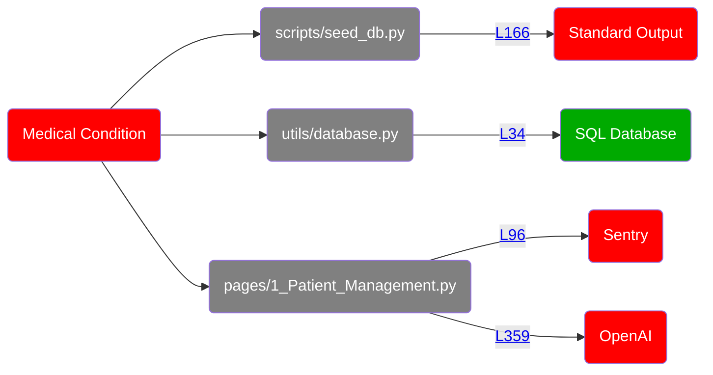
<details>
<summary>Show all 73 occurrences</summary>

[pages/1_Patient_Management.py:213](https://github.com/hounddogai/hounddog-test-python-app/blob/f29c8bebe716/pages/1_Patient_Management.py#L213-L213)

```python
patient_data
```
[scripts/seed_db.py:98](https://github.com/hounddogai/hounddog-test-python-app/blob/f29c8bebe716/scripts/seed_db.py#L98-L98)

```python
allergies_list
```
[pages/1_Patient_Management.py:222](https://github.com/hounddogai/hounddog-test-python-app/blob/f29c8bebe716/pages/1_Patient_Management.py#L222-L222)

```python
patient_data
```
[pages/1_Patient_Management.py:267](https://github.com/hounddogai/hounddog-test-python-app/blob/f29c8bebe716/pages/1_Patient_Management.py#L267-L267)

```python
patient_data
```
[pages/1_Patient_Management.py:307](https://github.com/hounddogai/hounddog-test-python-app/blob/f29c8bebe716/pages/1_Patient_Management.py#L307-L307)

```python
patient_data
```
[pages/1_Patient_Management.py:305](https://github.com/hounddogai/hounddog-test-python-app/blob/f29c8bebe716/pages/1_Patient_Management.py#L305-L305)

```python
patient_data
```
[pages/1_Patient_Management.py:53](https://github.com/hounddogai/hounddog-test-python-app/blob/f29c8bebe716/pages/1_Patient_Management.py#L53-L53)

```python
allergies
```
[pages/1_Patient_Management.py:83](https://github.com/hounddogai/hounddog-test-python-app/blob/f29c8bebe716/pages/1_Patient_Management.py#L83-L83)

```python
"allergies": allergies
```
[pages/1_Patient_Management.py:182](https://github.com/hounddogai/hounddog-test-python-app/blob/f29c8bebe716/pages/1_Patient_Management.py#L182-L182)

```python
patient_data
```
[pages/1_Patient_Management.py:223](https://github.com/hounddogai/hounddog-test-python-app/blob/f29c8bebe716/pages/1_Patient_Management.py#L223-L223)

```python
patient_data
```
[pages/1_Patient_Management.py:315](https://github.com/hounddogai/hounddog-test-python-app/blob/f29c8bebe716/pages/1_Patient_Management.py#L315-L315)

```python
patient_data
```
[pages/1_Patient_Management.py:272](https://github.com/hounddogai/hounddog-test-python-app/blob/f29c8bebe716/pages/1_Patient_Management.py#L272-L272)

```python
patient_data
```
[pages/1_Patient_Management.py:216](https://github.com/hounddogai/hounddog-test-python-app/blob/f29c8bebe716/pages/1_Patient_Management.py#L216-L216)

```python
patient_data
```
[pages/1_Patient_Management.py:316](https://github.com/hounddogai/hounddog-test-python-app/blob/f29c8bebe716/pages/1_Patient_Management.py#L316-L316)

```python
patient_data
```
[pages/1_Patient_Management.py:359](https://github.com/hounddogai/hounddog-test-python-app/blob/f29c8bebe716/pages/1_Patient_Management.py#L359-L359)

```python
messages
```
[pages/1_Patient_Management.py:353](https://github.com/hounddogai/hounddog-test-python-app/blob/f29c8bebe716/pages/1_Patient_Management.py#L353-L353)

```python
messages
```
[pages/1_Patient_Management.py:355](https://github.com/hounddogai/hounddog-test-python-app/blob/f29c8bebe716/pages/1_Patient_Management.py#L355-L355)

```python
messages
```
[pages/1_Patient_Management.py:327](https://github.com/hounddogai/hounddog-test-python-app/blob/f29c8bebe716/pages/1_Patient_Management.py#L327-L327)

```python
patient_data
```
[pages/1_Patient_Management.py:363](https://github.com/hounddogai/hounddog-test-python-app/blob/f29c8bebe716/pages/1_Patient_Management.py#L363-L363)

```python
history_key
```
[pages/1_Patient_Management.py:306](https://github.com/hounddogai/hounddog-test-python-app/blob/f29c8bebe716/pages/1_Patient_Management.py#L306-L306)

```python
patient_data
```
[pages/1_Patient_Management.py:186](https://github.com/hounddogai/hounddog-test-python-app/blob/f29c8bebe716/pages/1_Patient_Management.py#L186-L186)

```python
patient_data
```
[pages/1_Patient_Management.py:292](https://github.com/hounddogai/hounddog-test-python-app/blob/f29c8bebe716/pages/1_Patient_Management.py#L292-L292)

```python
patient_data
```
[pages/1_Patient_Management.py:347](https://github.com/hounddogai/hounddog-test-python-app/blob/f29c8bebe716/pages/1_Patient_Management.py#L347-L347)

```python
history_key
```
[pages/1_Patient_Management.py:105](https://github.com/hounddogai/hounddog-test-python-app/blob/f29c8bebe716/pages/1_Patient_Management.py#L105-L105)

```python
allergies
```
[pages/1_Patient_Management.py:105](https://github.com/hounddogai/hounddog-test-python-app/blob/f29c8bebe716/pages/1_Patient_Management.py#L105-L105)

```python
"allergies": allergies
```
[pages/1_Patient_Management.py:83](https://github.com/hounddogai/hounddog-test-python-app/blob/f29c8bebe716/pages/1_Patient_Management.py#L83-L83)

```python
allergies
```
[pages/1_Patient_Management.py:91](https://github.com/hounddogai/hounddog-test-python-app/blob/f29c8bebe716/pages/1_Patient_Management.py#L91-L91)

```python
patient_data
```
[scripts/seed_db.py:156](https://github.com/hounddogai/hounddog-test-python-app/blob/f29c8bebe716/scripts/seed_db.py#L156-L156)

```python
"allergies": random.choice(allergies_list)
```
[pages/1_Patient_Management.py:359](https://github.com/hounddogai/hounddog-test-python-app/blob/f29c8bebe716/pages/1_Patient_Management.py#L359-L359)

```python
messages
```
[utils/database.py:56](https://github.com/hounddogai/hounddog-test-python-app/blob/f29c8bebe716/utils/database.py#L56-L56)

```python
allergies
```
[scripts/seed_db.py:156](https://github.com/hounddogai/hounddog-test-python-app/blob/f29c8bebe716/scripts/seed_db.py#L156-L156)

```python
allergies_list
```
[pages/1_Patient_Management.py:342](https://github.com/hounddogai/hounddog-test-python-app/blob/f29c8bebe716/pages/1_Patient_Management.py#L342-L342)

```python
history_key
```
[pages/1_Patient_Management.py:353](https://github.com/hounddogai/hounddog-test-python-app/blob/f29c8bebe716/pages/1_Patient_Management.py#L353-L353)

```python
messages
```
[pages/1_Patient_Management.py:232](https://github.com/hounddogai/hounddog-test-python-app/blob/f29c8bebe716/pages/1_Patient_Management.py#L232-L232)

```python
patient_data
```
[pages/1_Patient_Management.py:243](https://github.com/hounddogai/hounddog-test-python-app/blob/f29c8bebe716/pages/1_Patient_Management.py#L243-L243)

```python
patient_data
```
[utils/database.py:34](https://github.com/hounddogai/hounddog-test-python-app/blob/f29c8bebe716/utils/database.py#L34-L34)

```python
allergies
```
[pages/1_Patient_Management.py:314](https://github.com/hounddogai/hounddog-test-python-app/blob/f29c8bebe716/pages/1_Patient_Management.py#L314-L314)

```python
patient_data
```
[pages/1_Patient_Management.py:217](https://github.com/hounddogai/hounddog-test-python-app/blob/f29c8bebe716/pages/1_Patient_Management.py#L217-L217)

```python
patient_data
```
[pages/1_Patient_Management.py:186](https://github.com/hounddogai/hounddog-test-python-app/blob/f29c8bebe716/pages/1_Patient_Management.py#L186-L186)

```python
patient_data
```
[pages/1_Patient_Management.py:310](https://github.com/hounddogai/hounddog-test-python-app/blob/f29c8bebe716/pages/1_Patient_Management.py#L310-L310)

```python
patient_data
```
[pages/1_Patient_Management.py:187](https://github.com/hounddogai/hounddog-test-python-app/blob/f29c8bebe716/pages/1_Patient_Management.py#L187-L187)

```python
patient_data
```
[pages/1_Patient_Management.py:309](https://github.com/hounddogai/hounddog-test-python-app/blob/f29c8bebe716/pages/1_Patient_Management.py#L309-L309)

```python
patient_data
```
[pages/1_Patient_Management.py:215](https://github.com/hounddogai/hounddog-test-python-app/blob/f29c8bebe716/pages/1_Patient_Management.py#L215-L215)

```python
patient_data
```
[pages/1_Patient_Management.py:230](https://github.com/hounddogai/hounddog-test-python-app/blob/f29c8bebe716/pages/1_Patient_Management.py#L230-L230)

```python
patient_data
```
[pages/1_Patient_Management.py:295](https://github.com/hounddogai/hounddog-test-python-app/blob/f29c8bebe716/pages/1_Patient_Management.py#L295-L295)

```python
patient_data
```
[pages/1_Patient_Management.py:328](https://github.com/hounddogai/hounddog-test-python-app/blob/f29c8bebe716/pages/1_Patient_Management.py#L328-L328)

```python
history_key
```
[pages/1_Patient_Management.py:346](https://github.com/hounddogai/hounddog-test-python-app/blob/f29c8bebe716/pages/1_Patient_Management.py#L346-L346)

```python
patient_context
```
[pages/1_Patient_Management.py:305](https://github.com/hounddogai/hounddog-test-python-app/blob/f29c8bebe716/pages/1_Patient_Management.py#L305-L305)

```python
patient_data
```
[pages/1_Patient_Management.py:213](https://github.com/hounddogai/hounddog-test-python-app/blob/f29c8bebe716/pages/1_Patient_Management.py#L213-L213)

```python
patient_data
```
[pages/1_Patient_Management.py:355](https://github.com/hounddogai/hounddog-test-python-app/blob/f29c8bebe716/pages/1_Patient_Management.py#L355-L355)

```python
messages
```
[utils/database.py:34](https://github.com/hounddogai/hounddog-test-python-app/blob/f29c8bebe716/utils/database.py#L34-L34)

```python
allergies = Column(Text)
```
[pages/1_Patient_Management.py:355](https://github.com/hounddogai/hounddog-test-python-app/blob/f29c8bebe716/pages/1_Patient_Management.py#L355-L355)

```python
messages
```
[pages/1_Patient_Management.py:346](https://github.com/hounddogai/hounddog-test-python-app/blob/f29c8bebe716/pages/1_Patient_Management.py#L346-L346)

```python
patient_context
```
[pages/1_Patient_Management.py:346](https://github.com/hounddogai/hounddog-test-python-app/blob/f29c8bebe716/pages/1_Patient_Management.py#L346-L346)

```python
patient_context
```
[pages/1_Patient_Management.py:244](https://github.com/hounddogai/hounddog-test-python-app/blob/f29c8bebe716/pages/1_Patient_Management.py#L244-L244)

```python
patient_data
```
[utils/database.py:56](https://github.com/hounddogai/hounddog-test-python-app/blob/f29c8bebe716/utils/database.py#L56-L56)

```python
"allergies": self.allergies
```
[pages/1_Patient_Management.py:180](https://github.com/hounddogai/hounddog-test-python-app/blob/f29c8bebe716/pages/1_Patient_Management.py#L180-L180)

```python
patient_data
```
[pages/1_Patient_Management.py:329](https://github.com/hounddogai/hounddog-test-python-app/blob/f29c8bebe716/pages/1_Patient_Management.py#L329-L329)

```python
history_key
```
[pages/1_Patient_Management.py:308](https://github.com/hounddogai/hounddog-test-python-app/blob/f29c8bebe716/pages/1_Patient_Management.py#L308-L308)

```python
patient_data
```
[pages/1_Patient_Management.py:281](https://github.com/hounddogai/hounddog-test-python-app/blob/f29c8bebe716/pages/1_Patient_Management.py#L281-L281)

```python
patient_data
```
[pages/1_Patient_Management.py:214](https://github.com/hounddogai/hounddog-test-python-app/blob/f29c8bebe716/pages/1_Patient_Management.py#L214-L214)

```python
patient_data
```
[pages/1_Patient_Management.py:332](https://github.com/hounddogai/hounddog-test-python-app/blob/f29c8bebe716/pages/1_Patient_Management.py#L332-L332)

```python
history_key
```
[utils/database.py:56](https://github.com/hounddogai/hounddog-test-python-app/blob/f29c8bebe716/utils/database.py#L56-L56)

```python
self.allergies
```
[scripts/seed_db.py:166](https://github.com/hounddogai/hounddog-test-python-app/blob/f29c8bebe716/scripts/seed_db.py#L166-L166)

```python
patient_data
```
[pages/1_Patient_Management.py:221](https://github.com/hounddogai/hounddog-test-python-app/blob/f29c8bebe716/pages/1_Patient_Management.py#L221-L221)

```python
patient_data
```
[pages/1_Patient_Management.py:236](https://github.com/hounddogai/hounddog-test-python-app/blob/f29c8bebe716/pages/1_Patient_Management.py#L236-L236)

```python
patient_data
```
[pages/1_Patient_Management.py:239](https://github.com/hounddogai/hounddog-test-python-app/blob/f29c8bebe716/pages/1_Patient_Management.py#L239-L239)

```python
patient_data
```
[pages/1_Patient_Management.py:353](https://github.com/hounddogai/hounddog-test-python-app/blob/f29c8bebe716/pages/1_Patient_Management.py#L353-L353)

```python
messages
```
[pages/1_Patient_Management.py:317](https://github.com/hounddogai/hounddog-test-python-app/blob/f29c8bebe716/pages/1_Patient_Management.py#L317-L317)

```python
patient_data
```
[pages/1_Patient_Management.py:311](https://github.com/hounddogai/hounddog-test-python-app/blob/f29c8bebe716/pages/1_Patient_Management.py#L311-L311)

```python
patient_data
```
[utils/data_manager.py:42](https://github.com/hounddogai/hounddog-test-python-app/blob/f29c8bebe716/utils/data_manager.py#L42-L42)

```python
allergies
```
[pages/1_Patient_Management.py:359](https://github.com/hounddogai/hounddog-test-python-app/blob/f29c8bebe716/pages/1_Patient_Management.py#L359-L359)

```python
messages
```
[scripts/seed_db.py:164](https://github.com/hounddogai/hounddog-test-python-app/blob/f29c8bebe716/scripts/seed_db.py#L164-L164)

```python
patient_data
```
</details>

## 2. Medical History

**Sensitivity:** <span style="color:rgba(255, 255, 255, 1); background-color:rgba(255, 0, 0, 1); font-family: monospace; border-radius: 3px;">&nbsp;**CRITICAL**&nbsp;</span>

**Tags:** PHI

**Dataflows:**

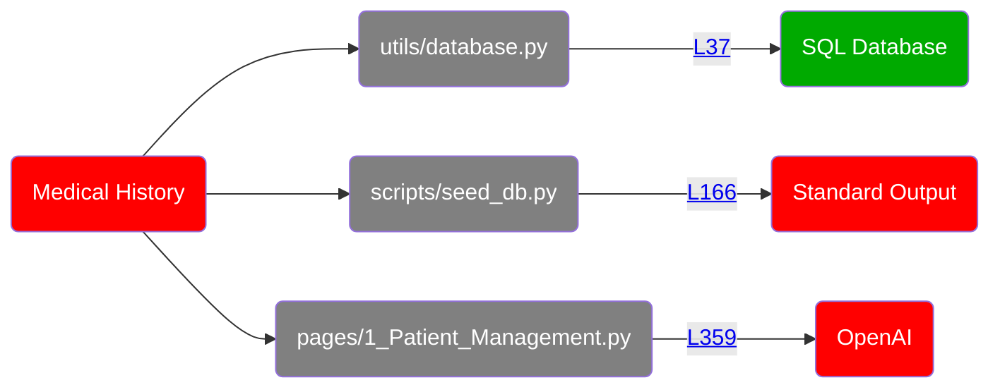
<details>
<summary>Show all 71 occurrences</summary>

[pages/1_Patient_Management.py:363](https://github.com/hounddogai/hounddog-test-python-app/blob/f29c8bebe716/pages/1_Patient_Management.py#L363-L363)

```python
history_key
```
[pages/1_Patient_Management.py:267](https://github.com/hounddogai/hounddog-test-python-app/blob/f29c8bebe716/pages/1_Patient_Management.py#L267-L267)

```python
patient_data
```
[pages/1_Patient_Management.py:355](https://github.com/hounddogai/hounddog-test-python-app/blob/f29c8bebe716/pages/1_Patient_Management.py#L355-L355)

```python
messages
```
[pages/1_Patient_Management.py:309](https://github.com/hounddogai/hounddog-test-python-app/blob/f29c8bebe716/pages/1_Patient_Management.py#L309-L309)

```python
patient_data
```
[utils/database.py:59](https://github.com/hounddogai/hounddog-test-python-app/blob/f29c8bebe716/utils/database.py#L59-L59)

```python
medical_history
```
[pages/1_Patient_Management.py:317](https://github.com/hounddogai/hounddog-test-python-app/blob/f29c8bebe716/pages/1_Patient_Management.py#L317-L317)

```python
patient_data
```
[pages/1_Patient_Management.py:243](https://github.com/hounddogai/hounddog-test-python-app/blob/f29c8bebe716/pages/1_Patient_Management.py#L243-L243)

```python
patient_data
```
[pages/1_Patient_Management.py:186](https://github.com/hounddogai/hounddog-test-python-app/blob/f29c8bebe716/pages/1_Patient_Management.py#L186-L186)

```python
patient_data
```
[pages/1_Patient_Management.py:359](https://github.com/hounddogai/hounddog-test-python-app/blob/f29c8bebe716/pages/1_Patient_Management.py#L359-L359)

```python
messages
```
[pages/1_Patient_Management.py:222](https://github.com/hounddogai/hounddog-test-python-app/blob/f29c8bebe716/pages/1_Patient_Management.py#L222-L222)

```python
patient_data
```
[pages/1_Patient_Management.py:353](https://github.com/hounddogai/hounddog-test-python-app/blob/f29c8bebe716/pages/1_Patient_Management.py#L353-L353)

```python
messages
```
[pages/1_Patient_Management.py:86](https://github.com/hounddogai/hounddog-test-python-app/blob/f29c8bebe716/pages/1_Patient_Management.py#L86-L86)

```python
"medical_history": medical_history
```
[pages/1_Patient_Management.py:281](https://github.com/hounddogai/hounddog-test-python-app/blob/f29c8bebe716/pages/1_Patient_Management.py#L281-L281)

```python
patient_data
```
[pages/1_Patient_Management.py:186](https://github.com/hounddogai/hounddog-test-python-app/blob/f29c8bebe716/pages/1_Patient_Management.py#L186-L186)

```python
patient_data
```
[pages/1_Patient_Management.py:359](https://github.com/hounddogai/hounddog-test-python-app/blob/f29c8bebe716/pages/1_Patient_Management.py#L359-L359)

```python
messages
```
[scripts/seed_db.py:159](https://github.com/hounddogai/hounddog-test-python-app/blob/f29c8bebe716/scripts/seed_db.py#L159-L159)

```python
medical_histories
```
[pages/1_Patient_Management.py:359](https://github.com/hounddogai/hounddog-test-python-app/blob/f29c8bebe716/pages/1_Patient_Management.py#L359-L359)

```python
messages
```
[pages/1_Patient_Management.py:308](https://github.com/hounddogai/hounddog-test-python-app/blob/f29c8bebe716/pages/1_Patient_Management.py#L308-L308)

```python
patient_data
```
[pages/1_Patient_Management.py:86](https://github.com/hounddogai/hounddog-test-python-app/blob/f29c8bebe716/pages/1_Patient_Management.py#L86-L86)

```python
medical_history
```
[utils/database.py:37](https://github.com/hounddogai/hounddog-test-python-app/blob/f29c8bebe716/utils/database.py#L37-L37)

```python
medical_history
```
[utils/database.py:59](https://github.com/hounddogai/hounddog-test-python-app/blob/f29c8bebe716/utils/database.py#L59-L59)

```python
self.medical_history
```
[utils/database.py:37](https://github.com/hounddogai/hounddog-test-python-app/blob/f29c8bebe716/utils/database.py#L37-L37)

```python
medical_history = Column(Text)
```
[pages/1_Patient_Management.py:347](https://github.com/hounddogai/hounddog-test-python-app/blob/f29c8bebe716/pages/1_Patient_Management.py#L347-L347)

```python
history_key
```
[pages/1_Patient_Management.py:232](https://github.com/hounddogai/hounddog-test-python-app/blob/f29c8bebe716/pages/1_Patient_Management.py#L232-L232)

```python
patient_data
```
[pages/1_Patient_Management.py:327](https://github.com/hounddogai/hounddog-test-python-app/blob/f29c8bebe716/pages/1_Patient_Management.py#L327-L327)

```python
patient_data
```
[pages/1_Patient_Management.py:236](https://github.com/hounddogai/hounddog-test-python-app/blob/f29c8bebe716/pages/1_Patient_Management.py#L236-L236)

```python
patient_data
```
[pages/1_Patient_Management.py:295](https://github.com/hounddogai/hounddog-test-python-app/blob/f29c8bebe716/pages/1_Patient_Management.py#L295-L295)

```python
patient_data
```
[pages/1_Patient_Management.py:91](https://github.com/hounddogai/hounddog-test-python-app/blob/f29c8bebe716/pages/1_Patient_Management.py#L91-L91)

```python
patient_data
```
[pages/1_Patient_Management.py:182](https://github.com/hounddogai/hounddog-test-python-app/blob/f29c8bebe716/pages/1_Patient_Management.py#L182-L182)

```python
patient_data
```
[pages/1_Patient_Management.py:213](https://github.com/hounddogai/hounddog-test-python-app/blob/f29c8bebe716/pages/1_Patient_Management.py#L213-L213)

```python
patient_data
```
[pages/1_Patient_Management.py:180](https://github.com/hounddogai/hounddog-test-python-app/blob/f29c8bebe716/pages/1_Patient_Management.py#L180-L180)

```python
patient_data
```
[pages/1_Patient_Management.py:342](https://github.com/hounddogai/hounddog-test-python-app/blob/f29c8bebe716/pages/1_Patient_Management.py#L342-L342)

```python
history_key
```
[pages/1_Patient_Management.py:221](https://github.com/hounddogai/hounddog-test-python-app/blob/f29c8bebe716/pages/1_Patient_Management.py#L221-L221)

```python
patient_data
```
[pages/1_Patient_Management.py:353](https://github.com/hounddogai/hounddog-test-python-app/blob/f29c8bebe716/pages/1_Patient_Management.py#L353-L353)

```python
messages
```
[pages/1_Patient_Management.py:355](https://github.com/hounddogai/hounddog-test-python-app/blob/f29c8bebe716/pages/1_Patient_Management.py#L355-L355)

```python
messages
```
[pages/1_Patient_Management.py:305](https://github.com/hounddogai/hounddog-test-python-app/blob/f29c8bebe716/pages/1_Patient_Management.py#L305-L305)

```python
patient_data
```
[pages/1_Patient_Management.py:353](https://github.com/hounddogai/hounddog-test-python-app/blob/f29c8bebe716/pages/1_Patient_Management.py#L353-L353)

```python
messages
```
[pages/1_Patient_Management.py:332](https://github.com/hounddogai/hounddog-test-python-app/blob/f29c8bebe716/pages/1_Patient_Management.py#L332-L332)

```python
history_key
```
[utils/database.py:59](https://github.com/hounddogai/hounddog-test-python-app/blob/f29c8bebe716/utils/database.py#L59-L59)

```python
"medical_history": self.medical_history
```
[pages/1_Patient_Management.py:316](https://github.com/hounddogai/hounddog-test-python-app/blob/f29c8bebe716/pages/1_Patient_Management.py#L316-L316)

```python
patient_data
```
[pages/1_Patient_Management.py:346](https://github.com/hounddogai/hounddog-test-python-app/blob/f29c8bebe716/pages/1_Patient_Management.py#L346-L346)

```python
patient_context
```
[pages/1_Patient_Management.py:307](https://github.com/hounddogai/hounddog-test-python-app/blob/f29c8bebe716/pages/1_Patient_Management.py#L307-L307)

```python
patient_data
```
[scripts/seed_db.py:111](https://github.com/hounddogai/hounddog-test-python-app/blob/f29c8bebe716/scripts/seed_db.py#L111-L111)

```python
medical_histories
```
[pages/1_Patient_Management.py:187](https://github.com/hounddogai/hounddog-test-python-app/blob/f29c8bebe716/pages/1_Patient_Management.py#L187-L187)

```python
patient_data
```
[pages/1_Patient_Management.py:329](https://github.com/hounddogai/hounddog-test-python-app/blob/f29c8bebe716/pages/1_Patient_Management.py#L329-L329)

```python
history_key
```
[pages/1_Patient_Management.py:239](https://github.com/hounddogai/hounddog-test-python-app/blob/f29c8bebe716/pages/1_Patient_Management.py#L239-L239)

```python
patient_data
```
[scripts/seed_db.py:166](https://github.com/hounddogai/hounddog-test-python-app/blob/f29c8bebe716/scripts/seed_db.py#L166-L166)

```python
patient_data
```
[pages/1_Patient_Management.py:214](https://github.com/hounddogai/hounddog-test-python-app/blob/f29c8bebe716/pages/1_Patient_Management.py#L214-L214)

```python
patient_data
```
[scripts/seed_db.py:164](https://github.com/hounddogai/hounddog-test-python-app/blob/f29c8bebe716/scripts/seed_db.py#L164-L164)

```python
patient_data
```
[pages/1_Patient_Management.py:314](https://github.com/hounddogai/hounddog-test-python-app/blob/f29c8bebe716/pages/1_Patient_Management.py#L314-L314)

```python
patient_data
```
[scripts/seed_db.py:159](https://github.com/hounddogai/hounddog-test-python-app/blob/f29c8bebe716/scripts/seed_db.py#L159-L159)

```python
"medical_history": random.choice(medical_histories)
```
[pages/1_Patient_Management.py:305](https://github.com/hounddogai/hounddog-test-python-app/blob/f29c8bebe716/pages/1_Patient_Management.py#L305-L305)

```python
patient_data
```
[pages/1_Patient_Management.py:216](https://github.com/hounddogai/hounddog-test-python-app/blob/f29c8bebe716/pages/1_Patient_Management.py#L216-L216)

```python
patient_data
```
[pages/1_Patient_Management.py:244](https://github.com/hounddogai/hounddog-test-python-app/blob/f29c8bebe716/pages/1_Patient_Management.py#L244-L244)

```python
patient_data
```
[pages/1_Patient_Management.py:315](https://github.com/hounddogai/hounddog-test-python-app/blob/f29c8bebe716/pages/1_Patient_Management.py#L315-L315)

```python
patient_data
```
[pages/1_Patient_Management.py:223](https://github.com/hounddogai/hounddog-test-python-app/blob/f29c8bebe716/pages/1_Patient_Management.py#L223-L223)

```python
patient_data
```
[pages/1_Patient_Management.py:306](https://github.com/hounddogai/hounddog-test-python-app/blob/f29c8bebe716/pages/1_Patient_Management.py#L306-L306)

```python
patient_data
```
[pages/1_Patient_Management.py:213](https://github.com/hounddogai/hounddog-test-python-app/blob/f29c8bebe716/pages/1_Patient_Management.py#L213-L213)

```python
patient_data
```
[pages/1_Patient_Management.py:272](https://github.com/hounddogai/hounddog-test-python-app/blob/f29c8bebe716/pages/1_Patient_Management.py#L272-L272)

```python
patient_data
```
[utils/data_manager.py:45](https://github.com/hounddogai/hounddog-test-python-app/blob/f29c8bebe716/utils/data_manager.py#L45-L45)

```python
medical_history
```
[pages/1_Patient_Management.py:215](https://github.com/hounddogai/hounddog-test-python-app/blob/f29c8bebe716/pages/1_Patient_Management.py#L215-L215)

```python
patient_data
```
[pages/1_Patient_Management.py:355](https://github.com/hounddogai/hounddog-test-python-app/blob/f29c8bebe716/pages/1_Patient_Management.py#L355-L355)

```python
messages
```
[pages/1_Patient_Management.py:346](https://github.com/hounddogai/hounddog-test-python-app/blob/f29c8bebe716/pages/1_Patient_Management.py#L346-L346)

```python
patient_context
```
[pages/1_Patient_Management.py:310](https://github.com/hounddogai/hounddog-test-python-app/blob/f29c8bebe716/pages/1_Patient_Management.py#L310-L310)

```python
patient_data
```
[pages/1_Patient_Management.py:346](https://github.com/hounddogai/hounddog-test-python-app/blob/f29c8bebe716/pages/1_Patient_Management.py#L346-L346)

```python
patient_context
```
[pages/1_Patient_Management.py:59](https://github.com/hounddogai/hounddog-test-python-app/blob/f29c8bebe716/pages/1_Patient_Management.py#L59-L59)

```python
medical_history
```
[pages/1_Patient_Management.py:217](https://github.com/hounddogai/hounddog-test-python-app/blob/f29c8bebe716/pages/1_Patient_Management.py#L217-L217)

```python
patient_data
```
[pages/1_Patient_Management.py:292](https://github.com/hounddogai/hounddog-test-python-app/blob/f29c8bebe716/pages/1_Patient_Management.py#L292-L292)

```python
patient_data
```
[pages/1_Patient_Management.py:230](https://github.com/hounddogai/hounddog-test-python-app/blob/f29c8bebe716/pages/1_Patient_Management.py#L230-L230)

```python
patient_data
```
[pages/1_Patient_Management.py:328](https://github.com/hounddogai/hounddog-test-python-app/blob/f29c8bebe716/pages/1_Patient_Management.py#L328-L328)

```python
history_key
```
[pages/1_Patient_Management.py:311](https://github.com/hounddogai/hounddog-test-python-app/blob/f29c8bebe716/pages/1_Patient_Management.py#L311-L311)

```python
patient_data
```
</details>

## 3. Medical Record Number

**Sensitivity:** <span style="color:rgba(255, 255, 255, 1); background-color:rgba(255, 0, 0, 1); font-family: monospace; border-radius: 3px;">&nbsp;**CRITICAL**&nbsp;</span>

**Tags:** PHI

**Dataflows:** None
<details>
<summary>Show all 9 occurrences</summary>

[utils/data_manager.py:387](https://github.com/hounddogai/hounddog-test-python-app/blob/f29c8bebe716/utils/data_manager.py#L387-L387)

```python
MedicalRecord.id
```
[utils/data_manager.py:239](https://github.com/hounddogai/hounddog-test-python-app/blob/f29c8bebe716/utils/data_manager.py#L239-L239)

```python
MedicalRecord.id
```
[utils/data_manager.py:389](https://github.com/hounddogai/hounddog-test-python-app/blob/f29c8bebe716/utils/data_manager.py#L389-L389)

```python
MedicalRecord.id
```
[utils/data_manager.py:387](https://github.com/hounddogai/hounddog-test-python-app/blob/f29c8bebe716/utils/data_manager.py#L387-L387)

```python
MedicalRecord.id
```
[utils/data_manager.py:239](https://github.com/hounddogai/hounddog-test-python-app/blob/f29c8bebe716/utils/data_manager.py#L239-L239)

```python
MedicalRecord.id
```
[utils/data_manager.py:496](https://github.com/hounddogai/hounddog-test-python-app/blob/f29c8bebe716/utils/data_manager.py#L496-L496)

```python
MedicalRecord.id
```
[utils/data_manager.py:496](https://github.com/hounddogai/hounddog-test-python-app/blob/f29c8bebe716/utils/data_manager.py#L496-L496)

```python
MedicalRecord.id
```
[utils/data_manager.py:248](https://github.com/hounddogai/hounddog-test-python-app/blob/f29c8bebe716/utils/data_manager.py#L248-L248)

```python
MedicalRecord.id
```
[utils/data_manager.py:248](https://github.com/hounddogai/hounddog-test-python-app/blob/f29c8bebe716/utils/data_manager.py#L248-L248)

```python
MedicalRecord.id
```
</details>

## 4. Sexual Orientation

**Sensitivity:** <span style="color:rgba(255, 255, 255, 1); background-color:rgba(255, 0, 0, 1); font-family: monospace; border-radius: 3px;">&nbsp;**CRITICAL**&nbsp;</span>

**Tags:** PII

**Dataflows:**

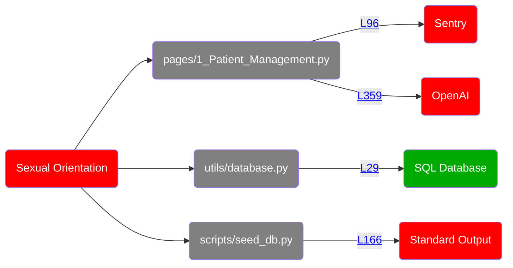
<details>
<summary>Show all 136 occurrences</summary>

[pages/1_Patient_Management.py:308](https://github.com/hounddogai/hounddog-test-python-app/blob/f29c8bebe716/pages/1_Patient_Management.py#L308-L308)

```python
patient_data
```
[pages/4_Analytics_Dashboard.py:512](https://github.com/hounddogai/hounddog-test-python-app/blob/f29c8bebe716/pages/4_Analytics_Dashboard.py#L512-L512)

```python
st.session_state.data_manager.get_gender_distribution
```
[pages/1_Patient_Management.py:236](https://github.com/hounddogai/hounddog-test-python-app/blob/f29c8bebe716/pages/1_Patient_Management.py#L236-L236)

```python
patient_data
```
[pages/1_Patient_Management.py:309](https://github.com/hounddogai/hounddog-test-python-app/blob/f29c8bebe716/pages/1_Patient_Management.py#L309-L309)

```python
patient_data
```
[pages/1_Patient_Management.py:307](https://github.com/hounddogai/hounddog-test-python-app/blob/f29c8bebe716/pages/1_Patient_Management.py#L307-L307)

```python
patient_data
```
[pages/1_Patient_Management.py:272](https://github.com/hounddogai/hounddog-test-python-app/blob/f29c8bebe716/pages/1_Patient_Management.py#L272-L272)

```python
patient_data
```
[utils/data_manager.py:420](https://github.com/hounddogai/hounddog-test-python-app/blob/f29c8bebe716/utils/data_manager.py#L420-L420)

```python
gender
```
[pages/1_Patient_Management.py:217](https://github.com/hounddogai/hounddog-test-python-app/blob/f29c8bebe716/pages/1_Patient_Management.py#L217-L217)

```python
patient_data
```
[pages/1_Patient_Management.py:314](https://github.com/hounddogai/hounddog-test-python-app/blob/f29c8bebe716/pages/1_Patient_Management.py#L314-L314)

```python
patient_data
```
[utils/database.py:29](https://github.com/hounddogai/hounddog-test-python-app/blob/f29c8bebe716/utils/database.py#L29-L29)

```python
gender
```
[pages/1_Patient_Management.py:306](https://github.com/hounddogai/hounddog-test-python-app/blob/f29c8bebe716/pages/1_Patient_Management.py#L306-L306)

```python
patient_data
```
[pages/1_Patient_Management.py:180](https://github.com/hounddogai/hounddog-test-python-app/blob/f29c8bebe716/pages/1_Patient_Management.py#L180-L180)

```python
patient_data
```
[pages/4_Analytics_Dashboard.py:72](https://github.com/hounddogai/hounddog-test-python-app/blob/f29c8bebe716/pages/4_Analytics_Dashboard.py#L72-L72)

```python
gender_data
```
[pages/4_Analytics_Dashboard.py:69](https://github.com/hounddogai/hounddog-test-python-app/blob/f29c8bebe716/pages/4_Analytics_Dashboard.py#L69-L69)

```python
get_gender_distribution
```
[pages/4_Analytics_Dashboard.py:512](https://github.com/hounddogai/hounddog-test-python-app/blob/f29c8bebe716/pages/4_Analytics_Dashboard.py#L512-L512)

```python
get_gender_distribution
```
[utils/data_manager.py:107](https://github.com/hounddogai/hounddog-test-python-app/blob/f29c8bebe716/utils/data_manager.py#L107-L107)

```python
gender_filter
```
[utils/data_manager.py:521](https://github.com/hounddogai/hounddog-test-python-app/blob/f29c8bebe716/utils/data_manager.py#L521-L521)

```python
Patient.gender.isnot
```
[utils/data_manager.py:280](https://github.com/hounddogai/hounddog-test-python-app/blob/f29c8bebe716/utils/data_manager.py#L280-L280)

```python
gender
```
[pages/1_Patient_Management.py:329](https://github.com/hounddogai/hounddog-test-python-app/blob/f29c8bebe716/pages/1_Patient_Management.py#L329-L329)

```python
history_key
```
[pages/1_Patient_Management.py:355](https://github.com/hounddogai/hounddog-test-python-app/blob/f29c8bebe716/pages/1_Patient_Management.py#L355-L355)

```python
messages
```
[scripts/seed_db.py:149](https://github.com/hounddogai/hounddog-test-python-app/blob/f29c8bebe716/scripts/seed_db.py#L149-L149)

```python
"gender": gender
```
[pages/1_Patient_Management.py:135](https://github.com/hounddogai/hounddog-test-python-app/blob/f29c8bebe716/pages/1_Patient_Management.py#L135-L135)

```python
gender_filter
```
[utils/data_manager.py:420](https://github.com/hounddogai/hounddog-test-python-app/blob/f29c8bebe716/utils/data_manager.py#L420-L420)

```python
patient.gender
```
[utils/data_manager.py:312](https://github.com/hounddogai/hounddog-test-python-app/blob/f29c8bebe716/utils/data_manager.py#L312-L312)

```python
gender_counts
```
[pages/1_Patient_Management.py:353](https://github.com/hounddogai/hounddog-test-python-app/blob/f29c8bebe716/pages/1_Patient_Management.py#L353-L353)

```python
messages
```
[utils/database.py:29](https://github.com/hounddogai/hounddog-test-python-app/blob/f29c8bebe716/utils/database.py#L29-L29)

```python
gender = Column(String(50), nullable=False)
```
[pages/1_Patient_Management.py:305](https://github.com/hounddogai/hounddog-test-python-app/blob/f29c8bebe716/pages/1_Patient_Management.py#L305-L305)

```python
patient_data
```
[scripts/seed_db.py:141](https://github.com/hounddogai/hounddog-test-python-app/blob/f29c8bebe716/scripts/seed_db.py#L141-L141)

```python
gender
```
[pages/4_Analytics_Dashboard.py:515](https://github.com/hounddogai/hounddog-test-python-app/blob/f29c8bebe716/pages/4_Analytics_Dashboard.py#L515-L515)

```python
gender_dist.items
```
[utils/data_manager.py:108](https://github.com/hounddogai/hounddog-test-python-app/blob/f29c8bebe716/utils/data_manager.py#L108-L108)

```python
gender
```
[pages/1_Patient_Management.py:78](https://github.com/hounddogai/hounddog-test-python-app/blob/f29c8bebe716/pages/1_Patient_Management.py#L78-L78)

```python
gender
```
[utils/data_manager.py:297](https://github.com/hounddogai/hounddog-test-python-app/blob/f29c8bebe716/utils/data_manager.py#L297-L297)

```python
gender_dict.get
```
[pages/1_Patient_Management.py:327](https://github.com/hounddogai/hounddog-test-python-app/blob/f29c8bebe716/pages/1_Patient_Management.py#L327-L327)

```python
patient_data
```
[utils/data_manager.py:521](https://github.com/hounddogai/hounddog-test-python-app/blob/f29c8bebe716/utils/data_manager.py#L521-L521)

```python
Patient.gender
```
[pages/1_Patient_Management.py:244](https://github.com/hounddogai/hounddog-test-python-app/blob/f29c8bebe716/pages/1_Patient_Management.py#L244-L244)

```python
patient_data
```
[utils/data_manager.py:311](https://github.com/hounddogai/hounddog-test-python-app/blob/f29c8bebe716/utils/data_manager.py#L311-L311)

```python
Patient.gender
```
[pages/1_Patient_Management.py:221](https://github.com/hounddogai/hounddog-test-python-app/blob/f29c8bebe716/pages/1_Patient_Management.py#L221-L221)

```python
patient_data
```
[utils/data_manager.py:311](https://github.com/hounddogai/hounddog-test-python-app/blob/f29c8bebe716/utils/data_manager.py#L311-L311)

```python
gender_counts
```
[pages/4_Analytics_Dashboard.py:77](https://github.com/hounddogai/hounddog-test-python-app/blob/f29c8bebe716/pages/4_Analytics_Dashboard.py#L77-L77)

```python
fig_gender.update_layout
```
[pages/4_Analytics_Dashboard.py:69](https://github.com/hounddogai/hounddog-test-python-app/blob/f29c8bebe716/pages/4_Analytics_Dashboard.py#L69-L69)

```python
st.session_state.data_manager.get_gender_distribution
```
[utils/data_manager.py:108](https://github.com/hounddogai/hounddog-test-python-app/blob/f29c8bebe716/utils/data_manager.py#L108-L108)

```python
Patient.gender
```
[pages/1_Patient_Management.py:216](https://github.com/hounddogai/hounddog-test-python-app/blob/f29c8bebe716/pages/1_Patient_Management.py#L216-L216)

```python
patient_data
```
[pages/1_Patient_Management.py:295](https://github.com/hounddogai/hounddog-test-python-app/blob/f29c8bebe716/pages/1_Patient_Management.py#L295-L295)

```python
patient_data
```
[pages/1_Patient_Management.py:355](https://github.com/hounddogai/hounddog-test-python-app/blob/f29c8bebe716/pages/1_Patient_Management.py#L355-L355)

```python
messages
```
[utils/data_manager.py:311](https://github.com/hounddogai/hounddog-test-python-app/blob/f29c8bebe716/utils/data_manager.py#L311-L311)

```python
gender
```
[pages/4_Analytics_Dashboard.py:73](https://github.com/hounddogai/hounddog-test-python-app/blob/f29c8bebe716/pages/4_Analytics_Dashboard.py#L73-L73)

```python
gender_data
```
[utils/data_manager.py:299](https://github.com/hounddogai/hounddog-test-python-app/blob/f29c8bebe716/utils/data_manager.py#L299-L299)

```python
gender_dict.items
```
[pages/1_Patient_Management.py:68](https://github.com/hounddogai/hounddog-test-python-app/blob/f29c8bebe716/pages/1_Patient_Management.py#L68-L68)

```python
gender
```
[pages/4_Analytics_Dashboard.py:511](https://github.com/hounddogai/hounddog-test-python-app/blob/f29c8bebe716/pages/4_Analytics_Dashboard.py#L511-L511)

```python
gender_dist
```
[pages/1_Patient_Management.py:305](https://github.com/hounddogai/hounddog-test-python-app/blob/f29c8bebe716/pages/1_Patient_Management.py#L305-L305)

```python
patient_data
```
[pages/4_Analytics_Dashboard.py:69](https://github.com/hounddogai/hounddog-test-python-app/blob/f29c8bebe716/pages/4_Analytics_Dashboard.py#L69-L69)

```python
st.session_state.data_manager.get_gender_distribution
```
[pages/1_Patient_Management.py:353](https://github.com/hounddogai/hounddog-test-python-app/blob/f29c8bebe716/pages/1_Patient_Management.py#L353-L353)

```python
messages
```
[utils/data_manager.py:297](https://github.com/hounddogai/hounddog-test-python-app/blob/f29c8bebe716/utils/data_manager.py#L297-L297)

```python
gender_dict
```
[pages/4_Analytics_Dashboard.py:73](https://github.com/hounddogai/hounddog-test-python-app/blob/f29c8bebe716/pages/4_Analytics_Dashboard.py#L73-L73)

```python
gender_data.keys
```
[pages/1_Patient_Management.py:328](https://github.com/hounddogai/hounddog-test-python-app/blob/f29c8bebe716/pages/1_Patient_Management.py#L328-L328)

```python
history_key
```
[utils/data_manager.py:521](https://github.com/hounddogai/hounddog-test-python-app/blob/f29c8bebe716/utils/data_manager.py#L521-L521)

```python
gender
```
[pages/1_Patient_Management.py:281](https://github.com/hounddogai/hounddog-test-python-app/blob/f29c8bebe716/pages/1_Patient_Management.py#L281-L281)

```python
patient_data
```
[utils/database.py:51](https://github.com/hounddogai/hounddog-test-python-app/blob/f29c8bebe716/utils/database.py#L51-L51)

```python
"gender": self.gender
```
[pages/1_Patient_Management.py:230](https://github.com/hounddogai/hounddog-test-python-app/blob/f29c8bebe716/pages/1_Patient_Management.py#L230-L230)

```python
patient_data
```
[pages/1_Patient_Management.py:186](https://github.com/hounddogai/hounddog-test-python-app/blob/f29c8bebe716/pages/1_Patient_Management.py#L186-L186)

```python
patient_data
```
[pages/1_Patient_Management.py:239](https://github.com/hounddogai/hounddog-test-python-app/blob/f29c8bebe716/pages/1_Patient_Management.py#L239-L239)

```python
patient_data
```
[pages/1_Patient_Management.py:78](https://github.com/hounddogai/hounddog-test-python-app/blob/f29c8bebe716/pages/1_Patient_Management.py#L78-L78)

```python
"gender": gender
```
[pages/1_Patient_Management.py:213](https://github.com/hounddogai/hounddog-test-python-app/blob/f29c8bebe716/pages/1_Patient_Management.py#L213-L213)

```python
patient_data
```
[utils/data_manager.py:280](https://github.com/hounddogai/hounddog-test-python-app/blob/f29c8bebe716/utils/data_manager.py#L280-L280)

```python
Patient.gender
```
[utils/data_manager.py:311](https://github.com/hounddogai/hounddog-test-python-app/blob/f29c8bebe716/utils/data_manager.py#L311-L311)

```python
Patient.gender
```
[pages/1_Patient_Management.py:347](https://github.com/hounddogai/hounddog-test-python-app/blob/f29c8bebe716/pages/1_Patient_Management.py#L347-L347)

```python
history_key
```
[utils/data_manager.py:521](https://github.com/hounddogai/hounddog-test-python-app/blob/f29c8bebe716/utils/data_manager.py#L521-L521)

```python
Patient.gender
```
[utils/data_manager.py:311](https://github.com/hounddogai/hounddog-test-python-app/blob/f29c8bebe716/utils/data_manager.py#L311-L311)

```python
Patient.gender
```
[pages/1_Patient_Management.py:132](https://github.com/hounddogai/hounddog-test-python-app/blob/f29c8bebe716/pages/1_Patient_Management.py#L132-L132)

```python
gender_filter
```
[pages/1_Patient_Management.py:359](https://github.com/hounddogai/hounddog-test-python-app/blob/f29c8bebe716/pages/1_Patient_Management.py#L359-L359)

```python
messages
```
[pages/4_Analytics_Dashboard.py:515](https://github.com/hounddogai/hounddog-test-python-app/blob/f29c8bebe716/pages/4_Analytics_Dashboard.py#L515-L515)

```python
gender
```
[pages/1_Patient_Management.py:186](https://github.com/hounddogai/hounddog-test-python-app/blob/f29c8bebe716/pages/1_Patient_Management.py#L186-L186)

```python
patient_data
```
[pages/4_Analytics_Dashboard.py:71](https://github.com/hounddogai/hounddog-test-python-app/blob/f29c8bebe716/pages/4_Analytics_Dashboard.py#L71-L71)

```python
fig_gender
```
[pages/1_Patient_Management.py:316](https://github.com/hounddogai/hounddog-test-python-app/blob/f29c8bebe716/pages/1_Patient_Management.py#L316-L316)

```python
patient_data
```
[pages/1_Patient_Management.py:317](https://github.com/hounddogai/hounddog-test-python-app/blob/f29c8bebe716/pages/1_Patient_Management.py#L317-L317)

```python
patient_data
```
[pages/1_Patient_Management.py:267](https://github.com/hounddogai/hounddog-test-python-app/blob/f29c8bebe716/pages/1_Patient_Management.py#L267-L267)

```python
patient_data
```
[utils/database.py:51](https://github.com/hounddogai/hounddog-test-python-app/blob/f29c8bebe716/utils/database.py#L51-L51)

```python
gender
```
[pages/1_Patient_Management.py:359](https://github.com/hounddogai/hounddog-test-python-app/blob/f29c8bebe716/pages/1_Patient_Management.py#L359-L359)

```python
messages
```
[pages/1_Patient_Management.py:292](https://github.com/hounddogai/hounddog-test-python-app/blob/f29c8bebe716/pages/1_Patient_Management.py#L292-L292)

```python
patient_data
```
[pages/4_Analytics_Dashboard.py:516](https://github.com/hounddogai/hounddog-test-python-app/blob/f29c8bebe716/pages/4_Analytics_Dashboard.py#L516-L516)

```python
gender
```
[scripts/seed_db.py:140](https://github.com/hounddogai/hounddog-test-python-app/blob/f29c8bebe716/scripts/seed_db.py#L140-L140)

```python
gender
```
[utils/data_manager.py:307](https://github.com/hounddogai/hounddog-test-python-app/blob/f29c8bebe716/utils/data_manager.py#L307-L307)

```python
get_gender_distribution
```
[pages/4_Analytics_Dashboard.py:77](https://github.com/hounddogai/hounddog-test-python-app/blob/f29c8bebe716/pages/4_Analytics_Dashboard.py#L77-L77)

```python
fig_gender
```
[pages/1_Patient_Management.py:91](https://github.com/hounddogai/hounddog-test-python-app/blob/f29c8bebe716/pages/1_Patient_Management.py#L91-L91)

```python
patient_data
```
[pages/1_Patient_Management.py:342](https://github.com/hounddogai/hounddog-test-python-app/blob/f29c8bebe716/pages/1_Patient_Management.py#L342-L342)

```python
history_key
```
[pages/1_Patient_Management.py:170](https://github.com/hounddogai/hounddog-test-python-app/blob/f29c8bebe716/pages/1_Patient_Management.py#L170-L170)

```python
gender_filter
```
[pages/1_Patient_Management.py:222](https://github.com/hounddogai/hounddog-test-python-app/blob/f29c8bebe716/pages/1_Patient_Management.py#L222-L222)

```python
patient_data
```
[pages/1_Patient_Management.py:346](https://github.com/hounddogai/hounddog-test-python-app/blob/f29c8bebe716/pages/1_Patient_Management.py#L346-L346)

```python
patient_context
```
[pages/1_Patient_Management.py:363](https://github.com/hounddogai/hounddog-test-python-app/blob/f29c8bebe716/pages/1_Patient_Management.py#L363-L363)

```python
history_key
```
[scripts/seed_db.py:149](https://github.com/hounddogai/hounddog-test-python-app/blob/f29c8bebe716/scripts/seed_db.py#L149-L149)

```python
gender
```
[pages/1_Patient_Management.py:213](https://github.com/hounddogai/hounddog-test-python-app/blob/f29c8bebe716/pages/1_Patient_Management.py#L213-L213)

```python
patient_data
```
[pages/1_Patient_Management.py:40](https://github.com/hounddogai/hounddog-test-python-app/blob/f29c8bebe716/pages/1_Patient_Management.py#L40-L40)

```python
gender
```
[pages/1_Patient_Management.py:223](https://github.com/hounddogai/hounddog-test-python-app/blob/f29c8bebe716/pages/1_Patient_Management.py#L223-L223)

```python
patient_data
```
[pages/1_Patient_Management.py:214](https://github.com/hounddogai/hounddog-test-python-app/blob/f29c8bebe716/pages/1_Patient_Management.py#L214-L214)

```python
patient_data
```
[utils/data_manager.py:299](https://github.com/hounddogai/hounddog-test-python-app/blob/f29c8bebe716/utils/data_manager.py#L299-L299)

```python
gender
```
[utils/data_manager.py:311](https://github.com/hounddogai/hounddog-test-python-app/blob/f29c8bebe716/utils/data_manager.py#L311-L311)

```python
gender
```
[pages/4_Analytics_Dashboard.py:78](https://github.com/hounddogai/hounddog-test-python-app/blob/f29c8bebe716/pages/4_Analytics_Dashboard.py#L78-L78)

```python
fig_gender
```
[pages/1_Patient_Management.py:232](https://github.com/hounddogai/hounddog-test-python-app/blob/f29c8bebe716/pages/1_Patient_Management.py#L232-L232)

```python
patient_data
```
[utils/data_manager.py:280](https://github.com/hounddogai/hounddog-test-python-app/blob/f29c8bebe716/utils/data_manager.py#L280-L280)

```python
Patient.gender
```
[utils/data_manager.py:299](https://github.com/hounddogai/hounddog-test-python-app/blob/f29c8bebe716/utils/data_manager.py#L299-L299)

```python
gender
```
[utils/data_manager.py:420](https://github.com/hounddogai/hounddog-test-python-app/blob/f29c8bebe716/utils/data_manager.py#L420-L420)

```python
"gender": patient.gender
```
[pages/1_Patient_Management.py:311](https://github.com/hounddogai/hounddog-test-python-app/blob/f29c8bebe716/pages/1_Patient_Management.py#L311-L311)

```python
patient_data
```
[pages/1_Patient_Management.py:182](https://github.com/hounddogai/hounddog-test-python-app/blob/f29c8bebe716/pages/1_Patient_Management.py#L182-L182)

```python
patient_data
```
[scripts/seed_db.py:164](https://github.com/hounddogai/hounddog-test-python-app/blob/f29c8bebe716/scripts/seed_db.py#L164-L164)

```python
patient_data
```
[pages/1_Patient_Management.py:315](https://github.com/hounddogai/hounddog-test-python-app/blob/f29c8bebe716/pages/1_Patient_Management.py#L315-L315)

```python
patient_data
```
[pages/1_Patient_Management.py:215](https://github.com/hounddogai/hounddog-test-python-app/blob/f29c8bebe716/pages/1_Patient_Management.py#L215-L215)

```python
patient_data
```
[pages/1_Patient_Management.py:310](https://github.com/hounddogai/hounddog-test-python-app/blob/f29c8bebe716/pages/1_Patient_Management.py#L310-L310)

```python
patient_data
```
[pages/4_Analytics_Dashboard.py:69](https://github.com/hounddogai/hounddog-test-python-app/blob/f29c8bebe716/pages/4_Analytics_Dashboard.py#L69-L69)

```python
gender_data
```
[pages/4_Analytics_Dashboard.py:515](https://github.com/hounddogai/hounddog-test-python-app/blob/f29c8bebe716/pages/4_Analytics_Dashboard.py#L515-L515)

```python
gender_dist
```
[utils/data_manager.py:281](https://github.com/hounddogai/hounddog-test-python-app/blob/f29c8bebe716/utils/data_manager.py#L281-L281)

```python
gender_counts
```
[pages/1_Patient_Management.py:346](https://github.com/hounddogai/hounddog-test-python-app/blob/f29c8bebe716/pages/1_Patient_Management.py#L346-L346)

```python
patient_context
```
[utils/data_manager.py:298](https://github.com/hounddogai/hounddog-test-python-app/blob/f29c8bebe716/utils/data_manager.py#L298-L298)

```python
gender_dict.get
```
[utils/data_manager.py:37](https://github.com/hounddogai/hounddog-test-python-app/blob/f29c8bebe716/utils/data_manager.py#L37-L37)

```python
gender
```
[pages/1_Patient_Management.py:102](https://github.com/hounddogai/hounddog-test-python-app/blob/f29c8bebe716/pages/1_Patient_Management.py#L102-L102)

```python
"gender": gender
```
[utils/data_manager.py:108](https://github.com/hounddogai/hounddog-test-python-app/blob/f29c8bebe716/utils/data_manager.py#L108-L108)

```python
gender_filter
```
[utils/data_manager.py:281](https://github.com/hounddogai/hounddog-test-python-app/blob/f29c8bebe716/utils/data_manager.py#L281-L281)

```python
gender_dict
```
[utils/data_manager.py:298](https://github.com/hounddogai/hounddog-test-python-app/blob/f29c8bebe716/utils/data_manager.py#L298-L298)

```python
gender_dict
```
[utils/data_manager.py:521](https://github.com/hounddogai/hounddog-test-python-app/blob/f29c8bebe716/utils/data_manager.py#L521-L521)

```python
Patient.gender.isnot
```
[utils/data_manager.py:108](https://github.com/hounddogai/hounddog-test-python-app/blob/f29c8bebe716/utils/data_manager.py#L108-L108)

```python
Patient.gender
```
[utils/data_manager.py:93](https://github.com/hounddogai/hounddog-test-python-app/blob/f29c8bebe716/utils/data_manager.py#L93-L93)

```python
gender_filter
```
[pages/1_Patient_Management.py:353](https://github.com/hounddogai/hounddog-test-python-app/blob/f29c8bebe716/pages/1_Patient_Management.py#L353-L353)

```python
messages
```
[pages/4_Analytics_Dashboard.py:70](https://github.com/hounddogai/hounddog-test-python-app/blob/f29c8bebe716/pages/4_Analytics_Dashboard.py#L70-L70)

```python
gender_data
```
[utils/data_manager.py:280](https://github.com/hounddogai/hounddog-test-python-app/blob/f29c8bebe716/utils/data_manager.py#L280-L280)

```python
gender
```
[pages/1_Patient_Management.py:346](https://github.com/hounddogai/hounddog-test-python-app/blob/f29c8bebe716/pages/1_Patient_Management.py#L346-L346)

```python
patient_context
```
[pages/1_Patient_Management.py:187](https://github.com/hounddogai/hounddog-test-python-app/blob/f29c8bebe716/pages/1_Patient_Management.py#L187-L187)

```python
patient_data
```
[utils/data_manager.py:299](https://github.com/hounddogai/hounddog-test-python-app/blob/f29c8bebe716/utils/data_manager.py#L299-L299)

```python
gender_dict
```
[utils/data_manager.py:280](https://github.com/hounddogai/hounddog-test-python-app/blob/f29c8bebe716/utils/data_manager.py#L280-L280)

```python
gender_counts
```
[pages/1_Patient_Management.py:243](https://github.com/hounddogai/hounddog-test-python-app/blob/f29c8bebe716/pages/1_Patient_Management.py#L243-L243)

```python
patient_data
```
[scripts/seed_db.py:166](https://github.com/hounddogai/hounddog-test-python-app/blob/f29c8bebe716/scripts/seed_db.py#L166-L166)

```python
patient_data
```
[pages/1_Patient_Management.py:359](https://github.com/hounddogai/hounddog-test-python-app/blob/f29c8bebe716/pages/1_Patient_Management.py#L359-L359)

```python
messages
```
[utils/database.py:51](https://github.com/hounddogai/hounddog-test-python-app/blob/f29c8bebe716/utils/database.py#L51-L51)

```python
self.gender
```
[pages/4_Analytics_Dashboard.py:72](https://github.com/hounddogai/hounddog-test-python-app/blob/f29c8bebe716/pages/4_Analytics_Dashboard.py#L72-L72)

```python
gender_data.values
```
[pages/1_Patient_Management.py:102](https://github.com/hounddogai/hounddog-test-python-app/blob/f29c8bebe716/pages/1_Patient_Management.py#L102-L102)

```python
gender
```
[pages/1_Patient_Management.py:332](https://github.com/hounddogai/hounddog-test-python-app/blob/f29c8bebe716/pages/1_Patient_Management.py#L332-L332)

```python
history_key
```
[pages/1_Patient_Management.py:355](https://github.com/hounddogai/hounddog-test-python-app/blob/f29c8bebe716/pages/1_Patient_Management.py#L355-L355)

```python
messages
```
[utils/data_manager.py:280](https://github.com/hounddogai/hounddog-test-python-app/blob/f29c8bebe716/utils/data_manager.py#L280-L280)

```python
Patient.gender
```
</details>

## 5. Blood Cholesterol

**Sensitivity:** <span style="color:rgba(255, 255, 255, 1); background-color:rgba(255, 100, 0, 1); font-family: monospace; border-radius: 3px;">&nbsp;&nbsp;**MEDIUM**&nbsp;&nbsp;</span>

**Tags:** PHI

**Dataflows:** None
<details>
<summary>Show all 17 occurrences</summary>

[pages/2_Health_Metrics.py:131](https://github.com/hounddogai/hounddog-test-python-app/blob/f29c8bebe716/pages/2_Health_Metrics.py#L131-L131)

```python
"Cholesterol (HDL)": "mg/dL"
```
[pages/2_Health_Metrics.py:139](https://github.com/hounddogai/hounddog-test-python-app/blob/f29c8bebe716/pages/2_Health_Metrics.py#L139-L139)

```python
unit_mappings
```
[scripts/seed_db.py:220](https://github.com/hounddogai/hounddog-test-python-app/blob/f29c8bebe716/scripts/seed_db.py#L220-L220)

```python
config
```
[pages/2_Health_Metrics.py:132](https://github.com/hounddogai/hounddog-test-python-app/blob/f29c8bebe716/pages/2_Health_Metrics.py#L132-L132)

```python
"Cholesterol (LDL)": "mg/dL"
```
[scripts/seed_db.py:212](https://github.com/hounddogai/hounddog-test-python-app/blob/f29c8bebe716/scripts/seed_db.py#L212-L212)

```python
config
```
[scripts/seed_db.py:186](https://github.com/hounddogai/hounddog-test-python-app/blob/f29c8bebe716/scripts/seed_db.py#L186-L186)

```python
"Cholesterol (Total)": {"min": 150, "max": 240, "unit": "mg/dL", "category": "Lab Results"}
```
[scripts/seed_db.py:214](https://github.com/hounddogai/hounddog-test-python-app/blob/f29c8bebe716/scripts/seed_db.py#L214-L214)

```python
config
```
[pages/2_Health_Metrics.py:139](https://github.com/hounddogai/hounddog-test-python-app/blob/f29c8bebe716/pages/2_Health_Metrics.py#L139-L139)

```python
unit_mappings
```
[scripts/seed_db.py:226](https://github.com/hounddogai/hounddog-test-python-app/blob/f29c8bebe716/scripts/seed_db.py#L226-L226)

```python
metric_data
```
[pages/2_Health_Metrics.py:130](https://github.com/hounddogai/hounddog-test-python-app/blob/f29c8bebe716/pages/2_Health_Metrics.py#L130-L130)

```python
"Cholesterol (Total)": "mg/dL"
```
[scripts/seed_db.py:226](https://github.com/hounddogai/hounddog-test-python-app/blob/f29c8bebe716/scripts/seed_db.py#L226-L226)

```python
metric_data
```
[scripts/seed_db.py:214](https://github.com/hounddogai/hounddog-test-python-app/blob/f29c8bebe716/scripts/seed_db.py#L214-L214)

```python
config
```
[scripts/seed_db.py:208](https://github.com/hounddogai/hounddog-test-python-app/blob/f29c8bebe716/scripts/seed_db.py#L208-L208)

```python
metric_configs
```
[scripts/seed_db.py:207](https://github.com/hounddogai/hounddog-test-python-app/blob/f29c8bebe716/scripts/seed_db.py#L207-L207)

```python
metric_configs
```
[scripts/seed_db.py:212](https://github.com/hounddogai/hounddog-test-python-app/blob/f29c8bebe716/scripts/seed_db.py#L212-L212)

```python
config
```
[pages/2_Health_Metrics.py:139](https://github.com/hounddogai/hounddog-test-python-app/blob/f29c8bebe716/pages/2_Health_Metrics.py#L139-L139)

```python
unit_mappings
```
[scripts/seed_db.py:223](https://github.com/hounddogai/hounddog-test-python-app/blob/f29c8bebe716/scripts/seed_db.py#L223-L223)

```python
config
```
</details>

## 6. Blood Pressure

**Sensitivity:** <span style="color:rgba(255, 255, 255, 1); background-color:rgba(255, 100, 0, 1); font-family: monospace; border-radius: 3px;">&nbsp;&nbsp;**MEDIUM**&nbsp;&nbsp;</span>

**Tags:** PHI

**Dataflows:** None
<details>
<summary>Show all 34 occurrences</summary>

[scripts/seed_db.py:212](https://github.com/hounddogai/hounddog-test-python-app/blob/f29c8bebe716/scripts/seed_db.py#L212-L212)

```python
config
```
[pages/2_Health_Metrics.py:147](https://github.com/hounddogai/hounddog-test-python-app/blob/f29c8bebe716/pages/2_Health_Metrics.py#L147-L147)

```python
"Blood Pressure (Diastolic)": (60, 90)
```
[pages/2_Health_Metrics.py:139](https://github.com/hounddogai/hounddog-test-python-app/blob/f29c8bebe716/pages/2_Health_Metrics.py#L139-L139)

```python
unit_mappings
```
[scripts/seed_db.py:212](https://github.com/hounddogai/hounddog-test-python-app/blob/f29c8bebe716/scripts/seed_db.py#L212-L212)

```python
config
```
[scripts/seed_db.py:220](https://github.com/hounddogai/hounddog-test-python-app/blob/f29c8bebe716/scripts/seed_db.py#L220-L220)

```python
config
```
[scripts/seed_db.py:214](https://github.com/hounddogai/hounddog-test-python-app/blob/f29c8bebe716/scripts/seed_db.py#L214-L214)

```python
config
```
[scripts/seed_db.py:207](https://github.com/hounddogai/hounddog-test-python-app/blob/f29c8bebe716/scripts/seed_db.py#L207-L207)

```python
metric_configs
```
[pages/2_Health_Metrics.py:139](https://github.com/hounddogai/hounddog-test-python-app/blob/f29c8bebe716/pages/2_Health_Metrics.py#L139-L139)

```python
unit_mappings
```
[pages/2_Health_Metrics.py:156](https://github.com/hounddogai/hounddog-test-python-app/blob/f29c8bebe716/pages/2_Health_Metrics.py#L156-L156)

```python
normal_ranges
```
[scripts/seed_db.py:223](https://github.com/hounddogai/hounddog-test-python-app/blob/f29c8bebe716/scripts/seed_db.py#L223-L223)

```python
config
```
[scripts/seed_db.py:226](https://github.com/hounddogai/hounddog-test-python-app/blob/f29c8bebe716/scripts/seed_db.py#L226-L226)

```python
metric_data
```
[pages/2_Health_Metrics.py:119](https://github.com/hounddogai/hounddog-test-python-app/blob/f29c8bebe716/pages/2_Health_Metrics.py#L119-L119)

```python
"Blood Pressure (Systolic)": "mmHg"
```
[pages/2_Health_Metrics.py:146](https://github.com/hounddogai/hounddog-test-python-app/blob/f29c8bebe716/pages/2_Health_Metrics.py#L146-L146)

```python
"Blood Pressure (Systolic)": (90, 140)
```
[pages/2_Health_Metrics.py:157](https://github.com/hounddogai/hounddog-test-python-app/blob/f29c8bebe716/pages/2_Health_Metrics.py#L157-L157)

```python
normal_ranges
```
[scripts/seed_db.py:226](https://github.com/hounddogai/hounddog-test-python-app/blob/f29c8bebe716/scripts/seed_db.py#L226-L226)

```python
metric_data
```
[pages/2_Health_Metrics.py:136](https://github.com/hounddogai/hounddog-test-python-app/blob/f29c8bebe716/pages/2_Health_Metrics.py#L136-L136)

```python
"Blood Pressure (Mean Arterial)": "mmHg"
```
[scripts/seed_db.py:226](https://github.com/hounddogai/hounddog-test-python-app/blob/f29c8bebe716/scripts/seed_db.py#L226-L226)

```python
metric_data
```
[scripts/seed_db.py:223](https://github.com/hounddogai/hounddog-test-python-app/blob/f29c8bebe716/scripts/seed_db.py#L223-L223)

```python
config
```
[scripts/seed_db.py:226](https://github.com/hounddogai/hounddog-test-python-app/blob/f29c8bebe716/scripts/seed_db.py#L226-L226)

```python
metric_data
```
[scripts/seed_db.py:212](https://github.com/hounddogai/hounddog-test-python-app/blob/f29c8bebe716/scripts/seed_db.py#L212-L212)

```python
config
```
[scripts/seed_db.py:214](https://github.com/hounddogai/hounddog-test-python-app/blob/f29c8bebe716/scripts/seed_db.py#L214-L214)

```python
config
```
[pages/2_Health_Metrics.py:139](https://github.com/hounddogai/hounddog-test-python-app/blob/f29c8bebe716/pages/2_Health_Metrics.py#L139-L139)

```python
unit_mappings
```
[scripts/seed_db.py:179](https://github.com/hounddogai/hounddog-test-python-app/blob/f29c8bebe716/scripts/seed_db.py#L179-L179)

```python
"Blood Pressure (Systolic)": {"min": 100, "max": 160, "unit": "mmHg", "category": "Vital Signs"}
```
[pages/2_Health_Metrics.py:156](https://github.com/hounddogai/hounddog-test-python-app/blob/f29c8bebe716/pages/2_Health_Metrics.py#L156-L156)

```python
normal_ranges
```
[scripts/seed_db.py:212](https://github.com/hounddogai/hounddog-test-python-app/blob/f29c8bebe716/scripts/seed_db.py#L212-L212)

```python
config
```
[pages/2_Health_Metrics.py:120](https://github.com/hounddogai/hounddog-test-python-app/blob/f29c8bebe716/pages/2_Health_Metrics.py#L120-L120)

```python
"Blood Pressure (Diastolic)": "mmHg"
```
[scripts/seed_db.py:214](https://github.com/hounddogai/hounddog-test-python-app/blob/f29c8bebe716/scripts/seed_db.py#L214-L214)

```python
config
```
[scripts/seed_db.py:220](https://github.com/hounddogai/hounddog-test-python-app/blob/f29c8bebe716/scripts/seed_db.py#L220-L220)

```python
config
```
[pages/2_Health_Metrics.py:157](https://github.com/hounddogai/hounddog-test-python-app/blob/f29c8bebe716/pages/2_Health_Metrics.py#L157-L157)

```python
normal_ranges
```
[scripts/seed_db.py:207](https://github.com/hounddogai/hounddog-test-python-app/blob/f29c8bebe716/scripts/seed_db.py#L207-L207)

```python
metric_configs
```
[scripts/seed_db.py:180](https://github.com/hounddogai/hounddog-test-python-app/blob/f29c8bebe716/scripts/seed_db.py#L180-L180)

```python
"Blood Pressure (Diastolic)": {"min": 60, "max": 100, "unit": "mmHg", "category": "Vital Signs"}
```
[scripts/seed_db.py:208](https://github.com/hounddogai/hounddog-test-python-app/blob/f29c8bebe716/scripts/seed_db.py#L208-L208)

```python
metric_configs
```
[scripts/seed_db.py:214](https://github.com/hounddogai/hounddog-test-python-app/blob/f29c8bebe716/scripts/seed_db.py#L214-L214)

```python
config
```
[scripts/seed_db.py:208](https://github.com/hounddogai/hounddog-test-python-app/blob/f29c8bebe716/scripts/seed_db.py#L208-L208)

```python
metric_configs
```
</details>

## 7. Blood Type

**Sensitivity:** <span style="color:rgba(255, 255, 255, 1); background-color:rgba(255, 100, 0, 1); font-family: monospace; border-radius: 3px;">&nbsp;&nbsp;**MEDIUM**&nbsp;&nbsp;</span>

**Tags:** PHI

**Dataflows:**

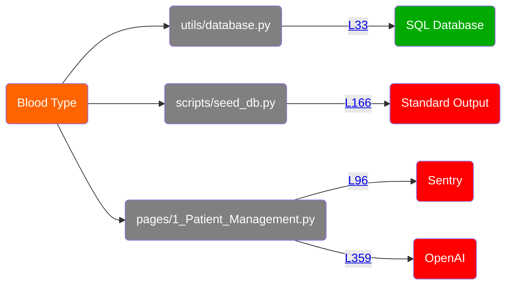
<details>
<summary>Show all 74 occurrences</summary>

[utils/database.py:55](https://github.com/hounddogai/hounddog-test-python-app/blob/f29c8bebe716/utils/database.py#L55-L55)

```python
self.blood_type
```
[pages/1_Patient_Management.py:347](https://github.com/hounddogai/hounddog-test-python-app/blob/f29c8bebe716/pages/1_Patient_Management.py#L347-L347)

```python
history_key
```
[utils/database.py:55](https://github.com/hounddogai/hounddog-test-python-app/blob/f29c8bebe716/utils/database.py#L55-L55)

```python
blood_type
```
[pages/1_Patient_Management.py:308](https://github.com/hounddogai/hounddog-test-python-app/blob/f29c8bebe716/pages/1_Patient_Management.py#L308-L308)

```python
patient_data
```
[pages/1_Patient_Management.py:329](https://github.com/hounddogai/hounddog-test-python-app/blob/f29c8bebe716/pages/1_Patient_Management.py#L329-L329)

```python
history_key
```
[pages/1_Patient_Management.py:91](https://github.com/hounddogai/hounddog-test-python-app/blob/f29c8bebe716/pages/1_Patient_Management.py#L91-L91)

```python
patient_data
```
[pages/1_Patient_Management.py:104](https://github.com/hounddogai/hounddog-test-python-app/blob/f29c8bebe716/pages/1_Patient_Management.py#L104-L104)

```python
"blood_type": blood_type
```
[pages/1_Patient_Management.py:355](https://github.com/hounddogai/hounddog-test-python-app/blob/f29c8bebe716/pages/1_Patient_Management.py#L355-L355)

```python
messages
```
[pages/1_Patient_Management.py:281](https://github.com/hounddogai/hounddog-test-python-app/blob/f29c8bebe716/pages/1_Patient_Management.py#L281-L281)

```python
patient_data
```
[pages/1_Patient_Management.py:82](https://github.com/hounddogai/hounddog-test-python-app/blob/f29c8bebe716/pages/1_Patient_Management.py#L82-L82)

```python
"blood_type": blood_type
```
[pages/1_Patient_Management.py:359](https://github.com/hounddogai/hounddog-test-python-app/blob/f29c8bebe716/pages/1_Patient_Management.py#L359-L359)

```python
messages
```
[pages/1_Patient_Management.py:186](https://github.com/hounddogai/hounddog-test-python-app/blob/f29c8bebe716/pages/1_Patient_Management.py#L186-L186)

```python
patient_data
```
[pages/1_Patient_Management.py:316](https://github.com/hounddogai/hounddog-test-python-app/blob/f29c8bebe716/pages/1_Patient_Management.py#L316-L316)

```python
patient_data
```
[scripts/seed_db.py:155](https://github.com/hounddogai/hounddog-test-python-app/blob/f29c8bebe716/scripts/seed_db.py#L155-L155)

```python
"blood_type": random.choice(blood_types)
```
[pages/1_Patient_Management.py:346](https://github.com/hounddogai/hounddog-test-python-app/blob/f29c8bebe716/pages/1_Patient_Management.py#L346-L346)

```python
patient_context
```
[pages/1_Patient_Management.py:328](https://github.com/hounddogai/hounddog-test-python-app/blob/f29c8bebe716/pages/1_Patient_Management.py#L328-L328)

```python
history_key
```
[pages/1_Patient_Management.py:215](https://github.com/hounddogai/hounddog-test-python-app/blob/f29c8bebe716/pages/1_Patient_Management.py#L215-L215)

```python
patient_data
```
[utils/data_manager.py:423](https://github.com/hounddogai/hounddog-test-python-app/blob/f29c8bebe716/utils/data_manager.py#L423-L423)

```python
patient.blood_type
```
[pages/1_Patient_Management.py:353](https://github.com/hounddogai/hounddog-test-python-app/blob/f29c8bebe716/pages/1_Patient_Management.py#L353-L353)

```python
messages
```
[pages/1_Patient_Management.py:315](https://github.com/hounddogai/hounddog-test-python-app/blob/f29c8bebe716/pages/1_Patient_Management.py#L315-L315)

```python
patient_data
```
[pages/1_Patient_Management.py:213](https://github.com/hounddogai/hounddog-test-python-app/blob/f29c8bebe716/pages/1_Patient_Management.py#L213-L213)

```python
patient_data
```
[pages/1_Patient_Management.py:327](https://github.com/hounddogai/hounddog-test-python-app/blob/f29c8bebe716/pages/1_Patient_Management.py#L327-L327)

```python
patient_data
```
[pages/1_Patient_Management.py:314](https://github.com/hounddogai/hounddog-test-python-app/blob/f29c8bebe716/pages/1_Patient_Management.py#L314-L314)

```python
patient_data
```
[utils/database.py:55](https://github.com/hounddogai/hounddog-test-python-app/blob/f29c8bebe716/utils/database.py#L55-L55)

```python
"blood_type": self.blood_type
```
[pages/1_Patient_Management.py:346](https://github.com/hounddogai/hounddog-test-python-app/blob/f29c8bebe716/pages/1_Patient_Management.py#L346-L346)

```python
patient_context
```
[pages/1_Patient_Management.py:221](https://github.com/hounddogai/hounddog-test-python-app/blob/f29c8bebe716/pages/1_Patient_Management.py#L221-L221)

```python
patient_data
```
[utils/data_manager.py:423](https://github.com/hounddogai/hounddog-test-python-app/blob/f29c8bebe716/utils/data_manager.py#L423-L423)

```python
blood_type
```
[pages/1_Patient_Management.py:307](https://github.com/hounddogai/hounddog-test-python-app/blob/f29c8bebe716/pages/1_Patient_Management.py#L307-L307)

```python
patient_data
```
[pages/1_Patient_Management.py:306](https://github.com/hounddogai/hounddog-test-python-app/blob/f29c8bebe716/pages/1_Patient_Management.py#L306-L306)

```python
patient_data
```
[pages/1_Patient_Management.py:182](https://github.com/hounddogai/hounddog-test-python-app/blob/f29c8bebe716/pages/1_Patient_Management.py#L182-L182)

```python
patient_data
```
[utils/database.py:33](https://github.com/hounddogai/hounddog-test-python-app/blob/f29c8bebe716/utils/database.py#L33-L33)

```python
blood_type
```
[pages/1_Patient_Management.py:353](https://github.com/hounddogai/hounddog-test-python-app/blob/f29c8bebe716/pages/1_Patient_Management.py#L353-L353)

```python
messages
```
[pages/1_Patient_Management.py:355](https://github.com/hounddogai/hounddog-test-python-app/blob/f29c8bebe716/pages/1_Patient_Management.py#L355-L355)

```python
messages
```
[pages/1_Patient_Management.py:359](https://github.com/hounddogai/hounddog-test-python-app/blob/f29c8bebe716/pages/1_Patient_Management.py#L359-L359)

```python
messages
```
[pages/1_Patient_Management.py:305](https://github.com/hounddogai/hounddog-test-python-app/blob/f29c8bebe716/pages/1_Patient_Management.py#L305-L305)

```python
patient_data
```
[pages/1_Patient_Management.py:104](https://github.com/hounddogai/hounddog-test-python-app/blob/f29c8bebe716/pages/1_Patient_Management.py#L104-L104)

```python
blood_type
```
[pages/1_Patient_Management.py:310](https://github.com/hounddogai/hounddog-test-python-app/blob/f29c8bebe716/pages/1_Patient_Management.py#L310-L310)

```python
patient_data
```
[pages/1_Patient_Management.py:355](https://github.com/hounddogai/hounddog-test-python-app/blob/f29c8bebe716/pages/1_Patient_Management.py#L355-L355)

```python
messages
```
[utils/data_manager.py:41](https://github.com/hounddogai/hounddog-test-python-app/blob/f29c8bebe716/utils/data_manager.py#L41-L41)

```python
blood_type
```
[pages/1_Patient_Management.py:236](https://github.com/hounddogai/hounddog-test-python-app/blob/f29c8bebe716/pages/1_Patient_Management.py#L236-L236)

```python
patient_data
```
[pages/1_Patient_Management.py:187](https://github.com/hounddogai/hounddog-test-python-app/blob/f29c8bebe716/pages/1_Patient_Management.py#L187-L187)

```python
patient_data
```
[pages/1_Patient_Management.py:217](https://github.com/hounddogai/hounddog-test-python-app/blob/f29c8bebe716/pages/1_Patient_Management.py#L217-L217)

```python
patient_data
```
[utils/database.py:33](https://github.com/hounddogai/hounddog-test-python-app/blob/f29c8bebe716/utils/database.py#L33-L33)

```python
blood_type = Column(String(10))
```
[pages/1_Patient_Management.py:311](https://github.com/hounddogai/hounddog-test-python-app/blob/f29c8bebe716/pages/1_Patient_Management.py#L311-L311)

```python
patient_data
```
[pages/1_Patient_Management.py:243](https://github.com/hounddogai/hounddog-test-python-app/blob/f29c8bebe716/pages/1_Patient_Management.py#L243-L243)

```python
patient_data
```
[utils/data_manager.py:423](https://github.com/hounddogai/hounddog-test-python-app/blob/f29c8bebe716/utils/data_manager.py#L423-L423)

```python
"blood_type": patient.blood_type or ""
```
[pages/1_Patient_Management.py:213](https://github.com/hounddogai/hounddog-test-python-app/blob/f29c8bebe716/pages/1_Patient_Management.py#L213-L213)

```python
patient_data
```
[pages/1_Patient_Management.py:239](https://github.com/hounddogai/hounddog-test-python-app/blob/f29c8bebe716/pages/1_Patient_Management.py#L239-L239)

```python
patient_data
```
[pages/1_Patient_Management.py:52](https://github.com/hounddogai/hounddog-test-python-app/blob/f29c8bebe716/pages/1_Patient_Management.py#L52-L52)

```python
blood_type
```
[scripts/seed_db.py:164](https://github.com/hounddogai/hounddog-test-python-app/blob/f29c8bebe716/scripts/seed_db.py#L164-L164)

```python
patient_data
```
[pages/1_Patient_Management.py:309](https://github.com/hounddogai/hounddog-test-python-app/blob/f29c8bebe716/pages/1_Patient_Management.py#L309-L309)

```python
patient_data
```
[pages/1_Patient_Management.py:317](https://github.com/hounddogai/hounddog-test-python-app/blob/f29c8bebe716/pages/1_Patient_Management.py#L317-L317)

```python
patient_data
```
[pages/1_Patient_Management.py:359](https://github.com/hounddogai/hounddog-test-python-app/blob/f29c8bebe716/pages/1_Patient_Management.py#L359-L359)

```python
messages
```
[pages/1_Patient_Management.py:292](https://github.com/hounddogai/hounddog-test-python-app/blob/f29c8bebe716/pages/1_Patient_Management.py#L292-L292)

```python
patient_data
```
[pages/1_Patient_Management.py:305](https://github.com/hounddogai/hounddog-test-python-app/blob/f29c8bebe716/pages/1_Patient_Management.py#L305-L305)

```python
patient_data
```
[pages/1_Patient_Management.py:232](https://github.com/hounddogai/hounddog-test-python-app/blob/f29c8bebe716/pages/1_Patient_Management.py#L232-L232)

```python
patient_data
```
[pages/1_Patient_Management.py:346](https://github.com/hounddogai/hounddog-test-python-app/blob/f29c8bebe716/pages/1_Patient_Management.py#L346-L346)

```python
patient_context
```
[pages/1_Patient_Management.py:363](https://github.com/hounddogai/hounddog-test-python-app/blob/f29c8bebe716/pages/1_Patient_Management.py#L363-L363)

```python
history_key
```
[pages/1_Patient_Management.py:332](https://github.com/hounddogai/hounddog-test-python-app/blob/f29c8bebe716/pages/1_Patient_Management.py#L332-L332)

```python
history_key
```
[pages/1_Patient_Management.py:214](https://github.com/hounddogai/hounddog-test-python-app/blob/f29c8bebe716/pages/1_Patient_Management.py#L214-L214)

```python
patient_data
```
[pages/1_Patient_Management.py:186](https://github.com/hounddogai/hounddog-test-python-app/blob/f29c8bebe716/pages/1_Patient_Management.py#L186-L186)

```python
patient_data
```
[pages/1_Patient_Management.py:267](https://github.com/hounddogai/hounddog-test-python-app/blob/f29c8bebe716/pages/1_Patient_Management.py#L267-L267)

```python
patient_data
```
[pages/1_Patient_Management.py:223](https://github.com/hounddogai/hounddog-test-python-app/blob/f29c8bebe716/pages/1_Patient_Management.py#L223-L223)

```python
patient_data
```
[pages/1_Patient_Management.py:180](https://github.com/hounddogai/hounddog-test-python-app/blob/f29c8bebe716/pages/1_Patient_Management.py#L180-L180)

```python
patient_data
```
[pages/1_Patient_Management.py:82](https://github.com/hounddogai/hounddog-test-python-app/blob/f29c8bebe716/pages/1_Patient_Management.py#L82-L82)

```python
blood_type
```
[pages/1_Patient_Management.py:295](https://github.com/hounddogai/hounddog-test-python-app/blob/f29c8bebe716/pages/1_Patient_Management.py#L295-L295)

```python
patient_data
```
[pages/1_Patient_Management.py:353](https://github.com/hounddogai/hounddog-test-python-app/blob/f29c8bebe716/pages/1_Patient_Management.py#L353-L353)

```python
messages
```
[pages/1_Patient_Management.py:244](https://github.com/hounddogai/hounddog-test-python-app/blob/f29c8bebe716/pages/1_Patient_Management.py#L244-L244)

```python
patient_data
```
[pages/1_Patient_Management.py:222](https://github.com/hounddogai/hounddog-test-python-app/blob/f29c8bebe716/pages/1_Patient_Management.py#L222-L222)

```python
patient_data
```
[pages/1_Patient_Management.py:230](https://github.com/hounddogai/hounddog-test-python-app/blob/f29c8bebe716/pages/1_Patient_Management.py#L230-L230)

```python
patient_data
```
[scripts/seed_db.py:166](https://github.com/hounddogai/hounddog-test-python-app/blob/f29c8bebe716/scripts/seed_db.py#L166-L166)

```python
patient_data
```
[pages/1_Patient_Management.py:272](https://github.com/hounddogai/hounddog-test-python-app/blob/f29c8bebe716/pages/1_Patient_Management.py#L272-L272)

```python
patient_data
```
[pages/1_Patient_Management.py:216](https://github.com/hounddogai/hounddog-test-python-app/blob/f29c8bebe716/pages/1_Patient_Management.py#L216-L216)

```python
patient_data
```
[pages/1_Patient_Management.py:342](https://github.com/hounddogai/hounddog-test-python-app/blob/f29c8bebe716/pages/1_Patient_Management.py#L342-L342)

```python
history_key
```
</details>

## 8. Medication

**Sensitivity:** <span style="color:rgba(255, 255, 255, 1); background-color:rgba(255, 100, 0, 1); font-family: monospace; border-radius: 3px;">&nbsp;&nbsp;**MEDIUM**&nbsp;&nbsp;</span>

**Tags:** PHI

**Dataflows:**

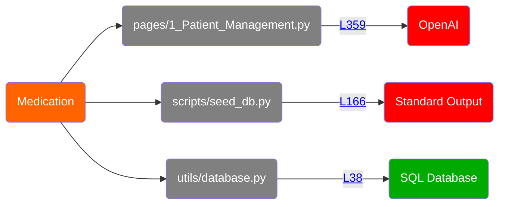
<details>
<summary>Show all 71 occurrences</summary>

[pages/1_Patient_Management.py:315](https://github.com/hounddogai/hounddog-test-python-app/blob/f29c8bebe716/pages/1_Patient_Management.py#L315-L315)

```python
patient_data
```
[scripts/seed_db.py:160](https://github.com/hounddogai/hounddog-test-python-app/blob/f29c8bebe716/scripts/seed_db.py#L160-L160)

```python
"current_medications": random.choice(medications_list)
```
[pages/1_Patient_Management.py:346](https://github.com/hounddogai/hounddog-test-python-app/blob/f29c8bebe716/pages/1_Patient_Management.py#L346-L346)

```python
patient_context
```
[pages/1_Patient_Management.py:221](https://github.com/hounddogai/hounddog-test-python-app/blob/f29c8bebe716/pages/1_Patient_Management.py#L221-L221)

```python
patient_data
```
[pages/1_Patient_Management.py:63](https://github.com/hounddogai/hounddog-test-python-app/blob/f29c8bebe716/pages/1_Patient_Management.py#L63-L63)

```python
current_medications
```
[pages/1_Patient_Management.py:267](https://github.com/hounddogai/hounddog-test-python-app/blob/f29c8bebe716/pages/1_Patient_Management.py#L267-L267)

```python
patient_data
```
[pages/1_Patient_Management.py:236](https://github.com/hounddogai/hounddog-test-python-app/blob/f29c8bebe716/pages/1_Patient_Management.py#L236-L236)

```python
patient_data
```
[pages/1_Patient_Management.py:353](https://github.com/hounddogai/hounddog-test-python-app/blob/f29c8bebe716/pages/1_Patient_Management.py#L353-L353)

```python
messages
```
[utils/database.py:60](https://github.com/hounddogai/hounddog-test-python-app/blob/f29c8bebe716/utils/database.py#L60-L60)

```python
"current_medications": self.current_medications
```
[pages/1_Patient_Management.py:355](https://github.com/hounddogai/hounddog-test-python-app/blob/f29c8bebe716/pages/1_Patient_Management.py#L355-L355)

```python
messages
```
[utils/database.py:38](https://github.com/hounddogai/hounddog-test-python-app/blob/f29c8bebe716/utils/database.py#L38-L38)

```python
current_medications
```
[pages/1_Patient_Management.py:230](https://github.com/hounddogai/hounddog-test-python-app/blob/f29c8bebe716/pages/1_Patient_Management.py#L230-L230)

```python
patient_data
```
[pages/1_Patient_Management.py:355](https://github.com/hounddogai/hounddog-test-python-app/blob/f29c8bebe716/pages/1_Patient_Management.py#L355-L355)

```python
messages
```
[pages/1_Patient_Management.py:87](https://github.com/hounddogai/hounddog-test-python-app/blob/f29c8bebe716/pages/1_Patient_Management.py#L87-L87)

```python
"current_medications": current_medications
```
[pages/1_Patient_Management.py:239](https://github.com/hounddogai/hounddog-test-python-app/blob/f29c8bebe716/pages/1_Patient_Management.py#L239-L239)

```python
patient_data
```
[pages/1_Patient_Management.py:222](https://github.com/hounddogai/hounddog-test-python-app/blob/f29c8bebe716/pages/1_Patient_Management.py#L222-L222)

```python
patient_data
```
[pages/1_Patient_Management.py:346](https://github.com/hounddogai/hounddog-test-python-app/blob/f29c8bebe716/pages/1_Patient_Management.py#L346-L346)

```python
patient_context
```
[pages/1_Patient_Management.py:342](https://github.com/hounddogai/hounddog-test-python-app/blob/f29c8bebe716/pages/1_Patient_Management.py#L342-L342)

```python
history_key
```
[pages/1_Patient_Management.py:232](https://github.com/hounddogai/hounddog-test-python-app/blob/f29c8bebe716/pages/1_Patient_Management.py#L232-L232)

```python
patient_data
```
[pages/1_Patient_Management.py:316](https://github.com/hounddogai/hounddog-test-python-app/blob/f29c8bebe716/pages/1_Patient_Management.py#L316-L316)

```python
patient_data
```
[scripts/seed_db.py:164](https://github.com/hounddogai/hounddog-test-python-app/blob/f29c8bebe716/scripts/seed_db.py#L164-L164)

```python
patient_data
```
[pages/1_Patient_Management.py:305](https://github.com/hounddogai/hounddog-test-python-app/blob/f29c8bebe716/pages/1_Patient_Management.py#L305-L305)

```python
patient_data
```
[scripts/seed_db.py:124](https://github.com/hounddogai/hounddog-test-python-app/blob/f29c8bebe716/scripts/seed_db.py#L124-L124)

```python
medications_list
```
[pages/1_Patient_Management.py:180](https://github.com/hounddogai/hounddog-test-python-app/blob/f29c8bebe716/pages/1_Patient_Management.py#L180-L180)

```python
patient_data
```
[pages/1_Patient_Management.py:217](https://github.com/hounddogai/hounddog-test-python-app/blob/f29c8bebe716/pages/1_Patient_Management.py#L217-L217)

```python
patient_data
```
[pages/1_Patient_Management.py:328](https://github.com/hounddogai/hounddog-test-python-app/blob/f29c8bebe716/pages/1_Patient_Management.py#L328-L328)

```python
history_key
```
[pages/1_Patient_Management.py:306](https://github.com/hounddogai/hounddog-test-python-app/blob/f29c8bebe716/pages/1_Patient_Management.py#L306-L306)

```python
patient_data
```
[pages/1_Patient_Management.py:272](https://github.com/hounddogai/hounddog-test-python-app/blob/f29c8bebe716/pages/1_Patient_Management.py#L272-L272)

```python
patient_data
```
[pages/1_Patient_Management.py:186](https://github.com/hounddogai/hounddog-test-python-app/blob/f29c8bebe716/pages/1_Patient_Management.py#L186-L186)

```python
patient_data
```
[pages/1_Patient_Management.py:186](https://github.com/hounddogai/hounddog-test-python-app/blob/f29c8bebe716/pages/1_Patient_Management.py#L186-L186)

```python
patient_data
```
[pages/1_Patient_Management.py:327](https://github.com/hounddogai/hounddog-test-python-app/blob/f29c8bebe716/pages/1_Patient_Management.py#L327-L327)

```python
patient_data
```
[utils/database.py:60](https://github.com/hounddogai/hounddog-test-python-app/blob/f29c8bebe716/utils/database.py#L60-L60)

```python
current_medications
```
[scripts/seed_db.py:160](https://github.com/hounddogai/hounddog-test-python-app/blob/f29c8bebe716/scripts/seed_db.py#L160-L160)

```python
medications_list
```
[utils/database.py:38](https://github.com/hounddogai/hounddog-test-python-app/blob/f29c8bebe716/utils/database.py#L38-L38)

```python
current_medications = Column(Text)
```
[pages/1_Patient_Management.py:214](https://github.com/hounddogai/hounddog-test-python-app/blob/f29c8bebe716/pages/1_Patient_Management.py#L214-L214)

```python
patient_data
```
[pages/1_Patient_Management.py:359](https://github.com/hounddogai/hounddog-test-python-app/blob/f29c8bebe716/pages/1_Patient_Management.py#L359-L359)

```python
messages
```
[pages/1_Patient_Management.py:223](https://github.com/hounddogai/hounddog-test-python-app/blob/f29c8bebe716/pages/1_Patient_Management.py#L223-L223)

```python
patient_data
```
[pages/1_Patient_Management.py:305](https://github.com/hounddogai/hounddog-test-python-app/blob/f29c8bebe716/pages/1_Patient_Management.py#L305-L305)

```python
patient_data
```
[pages/1_Patient_Management.py:353](https://github.com/hounddogai/hounddog-test-python-app/blob/f29c8bebe716/pages/1_Patient_Management.py#L353-L353)

```python
messages
```
[pages/1_Patient_Management.py:87](https://github.com/hounddogai/hounddog-test-python-app/blob/f29c8bebe716/pages/1_Patient_Management.py#L87-L87)

```python
current_medications
```
[pages/1_Patient_Management.py:317](https://github.com/hounddogai/hounddog-test-python-app/blob/f29c8bebe716/pages/1_Patient_Management.py#L317-L317)

```python
patient_data
```
[pages/1_Patient_Management.py:216](https://github.com/hounddogai/hounddog-test-python-app/blob/f29c8bebe716/pages/1_Patient_Management.py#L216-L216)

```python
patient_data
```
[pages/1_Patient_Management.py:311](https://github.com/hounddogai/hounddog-test-python-app/blob/f29c8bebe716/pages/1_Patient_Management.py#L311-L311)

```python
patient_data
```
[pages/1_Patient_Management.py:295](https://github.com/hounddogai/hounddog-test-python-app/blob/f29c8bebe716/pages/1_Patient_Management.py#L295-L295)

```python
patient_data
```
[pages/1_Patient_Management.py:332](https://github.com/hounddogai/hounddog-test-python-app/blob/f29c8bebe716/pages/1_Patient_Management.py#L332-L332)

```python
history_key
```
[pages/1_Patient_Management.py:182](https://github.com/hounddogai/hounddog-test-python-app/blob/f29c8bebe716/pages/1_Patient_Management.py#L182-L182)

```python
patient_data
```
[pages/1_Patient_Management.py:244](https://github.com/hounddogai/hounddog-test-python-app/blob/f29c8bebe716/pages/1_Patient_Management.py#L244-L244)

```python
patient_data
```
[pages/1_Patient_Management.py:310](https://github.com/hounddogai/hounddog-test-python-app/blob/f29c8bebe716/pages/1_Patient_Management.py#L310-L310)

```python
patient_data
```
[pages/1_Patient_Management.py:215](https://github.com/hounddogai/hounddog-test-python-app/blob/f29c8bebe716/pages/1_Patient_Management.py#L215-L215)

```python
patient_data
```
[pages/1_Patient_Management.py:329](https://github.com/hounddogai/hounddog-test-python-app/blob/f29c8bebe716/pages/1_Patient_Management.py#L329-L329)

```python
history_key
```
[pages/1_Patient_Management.py:281](https://github.com/hounddogai/hounddog-test-python-app/blob/f29c8bebe716/pages/1_Patient_Management.py#L281-L281)

```python
patient_data
```
[scripts/seed_db.py:166](https://github.com/hounddogai/hounddog-test-python-app/blob/f29c8bebe716/scripts/seed_db.py#L166-L166)

```python
patient_data
```
[pages/1_Patient_Management.py:187](https://github.com/hounddogai/hounddog-test-python-app/blob/f29c8bebe716/pages/1_Patient_Management.py#L187-L187)

```python
patient_data
```
[pages/1_Patient_Management.py:355](https://github.com/hounddogai/hounddog-test-python-app/blob/f29c8bebe716/pages/1_Patient_Management.py#L355-L355)

```python
messages
```
[utils/database.py:60](https://github.com/hounddogai/hounddog-test-python-app/blob/f29c8bebe716/utils/database.py#L60-L60)

```python
self.current_medications
```
[pages/1_Patient_Management.py:307](https://github.com/hounddogai/hounddog-test-python-app/blob/f29c8bebe716/pages/1_Patient_Management.py#L307-L307)

```python
patient_data
```
[pages/1_Patient_Management.py:243](https://github.com/hounddogai/hounddog-test-python-app/blob/f29c8bebe716/pages/1_Patient_Management.py#L243-L243)

```python
patient_data
```
[pages/1_Patient_Management.py:346](https://github.com/hounddogai/hounddog-test-python-app/blob/f29c8bebe716/pages/1_Patient_Management.py#L346-L346)

```python
patient_context
```
[pages/1_Patient_Management.py:359](https://github.com/hounddogai/hounddog-test-python-app/blob/f29c8bebe716/pages/1_Patient_Management.py#L359-L359)

```python
messages
```
[pages/1_Patient_Management.py:292](https://github.com/hounddogai/hounddog-test-python-app/blob/f29c8bebe716/pages/1_Patient_Management.py#L292-L292)

```python
patient_data
```
[pages/1_Patient_Management.py:213](https://github.com/hounddogai/hounddog-test-python-app/blob/f29c8bebe716/pages/1_Patient_Management.py#L213-L213)

```python
patient_data
```
[utils/data_manager.py:46](https://github.com/hounddogai/hounddog-test-python-app/blob/f29c8bebe716/utils/data_manager.py#L46-L46)

```python
current_medications
```
[pages/1_Patient_Management.py:213](https://github.com/hounddogai/hounddog-test-python-app/blob/f29c8bebe716/pages/1_Patient_Management.py#L213-L213)

```python
patient_data
```
[pages/1_Patient_Management.py:363](https://github.com/hounddogai/hounddog-test-python-app/blob/f29c8bebe716/pages/1_Patient_Management.py#L363-L363)

```python
history_key
```
[pages/1_Patient_Management.py:347](https://github.com/hounddogai/hounddog-test-python-app/blob/f29c8bebe716/pages/1_Patient_Management.py#L347-L347)

```python
history_key
```
[pages/1_Patient_Management.py:308](https://github.com/hounddogai/hounddog-test-python-app/blob/f29c8bebe716/pages/1_Patient_Management.py#L308-L308)

```python
patient_data
```
[pages/1_Patient_Management.py:359](https://github.com/hounddogai/hounddog-test-python-app/blob/f29c8bebe716/pages/1_Patient_Management.py#L359-L359)

```python
messages
```
[pages/1_Patient_Management.py:353](https://github.com/hounddogai/hounddog-test-python-app/blob/f29c8bebe716/pages/1_Patient_Management.py#L353-L353)

```python
messages
```
[pages/1_Patient_Management.py:314](https://github.com/hounddogai/hounddog-test-python-app/blob/f29c8bebe716/pages/1_Patient_Management.py#L314-L314)

```python
patient_data
```
[pages/1_Patient_Management.py:91](https://github.com/hounddogai/hounddog-test-python-app/blob/f29c8bebe716/pages/1_Patient_Management.py#L91-L91)

```python
patient_data
```
[pages/1_Patient_Management.py:309](https://github.com/hounddogai/hounddog-test-python-app/blob/f29c8bebe716/pages/1_Patient_Management.py#L309-L309)

```python
patient_data
```
</details>

## 9. Phone Number

**Sensitivity:** <span style="color:rgba(255, 255, 255, 1); background-color:rgba(255, 100, 0, 1); font-family: monospace; border-radius: 3px;">&nbsp;&nbsp;**MEDIUM**&nbsp;&nbsp;</span>

**Tags:** PII

**Dataflows:**

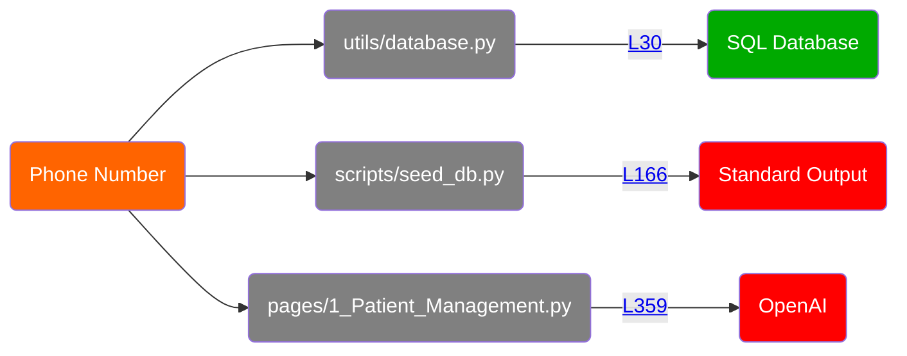
<details>
<summary>Show all 77 occurrences</summary>

[pages/1_Patient_Management.py:44](https://github.com/hounddogai/hounddog-test-python-app/blob/f29c8bebe716/pages/1_Patient_Management.py#L44-L44)

```python
phone
```
[pages/1_Patient_Management.py:309](https://github.com/hounddogai/hounddog-test-python-app/blob/f29c8bebe716/pages/1_Patient_Management.py#L309-L309)

```python
patient_data
```
[pages/1_Patient_Management.py:272](https://github.com/hounddogai/hounddog-test-python-app/blob/f29c8bebe716/pages/1_Patient_Management.py#L272-L272)

```python
patient_data
```
[pages/1_Patient_Management.py:359](https://github.com/hounddogai/hounddog-test-python-app/blob/f29c8bebe716/pages/1_Patient_Management.py#L359-L359)

```python
messages
```
[pages/1_Patient_Management.py:215](https://github.com/hounddogai/hounddog-test-python-app/blob/f29c8bebe716/pages/1_Patient_Management.py#L215-L215)

```python
patient_data
```
[pages/1_Patient_Management.py:346](https://github.com/hounddogai/hounddog-test-python-app/blob/f29c8bebe716/pages/1_Patient_Management.py#L346-L346)

```python
patient_context
```
[utils/data_manager.py:421](https://github.com/hounddogai/hounddog-test-python-app/blob/f29c8bebe716/utils/data_manager.py#L421-L421)

```python
patient.phone
```
[pages/1_Patient_Management.py:222](https://github.com/hounddogai/hounddog-test-python-app/blob/f29c8bebe716/pages/1_Patient_Management.py#L222-L222)

```python
patient_data
```
[pages/1_Patient_Management.py:327](https://github.com/hounddogai/hounddog-test-python-app/blob/f29c8bebe716/pages/1_Patient_Management.py#L327-L327)

```python
patient_data
```
[pages/1_Patient_Management.py:91](https://github.com/hounddogai/hounddog-test-python-app/blob/f29c8bebe716/pages/1_Patient_Management.py#L91-L91)

```python
patient_data
```
[pages/1_Patient_Management.py:332](https://github.com/hounddogai/hounddog-test-python-app/blob/f29c8bebe716/pages/1_Patient_Management.py#L332-L332)

```python
history_key
```
[pages/1_Patient_Management.py:186](https://github.com/hounddogai/hounddog-test-python-app/blob/f29c8bebe716/pages/1_Patient_Management.py#L186-L186)

```python
patient_data
```
[pages/1_Patient_Management.py:186](https://github.com/hounddogai/hounddog-test-python-app/blob/f29c8bebe716/pages/1_Patient_Management.py#L186-L186)

```python
patient_data
```
[pages/1_Patient_Management.py:305](https://github.com/hounddogai/hounddog-test-python-app/blob/f29c8bebe716/pages/1_Patient_Management.py#L305-L305)

```python
patient_data
```
[pages/1_Patient_Management.py:187](https://github.com/hounddogai/hounddog-test-python-app/blob/f29c8bebe716/pages/1_Patient_Management.py#L187-L187)

```python
patient_data
```
[pages/1_Patient_Management.py:180](https://github.com/hounddogai/hounddog-test-python-app/blob/f29c8bebe716/pages/1_Patient_Management.py#L180-L180)

```python
patient_data
```
[pages/1_Patient_Management.py:346](https://github.com/hounddogai/hounddog-test-python-app/blob/f29c8bebe716/pages/1_Patient_Management.py#L346-L346)

```python
patient_context
```
[pages/1_Patient_Management.py:359](https://github.com/hounddogai/hounddog-test-python-app/blob/f29c8bebe716/pages/1_Patient_Management.py#L359-L359)

```python
messages
```
[pages/1_Patient_Management.py:244](https://github.com/hounddogai/hounddog-test-python-app/blob/f29c8bebe716/pages/1_Patient_Management.py#L244-L244)

```python
patient_data
```
[pages/1_Patient_Management.py:239](https://github.com/hounddogai/hounddog-test-python-app/blob/f29c8bebe716/pages/1_Patient_Management.py#L239-L239)

```python
patient_data
```
[pages/1_Patient_Management.py:216](https://github.com/hounddogai/hounddog-test-python-app/blob/f29c8bebe716/pages/1_Patient_Management.py#L216-L216)

```python
patient_data
```
[utils/database.py:30](https://github.com/hounddogai/hounddog-test-python-app/blob/f29c8bebe716/utils/database.py#L30-L30)

```python
phone
```
[pages/1_Patient_Management.py:214](https://github.com/hounddogai/hounddog-test-python-app/blob/f29c8bebe716/pages/1_Patient_Management.py#L214-L214)

```python
patient_data
```
[pages/1_Patient_Management.py:311](https://github.com/hounddogai/hounddog-test-python-app/blob/f29c8bebe716/pages/1_Patient_Management.py#L311-L311)

```python
patient_data
```
[pages/1_Patient_Management.py:353](https://github.com/hounddogai/hounddog-test-python-app/blob/f29c8bebe716/pages/1_Patient_Management.py#L353-L353)

```python
messages
```
[utils/data_manager.py:522](https://github.com/hounddogai/hounddog-test-python-app/blob/f29c8bebe716/utils/data_manager.py#L522-L522)

```python
phone
```
[pages/1_Patient_Management.py:347](https://github.com/hounddogai/hounddog-test-python-app/blob/f29c8bebe716/pages/1_Patient_Management.py#L347-L347)

```python
history_key
```
[pages/1_Patient_Management.py:353](https://github.com/hounddogai/hounddog-test-python-app/blob/f29c8bebe716/pages/1_Patient_Management.py#L353-L353)

```python
messages
```
[pages/1_Patient_Management.py:329](https://github.com/hounddogai/hounddog-test-python-app/blob/f29c8bebe716/pages/1_Patient_Management.py#L329-L329)

```python
history_key
```
[pages/1_Patient_Management.py:232](https://github.com/hounddogai/hounddog-test-python-app/blob/f29c8bebe716/pages/1_Patient_Management.py#L232-L232)

```python
patient_data
```
[pages/1_Patient_Management.py:314](https://github.com/hounddogai/hounddog-test-python-app/blob/f29c8bebe716/pages/1_Patient_Management.py#L314-L314)

```python
patient_data
```
[pages/1_Patient_Management.py:306](https://github.com/hounddogai/hounddog-test-python-app/blob/f29c8bebe716/pages/1_Patient_Management.py#L306-L306)

```python
patient_data
```
[utils/data_manager.py:522](https://github.com/hounddogai/hounddog-test-python-app/blob/f29c8bebe716/utils/data_manager.py#L522-L522)

```python
Patient.phone.isnot
```
[pages/1_Patient_Management.py:355](https://github.com/hounddogai/hounddog-test-python-app/blob/f29c8bebe716/pages/1_Patient_Management.py#L355-L355)

```python
messages
```
[pages/1_Patient_Management.py:182](https://github.com/hounddogai/hounddog-test-python-app/blob/f29c8bebe716/pages/1_Patient_Management.py#L182-L182)

```python
patient_data
```
[pages/1_Patient_Management.py:292](https://github.com/hounddogai/hounddog-test-python-app/blob/f29c8bebe716/pages/1_Patient_Management.py#L292-L292)

```python
patient_data
```
[pages/1_Patient_Management.py:236](https://github.com/hounddogai/hounddog-test-python-app/blob/f29c8bebe716/pages/1_Patient_Management.py#L236-L236)

```python
patient_data
```
[pages/1_Patient_Management.py:307](https://github.com/hounddogai/hounddog-test-python-app/blob/f29c8bebe716/pages/1_Patient_Management.py#L307-L307)

```python
patient_data
```
[pages/1_Patient_Management.py:363](https://github.com/hounddogai/hounddog-test-python-app/blob/f29c8bebe716/pages/1_Patient_Management.py#L363-L363)

```python
history_key
```
[pages/1_Patient_Management.py:310](https://github.com/hounddogai/hounddog-test-python-app/blob/f29c8bebe716/pages/1_Patient_Management.py#L310-L310)

```python
patient_data
```
[utils/database.py:52](https://github.com/hounddogai/hounddog-test-python-app/blob/f29c8bebe716/utils/database.py#L52-L52)

```python
"phone": self.phone
```
[pages/1_Patient_Management.py:217](https://github.com/hounddogai/hounddog-test-python-app/blob/f29c8bebe716/pages/1_Patient_Management.py#L217-L217)

```python
patient_data
```
[pages/1_Patient_Management.py:342](https://github.com/hounddogai/hounddog-test-python-app/blob/f29c8bebe716/pages/1_Patient_Management.py#L342-L342)

```python
history_key
```
[pages/1_Patient_Management.py:353](https://github.com/hounddogai/hounddog-test-python-app/blob/f29c8bebe716/pages/1_Patient_Management.py#L353-L353)

```python
messages
```
[pages/1_Patient_Management.py:328](https://github.com/hounddogai/hounddog-test-python-app/blob/f29c8bebe716/pages/1_Patient_Management.py#L328-L328)

```python
history_key
```
[pages/1_Patient_Management.py:315](https://github.com/hounddogai/hounddog-test-python-app/blob/f29c8bebe716/pages/1_Patient_Management.py#L315-L315)

```python
patient_data
```
[pages/1_Patient_Management.py:346](https://github.com/hounddogai/hounddog-test-python-app/blob/f29c8bebe716/pages/1_Patient_Management.py#L346-L346)

```python
patient_context
```
[pages/1_Patient_Management.py:243](https://github.com/hounddogai/hounddog-test-python-app/blob/f29c8bebe716/pages/1_Patient_Management.py#L243-L243)

```python
patient_data
```
[pages/1_Patient_Management.py:79](https://github.com/hounddogai/hounddog-test-python-app/blob/f29c8bebe716/pages/1_Patient_Management.py#L79-L79)

```python
phone
```
[utils/data_manager.py:522](https://github.com/hounddogai/hounddog-test-python-app/blob/f29c8bebe716/utils/data_manager.py#L522-L522)

```python
Patient.phone.isnot
```
[scripts/seed_db.py:164](https://github.com/hounddogai/hounddog-test-python-app/blob/f29c8bebe716/scripts/seed_db.py#L164-L164)

```python
patient_data
```
[pages/1_Patient_Management.py:221](https://github.com/hounddogai/hounddog-test-python-app/blob/f29c8bebe716/pages/1_Patient_Management.py#L221-L221)

```python
patient_data
```
[utils/data_manager.py:421](https://github.com/hounddogai/hounddog-test-python-app/blob/f29c8bebe716/utils/data_manager.py#L421-L421)

```python
"phone": patient.phone or ""
```
[pages/1_Patient_Management.py:355](https://github.com/hounddogai/hounddog-test-python-app/blob/f29c8bebe716/pages/1_Patient_Management.py#L355-L355)

```python
messages
```
[pages/1_Patient_Management.py:295](https://github.com/hounddogai/hounddog-test-python-app/blob/f29c8bebe716/pages/1_Patient_Management.py#L295-L295)

```python
patient_data
```
[pages/1_Patient_Management.py:267](https://github.com/hounddogai/hounddog-test-python-app/blob/f29c8bebe716/pages/1_Patient_Management.py#L267-L267)

```python
patient_data
```
[utils/data_manager.py:38](https://github.com/hounddogai/hounddog-test-python-app/blob/f29c8bebe716/utils/data_manager.py#L38-L38)

```python
phone
```
[utils/data_manager.py:522](https://github.com/hounddogai/hounddog-test-python-app/blob/f29c8bebe716/utils/data_manager.py#L522-L522)

```python
Patient.phone
```
[pages/1_Patient_Management.py:213](https://github.com/hounddogai/hounddog-test-python-app/blob/f29c8bebe716/pages/1_Patient_Management.py#L213-L213)

```python
patient_data
```
[pages/1_Patient_Management.py:79](https://github.com/hounddogai/hounddog-test-python-app/blob/f29c8bebe716/pages/1_Patient_Management.py#L79-L79)

```python
"phone": phone
```
[utils/database.py:30](https://github.com/hounddogai/hounddog-test-python-app/blob/f29c8bebe716/utils/database.py#L30-L30)

```python
phone = Column(String(50))
```
[pages/1_Patient_Management.py:281](https://github.com/hounddogai/hounddog-test-python-app/blob/f29c8bebe716/pages/1_Patient_Management.py#L281-L281)

```python
patient_data
```
[pages/1_Patient_Management.py:359](https://github.com/hounddogai/hounddog-test-python-app/blob/f29c8bebe716/pages/1_Patient_Management.py#L359-L359)

```python
messages
```
[utils/data_manager.py:522](https://github.com/hounddogai/hounddog-test-python-app/blob/f29c8bebe716/utils/data_manager.py#L522-L522)

```python
Patient.phone
```
[pages/1_Patient_Management.py:355](https://github.com/hounddogai/hounddog-test-python-app/blob/f29c8bebe716/pages/1_Patient_Management.py#L355-L355)

```python
messages
```
[utils/database.py:52](https://github.com/hounddogai/hounddog-test-python-app/blob/f29c8bebe716/utils/database.py#L52-L52)

```python
self.phone
```
[pages/1_Patient_Management.py:317](https://github.com/hounddogai/hounddog-test-python-app/blob/f29c8bebe716/pages/1_Patient_Management.py#L317-L317)

```python
patient_data
```
[utils/database.py:52](https://github.com/hounddogai/hounddog-test-python-app/blob/f29c8bebe716/utils/database.py#L52-L52)

```python
phone
```
[pages/1_Patient_Management.py:308](https://github.com/hounddogai/hounddog-test-python-app/blob/f29c8bebe716/pages/1_Patient_Management.py#L308-L308)

```python
patient_data
```
[pages/1_Patient_Management.py:223](https://github.com/hounddogai/hounddog-test-python-app/blob/f29c8bebe716/pages/1_Patient_Management.py#L223-L223)

```python
patient_data
```
[pages/1_Patient_Management.py:213](https://github.com/hounddogai/hounddog-test-python-app/blob/f29c8bebe716/pages/1_Patient_Management.py#L213-L213)

```python
patient_data
```
[scripts/seed_db.py:150](https://github.com/hounddogai/hounddog-test-python-app/blob/f29c8bebe716/scripts/seed_db.py#L150-L150)

```python
"phone": f"+1 ({random.randint(200, 999)}) {random.randint(200, 999)}-{random.randint(1000, 9999)}"
```
[pages/1_Patient_Management.py:305](https://github.com/hounddogai/hounddog-test-python-app/blob/f29c8bebe716/pages/1_Patient_Management.py#L305-L305)

```python
patient_data
```
[pages/1_Patient_Management.py:316](https://github.com/hounddogai/hounddog-test-python-app/blob/f29c8bebe716/pages/1_Patient_Management.py#L316-L316)

```python
patient_data
```
[pages/1_Patient_Management.py:230](https://github.com/hounddogai/hounddog-test-python-app/blob/f29c8bebe716/pages/1_Patient_Management.py#L230-L230)

```python
patient_data
```
[utils/data_manager.py:421](https://github.com/hounddogai/hounddog-test-python-app/blob/f29c8bebe716/utils/data_manager.py#L421-L421)

```python
phone
```
[scripts/seed_db.py:166](https://github.com/hounddogai/hounddog-test-python-app/blob/f29c8bebe716/scripts/seed_db.py#L166-L166)

```python
patient_data
```
</details>

## 10. Vital Sign

**Sensitivity:** <span style="color:rgba(255, 255, 255, 1); background-color:rgba(255, 100, 0, 1); font-family: monospace; border-radius: 3px;">&nbsp;&nbsp;**MEDIUM**&nbsp;&nbsp;</span>

**Tags:** PHI

**Dataflows:** None
<details>
<summary>Show all 4 occurrences</summary>

[pages/2_Health_Metrics.py:107](https://github.com/hounddogai/hounddog-test-python-app/blob/f29c8bebe716/pages/2_Health_Metrics.py#L107-L107)

```python
metric_categories
```
[pages/2_Health_Metrics.py:77](https://github.com/hounddogai/hounddog-test-python-app/blob/f29c8bebe716/pages/2_Health_Metrics.py#L77-L84)

```python
"Vital Signs": [
            "Blood Pressure (Systolic)",
            "Blood Pressure (Diastolic)",
            "Heart Rate",
            "Body Temperature",
            "Respiratory Rate",
            "Oxygen Saturation",
        ]
```
[pages/2_Health_Metrics.py:101](https://github.com/hounddogai/hounddog-test-python-app/blob/f29c8bebe716/pages/2_Health_Metrics.py#L101-L101)

```python
metric_categories
```
[pages/2_Health_Metrics.py:110](https://github.com/hounddogai/hounddog-test-python-app/blob/f29c8bebe716/pages/2_Health_Metrics.py#L110-L110)

```python
metric_categories
```
</details>

## 11. Date of Birth

**Sensitivity:** <span style="color:rgba(0, 0, 0, 1); background-color:rgba(241, 194, 50, 1); font-family: monospace; border-radius: 3px;">&nbsp;&nbsp;&nbsp;**LOW**&nbsp;&nbsp;&nbsp;&nbsp;</span>

**Tags:** PII

**Dataflows:**

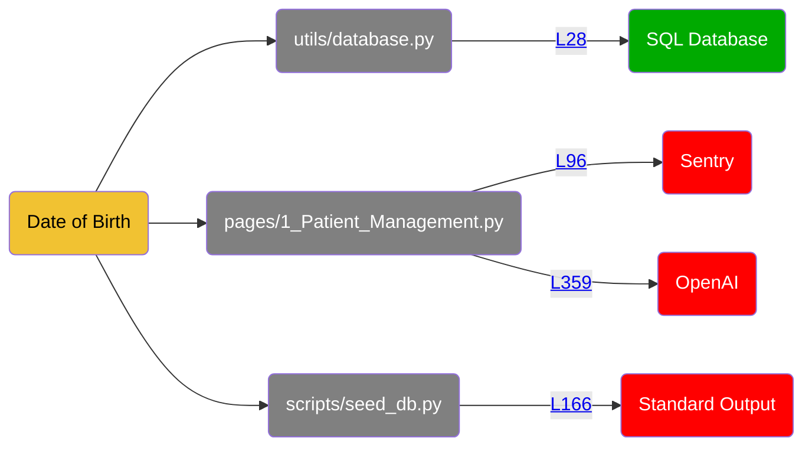
<details>
<summary>Show all 102 occurrences</summary>

[pages/1_Patient_Management.py:306](https://github.com/hounddogai/hounddog-test-python-app/blob/f29c8bebe716/pages/1_Patient_Management.py#L306-L306)

```python
patient_data
```
[utils/data_manager.py:323](https://github.com/hounddogai/hounddog-test-python-app/blob/f29c8bebe716/utils/data_manager.py#L323-L323)

```python
date_of_birth
```
[pages/1_Patient_Management.py:359](https://github.com/hounddogai/hounddog-test-python-app/blob/f29c8bebe716/pages/1_Patient_Management.py#L359-L359)

```python
messages
```
[pages/1_Patient_Management.py:314](https://github.com/hounddogai/hounddog-test-python-app/blob/f29c8bebe716/pages/1_Patient_Management.py#L314-L314)

```python
patient_data
```
[utils/data_manager.py:419](https://github.com/hounddogai/hounddog-test-python-app/blob/f29c8bebe716/utils/data_manager.py#L419-L419)

```python
"date_of_birth": str(patient.date_of_birth)
```
[utils/data_manager.py:286](https://github.com/hounddogai/hounddog-test-python-app/blob/f29c8bebe716/utils/data_manager.py#L286-L286)

```python
date_of_birth
```
[utils/database.py:28](https://github.com/hounddogai/hounddog-test-python-app/blob/f29c8bebe716/utils/database.py#L28-L28)

```python
date_of_birth = Column(Date, nullable=False)
```
[pages/1_Patient_Management.py:244](https://github.com/hounddogai/hounddog-test-python-app/blob/f29c8bebe716/pages/1_Patient_Management.py#L244-L244)

```python
patient_data
```
[utils/data_manager.py:291](https://github.com/hounddogai/hounddog-test-python-app/blob/f29c8bebe716/utils/data_manager.py#L291-L291)

```python
patient.date_of_birth
```
[utils/data_manager.py:291](https://github.com/hounddogai/hounddog-test-python-app/blob/f29c8bebe716/utils/data_manager.py#L291-L291)

```python
date_of_birth
```
[pages/1_Patient_Management.py:309](https://github.com/hounddogai/hounddog-test-python-app/blob/f29c8bebe716/pages/1_Patient_Management.py#L309-L309)

```python
patient_data
```
[utils/database.py:50](https://github.com/hounddogai/hounddog-test-python-app/blob/f29c8bebe716/utils/database.py#L50-L50)

```python
"date_of_birth": self.date_of_birth
```
[pages/1_Patient_Management.py:353](https://github.com/hounddogai/hounddog-test-python-app/blob/f29c8bebe716/pages/1_Patient_Management.py#L353-L353)

```python
messages
```
[pages/1_Patient_Management.py:346](https://github.com/hounddogai/hounddog-test-python-app/blob/f29c8bebe716/pages/1_Patient_Management.py#L346-L346)

```python
patient_context
```
[pages/1_Patient_Management.py:307](https://github.com/hounddogai/hounddog-test-python-app/blob/f29c8bebe716/pages/1_Patient_Management.py#L307-L307)

```python
patient_data
```
[pages/1_Patient_Management.py:217](https://github.com/hounddogai/hounddog-test-python-app/blob/f29c8bebe716/pages/1_Patient_Management.py#L217-L217)

```python
patient_data
```
[pages/1_Patient_Management.py:363](https://github.com/hounddogai/hounddog-test-python-app/blob/f29c8bebe716/pages/1_Patient_Management.py#L363-L363)

```python
history_key
```
[utils/data_manager.py:520](https://github.com/hounddogai/hounddog-test-python-app/blob/f29c8bebe716/utils/data_manager.py#L520-L520)

```python
Patient.date_of_birth.isnot
```
[pages/1_Patient_Management.py:215](https://github.com/hounddogai/hounddog-test-python-app/blob/f29c8bebe716/pages/1_Patient_Management.py#L215-L215)

```python
patient_data
```
[pages/1_Patient_Management.py:305](https://github.com/hounddogai/hounddog-test-python-app/blob/f29c8bebe716/pages/1_Patient_Management.py#L305-L305)

```python
patient_data
```
[utils/data_manager.py:419](https://github.com/hounddogai/hounddog-test-python-app/blob/f29c8bebe716/utils/data_manager.py#L419-L419)

```python
date_of_birth
```
[utils/data_manager.py:328](https://github.com/hounddogai/hounddog-test-python-app/blob/f29c8bebe716/utils/data_manager.py#L328-L328)

```python
patient.date_of_birth.day
```
[utils/data_manager.py:290](https://github.com/hounddogai/hounddog-test-python-app/blob/f29c8bebe716/utils/data_manager.py#L290-L290)

```python
patient.date_of_birth
```
[pages/1_Patient_Management.py:353](https://github.com/hounddogai/hounddog-test-python-app/blob/f29c8bebe716/pages/1_Patient_Management.py#L353-L353)

```python
messages
```
[scripts/seed_db.py:164](https://github.com/hounddogai/hounddog-test-python-app/blob/f29c8bebe716/scripts/seed_db.py#L164-L164)

```python
patient_data
```
[pages/1_Patient_Management.py:342](https://github.com/hounddogai/hounddog-test-python-app/blob/f29c8bebe716/pages/1_Patient_Management.py#L342-L342)

```python
history_key
```
[pages/1_Patient_Management.py:214](https://github.com/hounddogai/hounddog-test-python-app/blob/f29c8bebe716/pages/1_Patient_Management.py#L214-L214)

```python
patient_data
```
[pages/1_Patient_Management.py:359](https://github.com/hounddogai/hounddog-test-python-app/blob/f29c8bebe716/pages/1_Patient_Management.py#L359-L359)

```python
messages
```
[utils/database.py:50](https://github.com/hounddogai/hounddog-test-python-app/blob/f29c8bebe716/utils/database.py#L50-L50)

```python
date_of_birth
```
[utils/data_manager.py:290](https://github.com/hounddogai/hounddog-test-python-app/blob/f29c8bebe716/utils/data_manager.py#L290-L290)

```python
date_of_birth
```
[pages/1_Patient_Management.py:353](https://github.com/hounddogai/hounddog-test-python-app/blob/f29c8bebe716/pages/1_Patient_Management.py#L353-L353)

```python
messages
```
[utils/data_manager.py:520](https://github.com/hounddogai/hounddog-test-python-app/blob/f29c8bebe716/utils/data_manager.py#L520-L520)

```python
date_of_birth
```
[pages/1_Patient_Management.py:311](https://github.com/hounddogai/hounddog-test-python-app/blob/f29c8bebe716/pages/1_Patient_Management.py#L311-L311)

```python
patient_data
```
[utils/data_manager.py:286](https://github.com/hounddogai/hounddog-test-python-app/blob/f29c8bebe716/utils/data_manager.py#L286-L286)

```python
patient.date_of_birth
```
[pages/1_Patient_Management.py:310](https://github.com/hounddogai/hounddog-test-python-app/blob/f29c8bebe716/pages/1_Patient_Management.py#L310-L310)

```python
patient_data
```
[pages/1_Patient_Management.py:355](https://github.com/hounddogai/hounddog-test-python-app/blob/f29c8bebe716/pages/1_Patient_Management.py#L355-L355)

```python
messages
```
[utils/data_manager.py:328](https://github.com/hounddogai/hounddog-test-python-app/blob/f29c8bebe716/utils/data_manager.py#L328-L328)

```python
patient.date_of_birth.month
```
[utils/data_manager.py:328](https://github.com/hounddogai/hounddog-test-python-app/blob/f29c8bebe716/utils/data_manager.py#L328-L328)

```python
patient.date_of_birth
```
[pages/1_Patient_Management.py:221](https://github.com/hounddogai/hounddog-test-python-app/blob/f29c8bebe716/pages/1_Patient_Management.py#L221-L221)

```python
patient_data
```
[utils/data_manager.py:290](https://github.com/hounddogai/hounddog-test-python-app/blob/f29c8bebe716/utils/data_manager.py#L290-L290)

```python
patient.date_of_birth.year
```
[scripts/seed_db.py:166](https://github.com/hounddogai/hounddog-test-python-app/blob/f29c8bebe716/scripts/seed_db.py#L166-L166)

```python
patient_data
```
[pages/1_Patient_Management.py:305](https://github.com/hounddogai/hounddog-test-python-app/blob/f29c8bebe716/pages/1_Patient_Management.py#L305-L305)

```python
patient_data
```
[pages/1_Patient_Management.py:315](https://github.com/hounddogai/hounddog-test-python-app/blob/f29c8bebe716/pages/1_Patient_Management.py#L315-L315)

```python
patient_data
```
[utils/data_manager.py:36](https://github.com/hounddogai/hounddog-test-python-app/blob/f29c8bebe716/utils/data_manager.py#L36-L36)

```python
date_of_birth
```
[utils/data_manager.py:323](https://github.com/hounddogai/hounddog-test-python-app/blob/f29c8bebe716/utils/data_manager.py#L323-L323)

```python
patient.date_of_birth
```
[utils/data_manager.py:327](https://github.com/hounddogai/hounddog-test-python-app/blob/f29c8bebe716/utils/data_manager.py#L327-L327)

```python
patient.date_of_birth
```
[utils/data_manager.py:520](https://github.com/hounddogai/hounddog-test-python-app/blob/f29c8bebe716/utils/data_manager.py#L520-L520)

```python
Patient.date_of_birth.isnot
```
[pages/1_Patient_Management.py:186](https://github.com/hounddogai/hounddog-test-python-app/blob/f29c8bebe716/pages/1_Patient_Management.py#L186-L186)

```python
patient_data
```
[utils/data_manager.py:328](https://github.com/hounddogai/hounddog-test-python-app/blob/f29c8bebe716/utils/data_manager.py#L328-L328)

```python
patient.date_of_birth
```
[pages/1_Patient_Management.py:223](https://github.com/hounddogai/hounddog-test-python-app/blob/f29c8bebe716/pages/1_Patient_Management.py#L223-L223)

```python
patient_data
```
[pages/1_Patient_Management.py:267](https://github.com/hounddogai/hounddog-test-python-app/blob/f29c8bebe716/pages/1_Patient_Management.py#L267-L267)

```python
patient_data
```
[pages/1_Patient_Management.py:281](https://github.com/hounddogai/hounddog-test-python-app/blob/f29c8bebe716/pages/1_Patient_Management.py#L281-L281)

```python
patient_data
```
[pages/1_Patient_Management.py:308](https://github.com/hounddogai/hounddog-test-python-app/blob/f29c8bebe716/pages/1_Patient_Management.py#L308-L308)

```python
patient_data
```
[pages/1_Patient_Management.py:295](https://github.com/hounddogai/hounddog-test-python-app/blob/f29c8bebe716/pages/1_Patient_Management.py#L295-L295)

```python
patient_data
```
[pages/1_Patient_Management.py:77](https://github.com/hounddogai/hounddog-test-python-app/blob/f29c8bebe716/pages/1_Patient_Management.py#L77-L77)

```python
"date_of_birth": date_of_birth
```
[utils/database.py:28](https://github.com/hounddogai/hounddog-test-python-app/blob/f29c8bebe716/utils/database.py#L28-L28)

```python
date_of_birth
```
[pages/1_Patient_Management.py:182](https://github.com/hounddogai/hounddog-test-python-app/blob/f29c8bebe716/pages/1_Patient_Management.py#L182-L182)

```python
patient_data
```
[pages/1_Patient_Management.py:213](https://github.com/hounddogai/hounddog-test-python-app/blob/f29c8bebe716/pages/1_Patient_Management.py#L213-L213)

```python
patient_data
```
[scripts/seed_db.py:148](https://github.com/hounddogai/hounddog-test-python-app/blob/f29c8bebe716/scripts/seed_db.py#L148-L148)

```python
"date_of_birth": random_date(1940, 2010)
```
[utils/data_manager.py:291](https://github.com/hounddogai/hounddog-test-python-app/blob/f29c8bebe716/utils/data_manager.py#L291-L291)

```python
patient.date_of_birth.month
```
[utils/data_manager.py:328](https://github.com/hounddogai/hounddog-test-python-app/blob/f29c8bebe716/utils/data_manager.py#L328-L328)

```python
date_of_birth
```
[pages/1_Patient_Management.py:317](https://github.com/hounddogai/hounddog-test-python-app/blob/f29c8bebe716/pages/1_Patient_Management.py#L317-L317)

```python
patient_data
```
[pages/1_Patient_Management.py:91](https://github.com/hounddogai/hounddog-test-python-app/blob/f29c8bebe716/pages/1_Patient_Management.py#L91-L91)

```python
patient_data
```
[pages/1_Patient_Management.py:355](https://github.com/hounddogai/hounddog-test-python-app/blob/f29c8bebe716/pages/1_Patient_Management.py#L355-L355)

```python
messages
```
[pages/1_Patient_Management.py:328](https://github.com/hounddogai/hounddog-test-python-app/blob/f29c8bebe716/pages/1_Patient_Management.py#L328-L328)

```python
history_key
```
[pages/1_Patient_Management.py:355](https://github.com/hounddogai/hounddog-test-python-app/blob/f29c8bebe716/pages/1_Patient_Management.py#L355-L355)

```python
messages
```
[pages/1_Patient_Management.py:232](https://github.com/hounddogai/hounddog-test-python-app/blob/f29c8bebe716/pages/1_Patient_Management.py#L232-L232)

```python
patient_data
```
[pages/1_Patient_Management.py:347](https://github.com/hounddogai/hounddog-test-python-app/blob/f29c8bebe716/pages/1_Patient_Management.py#L347-L347)

```python
history_key
```
[utils/data_manager.py:328](https://github.com/hounddogai/hounddog-test-python-app/blob/f29c8bebe716/utils/data_manager.py#L328-L328)

```python
date_of_birth
```
[pages/1_Patient_Management.py:103](https://github.com/hounddogai/hounddog-test-python-app/blob/f29c8bebe716/pages/1_Patient_Management.py#L103-L103)

```python
date_of_birth
```
[utils/data_manager.py:327](https://github.com/hounddogai/hounddog-test-python-app/blob/f29c8bebe716/utils/data_manager.py#L327-L327)

```python
patient.date_of_birth.year
```
[pages/1_Patient_Management.py:272](https://github.com/hounddogai/hounddog-test-python-app/blob/f29c8bebe716/pages/1_Patient_Management.py#L272-L272)

```python
patient_data
```
[pages/1_Patient_Management.py:103](https://github.com/hounddogai/hounddog-test-python-app/blob/f29c8bebe716/pages/1_Patient_Management.py#L103-L103)

```python
"date_of_birth": str(date_of_birth)
```
[pages/1_Patient_Management.py:316](https://github.com/hounddogai/hounddog-test-python-app/blob/f29c8bebe716/pages/1_Patient_Management.py#L316-L316)

```python
patient_data
```
[utils/data_manager.py:291](https://github.com/hounddogai/hounddog-test-python-app/blob/f29c8bebe716/utils/data_manager.py#L291-L291)

```python
patient.date_of_birth
```
[utils/data_manager.py:327](https://github.com/hounddogai/hounddog-test-python-app/blob/f29c8bebe716/utils/data_manager.py#L327-L327)

```python
date_of_birth
```
[pages/1_Patient_Management.py:68](https://github.com/hounddogai/hounddog-test-python-app/blob/f29c8bebe716/pages/1_Patient_Management.py#L68-L68)

```python
date_of_birth
```
[pages/1_Patient_Management.py:243](https://github.com/hounddogai/hounddog-test-python-app/blob/f29c8bebe716/pages/1_Patient_Management.py#L243-L243)

```python
patient_data
```
[pages/1_Patient_Management.py:346](https://github.com/hounddogai/hounddog-test-python-app/blob/f29c8bebe716/pages/1_Patient_Management.py#L346-L346)

```python
patient_context
```
[pages/1_Patient_Management.py:186](https://github.com/hounddogai/hounddog-test-python-app/blob/f29c8bebe716/pages/1_Patient_Management.py#L186-L186)

```python
patient_data
```
[pages/1_Patient_Management.py:292](https://github.com/hounddogai/hounddog-test-python-app/blob/f29c8bebe716/pages/1_Patient_Management.py#L292-L292)

```python
patient_data
```
[pages/1_Patient_Management.py:187](https://github.com/hounddogai/hounddog-test-python-app/blob/f29c8bebe716/pages/1_Patient_Management.py#L187-L187)

```python
patient_data
```
[pages/1_Patient_Management.py:239](https://github.com/hounddogai/hounddog-test-python-app/blob/f29c8bebe716/pages/1_Patient_Management.py#L239-L239)

```python
patient_data
```
[pages/1_Patient_Management.py:216](https://github.com/hounddogai/hounddog-test-python-app/blob/f29c8bebe716/pages/1_Patient_Management.py#L216-L216)

```python
patient_data
```
[utils/data_manager.py:520](https://github.com/hounddogai/hounddog-test-python-app/blob/f29c8bebe716/utils/data_manager.py#L520-L520)

```python
Patient.date_of_birth
```
[pages/1_Patient_Management.py:332](https://github.com/hounddogai/hounddog-test-python-app/blob/f29c8bebe716/pages/1_Patient_Management.py#L332-L332)

```python
history_key
```
[pages/1_Patient_Management.py:236](https://github.com/hounddogai/hounddog-test-python-app/blob/f29c8bebe716/pages/1_Patient_Management.py#L236-L236)

```python
patient_data
```
[pages/1_Patient_Management.py:327](https://github.com/hounddogai/hounddog-test-python-app/blob/f29c8bebe716/pages/1_Patient_Management.py#L327-L327)

```python
patient_data
```
[pages/1_Patient_Management.py:180](https://github.com/hounddogai/hounddog-test-python-app/blob/f29c8bebe716/pages/1_Patient_Management.py#L180-L180)

```python
patient_data
```
[pages/1_Patient_Management.py:329](https://github.com/hounddogai/hounddog-test-python-app/blob/f29c8bebe716/pages/1_Patient_Management.py#L329-L329)

```python
history_key
```
[utils/data_manager.py:291](https://github.com/hounddogai/hounddog-test-python-app/blob/f29c8bebe716/utils/data_manager.py#L291-L291)

```python
patient.date_of_birth.day
```
[pages/1_Patient_Management.py:359](https://github.com/hounddogai/hounddog-test-python-app/blob/f29c8bebe716/pages/1_Patient_Management.py#L359-L359)

```python
messages
```
[utils/data_manager.py:520](https://github.com/hounddogai/hounddog-test-python-app/blob/f29c8bebe716/utils/data_manager.py#L520-L520)

```python
Patient.date_of_birth
```
[pages/1_Patient_Management.py:77](https://github.com/hounddogai/hounddog-test-python-app/blob/f29c8bebe716/pages/1_Patient_Management.py#L77-L77)

```python
date_of_birth
```
[pages/1_Patient_Management.py:34](https://github.com/hounddogai/hounddog-test-python-app/blob/f29c8bebe716/pages/1_Patient_Management.py#L34-L34)

```python
date_of_birth
```
[utils/database.py:50](https://github.com/hounddogai/hounddog-test-python-app/blob/f29c8bebe716/utils/database.py#L50-L50)

```python
self.date_of_birth
```
[pages/1_Patient_Management.py:222](https://github.com/hounddogai/hounddog-test-python-app/blob/f29c8bebe716/pages/1_Patient_Management.py#L222-L222)

```python
patient_data
```
[utils/data_manager.py:291](https://github.com/hounddogai/hounddog-test-python-app/blob/f29c8bebe716/utils/data_manager.py#L291-L291)

```python
date_of_birth
```
[pages/1_Patient_Management.py:213](https://github.com/hounddogai/hounddog-test-python-app/blob/f29c8bebe716/pages/1_Patient_Management.py#L213-L213)

```python
patient_data
```
[pages/1_Patient_Management.py:346](https://github.com/hounddogai/hounddog-test-python-app/blob/f29c8bebe716/pages/1_Patient_Management.py#L346-L346)

```python
patient_context
```
[pages/1_Patient_Management.py:230](https://github.com/hounddogai/hounddog-test-python-app/blob/f29c8bebe716/pages/1_Patient_Management.py#L230-L230)

```python
patient_data
```
[utils/data_manager.py:419](https://github.com/hounddogai/hounddog-test-python-app/blob/f29c8bebe716/utils/data_manager.py#L419-L419)

```python
patient.date_of_birth
```
</details>

## 12. Email

**Sensitivity:** <span style="color:rgba(0, 0, 0, 1); background-color:rgba(241, 194, 50, 1); font-family: monospace; border-radius: 3px;">&nbsp;&nbsp;&nbsp;**LOW**&nbsp;&nbsp;&nbsp;&nbsp;</span>

**Tags:** PII

**Dataflows:**

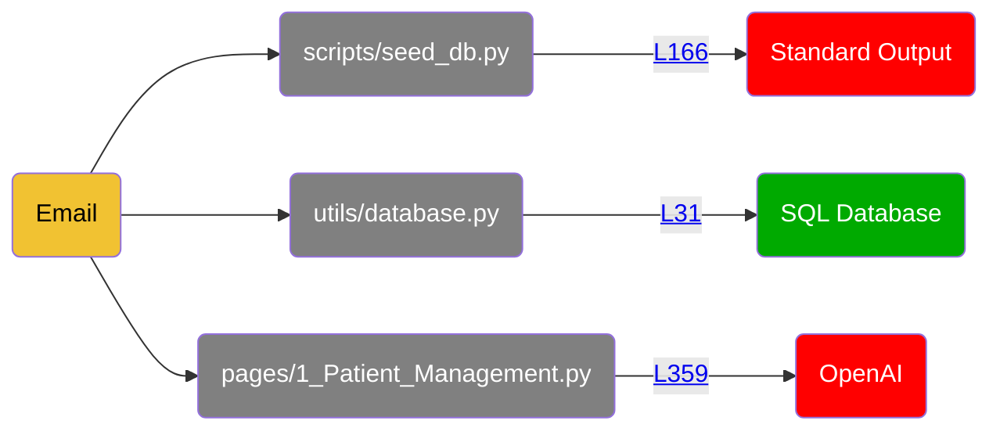
<details>
<summary>Show all 77 occurrences</summary>

[pages/1_Patient_Management.py:221](https://github.com/hounddogai/hounddog-test-python-app/blob/f29c8bebe716/pages/1_Patient_Management.py#L221-L221)

```python
patient_data
```
[pages/1_Patient_Management.py:306](https://github.com/hounddogai/hounddog-test-python-app/blob/f29c8bebe716/pages/1_Patient_Management.py#L306-L306)

```python
patient_data
```
[pages/1_Patient_Management.py:292](https://github.com/hounddogai/hounddog-test-python-app/blob/f29c8bebe716/pages/1_Patient_Management.py#L292-L292)

```python
patient_data
```
[utils/data_manager.py:523](https://github.com/hounddogai/hounddog-test-python-app/blob/f29c8bebe716/utils/data_manager.py#L523-L523)

```python
Patient.email.isnot
```
[pages/1_Patient_Management.py:91](https://github.com/hounddogai/hounddog-test-python-app/blob/f29c8bebe716/pages/1_Patient_Management.py#L91-L91)

```python
patient_data
```
[utils/database.py:31](https://github.com/hounddogai/hounddog-test-python-app/blob/f29c8bebe716/utils/database.py#L31-L31)

```python
email
```
[pages/1_Patient_Management.py:80](https://github.com/hounddogai/hounddog-test-python-app/blob/f29c8bebe716/pages/1_Patient_Management.py#L80-L80)

```python
email
```
[pages/1_Patient_Management.py:342](https://github.com/hounddogai/hounddog-test-python-app/blob/f29c8bebe716/pages/1_Patient_Management.py#L342-L342)

```python
history_key
```
[pages/1_Patient_Management.py:315](https://github.com/hounddogai/hounddog-test-python-app/blob/f29c8bebe716/pages/1_Patient_Management.py#L315-L315)

```python
patient_data
```
[utils/data_manager.py:523](https://github.com/hounddogai/hounddog-test-python-app/blob/f29c8bebe716/utils/data_manager.py#L523-L523)

```python
email
```
[pages/1_Patient_Management.py:213](https://github.com/hounddogai/hounddog-test-python-app/blob/f29c8bebe716/pages/1_Patient_Management.py#L213-L213)

```python
patient_data
```
[pages/1_Patient_Management.py:327](https://github.com/hounddogai/hounddog-test-python-app/blob/f29c8bebe716/pages/1_Patient_Management.py#L327-L327)

```python
patient_data
```
[pages/1_Patient_Management.py:305](https://github.com/hounddogai/hounddog-test-python-app/blob/f29c8bebe716/pages/1_Patient_Management.py#L305-L305)

```python
patient_data
```
[pages/1_Patient_Management.py:45](https://github.com/hounddogai/hounddog-test-python-app/blob/f29c8bebe716/pages/1_Patient_Management.py#L45-L45)

```python
email
```
[pages/1_Patient_Management.py:359](https://github.com/hounddogai/hounddog-test-python-app/blob/f29c8bebe716/pages/1_Patient_Management.py#L359-L359)

```python
messages
```
[pages/1_Patient_Management.py:355](https://github.com/hounddogai/hounddog-test-python-app/blob/f29c8bebe716/pages/1_Patient_Management.py#L355-L355)

```python
messages
```
[pages/1_Patient_Management.py:182](https://github.com/hounddogai/hounddog-test-python-app/blob/f29c8bebe716/pages/1_Patient_Management.py#L182-L182)

```python
patient_data
```
[pages/1_Patient_Management.py:223](https://github.com/hounddogai/hounddog-test-python-app/blob/f29c8bebe716/pages/1_Patient_Management.py#L223-L223)

```python
patient_data
```
[pages/1_Patient_Management.py:328](https://github.com/hounddogai/hounddog-test-python-app/blob/f29c8bebe716/pages/1_Patient_Management.py#L328-L328)

```python
history_key
```
[utils/database.py:31](https://github.com/hounddogai/hounddog-test-python-app/blob/f29c8bebe716/utils/database.py#L31-L31)

```python
email = Column(String(100))
```
[utils/data_manager.py:422](https://github.com/hounddogai/hounddog-test-python-app/blob/f29c8bebe716/utils/data_manager.py#L422-L422)

```python
"email": patient.email or ""
```
[pages/1_Patient_Management.py:346](https://github.com/hounddogai/hounddog-test-python-app/blob/f29c8bebe716/pages/1_Patient_Management.py#L346-L346)

```python
patient_context
```
[utils/data_manager.py:523](https://github.com/hounddogai/hounddog-test-python-app/blob/f29c8bebe716/utils/data_manager.py#L523-L523)

```python
Patient.email
```
[pages/1_Patient_Management.py:180](https://github.com/hounddogai/hounddog-test-python-app/blob/f29c8bebe716/pages/1_Patient_Management.py#L180-L180)

```python
patient_data
```
[utils/data_manager.py:422](https://github.com/hounddogai/hounddog-test-python-app/blob/f29c8bebe716/utils/data_manager.py#L422-L422)

```python
email
```
[utils/data_manager.py:523](https://github.com/hounddogai/hounddog-test-python-app/blob/f29c8bebe716/utils/data_manager.py#L523-L523)

```python
Patient.email.isnot
```
[pages/1_Patient_Management.py:186](https://github.com/hounddogai/hounddog-test-python-app/blob/f29c8bebe716/pages/1_Patient_Management.py#L186-L186)

```python
patient_data
```
[pages/1_Patient_Management.py:214](https://github.com/hounddogai/hounddog-test-python-app/blob/f29c8bebe716/pages/1_Patient_Management.py#L214-L214)

```python
patient_data
```
[pages/1_Patient_Management.py:232](https://github.com/hounddogai/hounddog-test-python-app/blob/f29c8bebe716/pages/1_Patient_Management.py#L232-L232)

```python
patient_data
```
[pages/1_Patient_Management.py:281](https://github.com/hounddogai/hounddog-test-python-app/blob/f29c8bebe716/pages/1_Patient_Management.py#L281-L281)

```python
patient_data
```
[scripts/seed_db.py:164](https://github.com/hounddogai/hounddog-test-python-app/blob/f29c8bebe716/scripts/seed_db.py#L164-L164)

```python
patient_data
```
[pages/1_Patient_Management.py:346](https://github.com/hounddogai/hounddog-test-python-app/blob/f29c8bebe716/pages/1_Patient_Management.py#L346-L346)

```python
patient_context
```
[pages/1_Patient_Management.py:295](https://github.com/hounddogai/hounddog-test-python-app/blob/f29c8bebe716/pages/1_Patient_Management.py#L295-L295)

```python
patient_data
```
[pages/1_Patient_Management.py:309](https://github.com/hounddogai/hounddog-test-python-app/blob/f29c8bebe716/pages/1_Patient_Management.py#L309-L309)

```python
patient_data
```
[pages/1_Patient_Management.py:222](https://github.com/hounddogai/hounddog-test-python-app/blob/f29c8bebe716/pages/1_Patient_Management.py#L222-L222)

```python
patient_data
```
[pages/1_Patient_Management.py:213](https://github.com/hounddogai/hounddog-test-python-app/blob/f29c8bebe716/pages/1_Patient_Management.py#L213-L213)

```python
patient_data
```
[pages/1_Patient_Management.py:187](https://github.com/hounddogai/hounddog-test-python-app/blob/f29c8bebe716/pages/1_Patient_Management.py#L187-L187)

```python
patient_data
```
[pages/1_Patient_Management.py:267](https://github.com/hounddogai/hounddog-test-python-app/blob/f29c8bebe716/pages/1_Patient_Management.py#L267-L267)

```python
patient_data
```
[pages/1_Patient_Management.py:230](https://github.com/hounddogai/hounddog-test-python-app/blob/f29c8bebe716/pages/1_Patient_Management.py#L230-L230)

```python
patient_data
```
[pages/1_Patient_Management.py:272](https://github.com/hounddogai/hounddog-test-python-app/blob/f29c8bebe716/pages/1_Patient_Management.py#L272-L272)

```python
patient_data
```
[utils/data_manager.py:422](https://github.com/hounddogai/hounddog-test-python-app/blob/f29c8bebe716/utils/data_manager.py#L422-L422)

```python
patient.email
```
[pages/1_Patient_Management.py:346](https://github.com/hounddogai/hounddog-test-python-app/blob/f29c8bebe716/pages/1_Patient_Management.py#L346-L346)

```python
patient_context
```
[pages/1_Patient_Management.py:332](https://github.com/hounddogai/hounddog-test-python-app/blob/f29c8bebe716/pages/1_Patient_Management.py#L332-L332)

```python
history_key
```
[pages/1_Patient_Management.py:308](https://github.com/hounddogai/hounddog-test-python-app/blob/f29c8bebe716/pages/1_Patient_Management.py#L308-L308)

```python
patient_data
```
[pages/1_Patient_Management.py:359](https://github.com/hounddogai/hounddog-test-python-app/blob/f29c8bebe716/pages/1_Patient_Management.py#L359-L359)

```python
messages
```
[pages/1_Patient_Management.py:311](https://github.com/hounddogai/hounddog-test-python-app/blob/f29c8bebe716/pages/1_Patient_Management.py#L311-L311)

```python
patient_data
```
[utils/database.py:53](https://github.com/hounddogai/hounddog-test-python-app/blob/f29c8bebe716/utils/database.py#L53-L53)

```python
self.email
```
[pages/1_Patient_Management.py:217](https://github.com/hounddogai/hounddog-test-python-app/blob/f29c8bebe716/pages/1_Patient_Management.py#L217-L217)

```python
patient_data
```
[pages/1_Patient_Management.py:215](https://github.com/hounddogai/hounddog-test-python-app/blob/f29c8bebe716/pages/1_Patient_Management.py#L215-L215)

```python
patient_data
```
[pages/1_Patient_Management.py:239](https://github.com/hounddogai/hounddog-test-python-app/blob/f29c8bebe716/pages/1_Patient_Management.py#L239-L239)

```python
patient_data
```
[utils/data_manager.py:39](https://github.com/hounddogai/hounddog-test-python-app/blob/f29c8bebe716/utils/data_manager.py#L39-L39)

```python
email
```
[pages/1_Patient_Management.py:80](https://github.com/hounddogai/hounddog-test-python-app/blob/f29c8bebe716/pages/1_Patient_Management.py#L80-L80)

```python
"email": email
```
[pages/1_Patient_Management.py:305](https://github.com/hounddogai/hounddog-test-python-app/blob/f29c8bebe716/pages/1_Patient_Management.py#L305-L305)

```python
patient_data
```
[pages/1_Patient_Management.py:310](https://github.com/hounddogai/hounddog-test-python-app/blob/f29c8bebe716/pages/1_Patient_Management.py#L310-L310)

```python
patient_data
```
[pages/1_Patient_Management.py:355](https://github.com/hounddogai/hounddog-test-python-app/blob/f29c8bebe716/pages/1_Patient_Management.py#L355-L355)

```python
messages
```
[pages/1_Patient_Management.py:244](https://github.com/hounddogai/hounddog-test-python-app/blob/f29c8bebe716/pages/1_Patient_Management.py#L244-L244)

```python
patient_data
```
[pages/1_Patient_Management.py:314](https://github.com/hounddogai/hounddog-test-python-app/blob/f29c8bebe716/pages/1_Patient_Management.py#L314-L314)

```python
patient_data
```
[utils/database.py:53](https://github.com/hounddogai/hounddog-test-python-app/blob/f29c8bebe716/utils/database.py#L53-L53)

```python
email
```
[utils/data_manager.py:523](https://github.com/hounddogai/hounddog-test-python-app/blob/f29c8bebe716/utils/data_manager.py#L523-L523)

```python
Patient.email
```
[pages/1_Patient_Management.py:316](https://github.com/hounddogai/hounddog-test-python-app/blob/f29c8bebe716/pages/1_Patient_Management.py#L316-L316)

```python
patient_data
```
[pages/1_Patient_Management.py:353](https://github.com/hounddogai/hounddog-test-python-app/blob/f29c8bebe716/pages/1_Patient_Management.py#L353-L353)

```python
messages
```
[pages/1_Patient_Management.py:363](https://github.com/hounddogai/hounddog-test-python-app/blob/f29c8bebe716/pages/1_Patient_Management.py#L363-L363)

```python
history_key
```
[pages/1_Patient_Management.py:186](https://github.com/hounddogai/hounddog-test-python-app/blob/f29c8bebe716/pages/1_Patient_Management.py#L186-L186)

```python
patient_data
```
[pages/1_Patient_Management.py:329](https://github.com/hounddogai/hounddog-test-python-app/blob/f29c8bebe716/pages/1_Patient_Management.py#L329-L329)

```python
history_key
```
[pages/1_Patient_Management.py:216](https://github.com/hounddogai/hounddog-test-python-app/blob/f29c8bebe716/pages/1_Patient_Management.py#L216-L216)

```python
patient_data
```
[pages/1_Patient_Management.py:236](https://github.com/hounddogai/hounddog-test-python-app/blob/f29c8bebe716/pages/1_Patient_Management.py#L236-L236)

```python
patient_data
```
[pages/1_Patient_Management.py:359](https://github.com/hounddogai/hounddog-test-python-app/blob/f29c8bebe716/pages/1_Patient_Management.py#L359-L359)

```python
messages
```
[pages/1_Patient_Management.py:347](https://github.com/hounddogai/hounddog-test-python-app/blob/f29c8bebe716/pages/1_Patient_Management.py#L347-L347)

```python
history_key
```
[pages/1_Patient_Management.py:243](https://github.com/hounddogai/hounddog-test-python-app/blob/f29c8bebe716/pages/1_Patient_Management.py#L243-L243)

```python
patient_data
```
[pages/1_Patient_Management.py:317](https://github.com/hounddogai/hounddog-test-python-app/blob/f29c8bebe716/pages/1_Patient_Management.py#L317-L317)

```python
patient_data
```
[pages/1_Patient_Management.py:355](https://github.com/hounddogai/hounddog-test-python-app/blob/f29c8bebe716/pages/1_Patient_Management.py#L355-L355)

```python
messages
```
[pages/1_Patient_Management.py:307](https://github.com/hounddogai/hounddog-test-python-app/blob/f29c8bebe716/pages/1_Patient_Management.py#L307-L307)

```python
patient_data
```
[utils/database.py:53](https://github.com/hounddogai/hounddog-test-python-app/blob/f29c8bebe716/utils/database.py#L53-L53)

```python
"email": self.email
```
[scripts/seed_db.py:151](https://github.com/hounddogai/hounddog-test-python-app/blob/f29c8bebe716/scripts/seed_db.py#L151-L151)

```python
"email": f"{first_name.lower()}.{last_name.lower()}@email.com"
```
[scripts/seed_db.py:166](https://github.com/hounddogai/hounddog-test-python-app/blob/f29c8bebe716/scripts/seed_db.py#L166-L166)

```python
patient_data
```
[pages/1_Patient_Management.py:353](https://github.com/hounddogai/hounddog-test-python-app/blob/f29c8bebe716/pages/1_Patient_Management.py#L353-L353)

```python
messages
```
[pages/1_Patient_Management.py:353](https://github.com/hounddogai/hounddog-test-python-app/blob/f29c8bebe716/pages/1_Patient_Management.py#L353-L353)

```python
messages
```
</details>

## 13. Emergency Contact

**Sensitivity:** <span style="color:rgba(0, 0, 0, 1); background-color:rgba(241, 194, 50, 1); font-family: monospace; border-radius: 3px;">&nbsp;&nbsp;&nbsp;**LOW**&nbsp;&nbsp;&nbsp;&nbsp;</span>

**Tags:** PII

**Dataflows:**

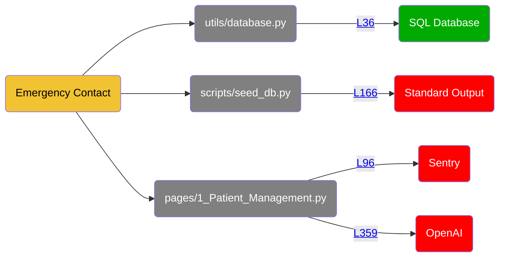
<details>
<summary>Show all 140 occurrences</summary>

[utils/database.py:36](https://github.com/hounddogai/hounddog-test-python-app/blob/f29c8bebe716/utils/database.py#L36-L36)

```python
emergency_contact_phone = Column(String(50))
```
[pages/1_Patient_Management.py:363](https://github.com/hounddogai/hounddog-test-python-app/blob/f29c8bebe716/pages/1_Patient_Management.py#L363-L363)

```python
history_key
```
[pages/1_Patient_Management.py:353](https://github.com/hounddogai/hounddog-test-python-app/blob/f29c8bebe716/pages/1_Patient_Management.py#L353-L353)

```python
messages
```
[pages/1_Patient_Management.py:214](https://github.com/hounddogai/hounddog-test-python-app/blob/f29c8bebe716/pages/1_Patient_Management.py#L214-L214)

```python
patient_data
```
[pages/1_Patient_Management.py:85](https://github.com/hounddogai/hounddog-test-python-app/blob/f29c8bebe716/pages/1_Patient_Management.py#L85-L85)

```python
emergency_contact_phone
```
[pages/1_Patient_Management.py:310](https://github.com/hounddogai/hounddog-test-python-app/blob/f29c8bebe716/pages/1_Patient_Management.py#L310-L310)

```python
patient_data
```
[pages/1_Patient_Management.py:243](https://github.com/hounddogai/hounddog-test-python-app/blob/f29c8bebe716/pages/1_Patient_Management.py#L243-L243)

```python
patient_data
```
[pages/1_Patient_Management.py:317](https://github.com/hounddogai/hounddog-test-python-app/blob/f29c8bebe716/pages/1_Patient_Management.py#L317-L317)

```python
patient_data
```
[pages/1_Patient_Management.py:223](https://github.com/hounddogai/hounddog-test-python-app/blob/f29c8bebe716/pages/1_Patient_Management.py#L223-L223)

```python
patient_data
```
[pages/1_Patient_Management.py:314](https://github.com/hounddogai/hounddog-test-python-app/blob/f29c8bebe716/pages/1_Patient_Management.py#L314-L314)

```python
patient_data
```
[scripts/seed_db.py:166](https://github.com/hounddogai/hounddog-test-python-app/blob/f29c8bebe716/scripts/seed_db.py#L166-L166)

```python
patient_data
```
[pages/1_Patient_Management.py:56](https://github.com/hounddogai/hounddog-test-python-app/blob/f29c8bebe716/pages/1_Patient_Management.py#L56-L56)

```python
emergency_contact_name
```
[pages/1_Patient_Management.py:216](https://github.com/hounddogai/hounddog-test-python-app/blob/f29c8bebe716/pages/1_Patient_Management.py#L216-L216)

```python
patient_data
```
[pages/1_Patient_Management.py:306](https://github.com/hounddogai/hounddog-test-python-app/blob/f29c8bebe716/pages/1_Patient_Management.py#L306-L306)

```python
patient_data
```
[pages/1_Patient_Management.py:215](https://github.com/hounddogai/hounddog-test-python-app/blob/f29c8bebe716/pages/1_Patient_Management.py#L215-L215)

```python
patient_data
```
[pages/1_Patient_Management.py:359](https://github.com/hounddogai/hounddog-test-python-app/blob/f29c8bebe716/pages/1_Patient_Management.py#L359-L359)

```python
messages
```
[pages/1_Patient_Management.py:182](https://github.com/hounddogai/hounddog-test-python-app/blob/f29c8bebe716/pages/1_Patient_Management.py#L182-L182)

```python
patient_data
```
[pages/1_Patient_Management.py:230](https://github.com/hounddogai/hounddog-test-python-app/blob/f29c8bebe716/pages/1_Patient_Management.py#L230-L230)

```python
patient_data
```
[scripts/seed_db.py:164](https://github.com/hounddogai/hounddog-test-python-app/blob/f29c8bebe716/scripts/seed_db.py#L164-L164)

```python
patient_data
```
[pages/1_Patient_Management.py:316](https://github.com/hounddogai/hounddog-test-python-app/blob/f29c8bebe716/pages/1_Patient_Management.py#L316-L316)

```python
patient_data
```
[pages/1_Patient_Management.py:363](https://github.com/hounddogai/hounddog-test-python-app/blob/f29c8bebe716/pages/1_Patient_Management.py#L363-L363)

```python
history_key
```
[scripts/seed_db.py:157](https://github.com/hounddogai/hounddog-test-python-app/blob/f29c8bebe716/scripts/seed_db.py#L157-L157)

```python
"emergency_contact_name": f"{random.choice(first_names_male + first_names_female)} {random.choice(last_names)}"
```
[pages/1_Patient_Management.py:305](https://github.com/hounddogai/hounddog-test-python-app/blob/f29c8bebe716/pages/1_Patient_Management.py#L305-L305)

```python
patient_data
```
[pages/1_Patient_Management.py:236](https://github.com/hounddogai/hounddog-test-python-app/blob/f29c8bebe716/pages/1_Patient_Management.py#L236-L236)

```python
patient_data
```
[pages/1_Patient_Management.py:332](https://github.com/hounddogai/hounddog-test-python-app/blob/f29c8bebe716/pages/1_Patient_Management.py#L332-L332)

```python
history_key
```
[pages/1_Patient_Management.py:355](https://github.com/hounddogai/hounddog-test-python-app/blob/f29c8bebe716/pages/1_Patient_Management.py#L355-L355)

```python
messages
```
[pages/1_Patient_Management.py:359](https://github.com/hounddogai/hounddog-test-python-app/blob/f29c8bebe716/pages/1_Patient_Management.py#L359-L359)

```python
messages
```
[pages/1_Patient_Management.py:84](https://github.com/hounddogai/hounddog-test-python-app/blob/f29c8bebe716/pages/1_Patient_Management.py#L84-L84)

```python
emergency_contact_name
```
[pages/1_Patient_Management.py:347](https://github.com/hounddogai/hounddog-test-python-app/blob/f29c8bebe716/pages/1_Patient_Management.py#L347-L347)

```python
history_key
```
[pages/1_Patient_Management.py:57](https://github.com/hounddogai/hounddog-test-python-app/blob/f29c8bebe716/pages/1_Patient_Management.py#L57-L57)

```python
emergency_contact_phone
```
[pages/1_Patient_Management.py:327](https://github.com/hounddogai/hounddog-test-python-app/blob/f29c8bebe716/pages/1_Patient_Management.py#L327-L327)

```python
patient_data
```
[pages/1_Patient_Management.py:342](https://github.com/hounddogai/hounddog-test-python-app/blob/f29c8bebe716/pages/1_Patient_Management.py#L342-L342)

```python
history_key
```
[utils/database.py:35](https://github.com/hounddogai/hounddog-test-python-app/blob/f29c8bebe716/utils/database.py#L35-L35)

```python
emergency_contact_name
```
[pages/1_Patient_Management.py:239](https://github.com/hounddogai/hounddog-test-python-app/blob/f29c8bebe716/pages/1_Patient_Management.py#L239-L239)

```python
patient_data
```
[pages/1_Patient_Management.py:267](https://github.com/hounddogai/hounddog-test-python-app/blob/f29c8bebe716/pages/1_Patient_Management.py#L267-L267)

```python
patient_data
```
[pages/1_Patient_Management.py:295](https://github.com/hounddogai/hounddog-test-python-app/blob/f29c8bebe716/pages/1_Patient_Management.py#L295-L295)

```python
patient_data
```
[pages/1_Patient_Management.py:346](https://github.com/hounddogai/hounddog-test-python-app/blob/f29c8bebe716/pages/1_Patient_Management.py#L346-L346)

```python
patient_context
```
[pages/1_Patient_Management.py:281](https://github.com/hounddogai/hounddog-test-python-app/blob/f29c8bebe716/pages/1_Patient_Management.py#L281-L281)

```python
patient_data
```
[pages/1_Patient_Management.py:306](https://github.com/hounddogai/hounddog-test-python-app/blob/f29c8bebe716/pages/1_Patient_Management.py#L306-L306)

```python
patient_data
```
[pages/1_Patient_Management.py:359](https://github.com/hounddogai/hounddog-test-python-app/blob/f29c8bebe716/pages/1_Patient_Management.py#L359-L359)

```python
messages
```
[pages/1_Patient_Management.py:332](https://github.com/hounddogai/hounddog-test-python-app/blob/f29c8bebe716/pages/1_Patient_Management.py#L332-L332)

```python
history_key
```
[pages/1_Patient_Management.py:317](https://github.com/hounddogai/hounddog-test-python-app/blob/f29c8bebe716/pages/1_Patient_Management.py#L317-L317)

```python
patient_data
```
[pages/1_Patient_Management.py:359](https://github.com/hounddogai/hounddog-test-python-app/blob/f29c8bebe716/pages/1_Patient_Management.py#L359-L359)

```python
messages
```
[pages/1_Patient_Management.py:213](https://github.com/hounddogai/hounddog-test-python-app/blob/f29c8bebe716/pages/1_Patient_Management.py#L213-L213)

```python
patient_data
```
[pages/1_Patient_Management.py:305](https://github.com/hounddogai/hounddog-test-python-app/blob/f29c8bebe716/pages/1_Patient_Management.py#L305-L305)

```python
patient_data
```
[pages/1_Patient_Management.py:186](https://github.com/hounddogai/hounddog-test-python-app/blob/f29c8bebe716/pages/1_Patient_Management.py#L186-L186)

```python
patient_data
```
[pages/1_Patient_Management.py:186](https://github.com/hounddogai/hounddog-test-python-app/blob/f29c8bebe716/pages/1_Patient_Management.py#L186-L186)

```python
patient_data
```
[pages/1_Patient_Management.py:239](https://github.com/hounddogai/hounddog-test-python-app/blob/f29c8bebe716/pages/1_Patient_Management.py#L239-L239)

```python
patient_data
```
[pages/1_Patient_Management.py:353](https://github.com/hounddogai/hounddog-test-python-app/blob/f29c8bebe716/pages/1_Patient_Management.py#L353-L353)

```python
messages
```
[pages/1_Patient_Management.py:244](https://github.com/hounddogai/hounddog-test-python-app/blob/f29c8bebe716/pages/1_Patient_Management.py#L244-L244)

```python
patient_data
```
[pages/1_Patient_Management.py:309](https://github.com/hounddogai/hounddog-test-python-app/blob/f29c8bebe716/pages/1_Patient_Management.py#L309-L309)

```python
patient_data
```
[pages/1_Patient_Management.py:186](https://github.com/hounddogai/hounddog-test-python-app/blob/f29c8bebe716/pages/1_Patient_Management.py#L186-L186)

```python
patient_data
```
[pages/1_Patient_Management.py:214](https://github.com/hounddogai/hounddog-test-python-app/blob/f29c8bebe716/pages/1_Patient_Management.py#L214-L214)

```python
patient_data
```
[pages/1_Patient_Management.py:355](https://github.com/hounddogai/hounddog-test-python-app/blob/f29c8bebe716/pages/1_Patient_Management.py#L355-L355)

```python
messages
```
[pages/1_Patient_Management.py:329](https://github.com/hounddogai/hounddog-test-python-app/blob/f29c8bebe716/pages/1_Patient_Management.py#L329-L329)

```python
history_key
```
[pages/1_Patient_Management.py:355](https://github.com/hounddogai/hounddog-test-python-app/blob/f29c8bebe716/pages/1_Patient_Management.py#L355-L355)

```python
messages
```
[pages/1_Patient_Management.py:346](https://github.com/hounddogai/hounddog-test-python-app/blob/f29c8bebe716/pages/1_Patient_Management.py#L346-L346)

```python
patient_context
```
[pages/1_Patient_Management.py:355](https://github.com/hounddogai/hounddog-test-python-app/blob/f29c8bebe716/pages/1_Patient_Management.py#L355-L355)

```python
messages
```
[pages/1_Patient_Management.py:232](https://github.com/hounddogai/hounddog-test-python-app/blob/f29c8bebe716/pages/1_Patient_Management.py#L232-L232)

```python
patient_data
```
[pages/1_Patient_Management.py:267](https://github.com/hounddogai/hounddog-test-python-app/blob/f29c8bebe716/pages/1_Patient_Management.py#L267-L267)

```python
patient_data
```
[pages/1_Patient_Management.py:85](https://github.com/hounddogai/hounddog-test-python-app/blob/f29c8bebe716/pages/1_Patient_Management.py#L85-L85)

```python
"emergency_contact_phone": emergency_contact_phone
```
[pages/1_Patient_Management.py:213](https://github.com/hounddogai/hounddog-test-python-app/blob/f29c8bebe716/pages/1_Patient_Management.py#L213-L213)

```python
patient_data
```
[utils/database.py:36](https://github.com/hounddogai/hounddog-test-python-app/blob/f29c8bebe716/utils/database.py#L36-L36)

```python
emergency_contact_phone
```
[pages/1_Patient_Management.py:307](https://github.com/hounddogai/hounddog-test-python-app/blob/f29c8bebe716/pages/1_Patient_Management.py#L307-L307)

```python
patient_data
```
[pages/1_Patient_Management.py:314](https://github.com/hounddogai/hounddog-test-python-app/blob/f29c8bebe716/pages/1_Patient_Management.py#L314-L314)

```python
patient_data
```
[pages/1_Patient_Management.py:91](https://github.com/hounddogai/hounddog-test-python-app/blob/f29c8bebe716/pages/1_Patient_Management.py#L91-L91)

```python
patient_data
```
[pages/1_Patient_Management.py:236](https://github.com/hounddogai/hounddog-test-python-app/blob/f29c8bebe716/pages/1_Patient_Management.py#L236-L236)

```python
patient_data
```
[pages/1_Patient_Management.py:315](https://github.com/hounddogai/hounddog-test-python-app/blob/f29c8bebe716/pages/1_Patient_Management.py#L315-L315)

```python
patient_data
```
[pages/1_Patient_Management.py:186](https://github.com/hounddogai/hounddog-test-python-app/blob/f29c8bebe716/pages/1_Patient_Management.py#L186-L186)

```python
patient_data
```
[scripts/seed_db.py:164](https://github.com/hounddogai/hounddog-test-python-app/blob/f29c8bebe716/scripts/seed_db.py#L164-L164)

```python
patient_data
```
[pages/1_Patient_Management.py:310](https://github.com/hounddogai/hounddog-test-python-app/blob/f29c8bebe716/pages/1_Patient_Management.py#L310-L310)

```python
patient_data
```
[scripts/seed_db.py:158](https://github.com/hounddogai/hounddog-test-python-app/blob/f29c8bebe716/scripts/seed_db.py#L158-L158)

```python
"emergency_contact_phone": f"+1 ({random.randint(200, 999)}) {random.randint(200, 999)}-{random.randint(1000, 9999)}"
```
[utils/database.py:57](https://github.com/hounddogai/hounddog-test-python-app/blob/f29c8bebe716/utils/database.py#L57-L57)

```python
emergency_contact_name
```
[pages/1_Patient_Management.py:180](https://github.com/hounddogai/hounddog-test-python-app/blob/f29c8bebe716/pages/1_Patient_Management.py#L180-L180)

```python
patient_data
```
[pages/1_Patient_Management.py:222](https://github.com/hounddogai/hounddog-test-python-app/blob/f29c8bebe716/pages/1_Patient_Management.py#L222-L222)

```python
patient_data
```
[utils/data_manager.py:44](https://github.com/hounddogai/hounddog-test-python-app/blob/f29c8bebe716/utils/data_manager.py#L44-L44)

```python
emergency_contact_phone
```
[pages/1_Patient_Management.py:187](https://github.com/hounddogai/hounddog-test-python-app/blob/f29c8bebe716/pages/1_Patient_Management.py#L187-L187)

```python
patient_data
```
[pages/1_Patient_Management.py:311](https://github.com/hounddogai/hounddog-test-python-app/blob/f29c8bebe716/pages/1_Patient_Management.py#L311-L311)

```python
patient_data
```
[pages/1_Patient_Management.py:346](https://github.com/hounddogai/hounddog-test-python-app/blob/f29c8bebe716/pages/1_Patient_Management.py#L346-L346)

```python
patient_context
```
[pages/1_Patient_Management.py:359](https://github.com/hounddogai/hounddog-test-python-app/blob/f29c8bebe716/pages/1_Patient_Management.py#L359-L359)

```python
messages
```
[pages/1_Patient_Management.py:307](https://github.com/hounddogai/hounddog-test-python-app/blob/f29c8bebe716/pages/1_Patient_Management.py#L307-L307)

```python
patient_data
```
[pages/1_Patient_Management.py:221](https://github.com/hounddogai/hounddog-test-python-app/blob/f29c8bebe716/pages/1_Patient_Management.py#L221-L221)

```python
patient_data
```
[pages/1_Patient_Management.py:305](https://github.com/hounddogai/hounddog-test-python-app/blob/f29c8bebe716/pages/1_Patient_Management.py#L305-L305)

```python
patient_data
```
[pages/1_Patient_Management.py:187](https://github.com/hounddogai/hounddog-test-python-app/blob/f29c8bebe716/pages/1_Patient_Management.py#L187-L187)

```python
patient_data
```
[pages/1_Patient_Management.py:355](https://github.com/hounddogai/hounddog-test-python-app/blob/f29c8bebe716/pages/1_Patient_Management.py#L355-L355)

```python
messages
```
[pages/1_Patient_Management.py:230](https://github.com/hounddogai/hounddog-test-python-app/blob/f29c8bebe716/pages/1_Patient_Management.py#L230-L230)

```python
patient_data
```
[pages/1_Patient_Management.py:353](https://github.com/hounddogai/hounddog-test-python-app/blob/f29c8bebe716/pages/1_Patient_Management.py#L353-L353)

```python
messages
```
[pages/1_Patient_Management.py:223](https://github.com/hounddogai/hounddog-test-python-app/blob/f29c8bebe716/pages/1_Patient_Management.py#L223-L223)

```python
patient_data
```
[pages/1_Patient_Management.py:342](https://github.com/hounddogai/hounddog-test-python-app/blob/f29c8bebe716/pages/1_Patient_Management.py#L342-L342)

```python
history_key
```
[pages/1_Patient_Management.py:346](https://github.com/hounddogai/hounddog-test-python-app/blob/f29c8bebe716/pages/1_Patient_Management.py#L346-L346)

```python
patient_context
```
[pages/1_Patient_Management.py:217](https://github.com/hounddogai/hounddog-test-python-app/blob/f29c8bebe716/pages/1_Patient_Management.py#L217-L217)

```python
patient_data
```
[pages/1_Patient_Management.py:346](https://github.com/hounddogai/hounddog-test-python-app/blob/f29c8bebe716/pages/1_Patient_Management.py#L346-L346)

```python
patient_context
```
[pages/1_Patient_Management.py:221](https://github.com/hounddogai/hounddog-test-python-app/blob/f29c8bebe716/pages/1_Patient_Management.py#L221-L221)

```python
patient_data
```
[pages/1_Patient_Management.py:355](https://github.com/hounddogai/hounddog-test-python-app/blob/f29c8bebe716/pages/1_Patient_Management.py#L355-L355)

```python
messages
```
[utils/database.py:57](https://github.com/hounddogai/hounddog-test-python-app/blob/f29c8bebe716/utils/database.py#L57-L57)

```python
"emergency_contact_name": self.emergency_contact_name
```
[pages/1_Patient_Management.py:353](https://github.com/hounddogai/hounddog-test-python-app/blob/f29c8bebe716/pages/1_Patient_Management.py#L353-L353)

```python
messages
```
[utils/database.py:57](https://github.com/hounddogai/hounddog-test-python-app/blob/f29c8bebe716/utils/database.py#L57-L57)

```python
self.emergency_contact_name
```
[pages/1_Patient_Management.py:359](https://github.com/hounddogai/hounddog-test-python-app/blob/f29c8bebe716/pages/1_Patient_Management.py#L359-L359)

```python
messages
```
[pages/1_Patient_Management.py:232](https://github.com/hounddogai/hounddog-test-python-app/blob/f29c8bebe716/pages/1_Patient_Management.py#L232-L232)

```python
patient_data
```
[utils/database.py:58](https://github.com/hounddogai/hounddog-test-python-app/blob/f29c8bebe716/utils/database.py#L58-L58)

```python
self.emergency_contact_phone
```
[pages/1_Patient_Management.py:308](https://github.com/hounddogai/hounddog-test-python-app/blob/f29c8bebe716/pages/1_Patient_Management.py#L308-L308)

```python
patient_data
```
[utils/data_manager.py:43](https://github.com/hounddogai/hounddog-test-python-app/blob/f29c8bebe716/utils/data_manager.py#L43-L43)

```python
emergency_contact_name
```
[pages/1_Patient_Management.py:305](https://github.com/hounddogai/hounddog-test-python-app/blob/f29c8bebe716/pages/1_Patient_Management.py#L305-L305)

```python
patient_data
```
[pages/1_Patient_Management.py:272](https://github.com/hounddogai/hounddog-test-python-app/blob/f29c8bebe716/pages/1_Patient_Management.py#L272-L272)

```python
patient_data
```
[pages/1_Patient_Management.py:308](https://github.com/hounddogai/hounddog-test-python-app/blob/f29c8bebe716/pages/1_Patient_Management.py#L308-L308)

```python
patient_data
```
[pages/1_Patient_Management.py:329](https://github.com/hounddogai/hounddog-test-python-app/blob/f29c8bebe716/pages/1_Patient_Management.py#L329-L329)

```python
history_key
```
[pages/1_Patient_Management.py:353](https://github.com/hounddogai/hounddog-test-python-app/blob/f29c8bebe716/pages/1_Patient_Management.py#L353-L353)

```python
messages
```
[scripts/seed_db.py:166](https://github.com/hounddogai/hounddog-test-python-app/blob/f29c8bebe716/scripts/seed_db.py#L166-L166)

```python
patient_data
```
[utils/database.py:58](https://github.com/hounddogai/hounddog-test-python-app/blob/f29c8bebe716/utils/database.py#L58-L58)

```python
emergency_contact_phone
```
[pages/1_Patient_Management.py:309](https://github.com/hounddogai/hounddog-test-python-app/blob/f29c8bebe716/pages/1_Patient_Management.py#L309-L309)

```python
patient_data
```
[pages/1_Patient_Management.py:295](https://github.com/hounddogai/hounddog-test-python-app/blob/f29c8bebe716/pages/1_Patient_Management.py#L295-L295)

```python
patient_data
```
[pages/1_Patient_Management.py:91](https://github.com/hounddogai/hounddog-test-python-app/blob/f29c8bebe716/pages/1_Patient_Management.py#L91-L91)

```python
patient_data
```
[pages/1_Patient_Management.py:84](https://github.com/hounddogai/hounddog-test-python-app/blob/f29c8bebe716/pages/1_Patient_Management.py#L84-L84)

```python
"emergency_contact_name": emergency_contact_name
```
[pages/1_Patient_Management.py:244](https://github.com/hounddogai/hounddog-test-python-app/blob/f29c8bebe716/pages/1_Patient_Management.py#L244-L244)

```python
patient_data
```
[pages/1_Patient_Management.py:180](https://github.com/hounddogai/hounddog-test-python-app/blob/f29c8bebe716/pages/1_Patient_Management.py#L180-L180)

```python
patient_data
```
[pages/1_Patient_Management.py:328](https://github.com/hounddogai/hounddog-test-python-app/blob/f29c8bebe716/pages/1_Patient_Management.py#L328-L328)

```python
history_key
```
[pages/1_Patient_Management.py:315](https://github.com/hounddogai/hounddog-test-python-app/blob/f29c8bebe716/pages/1_Patient_Management.py#L315-L315)

```python
patient_data
```
[pages/1_Patient_Management.py:316](https://github.com/hounddogai/hounddog-test-python-app/blob/f29c8bebe716/pages/1_Patient_Management.py#L316-L316)

```python
patient_data
```
[pages/1_Patient_Management.py:217](https://github.com/hounddogai/hounddog-test-python-app/blob/f29c8bebe716/pages/1_Patient_Management.py#L217-L217)

```python
patient_data
```
[pages/1_Patient_Management.py:311](https://github.com/hounddogai/hounddog-test-python-app/blob/f29c8bebe716/pages/1_Patient_Management.py#L311-L311)

```python
patient_data
```
[pages/1_Patient_Management.py:243](https://github.com/hounddogai/hounddog-test-python-app/blob/f29c8bebe716/pages/1_Patient_Management.py#L243-L243)

```python
patient_data
```
[pages/1_Patient_Management.py:281](https://github.com/hounddogai/hounddog-test-python-app/blob/f29c8bebe716/pages/1_Patient_Management.py#L281-L281)

```python
patient_data
```
[pages/1_Patient_Management.py:347](https://github.com/hounddogai/hounddog-test-python-app/blob/f29c8bebe716/pages/1_Patient_Management.py#L347-L347)

```python
history_key
```
[pages/1_Patient_Management.py:182](https://github.com/hounddogai/hounddog-test-python-app/blob/f29c8bebe716/pages/1_Patient_Management.py#L182-L182)

```python
patient_data
```
[pages/1_Patient_Management.py:213](https://github.com/hounddogai/hounddog-test-python-app/blob/f29c8bebe716/pages/1_Patient_Management.py#L213-L213)

```python
patient_data
```
[pages/1_Patient_Management.py:346](https://github.com/hounddogai/hounddog-test-python-app/blob/f29c8bebe716/pages/1_Patient_Management.py#L346-L346)

```python
patient_context
```
[pages/1_Patient_Management.py:216](https://github.com/hounddogai/hounddog-test-python-app/blob/f29c8bebe716/pages/1_Patient_Management.py#L216-L216)

```python
patient_data
```
[pages/1_Patient_Management.py:328](https://github.com/hounddogai/hounddog-test-python-app/blob/f29c8bebe716/pages/1_Patient_Management.py#L328-L328)

```python
history_key
```
[utils/database.py:35](https://github.com/hounddogai/hounddog-test-python-app/blob/f29c8bebe716/utils/database.py#L35-L35)

```python
emergency_contact_name = Column(String(100))
```
[pages/1_Patient_Management.py:353](https://github.com/hounddogai/hounddog-test-python-app/blob/f29c8bebe716/pages/1_Patient_Management.py#L353-L353)

```python
messages
```
[pages/1_Patient_Management.py:272](https://github.com/hounddogai/hounddog-test-python-app/blob/f29c8bebe716/pages/1_Patient_Management.py#L272-L272)

```python
patient_data
```
[pages/1_Patient_Management.py:327](https://github.com/hounddogai/hounddog-test-python-app/blob/f29c8bebe716/pages/1_Patient_Management.py#L327-L327)

```python
patient_data
```
[pages/1_Patient_Management.py:292](https://github.com/hounddogai/hounddog-test-python-app/blob/f29c8bebe716/pages/1_Patient_Management.py#L292-L292)

```python
patient_data
```
[pages/1_Patient_Management.py:292](https://github.com/hounddogai/hounddog-test-python-app/blob/f29c8bebe716/pages/1_Patient_Management.py#L292-L292)

```python
patient_data
```
[pages/1_Patient_Management.py:222](https://github.com/hounddogai/hounddog-test-python-app/blob/f29c8bebe716/pages/1_Patient_Management.py#L222-L222)

```python
patient_data
```
[pages/1_Patient_Management.py:215](https://github.com/hounddogai/hounddog-test-python-app/blob/f29c8bebe716/pages/1_Patient_Management.py#L215-L215)

```python
patient_data
```
[pages/1_Patient_Management.py:106](https://github.com/hounddogai/hounddog-test-python-app/blob/f29c8bebe716/pages/1_Patient_Management.py#L106-L106)

```python
emergency_contact_name
```
[pages/1_Patient_Management.py:213](https://github.com/hounddogai/hounddog-test-python-app/blob/f29c8bebe716/pages/1_Patient_Management.py#L213-L213)

```python
patient_data
```
[utils/database.py:58](https://github.com/hounddogai/hounddog-test-python-app/blob/f29c8bebe716/utils/database.py#L58-L58)

```python
"emergency_contact_phone": self.emergency_contact_phone
```
[pages/1_Patient_Management.py:106](https://github.com/hounddogai/hounddog-test-python-app/blob/f29c8bebe716/pages/1_Patient_Management.py#L106-L106)

```python
"emergency_contact": emergency_contact_name
```
</details>

## 14. First Name

**Sensitivity:** <span style="color:rgba(0, 0, 0, 1); background-color:rgba(241, 194, 50, 1); font-family: monospace; border-radius: 3px;">&nbsp;&nbsp;&nbsp;**LOW**&nbsp;&nbsp;&nbsp;&nbsp;</span>

**Tags:** PII

**Dataflows:**

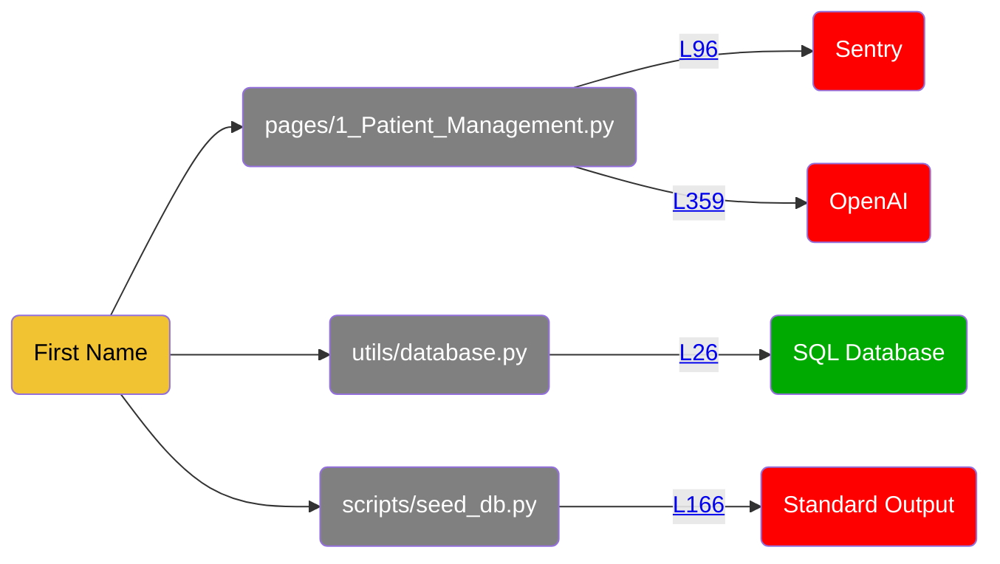
<details>
<summary>Show all 108 occurrences</summary>

[pages/1_Patient_Management.py:305](https://github.com/hounddogai/hounddog-test-python-app/blob/f29c8bebe716/pages/1_Patient_Management.py#L305-L305)

```python
patient_data
```
[scripts/seed_db.py:157](https://github.com/hounddogai/hounddog-test-python-app/blob/f29c8bebe716/scripts/seed_db.py#L157-L157)

```python
first_names_male
```
[utils/data_manager.py:518](https://github.com/hounddogai/hounddog-test-python-app/blob/f29c8bebe716/utils/data_manager.py#L518-L518)

```python
Patient.first_name.isnot
```
[scripts/seed_db.py:146](https://github.com/hounddogai/hounddog-test-python-app/blob/f29c8bebe716/scripts/seed_db.py#L146-L146)

```python
first_name
```
[utils/data_manager.py:518](https://github.com/hounddogai/hounddog-test-python-app/blob/f29c8bebe716/utils/data_manager.py#L518-L518)

```python
first_name
```
[pages/1_Patient_Management.py:187](https://github.com/hounddogai/hounddog-test-python-app/blob/f29c8bebe716/pages/1_Patient_Management.py#L187-L187)

```python
patient_data
```
[pages/1_Patient_Management.py:355](https://github.com/hounddogai/hounddog-test-python-app/blob/f29c8bebe716/pages/1_Patient_Management.py#L355-L355)

```python
messages
```
[scripts/seed_db.py:164](https://github.com/hounddogai/hounddog-test-python-app/blob/f29c8bebe716/scripts/seed_db.py#L164-L164)

```python
patient_data
```
[utils/data_manager.py:464](https://github.com/hounddogai/hounddog-test-python-app/blob/f29c8bebe716/utils/data_manager.py#L464-L464)

```python
first_name
```
[utils/data_manager.py:417](https://github.com/hounddogai/hounddog-test-python-app/blob/f29c8bebe716/utils/data_manager.py#L417-L417)

```python
first_name
```
[pages/1_Patient_Management.py:359](https://github.com/hounddogai/hounddog-test-python-app/blob/f29c8bebe716/pages/1_Patient_Management.py#L359-L359)

```python
messages
```
[pages/1_Patient_Management.py:359](https://github.com/hounddogai/hounddog-test-python-app/blob/f29c8bebe716/pages/1_Patient_Management.py#L359-L359)

```python
messages
```
[pages/1_Patient_Management.py:239](https://github.com/hounddogai/hounddog-test-python-app/blob/f29c8bebe716/pages/1_Patient_Management.py#L239-L239)

```python
patient_data
```
[pages/1_Patient_Management.py:308](https://github.com/hounddogai/hounddog-test-python-app/blob/f29c8bebe716/pages/1_Patient_Management.py#L308-L308)

```python
patient_data
```
[pages/1_Patient_Management.py:75](https://github.com/hounddogai/hounddog-test-python-app/blob/f29c8bebe716/pages/1_Patient_Management.py#L75-L75)

```python
"first_name": first_name
```
[pages/1_Patient_Management.py:342](https://github.com/hounddogai/hounddog-test-python-app/blob/f29c8bebe716/pages/1_Patient_Management.py#L342-L342)

```python
history_key
```
[utils/database.py:48](https://github.com/hounddogai/hounddog-test-python-app/blob/f29c8bebe716/utils/database.py#L48-L48)

```python
"first_name": self.first_name
```
[pages/1_Patient_Management.py:213](https://github.com/hounddogai/hounddog-test-python-app/blob/f29c8bebe716/pages/1_Patient_Management.py#L213-L213)

```python
patient_data
```
[utils/database.py:48](https://github.com/hounddogai/hounddog-test-python-app/blob/f29c8bebe716/utils/database.py#L48-L48)

```python
self.first_name
```
[pages/1_Patient_Management.py:281](https://github.com/hounddogai/hounddog-test-python-app/blob/f29c8bebe716/pages/1_Patient_Management.py#L281-L281)

```python
patient_data
```
[pages/1_Patient_Management.py:182](https://github.com/hounddogai/hounddog-test-python-app/blob/f29c8bebe716/pages/1_Patient_Management.py#L182-L182)

```python
patient_data
```
[utils/data_manager.py:441](https://github.com/hounddogai/hounddog-test-python-app/blob/f29c8bebe716/utils/data_manager.py#L441-L441)

```python
metric.patient.first_name
```
[pages/1_Patient_Management.py:221](https://github.com/hounddogai/hounddog-test-python-app/blob/f29c8bebe716/pages/1_Patient_Management.py#L221-L221)

```python
patient_data
```
[pages/1_Patient_Management.py:295](https://github.com/hounddogai/hounddog-test-python-app/blob/f29c8bebe716/pages/1_Patient_Management.py#L295-L295)

```python
patient_data
```
[utils/data_manager.py:102](https://github.com/hounddogai/hounddog-test-python-app/blob/f29c8bebe716/utils/data_manager.py#L102-L102)

```python
Patient.first_name
```
[pages/1_Patient_Management.py:353](https://github.com/hounddogai/hounddog-test-python-app/blob/f29c8bebe716/pages/1_Patient_Management.py#L353-L353)

```python
messages
```
[pages/1_Patient_Management.py:223](https://github.com/hounddogai/hounddog-test-python-app/blob/f29c8bebe716/pages/1_Patient_Management.py#L223-L223)

```python
patient_data
```
[scripts/seed_db.py:166](https://github.com/hounddogai/hounddog-test-python-app/blob/f29c8bebe716/scripts/seed_db.py#L166-L166)

```python
patient_data
```
[pages/1_Patient_Management.py:92](https://github.com/hounddogai/hounddog-test-python-app/blob/f29c8bebe716/pages/1_Patient_Management.py#L92-L92)

```python
first_name
```
[utils/data_manager.py:132](https://github.com/hounddogai/hounddog-test-python-app/blob/f29c8bebe716/utils/data_manager.py#L132-L132)

```python
first_name
```
[pages/1_Patient_Management.py:213](https://github.com/hounddogai/hounddog-test-python-app/blob/f29c8bebe716/pages/1_Patient_Management.py#L213-L213)

```python
patient_data
```
[scripts/seed_db.py:146](https://github.com/hounddogai/hounddog-test-python-app/blob/f29c8bebe716/scripts/seed_db.py#L146-L146)

```python
"first_name": first_name
```
[pages/1_Patient_Management.py:216](https://github.com/hounddogai/hounddog-test-python-app/blob/f29c8bebe716/pages/1_Patient_Management.py#L216-L216)

```python
patient_data
```
[utils/data_manager.py:102](https://github.com/hounddogai/hounddog-test-python-app/blob/f29c8bebe716/utils/data_manager.py#L102-L102)

```python
Patient.first_name
```
[pages/1_Patient_Management.py:68](https://github.com/hounddogai/hounddog-test-python-app/blob/f29c8bebe716/pages/1_Patient_Management.py#L68-L68)

```python
first_name
```
[utils/data_manager.py:464](https://github.com/hounddogai/hounddog-test-python-app/blob/f29c8bebe716/utils/data_manager.py#L464-L464)

```python
record.patient.first_name
```
[utils/data_manager.py:34](https://github.com/hounddogai/hounddog-test-python-app/blob/f29c8bebe716/utils/data_manager.py#L34-L34)

```python
first_name
```
[utils/data_manager.py:417](https://github.com/hounddogai/hounddog-test-python-app/blob/f29c8bebe716/utils/data_manager.py#L417-L417)

```python
"first_name": patient.first_name
```
[scripts/seed_db.py:49](https://github.com/hounddogai/hounddog-test-python-app/blob/f29c8bebe716/scripts/seed_db.py#L49-L49)

```python
first_names_male
```
[scripts/seed_db.py:141](https://github.com/hounddogai/hounddog-test-python-app/blob/f29c8bebe716/scripts/seed_db.py#L141-L141)

```python
first_names_male
```
[pages/1_Patient_Management.py:307](https://github.com/hounddogai/hounddog-test-python-app/blob/f29c8bebe716/pages/1_Patient_Management.py#L307-L307)

```python
patient_data
```
[pages/1_Patient_Management.py:244](https://github.com/hounddogai/hounddog-test-python-app/blob/f29c8bebe716/pages/1_Patient_Management.py#L244-L244)

```python
patient_data
```
[pages/1_Patient_Management.py:317](https://github.com/hounddogai/hounddog-test-python-app/blob/f29c8bebe716/pages/1_Patient_Management.py#L317-L317)

```python
patient_data
```
[pages/1_Patient_Management.py:305](https://github.com/hounddogai/hounddog-test-python-app/blob/f29c8bebe716/pages/1_Patient_Management.py#L305-L305)

```python
patient_data
```
[pages/1_Patient_Management.py:101](https://github.com/hounddogai/hounddog-test-python-app/blob/f29c8bebe716/pages/1_Patient_Management.py#L101-L101)

```python
first_name
```
[pages/1_Patient_Management.py:32](https://github.com/hounddogai/hounddog-test-python-app/blob/f29c8bebe716/pages/1_Patient_Management.py#L32-L32)

```python
first_name
```
[utils/data_manager.py:518](https://github.com/hounddogai/hounddog-test-python-app/blob/f29c8bebe716/utils/data_manager.py#L518-L518)

```python
Patient.first_name
```
[utils/database.py:26](https://github.com/hounddogai/hounddog-test-python-app/blob/f29c8bebe716/utils/database.py#L26-L26)

```python
first_name = Column(String(100), nullable=False)
```
[pages/1_Patient_Management.py:355](https://github.com/hounddogai/hounddog-test-python-app/blob/f29c8bebe716/pages/1_Patient_Management.py#L355-L355)

```python
messages
```
[pages/1_Patient_Management.py:310](https://github.com/hounddogai/hounddog-test-python-app/blob/f29c8bebe716/pages/1_Patient_Management.py#L310-L310)

```python
patient_data
```
[pages/1_Patient_Management.py:214](https://github.com/hounddogai/hounddog-test-python-app/blob/f29c8bebe716/pages/1_Patient_Management.py#L214-L214)

```python
patient_data
```
[pages/1_Patient_Management.py:243](https://github.com/hounddogai/hounddog-test-python-app/blob/f29c8bebe716/pages/1_Patient_Management.py#L243-L243)

```python
patient_data
```
[pages/1_Patient_Management.py:115](https://github.com/hounddogai/hounddog-test-python-app/blob/f29c8bebe716/pages/1_Patient_Management.py#L115-L115)

```python
first_name
```
[scripts/seed_db.py:151](https://github.com/hounddogai/hounddog-test-python-app/blob/f29c8bebe716/scripts/seed_db.py#L151-L151)

```python
first_name
```
[scripts/seed_db.py:166](https://github.com/hounddogai/hounddog-test-python-app/blob/f29c8bebe716/scripts/seed_db.py#L166-L166)

```python
first_name
```
[pages/1_Patient_Management.py:230](https://github.com/hounddogai/hounddog-test-python-app/blob/f29c8bebe716/pages/1_Patient_Management.py#L230-L230)

```python
patient_data
```
[pages/1_Patient_Management.py:359](https://github.com/hounddogai/hounddog-test-python-app/blob/f29c8bebe716/pages/1_Patient_Management.py#L359-L359)

```python
messages
```
[utils/data_manager.py:518](https://github.com/hounddogai/hounddog-test-python-app/blob/f29c8bebe716/utils/data_manager.py#L518-L518)

```python
Patient.first_name
```
[scripts/seed_db.py:157](https://github.com/hounddogai/hounddog-test-python-app/blob/f29c8bebe716/scripts/seed_db.py#L157-L157)

```python
first_names_female
```
[pages/1_Patient_Management.py:329](https://github.com/hounddogai/hounddog-test-python-app/blob/f29c8bebe716/pages/1_Patient_Management.py#L329-L329)

```python
history_key
```
[pages/1_Patient_Management.py:353](https://github.com/hounddogai/hounddog-test-python-app/blob/f29c8bebe716/pages/1_Patient_Management.py#L353-L353)

```python
messages
```
[pages/1_Patient_Management.py:314](https://github.com/hounddogai/hounddog-test-python-app/blob/f29c8bebe716/pages/1_Patient_Management.py#L314-L314)

```python
patient_data
```
[pages/1_Patient_Management.py:363](https://github.com/hounddogai/hounddog-test-python-app/blob/f29c8bebe716/pages/1_Patient_Management.py#L363-L363)

```python
history_key
```
[pages/1_Patient_Management.py:232](https://github.com/hounddogai/hounddog-test-python-app/blob/f29c8bebe716/pages/1_Patient_Management.py#L232-L232)

```python
patient_data
```
[utils/data_manager.py:197](https://github.com/hounddogai/hounddog-test-python-app/blob/f29c8bebe716/utils/data_manager.py#L197-L197)

```python
patient_name
```
[utils/data_manager.py:441](https://github.com/hounddogai/hounddog-test-python-app/blob/f29c8bebe716/utils/data_manager.py#L441-L441)

```python
first_name
```
[pages/1_Patient_Management.py:215](https://github.com/hounddogai/hounddog-test-python-app/blob/f29c8bebe716/pages/1_Patient_Management.py#L215-L215)

```python
patient_data
```
[pages/1_Patient_Management.py:272](https://github.com/hounddogai/hounddog-test-python-app/blob/f29c8bebe716/pages/1_Patient_Management.py#L272-L272)

```python
patient_data
```
[pages/1_Patient_Management.py:309](https://github.com/hounddogai/hounddog-test-python-app/blob/f29c8bebe716/pages/1_Patient_Management.py#L309-L309)

```python
patient_data
```
[utils/data_manager.py:139](https://github.com/hounddogai/hounddog-test-python-app/blob/f29c8bebe716/utils/data_manager.py#L139-L139)

```python
patient_name
```
[pages/1_Patient_Management.py:292](https://github.com/hounddogai/hounddog-test-python-app/blob/f29c8bebe716/pages/1_Patient_Management.py#L292-L292)

```python
patient_data
```
[pages/1_Patient_Management.py:217](https://github.com/hounddogai/hounddog-test-python-app/blob/f29c8bebe716/pages/1_Patient_Management.py#L217-L217)

```python
patient_data
```
[pages/1_Patient_Management.py:328](https://github.com/hounddogai/hounddog-test-python-app/blob/f29c8bebe716/pages/1_Patient_Management.py#L328-L328)

```python
history_key
```
[pages/1_Patient_Management.py:306](https://github.com/hounddogai/hounddog-test-python-app/blob/f29c8bebe716/pages/1_Patient_Management.py#L306-L306)

```python
patient_data
```
[utils/data_manager.py:102](https://github.com/hounddogai/hounddog-test-python-app/blob/f29c8bebe716/utils/data_manager.py#L102-L102)

```python
first_name
```
[scripts/seed_db.py:141](https://github.com/hounddogai/hounddog-test-python-app/blob/f29c8bebe716/scripts/seed_db.py#L141-L141)

```python
first_names_female
```
[pages/1_Patient_Management.py:327](https://github.com/hounddogai/hounddog-test-python-app/blob/f29c8bebe716/pages/1_Patient_Management.py#L327-L327)

```python
patient_data
```
[scripts/seed_db.py:151](https://github.com/hounddogai/hounddog-test-python-app/blob/f29c8bebe716/scripts/seed_db.py#L151-L151)

```python
first_name.lower
```
[pages/1_Patient_Management.py:355](https://github.com/hounddogai/hounddog-test-python-app/blob/f29c8bebe716/pages/1_Patient_Management.py#L355-L355)

```python
messages
```
[pages/1_Patient_Management.py:119](https://github.com/hounddogai/hounddog-test-python-app/blob/f29c8bebe716/pages/1_Patient_Management.py#L119-L119)

```python
first_name
```
[pages/1_Patient_Management.py:91](https://github.com/hounddogai/hounddog-test-python-app/blob/f29c8bebe716/pages/1_Patient_Management.py#L91-L91)

```python
patient_data
```
[utils/data_manager.py:132](https://github.com/hounddogai/hounddog-test-python-app/blob/f29c8bebe716/utils/data_manager.py#L132-L132)

```python
patient.first_name
```
[pages/1_Patient_Management.py:267](https://github.com/hounddogai/hounddog-test-python-app/blob/f29c8bebe716/pages/1_Patient_Management.py#L267-L267)

```python
patient_data
```
[pages/1_Patient_Management.py:186](https://github.com/hounddogai/hounddog-test-python-app/blob/f29c8bebe716/pages/1_Patient_Management.py#L186-L186)

```python
patient_data
```
[pages/1_Patient_Management.py:236](https://github.com/hounddogai/hounddog-test-python-app/blob/f29c8bebe716/pages/1_Patient_Management.py#L236-L236)

```python
patient_data
```
[pages/1_Patient_Management.py:315](https://github.com/hounddogai/hounddog-test-python-app/blob/f29c8bebe716/pages/1_Patient_Management.py#L315-L315)

```python
patient_data
```
[pages/1_Patient_Management.py:332](https://github.com/hounddogai/hounddog-test-python-app/blob/f29c8bebe716/pages/1_Patient_Management.py#L332-L332)

```python
history_key
```
[pages/1_Patient_Management.py:346](https://github.com/hounddogai/hounddog-test-python-app/blob/f29c8bebe716/pages/1_Patient_Management.py#L346-L346)

```python
patient_context
```
[pages/1_Patient_Management.py:222](https://github.com/hounddogai/hounddog-test-python-app/blob/f29c8bebe716/pages/1_Patient_Management.py#L222-L222)

```python
patient_data
```
[pages/1_Patient_Management.py:347](https://github.com/hounddogai/hounddog-test-python-app/blob/f29c8bebe716/pages/1_Patient_Management.py#L347-L347)

```python
history_key
```
[pages/1_Patient_Management.py:346](https://github.com/hounddogai/hounddog-test-python-app/blob/f29c8bebe716/pages/1_Patient_Management.py#L346-L346)

```python
patient_context
```
[pages/1_Patient_Management.py:97](https://github.com/hounddogai/hounddog-test-python-app/blob/f29c8bebe716/pages/1_Patient_Management.py#L97-L97)

```python
first_name
```
[utils/data_manager.py:518](https://github.com/hounddogai/hounddog-test-python-app/blob/f29c8bebe716/utils/data_manager.py#L518-L518)

```python
Patient.first_name.isnot
```
[utils/database.py:26](https://github.com/hounddogai/hounddog-test-python-app/blob/f29c8bebe716/utils/database.py#L26-L26)

```python
first_name
```
[scripts/seed_db.py:141](https://github.com/hounddogai/hounddog-test-python-app/blob/f29c8bebe716/scripts/seed_db.py#L141-L141)

```python
first_name
```
[pages/1_Patient_Management.py:75](https://github.com/hounddogai/hounddog-test-python-app/blob/f29c8bebe716/pages/1_Patient_Management.py#L75-L75)

```python
first_name
```
[pages/1_Patient_Management.py:180](https://github.com/hounddogai/hounddog-test-python-app/blob/f29c8bebe716/pages/1_Patient_Management.py#L180-L180)

```python
patient_data
```
[utils/data_manager.py:190](https://github.com/hounddogai/hounddog-test-python-app/blob/f29c8bebe716/utils/data_manager.py#L190-L190)

```python
first_name
```
[utils/database.py:48](https://github.com/hounddogai/hounddog-test-python-app/blob/f29c8bebe716/utils/database.py#L48-L48)

```python
first_name
```
[pages/1_Patient_Management.py:311](https://github.com/hounddogai/hounddog-test-python-app/blob/f29c8bebe716/pages/1_Patient_Management.py#L311-L311)

```python
patient_data
```
[utils/data_manager.py:190](https://github.com/hounddogai/hounddog-test-python-app/blob/f29c8bebe716/utils/data_manager.py#L190-L190)

```python
patient.first_name
```
[scripts/seed_db.py:61](https://github.com/hounddogai/hounddog-test-python-app/blob/f29c8bebe716/scripts/seed_db.py#L61-L61)

```python
first_names_female
```
[pages/1_Patient_Management.py:353](https://github.com/hounddogai/hounddog-test-python-app/blob/f29c8bebe716/pages/1_Patient_Management.py#L353-L353)

```python
messages
```
[pages/1_Patient_Management.py:186](https://github.com/hounddogai/hounddog-test-python-app/blob/f29c8bebe716/pages/1_Patient_Management.py#L186-L186)

```python
patient_data
```
[pages/1_Patient_Management.py:316](https://github.com/hounddogai/hounddog-test-python-app/blob/f29c8bebe716/pages/1_Patient_Management.py#L316-L316)

```python
patient_data
```
[pages/1_Patient_Management.py:346](https://github.com/hounddogai/hounddog-test-python-app/blob/f29c8bebe716/pages/1_Patient_Management.py#L346-L346)

```python
patient_context
```
[scripts/seed_db.py:168](https://github.com/hounddogai/hounddog-test-python-app/blob/f29c8bebe716/scripts/seed_db.py#L168-L168)

```python
first_name
```
[utils/data_manager.py:417](https://github.com/hounddogai/hounddog-test-python-app/blob/f29c8bebe716/utils/data_manager.py#L417-L417)

```python
patient.first_name
```
</details>

## 15. Last Name

**Sensitivity:** <span style="color:rgba(0, 0, 0, 1); background-color:rgba(241, 194, 50, 1); font-family: monospace; border-radius: 3px;">&nbsp;&nbsp;&nbsp;**LOW**&nbsp;&nbsp;&nbsp;&nbsp;</span>

**Tags:** PII

**Dataflows:**

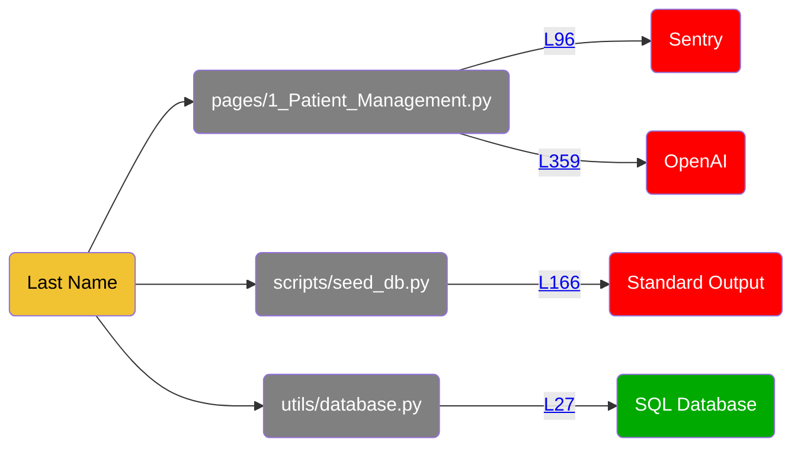
<details>
<summary>Show all 105 occurrences</summary>

[pages/1_Patient_Management.py:315](https://github.com/hounddogai/hounddog-test-python-app/blob/f29c8bebe716/pages/1_Patient_Management.py#L315-L315)

```python
patient_data
```
[utils/data_manager.py:132](https://github.com/hounddogai/hounddog-test-python-app/blob/f29c8bebe716/utils/data_manager.py#L132-L132)

```python
patient.last_name
```
[pages/1_Patient_Management.py:355](https://github.com/hounddogai/hounddog-test-python-app/blob/f29c8bebe716/pages/1_Patient_Management.py#L355-L355)

```python
messages
```
[pages/1_Patient_Management.py:359](https://github.com/hounddogai/hounddog-test-python-app/blob/f29c8bebe716/pages/1_Patient_Management.py#L359-L359)

```python
messages
```
[pages/1_Patient_Management.py:230](https://github.com/hounddogai/hounddog-test-python-app/blob/f29c8bebe716/pages/1_Patient_Management.py#L230-L230)

```python
patient_data
```
[scripts/seed_db.py:147](https://github.com/hounddogai/hounddog-test-python-app/blob/f29c8bebe716/scripts/seed_db.py#L147-L147)

```python
last_name
```
[scripts/seed_db.py:164](https://github.com/hounddogai/hounddog-test-python-app/blob/f29c8bebe716/scripts/seed_db.py#L164-L164)

```python
patient_data
```
[pages/1_Patient_Management.py:215](https://github.com/hounddogai/hounddog-test-python-app/blob/f29c8bebe716/pages/1_Patient_Management.py#L215-L215)

```python
patient_data
```
[pages/1_Patient_Management.py:342](https://github.com/hounddogai/hounddog-test-python-app/blob/f29c8bebe716/pages/1_Patient_Management.py#L342-L342)

```python
history_key
```
[pages/1_Patient_Management.py:115](https://github.com/hounddogai/hounddog-test-python-app/blob/f29c8bebe716/pages/1_Patient_Management.py#L115-L115)

```python
last_name
```
[pages/1_Patient_Management.py:222](https://github.com/hounddogai/hounddog-test-python-app/blob/f29c8bebe716/pages/1_Patient_Management.py#L222-L222)

```python
patient_data
```
[pages/1_Patient_Management.py:314](https://github.com/hounddogai/hounddog-test-python-app/blob/f29c8bebe716/pages/1_Patient_Management.py#L314-L314)

```python
patient_data
```
[pages/1_Patient_Management.py:68](https://github.com/hounddogai/hounddog-test-python-app/blob/f29c8bebe716/pages/1_Patient_Management.py#L68-L68)

```python
last_name
```
[pages/1_Patient_Management.py:305](https://github.com/hounddogai/hounddog-test-python-app/blob/f29c8bebe716/pages/1_Patient_Management.py#L305-L305)

```python
patient_data
```
[pages/1_Patient_Management.py:281](https://github.com/hounddogai/hounddog-test-python-app/blob/f29c8bebe716/pages/1_Patient_Management.py#L281-L281)

```python
patient_data
```
[pages/1_Patient_Management.py:236](https://github.com/hounddogai/hounddog-test-python-app/blob/f29c8bebe716/pages/1_Patient_Management.py#L236-L236)

```python
patient_data
```
[pages/1_Patient_Management.py:76](https://github.com/hounddogai/hounddog-test-python-app/blob/f29c8bebe716/pages/1_Patient_Management.py#L76-L76)

```python
last_name
```
[pages/1_Patient_Management.py:346](https://github.com/hounddogai/hounddog-test-python-app/blob/f29c8bebe716/pages/1_Patient_Management.py#L346-L346)

```python
patient_context
```
[pages/1_Patient_Management.py:346](https://github.com/hounddogai/hounddog-test-python-app/blob/f29c8bebe716/pages/1_Patient_Management.py#L346-L346)

```python
patient_context
```
[pages/1_Patient_Management.py:239](https://github.com/hounddogai/hounddog-test-python-app/blob/f29c8bebe716/pages/1_Patient_Management.py#L239-L239)

```python
patient_data
```
[pages/1_Patient_Management.py:232](https://github.com/hounddogai/hounddog-test-python-app/blob/f29c8bebe716/pages/1_Patient_Management.py#L232-L232)

```python
patient_data
```
[utils/data_manager.py:418](https://github.com/hounddogai/hounddog-test-python-app/blob/f29c8bebe716/utils/data_manager.py#L418-L418)

```python
"last_name": patient.last_name
```
[pages/1_Patient_Management.py:97](https://github.com/hounddogai/hounddog-test-python-app/blob/f29c8bebe716/pages/1_Patient_Management.py#L97-L97)

```python
last_name
```
[pages/1_Patient_Management.py:359](https://github.com/hounddogai/hounddog-test-python-app/blob/f29c8bebe716/pages/1_Patient_Management.py#L359-L359)

```python
messages
```
[pages/1_Patient_Management.py:216](https://github.com/hounddogai/hounddog-test-python-app/blob/f29c8bebe716/pages/1_Patient_Management.py#L216-L216)

```python
patient_data
```
[pages/1_Patient_Management.py:332](https://github.com/hounddogai/hounddog-test-python-app/blob/f29c8bebe716/pages/1_Patient_Management.py#L332-L332)

```python
history_key
```
[utils/data_manager.py:190](https://github.com/hounddogai/hounddog-test-python-app/blob/f29c8bebe716/utils/data_manager.py#L190-L190)

```python
last_name
```
[pages/1_Patient_Management.py:33](https://github.com/hounddogai/hounddog-test-python-app/blob/f29c8bebe716/pages/1_Patient_Management.py#L33-L33)

```python
last_name
```
[pages/1_Patient_Management.py:306](https://github.com/hounddogai/hounddog-test-python-app/blob/f29c8bebe716/pages/1_Patient_Management.py#L306-L306)

```python
patient_data
```
[pages/1_Patient_Management.py:214](https://github.com/hounddogai/hounddog-test-python-app/blob/f29c8bebe716/pages/1_Patient_Management.py#L214-L214)

```python
patient_data
```
[pages/1_Patient_Management.py:327](https://github.com/hounddogai/hounddog-test-python-app/blob/f29c8bebe716/pages/1_Patient_Management.py#L327-L327)

```python
patient_data
```
[utils/data_manager.py:103](https://github.com/hounddogai/hounddog-test-python-app/blob/f29c8bebe716/utils/data_manager.py#L103-L103)

```python
last_name
```
[utils/database.py:49](https://github.com/hounddogai/hounddog-test-python-app/blob/f29c8bebe716/utils/database.py#L49-L49)

```python
self.last_name
```
[pages/1_Patient_Management.py:92](https://github.com/hounddogai/hounddog-test-python-app/blob/f29c8bebe716/pages/1_Patient_Management.py#L92-L92)

```python
last_name
```
[pages/1_Patient_Management.py:355](https://github.com/hounddogai/hounddog-test-python-app/blob/f29c8bebe716/pages/1_Patient_Management.py#L355-L355)

```python
messages
```
[pages/1_Patient_Management.py:347](https://github.com/hounddogai/hounddog-test-python-app/blob/f29c8bebe716/pages/1_Patient_Management.py#L347-L347)

```python
history_key
```
[utils/data_manager.py:464](https://github.com/hounddogai/hounddog-test-python-app/blob/f29c8bebe716/utils/data_manager.py#L464-L464)

```python
record.patient.last_name
```
[pages/1_Patient_Management.py:221](https://github.com/hounddogai/hounddog-test-python-app/blob/f29c8bebe716/pages/1_Patient_Management.py#L221-L221)

```python
patient_data
```
[utils/data_manager.py:190](https://github.com/hounddogai/hounddog-test-python-app/blob/f29c8bebe716/utils/data_manager.py#L190-L190)

```python
patient.last_name
```
[pages/1_Patient_Management.py:101](https://github.com/hounddogai/hounddog-test-python-app/blob/f29c8bebe716/pages/1_Patient_Management.py#L101-L101)

```python
last_name
```
[utils/data_manager.py:464](https://github.com/hounddogai/hounddog-test-python-app/blob/f29c8bebe716/utils/data_manager.py#L464-L464)

```python
last_name
```
[scripts/seed_db.py:142](https://github.com/hounddogai/hounddog-test-python-app/blob/f29c8bebe716/scripts/seed_db.py#L142-L142)

```python
last_name
```
[pages/1_Patient_Management.py:244](https://github.com/hounddogai/hounddog-test-python-app/blob/f29c8bebe716/pages/1_Patient_Management.py#L244-L244)

```python
patient_data
```
[pages/1_Patient_Management.py:243](https://github.com/hounddogai/hounddog-test-python-app/blob/f29c8bebe716/pages/1_Patient_Management.py#L243-L243)

```python
patient_data
```
[scripts/seed_db.py:151](https://github.com/hounddogai/hounddog-test-python-app/blob/f29c8bebe716/scripts/seed_db.py#L151-L151)

```python
last_name
```
[scripts/seed_db.py:142](https://github.com/hounddogai/hounddog-test-python-app/blob/f29c8bebe716/scripts/seed_db.py#L142-L142)

```python
last_names
```
[pages/1_Patient_Management.py:353](https://github.com/hounddogai/hounddog-test-python-app/blob/f29c8bebe716/pages/1_Patient_Management.py#L353-L353)

```python
messages
```
[pages/1_Patient_Management.py:119](https://github.com/hounddogai/hounddog-test-python-app/blob/f29c8bebe716/pages/1_Patient_Management.py#L119-L119)

```python
last_name
```
[pages/1_Patient_Management.py:305](https://github.com/hounddogai/hounddog-test-python-app/blob/f29c8bebe716/pages/1_Patient_Management.py#L305-L305)

```python
patient_data
```
[pages/1_Patient_Management.py:292](https://github.com/hounddogai/hounddog-test-python-app/blob/f29c8bebe716/pages/1_Patient_Management.py#L292-L292)

```python
patient_data
```
[utils/data_manager.py:519](https://github.com/hounddogai/hounddog-test-python-app/blob/f29c8bebe716/utils/data_manager.py#L519-L519)

```python
Patient.last_name
```
[scripts/seed_db.py:166](https://github.com/hounddogai/hounddog-test-python-app/blob/f29c8bebe716/scripts/seed_db.py#L166-L166)

```python
last_name
```
[pages/1_Patient_Management.py:213](https://github.com/hounddogai/hounddog-test-python-app/blob/f29c8bebe716/pages/1_Patient_Management.py#L213-L213)

```python
patient_data
```
[utils/data_manager.py:132](https://github.com/hounddogai/hounddog-test-python-app/blob/f29c8bebe716/utils/data_manager.py#L132-L132)

```python
last_name
```
[pages/1_Patient_Management.py:186](https://github.com/hounddogai/hounddog-test-python-app/blob/f29c8bebe716/pages/1_Patient_Management.py#L186-L186)

```python
patient_data
```
[scripts/seed_db.py:73](https://github.com/hounddogai/hounddog-test-python-app/blob/f29c8bebe716/scripts/seed_db.py#L73-L73)

```python
last_names
```
[pages/1_Patient_Management.py:186](https://github.com/hounddogai/hounddog-test-python-app/blob/f29c8bebe716/pages/1_Patient_Management.py#L186-L186)

```python
patient_data
```
[scripts/seed_db.py:166](https://github.com/hounddogai/hounddog-test-python-app/blob/f29c8bebe716/scripts/seed_db.py#L166-L166)

```python
patient_data
```
[pages/1_Patient_Management.py:295](https://github.com/hounddogai/hounddog-test-python-app/blob/f29c8bebe716/pages/1_Patient_Management.py#L295-L295)

```python
patient_data
```
[utils/data_manager.py:139](https://github.com/hounddogai/hounddog-test-python-app/blob/f29c8bebe716/utils/data_manager.py#L139-L139)

```python
patient_name
```
[scripts/seed_db.py:157](https://github.com/hounddogai/hounddog-test-python-app/blob/f29c8bebe716/scripts/seed_db.py#L157-L157)

```python
last_names
```
[utils/data_manager.py:35](https://github.com/hounddogai/hounddog-test-python-app/blob/f29c8bebe716/utils/data_manager.py#L35-L35)

```python
last_name
```
[utils/data_manager.py:519](https://github.com/hounddogai/hounddog-test-python-app/blob/f29c8bebe716/utils/data_manager.py#L519-L519)

```python
Patient.last_name.isnot
```
[pages/1_Patient_Management.py:180](https://github.com/hounddogai/hounddog-test-python-app/blob/f29c8bebe716/pages/1_Patient_Management.py#L180-L180)

```python
patient_data
```
[pages/1_Patient_Management.py:217](https://github.com/hounddogai/hounddog-test-python-app/blob/f29c8bebe716/pages/1_Patient_Management.py#L217-L217)

```python
patient_data
```
[pages/1_Patient_Management.py:223](https://github.com/hounddogai/hounddog-test-python-app/blob/f29c8bebe716/pages/1_Patient_Management.py#L223-L223)

```python
patient_data
```
[scripts/seed_db.py:151](https://github.com/hounddogai/hounddog-test-python-app/blob/f29c8bebe716/scripts/seed_db.py#L151-L151)

```python
last_name.lower
```
[pages/1_Patient_Management.py:213](https://github.com/hounddogai/hounddog-test-python-app/blob/f29c8bebe716/pages/1_Patient_Management.py#L213-L213)

```python
patient_data
```
[utils/data_manager.py:519](https://github.com/hounddogai/hounddog-test-python-app/blob/f29c8bebe716/utils/data_manager.py#L519-L519)

```python
last_name
```
[pages/1_Patient_Management.py:267](https://github.com/hounddogai/hounddog-test-python-app/blob/f29c8bebe716/pages/1_Patient_Management.py#L267-L267)

```python
patient_data
```
[pages/1_Patient_Management.py:76](https://github.com/hounddogai/hounddog-test-python-app/blob/f29c8bebe716/pages/1_Patient_Management.py#L76-L76)

```python
"last_name": last_name
```
[pages/1_Patient_Management.py:359](https://github.com/hounddogai/hounddog-test-python-app/blob/f29c8bebe716/pages/1_Patient_Management.py#L359-L359)

```python
messages
```
[utils/data_manager.py:103](https://github.com/hounddogai/hounddog-test-python-app/blob/f29c8bebe716/utils/data_manager.py#L103-L103)

```python
Patient.last_name
```
[utils/data_manager.py:519](https://github.com/hounddogai/hounddog-test-python-app/blob/f29c8bebe716/utils/data_manager.py#L519-L519)

```python
Patient.last_name.isnot
```
[utils/data_manager.py:418](https://github.com/hounddogai/hounddog-test-python-app/blob/f29c8bebe716/utils/data_manager.py#L418-L418)

```python
last_name
```
[utils/data_manager.py:418](https://github.com/hounddogai/hounddog-test-python-app/blob/f29c8bebe716/utils/data_manager.py#L418-L418)

```python
patient.last_name
```
[pages/1_Patient_Management.py:355](https://github.com/hounddogai/hounddog-test-python-app/blob/f29c8bebe716/pages/1_Patient_Management.py#L355-L355)

```python
messages
```
[pages/1_Patient_Management.py:91](https://github.com/hounddogai/hounddog-test-python-app/blob/f29c8bebe716/pages/1_Patient_Management.py#L91-L91)

```python
patient_data
```
[utils/data_manager.py:441](https://github.com/hounddogai/hounddog-test-python-app/blob/f29c8bebe716/utils/data_manager.py#L441-L441)

```python
metric.patient.last_name
```
[pages/1_Patient_Management.py:187](https://github.com/hounddogai/hounddog-test-python-app/blob/f29c8bebe716/pages/1_Patient_Management.py#L187-L187)

```python
patient_data
```
[utils/data_manager.py:519](https://github.com/hounddogai/hounddog-test-python-app/blob/f29c8bebe716/utils/data_manager.py#L519-L519)

```python
Patient.last_name
```
[utils/data_manager.py:103](https://github.com/hounddogai/hounddog-test-python-app/blob/f29c8bebe716/utils/data_manager.py#L103-L103)

```python
Patient.last_name
```
[scripts/seed_db.py:168](https://github.com/hounddogai/hounddog-test-python-app/blob/f29c8bebe716/scripts/seed_db.py#L168-L168)

```python
last_name
```
[pages/1_Patient_Management.py:272](https://github.com/hounddogai/hounddog-test-python-app/blob/f29c8bebe716/pages/1_Patient_Management.py#L272-L272)

```python
patient_data
```
[utils/database.py:49](https://github.com/hounddogai/hounddog-test-python-app/blob/f29c8bebe716/utils/database.py#L49-L49)

```python
"last_name": self.last_name
```
[utils/database.py:27](https://github.com/hounddogai/hounddog-test-python-app/blob/f29c8bebe716/utils/database.py#L27-L27)

```python
last_name = Column(String(100), nullable=False)
```
[pages/1_Patient_Management.py:182](https://github.com/hounddogai/hounddog-test-python-app/blob/f29c8bebe716/pages/1_Patient_Management.py#L182-L182)

```python
patient_data
```
[utils/data_manager.py:197](https://github.com/hounddogai/hounddog-test-python-app/blob/f29c8bebe716/utils/data_manager.py#L197-L197)

```python
patient_name
```
[pages/1_Patient_Management.py:310](https://github.com/hounddogai/hounddog-test-python-app/blob/f29c8bebe716/pages/1_Patient_Management.py#L310-L310)

```python
patient_data
```
[utils/data_manager.py:441](https://github.com/hounddogai/hounddog-test-python-app/blob/f29c8bebe716/utils/data_manager.py#L441-L441)

```python
last_name
```
[pages/1_Patient_Management.py:328](https://github.com/hounddogai/hounddog-test-python-app/blob/f29c8bebe716/pages/1_Patient_Management.py#L328-L328)

```python
history_key
```
[pages/1_Patient_Management.py:346](https://github.com/hounddogai/hounddog-test-python-app/blob/f29c8bebe716/pages/1_Patient_Management.py#L346-L346)

```python
patient_context
```
[pages/1_Patient_Management.py:309](https://github.com/hounddogai/hounddog-test-python-app/blob/f29c8bebe716/pages/1_Patient_Management.py#L309-L309)

```python
patient_data
```
[pages/1_Patient_Management.py:353](https://github.com/hounddogai/hounddog-test-python-app/blob/f29c8bebe716/pages/1_Patient_Management.py#L353-L353)

```python
messages
```
[utils/database.py:49](https://github.com/hounddogai/hounddog-test-python-app/blob/f29c8bebe716/utils/database.py#L49-L49)

```python
last_name
```
[pages/1_Patient_Management.py:307](https://github.com/hounddogai/hounddog-test-python-app/blob/f29c8bebe716/pages/1_Patient_Management.py#L307-L307)

```python
patient_data
```
[utils/database.py:27](https://github.com/hounddogai/hounddog-test-python-app/blob/f29c8bebe716/utils/database.py#L27-L27)

```python
last_name
```
[pages/1_Patient_Management.py:363](https://github.com/hounddogai/hounddog-test-python-app/blob/f29c8bebe716/pages/1_Patient_Management.py#L363-L363)

```python
history_key
```
[pages/1_Patient_Management.py:317](https://github.com/hounddogai/hounddog-test-python-app/blob/f29c8bebe716/pages/1_Patient_Management.py#L317-L317)

```python
patient_data
```
[pages/1_Patient_Management.py:308](https://github.com/hounddogai/hounddog-test-python-app/blob/f29c8bebe716/pages/1_Patient_Management.py#L308-L308)

```python
patient_data
```
[scripts/seed_db.py:147](https://github.com/hounddogai/hounddog-test-python-app/blob/f29c8bebe716/scripts/seed_db.py#L147-L147)

```python
"last_name": last_name
```
[pages/1_Patient_Management.py:329](https://github.com/hounddogai/hounddog-test-python-app/blob/f29c8bebe716/pages/1_Patient_Management.py#L329-L329)

```python
history_key
```
[pages/1_Patient_Management.py:316](https://github.com/hounddogai/hounddog-test-python-app/blob/f29c8bebe716/pages/1_Patient_Management.py#L316-L316)

```python
patient_data
```
[pages/1_Patient_Management.py:311](https://github.com/hounddogai/hounddog-test-python-app/blob/f29c8bebe716/pages/1_Patient_Management.py#L311-L311)

```python
patient_data
```
[pages/1_Patient_Management.py:353](https://github.com/hounddogai/hounddog-test-python-app/blob/f29c8bebe716/pages/1_Patient_Management.py#L353-L353)

```python
messages
```
</details>


# Vulnerabilities

|Severity|Data Element|Data Sink|Location|
|:-|:-|:-|:-|
|<span style="color:rgba(255, 255, 255, 1); background-color:rgba(255, 0, 0, 1); font-family: monospace; border-radius: 3px;">&nbsp;**CRITICAL**&nbsp;</span>|Blood Type, Date of Birth, Email, Emergency Contact, First Name, Last Name, Medical Condition, Medical History, Medication, Phone Number, Sexual Orientation|OpenAI|[pages/1_Patient_Management.py:359](https://github.com/hounddogai/hounddog-test-python-app/blob/f29c8bebe716/pages/1_Patient_Management.py#L359-L359)|
|<span style="color:rgba(255, 255, 255, 1); background-color:rgba(255, 0, 0, 1); font-family: monospace; border-radius: 3px;">&nbsp;**CRITICAL**&nbsp;</span>|Blood Type, Date of Birth, Emergency Contact, First Name, Last Name, Medical Condition, Sexual Orientation|Sentry|[pages/1_Patient_Management.py:96](https://github.com/hounddogai/hounddog-test-python-app/blob/f29c8bebe716/pages/1_Patient_Management.py#L96-L109)|
|<span style="color:rgba(255, 255, 255, 1); background-color:rgba(255, 0, 0, 1); font-family: monospace; border-radius: 3px;">&nbsp;**CRITICAL**&nbsp;</span>|Blood Type, Date of Birth, Email, Emergency Contact, First Name, Last Name, Medical Condition, Medical History, Medication, Phone Number, Sexual Orientation|Standard Output|[scripts/seed_db.py:166](https://github.com/hounddogai/hounddog-test-python-app/blob/f29c8bebe716/scripts/seed_db.py#L166-L166)|
|<span style="color:rgba(0, 0, 0, 1); background-color:rgba(241, 194, 50, 1); font-family: monospace; border-radius: 3px;">&nbsp;&nbsp;&nbsp;**LOW**&nbsp;&nbsp;&nbsp;&nbsp;</span>|First Name, Last Name|Sentry|[pages/1_Patient_Management.py:114](https://github.com/hounddogai/hounddog-test-python-app/blob/f29c8bebe716/pages/1_Patient_Management.py#L114-L121)|
|<span style="color:rgba(0, 0, 0, 1); background-color:rgba(241, 194, 50, 1); font-family: monospace; border-radius: 3px;">&nbsp;&nbsp;&nbsp;**LOW**&nbsp;&nbsp;&nbsp;&nbsp;</span>|First Name, Last Name|Standard Output|[scripts/seed_db.py:168](https://github.com/hounddogai/hounddog-test-python-app/blob/f29c8bebe716/scripts/seed_db.py#L168-L168)|


## 1. Medical Condition, Medical History, Sexual Orientation, Blood Type, Medication, Phone Number, Date of Birth, Email, Emergency Contact, First Name and Last Name sent to OpenAI

**CWE & OWASP:**
 [CWE-201](https://cwe.mitre.org/data/definitions/201.html), [A01:2021](https://owasp.org/Top10/A01_2021)

This issue was rated as <span style="color:rgba(255, 255, 255, 1); background-color:rgba(255, 0, 0, 1); font-family: monospace; border-radius: 3px;">&nbsp;**CRITICAL**&nbsp;</span> for exposing the following data to **OpenAI**:

|Sensitivity|Data Element|Tags|
|:-|:-|:-|
|<span style="color:rgba(255, 255, 255, 1); background-color:rgba(255, 0, 0, 1); font-family: monospace; border-radius: 3px;">&nbsp;**CRITICAL**&nbsp;</span>|Medical Condition|PHI|
|<span style="color:rgba(255, 255, 255, 1); background-color:rgba(255, 0, 0, 1); font-family: monospace; border-radius: 3px;">&nbsp;**CRITICAL**&nbsp;</span>|Medical History|PHI|
|<span style="color:rgba(255, 255, 255, 1); background-color:rgba(255, 0, 0, 1); font-family: monospace; border-radius: 3px;">&nbsp;**CRITICAL**&nbsp;</span>|Sexual Orientation|PII|
|<span style="color:rgba(255, 255, 255, 1); background-color:rgba(255, 100, 0, 1); font-family: monospace; border-radius: 3px;">&nbsp;&nbsp;**MEDIUM**&nbsp;&nbsp;</span>|Blood Type|PHI|
|<span style="color:rgba(255, 255, 255, 1); background-color:rgba(255, 100, 0, 1); font-family: monospace; border-radius: 3px;">&nbsp;&nbsp;**MEDIUM**&nbsp;&nbsp;</span>|Medication|PHI|
|<span style="color:rgba(255, 255, 255, 1); background-color:rgba(255, 100, 0, 1); font-family: monospace; border-radius: 3px;">&nbsp;&nbsp;**MEDIUM**&nbsp;&nbsp;</span>|Phone Number|PII|
|<span style="color:rgba(0, 0, 0, 1); background-color:rgba(241, 194, 50, 1); font-family: monospace; border-radius: 3px;">&nbsp;&nbsp;&nbsp;**LOW**&nbsp;&nbsp;&nbsp;&nbsp;</span>|Date of Birth|PII|
|<span style="color:rgba(0, 0, 0, 1); background-color:rgba(241, 194, 50, 1); font-family: monospace; border-radius: 3px;">&nbsp;&nbsp;&nbsp;**LOW**&nbsp;&nbsp;&nbsp;&nbsp;</span>|Email|PII|
|<span style="color:rgba(0, 0, 0, 1); background-color:rgba(241, 194, 50, 1); font-family: monospace; border-radius: 3px;">&nbsp;&nbsp;&nbsp;**LOW**&nbsp;&nbsp;&nbsp;&nbsp;</span>|Emergency Contact|PII|
|<span style="color:rgba(0, 0, 0, 1); background-color:rgba(241, 194, 50, 1); font-family: monospace; border-radius: 3px;">&nbsp;&nbsp;&nbsp;**LOW**&nbsp;&nbsp;&nbsp;&nbsp;</span>|First Name|PII|
|<span style="color:rgba(0, 0, 0, 1); background-color:rgba(241, 194, 50, 1); font-family: monospace; border-radius: 3px;">&nbsp;&nbsp;&nbsp;**LOW**&nbsp;&nbsp;&nbsp;&nbsp;</span>|Last Name|PII|

in [pages/1_Patient_Management.py:359:36](https://github.com/hounddogai/hounddog-test-python-app/blob/f29c8bebe716/pages/1_Patient_Management.py#L359-L359):

```python
llm.invoke(messages)
```
<details>
<summary><span style="color:rgba(100, 100, 100, 1)">See more details</span></summary>

</br>Additional details for **Medical Condition** occurrence #1:

1. First detected here in [pages/1_Patient_Management.py:83:21](https://github.com/hounddogai/hounddog-test-python-app/blob/f29c8bebe716/pages/1_Patient_Management.py#L83-L83)

    ```python
    "allergies": allergies
    ```

2. Placed inside a dictionary in [pages/1_Patient_Management.py:83:21](https://github.com/hounddogai/hounddog-test-python-app/blob/f29c8bebe716/pages/1_Patient_Management.py#L83-L83)

    ```python
    "allergies": allergies
    ```

3. Assigned to 'patient_data' in [pages/1_Patient_Management.py:73:17](https://github.com/hounddogai/hounddog-test-python-app/blob/f29c8bebe716/pages/1_Patient_Management.py#L73-L89)

    ```python
    patient_data = {
        "patient_id": patient_id,
        "first_name": first_name,
        "last_name": last_name,
        "date_of_birth": date_of_birth,
        "gender": gender,
        "phone": phone,
        "email": email,
        "address": address,
        "blood_type": blood_type,
        "allergies": allergies,
        "emergency_contact_name": emergency_contact_name,
        "emergency_contact_phone": emergency_contact_phone,
        "medical_history": medical_history,
        "current_medications": current_medications,
        "created_date": datetime.now(),
    }
    ```

4. Placed inside a string in [pages/1_Patient_Management.py:301:35](https://github.com/hounddogai/hounddog-test-python-app/blob/f29c8bebe716/pages/1_Patient_Management.py#L301-L324)

    ```python
                      f"""
    You are an assistant for clinicians. Use only the provided patient data unless the user explicitly asks for general medical knowledge.
    
    Patient Demographics:
    - Name: {patient_data["first_name"]} {patient_data["last_name"]}
    - Patient ID: {patient_data["patient_id"]}
    - Date of Birth: {_fmt(patient_data.get("date_of_birth"))}
    - Gender: {_fmt(patient_data.get("gender"))}
    - Phone: {_fmt(patient_data.get("phone"))}
    - Email: {_fmt(patient_data.get("email"))}
    - Address: {_fmt(patient_data.get("address"))}
    
    Medical Information:
    - Blood Type: {_fmt(patient_data.get("blood_type"))}
    - Allergies: {_fmt(patient_data.get("allergies"))}
    - Medical History: {_fmt(patient_data.get("medical_history"))}
    - Current Medications: {_fmt(patient_data.get("current_medications"))}
    
    Recent Health Metrics:
    {chr(10).join([f"• {m['date']}: {m['metric_type']} = {m['value']} {m.get('unit', '')}" for m in (recent_metrics or [])])}
    
    Recent Medical Records:
    {chr(10).join([f"• {r['record_date']}: {r['record_type']} - {r.get('description', '')}" for r in (recent_records or [])])}
    """
    ```

5. Assigned to 'patient_context' in [pages/1_Patient_Management.py:301:17](https://github.com/hounddogai/hounddog-test-python-app/blob/f29c8bebe716/pages/1_Patient_Management.py#L301-L324)

    ```python
    patient_context = f"""
    You are an assistant for clinicians. Use only the provided patient data unless the user explicitly asks for general medical knowledge.
    
    Patient Demographics:
    - Name: {patient_data["first_name"]} {patient_data["last_name"]}
    - Patient ID: {patient_data["patient_id"]}
    - Date of Birth: {_fmt(patient_data.get("date_of_birth"))}
    - Gender: {_fmt(patient_data.get("gender"))}
    - Phone: {_fmt(patient_data.get("phone"))}
    - Email: {_fmt(patient_data.get("email"))}
    - Address: {_fmt(patient_data.get("address"))}
    
    Medical Information:
    - Blood Type: {_fmt(patient_data.get("blood_type"))}
    - Allergies: {_fmt(patient_data.get("allergies"))}
    - Medical History: {_fmt(patient_data.get("medical_history"))}
    - Current Medications: {_fmt(patient_data.get("current_medications"))}
    
    Recent Health Metrics:
    {chr(10).join([f"• {m['date']}: {m['metric_type']} = {m['value']} {m.get('unit', '')}" for m in (recent_metrics or [])])}
    
    Recent Medical Records:
    {chr(10).join([f"• {r['record_date']}: {r['record_type']} - {r.get('description', '')}" for r in (recent_records or [])])}
    """.strip()
    ```

6. Wrapped in langchain_core.messages.SystemMessage in [pages/1_Patient_Management.py:346:37](https://github.com/hounddogai/hounddog-test-python-app/blob/f29c8bebe716/pages/1_Patient_Management.py#L346-L346)

    ```python
    SystemMessage(content=patient_context)
    ```

7. Assigned to 'messages' in [pages/1_Patient_Management.py:346:25](https://github.com/hounddogai/hounddog-test-python-app/blob/f29c8bebe716/pages/1_Patient_Management.py#L346-L346)

    ```python
    messages = [SystemMessage(content=patient_context)]
    ```

8. Sent to OpenAI in [pages/1_Patient_Management.py:359:36](https://github.com/hounddogai/hounddog-test-python-app/blob/f29c8bebe716/pages/1_Patient_Management.py#L359-L359)

    ```python
    llm.invoke(messages)
    ```
</br>Additional details for **Medical Condition** occurrence #2:

1. First detected here in [pages/1_Patient_Management.py:83:21](https://github.com/hounddogai/hounddog-test-python-app/blob/f29c8bebe716/pages/1_Patient_Management.py#L83-L83)

    ```python
    "allergies": allergies
    ```

2. Placed inside a dictionary in [pages/1_Patient_Management.py:83:21](https://github.com/hounddogai/hounddog-test-python-app/blob/f29c8bebe716/pages/1_Patient_Management.py#L83-L83)

    ```python
    "allergies": allergies
    ```

3. Assigned to 'patient_data' in [pages/1_Patient_Management.py:73:17](https://github.com/hounddogai/hounddog-test-python-app/blob/f29c8bebe716/pages/1_Patient_Management.py#L73-L89)

    ```python
    patient_data = {
        "patient_id": patient_id,
        "first_name": first_name,
        "last_name": last_name,
        "date_of_birth": date_of_birth,
        "gender": gender,
        "phone": phone,
        "email": email,
        "address": address,
        "blood_type": blood_type,
        "allergies": allergies,
        "emergency_contact_name": emergency_contact_name,
        "emergency_contact_phone": emergency_contact_phone,
        "medical_history": medical_history,
        "current_medications": current_medications,
        "created_date": datetime.now(),
    }
    ```

4. Placed inside a string in [pages/1_Patient_Management.py:301:35](https://github.com/hounddogai/hounddog-test-python-app/blob/f29c8bebe716/pages/1_Patient_Management.py#L301-L324)

    ```python
                      f"""
    You are an assistant for clinicians. Use only the provided patient data unless the user explicitly asks for general medical knowledge.
    
    Patient Demographics:
    - Name: {patient_data["first_name"]} {patient_data["last_name"]}
    - Patient ID: {patient_data["patient_id"]}
    - Date of Birth: {_fmt(patient_data.get("date_of_birth"))}
    - Gender: {_fmt(patient_data.get("gender"))}
    - Phone: {_fmt(patient_data.get("phone"))}
    - Email: {_fmt(patient_data.get("email"))}
    - Address: {_fmt(patient_data.get("address"))}
    
    Medical Information:
    - Blood Type: {_fmt(patient_data.get("blood_type"))}
    - Allergies: {_fmt(patient_data.get("allergies"))}
    - Medical History: {_fmt(patient_data.get("medical_history"))}
    - Current Medications: {_fmt(patient_data.get("current_medications"))}
    
    Recent Health Metrics:
    {chr(10).join([f"• {m['date']}: {m['metric_type']} = {m['value']} {m.get('unit', '')}" for m in (recent_metrics or [])])}
    
    Recent Medical Records:
    {chr(10).join([f"• {r['record_date']}: {r['record_type']} - {r.get('description', '')}" for r in (recent_records or [])])}
    """
    ```

5. Assigned to 'patient_context' in [pages/1_Patient_Management.py:301:17](https://github.com/hounddogai/hounddog-test-python-app/blob/f29c8bebe716/pages/1_Patient_Management.py#L301-L324)

    ```python
    patient_context = f"""
    You are an assistant for clinicians. Use only the provided patient data unless the user explicitly asks for general medical knowledge.
    
    Patient Demographics:
    - Name: {patient_data["first_name"]} {patient_data["last_name"]}
    - Patient ID: {patient_data["patient_id"]}
    - Date of Birth: {_fmt(patient_data.get("date_of_birth"))}
    - Gender: {_fmt(patient_data.get("gender"))}
    - Phone: {_fmt(patient_data.get("phone"))}
    - Email: {_fmt(patient_data.get("email"))}
    - Address: {_fmt(patient_data.get("address"))}
    
    Medical Information:
    - Blood Type: {_fmt(patient_data.get("blood_type"))}
    - Allergies: {_fmt(patient_data.get("allergies"))}
    - Medical History: {_fmt(patient_data.get("medical_history"))}
    - Current Medications: {_fmt(patient_data.get("current_medications"))}
    
    Recent Health Metrics:
    {chr(10).join([f"• {m['date']}: {m['metric_type']} = {m['value']} {m.get('unit', '')}" for m in (recent_metrics or [])])}
    
    Recent Medical Records:
    {chr(10).join([f"• {r['record_date']}: {r['record_type']} - {r.get('description', '')}" for r in (recent_records or [])])}
    """.strip()
    ```

6. Wrapped in langchain_core.messages.SystemMessage in [pages/1_Patient_Management.py:346:37](https://github.com/hounddogai/hounddog-test-python-app/blob/f29c8bebe716/pages/1_Patient_Management.py#L346-L346)

    ```python
    SystemMessage(content=patient_context)
    ```

7. Assigned to 'messages' in [pages/1_Patient_Management.py:346:25](https://github.com/hounddogai/hounddog-test-python-app/blob/f29c8bebe716/pages/1_Patient_Management.py#L346-L346)

    ```python
    messages = [SystemMessage(content=patient_context)]
    ```

8. Sent to OpenAI in [pages/1_Patient_Management.py:359:36](https://github.com/hounddogai/hounddog-test-python-app/blob/f29c8bebe716/pages/1_Patient_Management.py#L359-L359)

    ```python
    llm.invoke(messages)
    ```
</br>Additional details for **Medical Condition** occurrence #3:

1. First detected here in [pages/1_Patient_Management.py:83:21](https://github.com/hounddogai/hounddog-test-python-app/blob/f29c8bebe716/pages/1_Patient_Management.py#L83-L83)

    ```python
    "allergies": allergies
    ```

2. Placed inside a dictionary in [pages/1_Patient_Management.py:83:21](https://github.com/hounddogai/hounddog-test-python-app/blob/f29c8bebe716/pages/1_Patient_Management.py#L83-L83)

    ```python
    "allergies": allergies
    ```

3. Assigned to 'patient_data' in [pages/1_Patient_Management.py:73:17](https://github.com/hounddogai/hounddog-test-python-app/blob/f29c8bebe716/pages/1_Patient_Management.py#L73-L89)

    ```python
    patient_data = {
        "patient_id": patient_id,
        "first_name": first_name,
        "last_name": last_name,
        "date_of_birth": date_of_birth,
        "gender": gender,
        "phone": phone,
        "email": email,
        "address": address,
        "blood_type": blood_type,
        "allergies": allergies,
        "emergency_contact_name": emergency_contact_name,
        "emergency_contact_phone": emergency_contact_phone,
        "medical_history": medical_history,
        "current_medications": current_medications,
        "created_date": datetime.now(),
    }
    ```

4. Placed inside a string in [pages/1_Patient_Management.py:301:35](https://github.com/hounddogai/hounddog-test-python-app/blob/f29c8bebe716/pages/1_Patient_Management.py#L301-L324)

    ```python
                      f"""
    You are an assistant for clinicians. Use only the provided patient data unless the user explicitly asks for general medical knowledge.
    
    Patient Demographics:
    - Name: {patient_data["first_name"]} {patient_data["last_name"]}
    - Patient ID: {patient_data["patient_id"]}
    - Date of Birth: {_fmt(patient_data.get("date_of_birth"))}
    - Gender: {_fmt(patient_data.get("gender"))}
    - Phone: {_fmt(patient_data.get("phone"))}
    - Email: {_fmt(patient_data.get("email"))}
    - Address: {_fmt(patient_data.get("address"))}
    
    Medical Information:
    - Blood Type: {_fmt(patient_data.get("blood_type"))}
    - Allergies: {_fmt(patient_data.get("allergies"))}
    - Medical History: {_fmt(patient_data.get("medical_history"))}
    - Current Medications: {_fmt(patient_data.get("current_medications"))}
    
    Recent Health Metrics:
    {chr(10).join([f"• {m['date']}: {m['metric_type']} = {m['value']} {m.get('unit', '')}" for m in (recent_metrics or [])])}
    
    Recent Medical Records:
    {chr(10).join([f"• {r['record_date']}: {r['record_type']} - {r.get('description', '')}" for r in (recent_records or [])])}
    """
    ```

5. Assigned to 'patient_context' in [pages/1_Patient_Management.py:301:17](https://github.com/hounddogai/hounddog-test-python-app/blob/f29c8bebe716/pages/1_Patient_Management.py#L301-L324)

    ```python
    patient_context = f"""
    You are an assistant for clinicians. Use only the provided patient data unless the user explicitly asks for general medical knowledge.
    
    Patient Demographics:
    - Name: {patient_data["first_name"]} {patient_data["last_name"]}
    - Patient ID: {patient_data["patient_id"]}
    - Date of Birth: {_fmt(patient_data.get("date_of_birth"))}
    - Gender: {_fmt(patient_data.get("gender"))}
    - Phone: {_fmt(patient_data.get("phone"))}
    - Email: {_fmt(patient_data.get("email"))}
    - Address: {_fmt(patient_data.get("address"))}
    
    Medical Information:
    - Blood Type: {_fmt(patient_data.get("blood_type"))}
    - Allergies: {_fmt(patient_data.get("allergies"))}
    - Medical History: {_fmt(patient_data.get("medical_history"))}
    - Current Medications: {_fmt(patient_data.get("current_medications"))}
    
    Recent Health Metrics:
    {chr(10).join([f"• {m['date']}: {m['metric_type']} = {m['value']} {m.get('unit', '')}" for m in (recent_metrics or [])])}
    
    Recent Medical Records:
    {chr(10).join([f"• {r['record_date']}: {r['record_type']} - {r.get('description', '')}" for r in (recent_records or [])])}
    """.strip()
    ```

6. Wrapped in langchain_core.messages.SystemMessage in [pages/1_Patient_Management.py:346:37](https://github.com/hounddogai/hounddog-test-python-app/blob/f29c8bebe716/pages/1_Patient_Management.py#L346-L346)

    ```python
    SystemMessage(content=patient_context)
    ```

7. Assigned to 'messages' in [pages/1_Patient_Management.py:346:25](https://github.com/hounddogai/hounddog-test-python-app/blob/f29c8bebe716/pages/1_Patient_Management.py#L346-L346)

    ```python
    messages = [SystemMessage(content=patient_context)]
    ```

8. Sent to OpenAI in [pages/1_Patient_Management.py:359:36](https://github.com/hounddogai/hounddog-test-python-app/blob/f29c8bebe716/pages/1_Patient_Management.py#L359-L359)

    ```python
    llm.invoke(messages)
    ```
</br>Additional details for **Medical History** occurrence #1:

1. First detected here in [pages/1_Patient_Management.py:86:21](https://github.com/hounddogai/hounddog-test-python-app/blob/f29c8bebe716/pages/1_Patient_Management.py#L86-L86)

    ```python
    "medical_history": medical_history
    ```

2. Placed inside a dictionary in [pages/1_Patient_Management.py:86:21](https://github.com/hounddogai/hounddog-test-python-app/blob/f29c8bebe716/pages/1_Patient_Management.py#L86-L86)

    ```python
    "medical_history": medical_history
    ```

3. Assigned to 'patient_data' in [pages/1_Patient_Management.py:73:17](https://github.com/hounddogai/hounddog-test-python-app/blob/f29c8bebe716/pages/1_Patient_Management.py#L73-L89)

    ```python
    patient_data = {
        "patient_id": patient_id,
        "first_name": first_name,
        "last_name": last_name,
        "date_of_birth": date_of_birth,
        "gender": gender,
        "phone": phone,
        "email": email,
        "address": address,
        "blood_type": blood_type,
        "allergies": allergies,
        "emergency_contact_name": emergency_contact_name,
        "emergency_contact_phone": emergency_contact_phone,
        "medical_history": medical_history,
        "current_medications": current_medications,
        "created_date": datetime.now(),
    }
    ```

4. Placed inside a string in [pages/1_Patient_Management.py:301:35](https://github.com/hounddogai/hounddog-test-python-app/blob/f29c8bebe716/pages/1_Patient_Management.py#L301-L324)

    ```python
                      f"""
    You are an assistant for clinicians. Use only the provided patient data unless the user explicitly asks for general medical knowledge.
    
    Patient Demographics:
    - Name: {patient_data["first_name"]} {patient_data["last_name"]}
    - Patient ID: {patient_data["patient_id"]}
    - Date of Birth: {_fmt(patient_data.get("date_of_birth"))}
    - Gender: {_fmt(patient_data.get("gender"))}
    - Phone: {_fmt(patient_data.get("phone"))}
    - Email: {_fmt(patient_data.get("email"))}
    - Address: {_fmt(patient_data.get("address"))}
    
    Medical Information:
    - Blood Type: {_fmt(patient_data.get("blood_type"))}
    - Allergies: {_fmt(patient_data.get("allergies"))}
    - Medical History: {_fmt(patient_data.get("medical_history"))}
    - Current Medications: {_fmt(patient_data.get("current_medications"))}
    
    Recent Health Metrics:
    {chr(10).join([f"• {m['date']}: {m['metric_type']} = {m['value']} {m.get('unit', '')}" for m in (recent_metrics or [])])}
    
    Recent Medical Records:
    {chr(10).join([f"• {r['record_date']}: {r['record_type']} - {r.get('description', '')}" for r in (recent_records or [])])}
    """
    ```

5. Assigned to 'patient_context' in [pages/1_Patient_Management.py:301:17](https://github.com/hounddogai/hounddog-test-python-app/blob/f29c8bebe716/pages/1_Patient_Management.py#L301-L324)

    ```python
    patient_context = f"""
    You are an assistant for clinicians. Use only the provided patient data unless the user explicitly asks for general medical knowledge.
    
    Patient Demographics:
    - Name: {patient_data["first_name"]} {patient_data["last_name"]}
    - Patient ID: {patient_data["patient_id"]}
    - Date of Birth: {_fmt(patient_data.get("date_of_birth"))}
    - Gender: {_fmt(patient_data.get("gender"))}
    - Phone: {_fmt(patient_data.get("phone"))}
    - Email: {_fmt(patient_data.get("email"))}
    - Address: {_fmt(patient_data.get("address"))}
    
    Medical Information:
    - Blood Type: {_fmt(patient_data.get("blood_type"))}
    - Allergies: {_fmt(patient_data.get("allergies"))}
    - Medical History: {_fmt(patient_data.get("medical_history"))}
    - Current Medications: {_fmt(patient_data.get("current_medications"))}
    
    Recent Health Metrics:
    {chr(10).join([f"• {m['date']}: {m['metric_type']} = {m['value']} {m.get('unit', '')}" for m in (recent_metrics or [])])}
    
    Recent Medical Records:
    {chr(10).join([f"• {r['record_date']}: {r['record_type']} - {r.get('description', '')}" for r in (recent_records or [])])}
    """.strip()
    ```

6. Wrapped in langchain_core.messages.SystemMessage in [pages/1_Patient_Management.py:346:37](https://github.com/hounddogai/hounddog-test-python-app/blob/f29c8bebe716/pages/1_Patient_Management.py#L346-L346)

    ```python
    SystemMessage(content=patient_context)
    ```

7. Assigned to 'messages' in [pages/1_Patient_Management.py:346:25](https://github.com/hounddogai/hounddog-test-python-app/blob/f29c8bebe716/pages/1_Patient_Management.py#L346-L346)

    ```python
    messages = [SystemMessage(content=patient_context)]
    ```

8. Sent to OpenAI in [pages/1_Patient_Management.py:359:36](https://github.com/hounddogai/hounddog-test-python-app/blob/f29c8bebe716/pages/1_Patient_Management.py#L359-L359)

    ```python
    llm.invoke(messages)
    ```
</br>Additional details for **Medical History** occurrence #2:

1. First detected here in [pages/1_Patient_Management.py:86:21](https://github.com/hounddogai/hounddog-test-python-app/blob/f29c8bebe716/pages/1_Patient_Management.py#L86-L86)

    ```python
    "medical_history": medical_history
    ```

2. Placed inside a dictionary in [pages/1_Patient_Management.py:86:21](https://github.com/hounddogai/hounddog-test-python-app/blob/f29c8bebe716/pages/1_Patient_Management.py#L86-L86)

    ```python
    "medical_history": medical_history
    ```

3. Assigned to 'patient_data' in [pages/1_Patient_Management.py:73:17](https://github.com/hounddogai/hounddog-test-python-app/blob/f29c8bebe716/pages/1_Patient_Management.py#L73-L89)

    ```python
    patient_data = {
        "patient_id": patient_id,
        "first_name": first_name,
        "last_name": last_name,
        "date_of_birth": date_of_birth,
        "gender": gender,
        "phone": phone,
        "email": email,
        "address": address,
        "blood_type": blood_type,
        "allergies": allergies,
        "emergency_contact_name": emergency_contact_name,
        "emergency_contact_phone": emergency_contact_phone,
        "medical_history": medical_history,
        "current_medications": current_medications,
        "created_date": datetime.now(),
    }
    ```

4. Placed inside a string in [pages/1_Patient_Management.py:301:35](https://github.com/hounddogai/hounddog-test-python-app/blob/f29c8bebe716/pages/1_Patient_Management.py#L301-L324)

    ```python
                      f"""
    You are an assistant for clinicians. Use only the provided patient data unless the user explicitly asks for general medical knowledge.
    
    Patient Demographics:
    - Name: {patient_data["first_name"]} {patient_data["last_name"]}
    - Patient ID: {patient_data["patient_id"]}
    - Date of Birth: {_fmt(patient_data.get("date_of_birth"))}
    - Gender: {_fmt(patient_data.get("gender"))}
    - Phone: {_fmt(patient_data.get("phone"))}
    - Email: {_fmt(patient_data.get("email"))}
    - Address: {_fmt(patient_data.get("address"))}
    
    Medical Information:
    - Blood Type: {_fmt(patient_data.get("blood_type"))}
    - Allergies: {_fmt(patient_data.get("allergies"))}
    - Medical History: {_fmt(patient_data.get("medical_history"))}
    - Current Medications: {_fmt(patient_data.get("current_medications"))}
    
    Recent Health Metrics:
    {chr(10).join([f"• {m['date']}: {m['metric_type']} = {m['value']} {m.get('unit', '')}" for m in (recent_metrics or [])])}
    
    Recent Medical Records:
    {chr(10).join([f"• {r['record_date']}: {r['record_type']} - {r.get('description', '')}" for r in (recent_records or [])])}
    """
    ```

5. Assigned to 'patient_context' in [pages/1_Patient_Management.py:301:17](https://github.com/hounddogai/hounddog-test-python-app/blob/f29c8bebe716/pages/1_Patient_Management.py#L301-L324)

    ```python
    patient_context = f"""
    You are an assistant for clinicians. Use only the provided patient data unless the user explicitly asks for general medical knowledge.
    
    Patient Demographics:
    - Name: {patient_data["first_name"]} {patient_data["last_name"]}
    - Patient ID: {patient_data["patient_id"]}
    - Date of Birth: {_fmt(patient_data.get("date_of_birth"))}
    - Gender: {_fmt(patient_data.get("gender"))}
    - Phone: {_fmt(patient_data.get("phone"))}
    - Email: {_fmt(patient_data.get("email"))}
    - Address: {_fmt(patient_data.get("address"))}
    
    Medical Information:
    - Blood Type: {_fmt(patient_data.get("blood_type"))}
    - Allergies: {_fmt(patient_data.get("allergies"))}
    - Medical History: {_fmt(patient_data.get("medical_history"))}
    - Current Medications: {_fmt(patient_data.get("current_medications"))}
    
    Recent Health Metrics:
    {chr(10).join([f"• {m['date']}: {m['metric_type']} = {m['value']} {m.get('unit', '')}" for m in (recent_metrics or [])])}
    
    Recent Medical Records:
    {chr(10).join([f"• {r['record_date']}: {r['record_type']} - {r.get('description', '')}" for r in (recent_records or [])])}
    """.strip()
    ```

6. Wrapped in langchain_core.messages.SystemMessage in [pages/1_Patient_Management.py:346:37](https://github.com/hounddogai/hounddog-test-python-app/blob/f29c8bebe716/pages/1_Patient_Management.py#L346-L346)

    ```python
    SystemMessage(content=patient_context)
    ```

7. Assigned to 'messages' in [pages/1_Patient_Management.py:346:25](https://github.com/hounddogai/hounddog-test-python-app/blob/f29c8bebe716/pages/1_Patient_Management.py#L346-L346)

    ```python
    messages = [SystemMessage(content=patient_context)]
    ```

8. Sent to OpenAI in [pages/1_Patient_Management.py:359:36](https://github.com/hounddogai/hounddog-test-python-app/blob/f29c8bebe716/pages/1_Patient_Management.py#L359-L359)

    ```python
    llm.invoke(messages)
    ```
</br>Additional details for **Medical History** occurrence #3:

1. First detected here in [pages/1_Patient_Management.py:86:21](https://github.com/hounddogai/hounddog-test-python-app/blob/f29c8bebe716/pages/1_Patient_Management.py#L86-L86)

    ```python
    "medical_history": medical_history
    ```

2. Placed inside a dictionary in [pages/1_Patient_Management.py:86:21](https://github.com/hounddogai/hounddog-test-python-app/blob/f29c8bebe716/pages/1_Patient_Management.py#L86-L86)

    ```python
    "medical_history": medical_history
    ```

3. Assigned to 'patient_data' in [pages/1_Patient_Management.py:73:17](https://github.com/hounddogai/hounddog-test-python-app/blob/f29c8bebe716/pages/1_Patient_Management.py#L73-L89)

    ```python
    patient_data = {
        "patient_id": patient_id,
        "first_name": first_name,
        "last_name": last_name,
        "date_of_birth": date_of_birth,
        "gender": gender,
        "phone": phone,
        "email": email,
        "address": address,
        "blood_type": blood_type,
        "allergies": allergies,
        "emergency_contact_name": emergency_contact_name,
        "emergency_contact_phone": emergency_contact_phone,
        "medical_history": medical_history,
        "current_medications": current_medications,
        "created_date": datetime.now(),
    }
    ```

4. Placed inside a string in [pages/1_Patient_Management.py:301:35](https://github.com/hounddogai/hounddog-test-python-app/blob/f29c8bebe716/pages/1_Patient_Management.py#L301-L324)

    ```python
                      f"""
    You are an assistant for clinicians. Use only the provided patient data unless the user explicitly asks for general medical knowledge.
    
    Patient Demographics:
    - Name: {patient_data["first_name"]} {patient_data["last_name"]}
    - Patient ID: {patient_data["patient_id"]}
    - Date of Birth: {_fmt(patient_data.get("date_of_birth"))}
    - Gender: {_fmt(patient_data.get("gender"))}
    - Phone: {_fmt(patient_data.get("phone"))}
    - Email: {_fmt(patient_data.get("email"))}
    - Address: {_fmt(patient_data.get("address"))}
    
    Medical Information:
    - Blood Type: {_fmt(patient_data.get("blood_type"))}
    - Allergies: {_fmt(patient_data.get("allergies"))}
    - Medical History: {_fmt(patient_data.get("medical_history"))}
    - Current Medications: {_fmt(patient_data.get("current_medications"))}
    
    Recent Health Metrics:
    {chr(10).join([f"• {m['date']}: {m['metric_type']} = {m['value']} {m.get('unit', '')}" for m in (recent_metrics or [])])}
    
    Recent Medical Records:
    {chr(10).join([f"• {r['record_date']}: {r['record_type']} - {r.get('description', '')}" for r in (recent_records or [])])}
    """
    ```

5. Assigned to 'patient_context' in [pages/1_Patient_Management.py:301:17](https://github.com/hounddogai/hounddog-test-python-app/blob/f29c8bebe716/pages/1_Patient_Management.py#L301-L324)

    ```python
    patient_context = f"""
    You are an assistant for clinicians. Use only the provided patient data unless the user explicitly asks for general medical knowledge.
    
    Patient Demographics:
    - Name: {patient_data["first_name"]} {patient_data["last_name"]}
    - Patient ID: {patient_data["patient_id"]}
    - Date of Birth: {_fmt(patient_data.get("date_of_birth"))}
    - Gender: {_fmt(patient_data.get("gender"))}
    - Phone: {_fmt(patient_data.get("phone"))}
    - Email: {_fmt(patient_data.get("email"))}
    - Address: {_fmt(patient_data.get("address"))}
    
    Medical Information:
    - Blood Type: {_fmt(patient_data.get("blood_type"))}
    - Allergies: {_fmt(patient_data.get("allergies"))}
    - Medical History: {_fmt(patient_data.get("medical_history"))}
    - Current Medications: {_fmt(patient_data.get("current_medications"))}
    
    Recent Health Metrics:
    {chr(10).join([f"• {m['date']}: {m['metric_type']} = {m['value']} {m.get('unit', '')}" for m in (recent_metrics or [])])}
    
    Recent Medical Records:
    {chr(10).join([f"• {r['record_date']}: {r['record_type']} - {r.get('description', '')}" for r in (recent_records or [])])}
    """.strip()
    ```

6. Wrapped in langchain_core.messages.SystemMessage in [pages/1_Patient_Management.py:346:37](https://github.com/hounddogai/hounddog-test-python-app/blob/f29c8bebe716/pages/1_Patient_Management.py#L346-L346)

    ```python
    SystemMessage(content=patient_context)
    ```

7. Assigned to 'messages' in [pages/1_Patient_Management.py:346:25](https://github.com/hounddogai/hounddog-test-python-app/blob/f29c8bebe716/pages/1_Patient_Management.py#L346-L346)

    ```python
    messages = [SystemMessage(content=patient_context)]
    ```

8. Sent to OpenAI in [pages/1_Patient_Management.py:359:36](https://github.com/hounddogai/hounddog-test-python-app/blob/f29c8bebe716/pages/1_Patient_Management.py#L359-L359)

    ```python
    llm.invoke(messages)
    ```
</br>Additional details for **Sexual Orientation** occurrence #1:

1. First detected here in [pages/1_Patient_Management.py:78:21](https://github.com/hounddogai/hounddog-test-python-app/blob/f29c8bebe716/pages/1_Patient_Management.py#L78-L78)

    ```python
    "gender": gender
    ```

2. Placed inside a dictionary in [pages/1_Patient_Management.py:78:21](https://github.com/hounddogai/hounddog-test-python-app/blob/f29c8bebe716/pages/1_Patient_Management.py#L78-L78)

    ```python
    "gender": gender
    ```

3. Assigned to 'patient_data' in [pages/1_Patient_Management.py:73:17](https://github.com/hounddogai/hounddog-test-python-app/blob/f29c8bebe716/pages/1_Patient_Management.py#L73-L89)

    ```python
    patient_data = {
        "patient_id": patient_id,
        "first_name": first_name,
        "last_name": last_name,
        "date_of_birth": date_of_birth,
        "gender": gender,
        "phone": phone,
        "email": email,
        "address": address,
        "blood_type": blood_type,
        "allergies": allergies,
        "emergency_contact_name": emergency_contact_name,
        "emergency_contact_phone": emergency_contact_phone,
        "medical_history": medical_history,
        "current_medications": current_medications,
        "created_date": datetime.now(),
    }
    ```

4. Placed inside a string in [pages/1_Patient_Management.py:301:35](https://github.com/hounddogai/hounddog-test-python-app/blob/f29c8bebe716/pages/1_Patient_Management.py#L301-L324)

    ```python
                      f"""
    You are an assistant for clinicians. Use only the provided patient data unless the user explicitly asks for general medical knowledge.
    
    Patient Demographics:
    - Name: {patient_data["first_name"]} {patient_data["last_name"]}
    - Patient ID: {patient_data["patient_id"]}
    - Date of Birth: {_fmt(patient_data.get("date_of_birth"))}
    - Gender: {_fmt(patient_data.get("gender"))}
    - Phone: {_fmt(patient_data.get("phone"))}
    - Email: {_fmt(patient_data.get("email"))}
    - Address: {_fmt(patient_data.get("address"))}
    
    Medical Information:
    - Blood Type: {_fmt(patient_data.get("blood_type"))}
    - Allergies: {_fmt(patient_data.get("allergies"))}
    - Medical History: {_fmt(patient_data.get("medical_history"))}
    - Current Medications: {_fmt(patient_data.get("current_medications"))}
    
    Recent Health Metrics:
    {chr(10).join([f"• {m['date']}: {m['metric_type']} = {m['value']} {m.get('unit', '')}" for m in (recent_metrics or [])])}
    
    Recent Medical Records:
    {chr(10).join([f"• {r['record_date']}: {r['record_type']} - {r.get('description', '')}" for r in (recent_records or [])])}
    """
    ```

5. Propagated from receiver via str.strip in [pages/1_Patient_Management.py:301:35](https://github.com/hounddogai/hounddog-test-python-app/blob/f29c8bebe716/pages/1_Patient_Management.py#L301-L324)

    ```python
                      f"""
    You are an assistant for clinicians. Use only the provided patient data unless the user explicitly asks for general medical knowledge.
    
    Patient Demographics:
    - Name: {patient_data["first_name"]} {patient_data["last_name"]}
    - Patient ID: {patient_data["patient_id"]}
    - Date of Birth: {_fmt(patient_data.get("date_of_birth"))}
    - Gender: {_fmt(patient_data.get("gender"))}
    - Phone: {_fmt(patient_data.get("phone"))}
    - Email: {_fmt(patient_data.get("email"))}
    - Address: {_fmt(patient_data.get("address"))}
    
    Medical Information:
    - Blood Type: {_fmt(patient_data.get("blood_type"))}
    - Allergies: {_fmt(patient_data.get("allergies"))}
    - Medical History: {_fmt(patient_data.get("medical_history"))}
    - Current Medications: {_fmt(patient_data.get("current_medications"))}
    
    Recent Health Metrics:
    {chr(10).join([f"• {m['date']}: {m['metric_type']} = {m['value']} {m.get('unit', '')}" for m in (recent_metrics or [])])}
    
    Recent Medical Records:
    {chr(10).join([f"• {r['record_date']}: {r['record_type']} - {r.get('description', '')}" for r in (recent_records or [])])}
    """.strip()
    ```

6. Assigned to 'patient_context' in [pages/1_Patient_Management.py:301:17](https://github.com/hounddogai/hounddog-test-python-app/blob/f29c8bebe716/pages/1_Patient_Management.py#L301-L324)

    ```python
    patient_context = f"""
    You are an assistant for clinicians. Use only the provided patient data unless the user explicitly asks for general medical knowledge.
    
    Patient Demographics:
    - Name: {patient_data["first_name"]} {patient_data["last_name"]}
    - Patient ID: {patient_data["patient_id"]}
    - Date of Birth: {_fmt(patient_data.get("date_of_birth"))}
    - Gender: {_fmt(patient_data.get("gender"))}
    - Phone: {_fmt(patient_data.get("phone"))}
    - Email: {_fmt(patient_data.get("email"))}
    - Address: {_fmt(patient_data.get("address"))}
    
    Medical Information:
    - Blood Type: {_fmt(patient_data.get("blood_type"))}
    - Allergies: {_fmt(patient_data.get("allergies"))}
    - Medical History: {_fmt(patient_data.get("medical_history"))}
    - Current Medications: {_fmt(patient_data.get("current_medications"))}
    
    Recent Health Metrics:
    {chr(10).join([f"• {m['date']}: {m['metric_type']} = {m['value']} {m.get('unit', '')}" for m in (recent_metrics or [])])}
    
    Recent Medical Records:
    {chr(10).join([f"• {r['record_date']}: {r['record_type']} - {r.get('description', '')}" for r in (recent_records or [])])}
    """.strip()
    ```

7. Wrapped in langchain_core.messages.SystemMessage in [pages/1_Patient_Management.py:346:37](https://github.com/hounddogai/hounddog-test-python-app/blob/f29c8bebe716/pages/1_Patient_Management.py#L346-L346)

    ```python
    SystemMessage(content=patient_context)
    ```

8. Assigned to 'messages' in [pages/1_Patient_Management.py:346:25](https://github.com/hounddogai/hounddog-test-python-app/blob/f29c8bebe716/pages/1_Patient_Management.py#L346-L346)

    ```python
    messages = [SystemMessage(content=patient_context)]
    ```

9. Sent to OpenAI in [pages/1_Patient_Management.py:359:36](https://github.com/hounddogai/hounddog-test-python-app/blob/f29c8bebe716/pages/1_Patient_Management.py#L359-L359)

    ```python
    llm.invoke(messages)
    ```
</br>Additional details for **Sexual Orientation** occurrence #2:

1. First detected here in [pages/1_Patient_Management.py:78:21](https://github.com/hounddogai/hounddog-test-python-app/blob/f29c8bebe716/pages/1_Patient_Management.py#L78-L78)

    ```python
    "gender": gender
    ```

2. Placed inside a dictionary in [pages/1_Patient_Management.py:78:21](https://github.com/hounddogai/hounddog-test-python-app/blob/f29c8bebe716/pages/1_Patient_Management.py#L78-L78)

    ```python
    "gender": gender
    ```

3. Assigned to 'patient_data' in [pages/1_Patient_Management.py:73:17](https://github.com/hounddogai/hounddog-test-python-app/blob/f29c8bebe716/pages/1_Patient_Management.py#L73-L89)

    ```python
    patient_data = {
        "patient_id": patient_id,
        "first_name": first_name,
        "last_name": last_name,
        "date_of_birth": date_of_birth,
        "gender": gender,
        "phone": phone,
        "email": email,
        "address": address,
        "blood_type": blood_type,
        "allergies": allergies,
        "emergency_contact_name": emergency_contact_name,
        "emergency_contact_phone": emergency_contact_phone,
        "medical_history": medical_history,
        "current_medications": current_medications,
        "created_date": datetime.now(),
    }
    ```

4. Placed inside a string in [pages/1_Patient_Management.py:301:35](https://github.com/hounddogai/hounddog-test-python-app/blob/f29c8bebe716/pages/1_Patient_Management.py#L301-L324)

    ```python
                      f"""
    You are an assistant for clinicians. Use only the provided patient data unless the user explicitly asks for general medical knowledge.
    
    Patient Demographics:
    - Name: {patient_data["first_name"]} {patient_data["last_name"]}
    - Patient ID: {patient_data["patient_id"]}
    - Date of Birth: {_fmt(patient_data.get("date_of_birth"))}
    - Gender: {_fmt(patient_data.get("gender"))}
    - Phone: {_fmt(patient_data.get("phone"))}
    - Email: {_fmt(patient_data.get("email"))}
    - Address: {_fmt(patient_data.get("address"))}
    
    Medical Information:
    - Blood Type: {_fmt(patient_data.get("blood_type"))}
    - Allergies: {_fmt(patient_data.get("allergies"))}
    - Medical History: {_fmt(patient_data.get("medical_history"))}
    - Current Medications: {_fmt(patient_data.get("current_medications"))}
    
    Recent Health Metrics:
    {chr(10).join([f"• {m['date']}: {m['metric_type']} = {m['value']} {m.get('unit', '')}" for m in (recent_metrics or [])])}
    
    Recent Medical Records:
    {chr(10).join([f"• {r['record_date']}: {r['record_type']} - {r.get('description', '')}" for r in (recent_records or [])])}
    """
    ```

5. Assigned to 'patient_context' in [pages/1_Patient_Management.py:301:17](https://github.com/hounddogai/hounddog-test-python-app/blob/f29c8bebe716/pages/1_Patient_Management.py#L301-L324)

    ```python
    patient_context = f"""
    You are an assistant for clinicians. Use only the provided patient data unless the user explicitly asks for general medical knowledge.
    
    Patient Demographics:
    - Name: {patient_data["first_name"]} {patient_data["last_name"]}
    - Patient ID: {patient_data["patient_id"]}
    - Date of Birth: {_fmt(patient_data.get("date_of_birth"))}
    - Gender: {_fmt(patient_data.get("gender"))}
    - Phone: {_fmt(patient_data.get("phone"))}
    - Email: {_fmt(patient_data.get("email"))}
    - Address: {_fmt(patient_data.get("address"))}
    
    Medical Information:
    - Blood Type: {_fmt(patient_data.get("blood_type"))}
    - Allergies: {_fmt(patient_data.get("allergies"))}
    - Medical History: {_fmt(patient_data.get("medical_history"))}
    - Current Medications: {_fmt(patient_data.get("current_medications"))}
    
    Recent Health Metrics:
    {chr(10).join([f"• {m['date']}: {m['metric_type']} = {m['value']} {m.get('unit', '')}" for m in (recent_metrics or [])])}
    
    Recent Medical Records:
    {chr(10).join([f"• {r['record_date']}: {r['record_type']} - {r.get('description', '')}" for r in (recent_records or [])])}
    """.strip()
    ```

6. Wrapped in langchain_core.messages.SystemMessage in [pages/1_Patient_Management.py:346:37](https://github.com/hounddogai/hounddog-test-python-app/blob/f29c8bebe716/pages/1_Patient_Management.py#L346-L346)

    ```python
    SystemMessage(content=patient_context)
    ```

7. Assigned to 'messages' in [pages/1_Patient_Management.py:346:25](https://github.com/hounddogai/hounddog-test-python-app/blob/f29c8bebe716/pages/1_Patient_Management.py#L346-L346)

    ```python
    messages = [SystemMessage(content=patient_context)]
    ```

8. Sent to OpenAI in [pages/1_Patient_Management.py:359:36](https://github.com/hounddogai/hounddog-test-python-app/blob/f29c8bebe716/pages/1_Patient_Management.py#L359-L359)

    ```python
    llm.invoke(messages)
    ```
</br>Additional details for **Sexual Orientation** occurrence #3:

1. First detected here in [pages/1_Patient_Management.py:78:21](https://github.com/hounddogai/hounddog-test-python-app/blob/f29c8bebe716/pages/1_Patient_Management.py#L78-L78)

    ```python
    "gender": gender
    ```

2. Placed inside a dictionary in [pages/1_Patient_Management.py:78:21](https://github.com/hounddogai/hounddog-test-python-app/blob/f29c8bebe716/pages/1_Patient_Management.py#L78-L78)

    ```python
    "gender": gender
    ```

3. Assigned to 'patient_data' in [pages/1_Patient_Management.py:73:17](https://github.com/hounddogai/hounddog-test-python-app/blob/f29c8bebe716/pages/1_Patient_Management.py#L73-L89)

    ```python
    patient_data = {
        "patient_id": patient_id,
        "first_name": first_name,
        "last_name": last_name,
        "date_of_birth": date_of_birth,
        "gender": gender,
        "phone": phone,
        "email": email,
        "address": address,
        "blood_type": blood_type,
        "allergies": allergies,
        "emergency_contact_name": emergency_contact_name,
        "emergency_contact_phone": emergency_contact_phone,
        "medical_history": medical_history,
        "current_medications": current_medications,
        "created_date": datetime.now(),
    }
    ```

4. Placed inside a string in [pages/1_Patient_Management.py:301:35](https://github.com/hounddogai/hounddog-test-python-app/blob/f29c8bebe716/pages/1_Patient_Management.py#L301-L324)

    ```python
                      f"""
    You are an assistant for clinicians. Use only the provided patient data unless the user explicitly asks for general medical knowledge.
    
    Patient Demographics:
    - Name: {patient_data["first_name"]} {patient_data["last_name"]}
    - Patient ID: {patient_data["patient_id"]}
    - Date of Birth: {_fmt(patient_data.get("date_of_birth"))}
    - Gender: {_fmt(patient_data.get("gender"))}
    - Phone: {_fmt(patient_data.get("phone"))}
    - Email: {_fmt(patient_data.get("email"))}
    - Address: {_fmt(patient_data.get("address"))}
    
    Medical Information:
    - Blood Type: {_fmt(patient_data.get("blood_type"))}
    - Allergies: {_fmt(patient_data.get("allergies"))}
    - Medical History: {_fmt(patient_data.get("medical_history"))}
    - Current Medications: {_fmt(patient_data.get("current_medications"))}
    
    Recent Health Metrics:
    {chr(10).join([f"• {m['date']}: {m['metric_type']} = {m['value']} {m.get('unit', '')}" for m in (recent_metrics or [])])}
    
    Recent Medical Records:
    {chr(10).join([f"• {r['record_date']}: {r['record_type']} - {r.get('description', '')}" for r in (recent_records or [])])}
    """
    ```

5. Assigned to 'patient_context' in [pages/1_Patient_Management.py:301:17](https://github.com/hounddogai/hounddog-test-python-app/blob/f29c8bebe716/pages/1_Patient_Management.py#L301-L324)

    ```python
    patient_context = f"""
    You are an assistant for clinicians. Use only the provided patient data unless the user explicitly asks for general medical knowledge.
    
    Patient Demographics:
    - Name: {patient_data["first_name"]} {patient_data["last_name"]}
    - Patient ID: {patient_data["patient_id"]}
    - Date of Birth: {_fmt(patient_data.get("date_of_birth"))}
    - Gender: {_fmt(patient_data.get("gender"))}
    - Phone: {_fmt(patient_data.get("phone"))}
    - Email: {_fmt(patient_data.get("email"))}
    - Address: {_fmt(patient_data.get("address"))}
    
    Medical Information:
    - Blood Type: {_fmt(patient_data.get("blood_type"))}
    - Allergies: {_fmt(patient_data.get("allergies"))}
    - Medical History: {_fmt(patient_data.get("medical_history"))}
    - Current Medications: {_fmt(patient_data.get("current_medications"))}
    
    Recent Health Metrics:
    {chr(10).join([f"• {m['date']}: {m['metric_type']} = {m['value']} {m.get('unit', '')}" for m in (recent_metrics or [])])}
    
    Recent Medical Records:
    {chr(10).join([f"• {r['record_date']}: {r['record_type']} - {r.get('description', '')}" for r in (recent_records or [])])}
    """.strip()
    ```

6. Wrapped in langchain_core.messages.SystemMessage in [pages/1_Patient_Management.py:346:37](https://github.com/hounddogai/hounddog-test-python-app/blob/f29c8bebe716/pages/1_Patient_Management.py#L346-L346)

    ```python
    SystemMessage(content=patient_context)
    ```

7. Assigned to 'messages' in [pages/1_Patient_Management.py:346:25](https://github.com/hounddogai/hounddog-test-python-app/blob/f29c8bebe716/pages/1_Patient_Management.py#L346-L346)

    ```python
    messages = [SystemMessage(content=patient_context)]
    ```

8. Sent to OpenAI in [pages/1_Patient_Management.py:359:36](https://github.com/hounddogai/hounddog-test-python-app/blob/f29c8bebe716/pages/1_Patient_Management.py#L359-L359)

    ```python
    llm.invoke(messages)
    ```
</br>Additional details for **Blood Type** occurrence #1:

1. First detected here in [pages/1_Patient_Management.py:82:21](https://github.com/hounddogai/hounddog-test-python-app/blob/f29c8bebe716/pages/1_Patient_Management.py#L82-L82)

    ```python
    "blood_type": blood_type
    ```

2. Placed inside a dictionary in [pages/1_Patient_Management.py:82:21](https://github.com/hounddogai/hounddog-test-python-app/blob/f29c8bebe716/pages/1_Patient_Management.py#L82-L82)

    ```python
    "blood_type": blood_type
    ```

3. Assigned to 'patient_data' in [pages/1_Patient_Management.py:73:17](https://github.com/hounddogai/hounddog-test-python-app/blob/f29c8bebe716/pages/1_Patient_Management.py#L73-L89)

    ```python
    patient_data = {
        "patient_id": patient_id,
        "first_name": first_name,
        "last_name": last_name,
        "date_of_birth": date_of_birth,
        "gender": gender,
        "phone": phone,
        "email": email,
        "address": address,
        "blood_type": blood_type,
        "allergies": allergies,
        "emergency_contact_name": emergency_contact_name,
        "emergency_contact_phone": emergency_contact_phone,
        "medical_history": medical_history,
        "current_medications": current_medications,
        "created_date": datetime.now(),
    }
    ```

4. Placed inside a string in [pages/1_Patient_Management.py:301:35](https://github.com/hounddogai/hounddog-test-python-app/blob/f29c8bebe716/pages/1_Patient_Management.py#L301-L324)

    ```python
                      f"""
    You are an assistant for clinicians. Use only the provided patient data unless the user explicitly asks for general medical knowledge.
    
    Patient Demographics:
    - Name: {patient_data["first_name"]} {patient_data["last_name"]}
    - Patient ID: {patient_data["patient_id"]}
    - Date of Birth: {_fmt(patient_data.get("date_of_birth"))}
    - Gender: {_fmt(patient_data.get("gender"))}
    - Phone: {_fmt(patient_data.get("phone"))}
    - Email: {_fmt(patient_data.get("email"))}
    - Address: {_fmt(patient_data.get("address"))}
    
    Medical Information:
    - Blood Type: {_fmt(patient_data.get("blood_type"))}
    - Allergies: {_fmt(patient_data.get("allergies"))}
    - Medical History: {_fmt(patient_data.get("medical_history"))}
    - Current Medications: {_fmt(patient_data.get("current_medications"))}
    
    Recent Health Metrics:
    {chr(10).join([f"• {m['date']}: {m['metric_type']} = {m['value']} {m.get('unit', '')}" for m in (recent_metrics or [])])}
    
    Recent Medical Records:
    {chr(10).join([f"• {r['record_date']}: {r['record_type']} - {r.get('description', '')}" for r in (recent_records or [])])}
    """
    ```

5. Assigned to 'patient_context' in [pages/1_Patient_Management.py:301:17](https://github.com/hounddogai/hounddog-test-python-app/blob/f29c8bebe716/pages/1_Patient_Management.py#L301-L324)

    ```python
    patient_context = f"""
    You are an assistant for clinicians. Use only the provided patient data unless the user explicitly asks for general medical knowledge.
    
    Patient Demographics:
    - Name: {patient_data["first_name"]} {patient_data["last_name"]}
    - Patient ID: {patient_data["patient_id"]}
    - Date of Birth: {_fmt(patient_data.get("date_of_birth"))}
    - Gender: {_fmt(patient_data.get("gender"))}
    - Phone: {_fmt(patient_data.get("phone"))}
    - Email: {_fmt(patient_data.get("email"))}
    - Address: {_fmt(patient_data.get("address"))}
    
    Medical Information:
    - Blood Type: {_fmt(patient_data.get("blood_type"))}
    - Allergies: {_fmt(patient_data.get("allergies"))}
    - Medical History: {_fmt(patient_data.get("medical_history"))}
    - Current Medications: {_fmt(patient_data.get("current_medications"))}
    
    Recent Health Metrics:
    {chr(10).join([f"• {m['date']}: {m['metric_type']} = {m['value']} {m.get('unit', '')}" for m in (recent_metrics or [])])}
    
    Recent Medical Records:
    {chr(10).join([f"• {r['record_date']}: {r['record_type']} - {r.get('description', '')}" for r in (recent_records or [])])}
    """.strip()
    ```

6. Wrapped in langchain_core.messages.SystemMessage in [pages/1_Patient_Management.py:346:37](https://github.com/hounddogai/hounddog-test-python-app/blob/f29c8bebe716/pages/1_Patient_Management.py#L346-L346)

    ```python
    SystemMessage(content=patient_context)
    ```

7. Assigned to 'messages' in [pages/1_Patient_Management.py:346:25](https://github.com/hounddogai/hounddog-test-python-app/blob/f29c8bebe716/pages/1_Patient_Management.py#L346-L346)

    ```python
    messages = [SystemMessage(content=patient_context)]
    ```

8. Sent to OpenAI in [pages/1_Patient_Management.py:359:36](https://github.com/hounddogai/hounddog-test-python-app/blob/f29c8bebe716/pages/1_Patient_Management.py#L359-L359)

    ```python
    llm.invoke(messages)
    ```
</br>Additional details for **Blood Type** occurrence #2:

1. First detected here in [pages/1_Patient_Management.py:82:21](https://github.com/hounddogai/hounddog-test-python-app/blob/f29c8bebe716/pages/1_Patient_Management.py#L82-L82)

    ```python
    "blood_type": blood_type
    ```

2. Placed inside a dictionary in [pages/1_Patient_Management.py:82:21](https://github.com/hounddogai/hounddog-test-python-app/blob/f29c8bebe716/pages/1_Patient_Management.py#L82-L82)

    ```python
    "blood_type": blood_type
    ```

3. Assigned to 'patient_data' in [pages/1_Patient_Management.py:73:17](https://github.com/hounddogai/hounddog-test-python-app/blob/f29c8bebe716/pages/1_Patient_Management.py#L73-L89)

    ```python
    patient_data = {
        "patient_id": patient_id,
        "first_name": first_name,
        "last_name": last_name,
        "date_of_birth": date_of_birth,
        "gender": gender,
        "phone": phone,
        "email": email,
        "address": address,
        "blood_type": blood_type,
        "allergies": allergies,
        "emergency_contact_name": emergency_contact_name,
        "emergency_contact_phone": emergency_contact_phone,
        "medical_history": medical_history,
        "current_medications": current_medications,
        "created_date": datetime.now(),
    }
    ```

4. Placed inside a string in [pages/1_Patient_Management.py:301:35](https://github.com/hounddogai/hounddog-test-python-app/blob/f29c8bebe716/pages/1_Patient_Management.py#L301-L324)

    ```python
                      f"""
    You are an assistant for clinicians. Use only the provided patient data unless the user explicitly asks for general medical knowledge.
    
    Patient Demographics:
    - Name: {patient_data["first_name"]} {patient_data["last_name"]}
    - Patient ID: {patient_data["patient_id"]}
    - Date of Birth: {_fmt(patient_data.get("date_of_birth"))}
    - Gender: {_fmt(patient_data.get("gender"))}
    - Phone: {_fmt(patient_data.get("phone"))}
    - Email: {_fmt(patient_data.get("email"))}
    - Address: {_fmt(patient_data.get("address"))}
    
    Medical Information:
    - Blood Type: {_fmt(patient_data.get("blood_type"))}
    - Allergies: {_fmt(patient_data.get("allergies"))}
    - Medical History: {_fmt(patient_data.get("medical_history"))}
    - Current Medications: {_fmt(patient_data.get("current_medications"))}
    
    Recent Health Metrics:
    {chr(10).join([f"• {m['date']}: {m['metric_type']} = {m['value']} {m.get('unit', '')}" for m in (recent_metrics or [])])}
    
    Recent Medical Records:
    {chr(10).join([f"• {r['record_date']}: {r['record_type']} - {r.get('description', '')}" for r in (recent_records or [])])}
    """
    ```

5. Propagated from receiver via str.strip in [pages/1_Patient_Management.py:301:35](https://github.com/hounddogai/hounddog-test-python-app/blob/f29c8bebe716/pages/1_Patient_Management.py#L301-L324)

    ```python
                      f"""
    You are an assistant for clinicians. Use only the provided patient data unless the user explicitly asks for general medical knowledge.
    
    Patient Demographics:
    - Name: {patient_data["first_name"]} {patient_data["last_name"]}
    - Patient ID: {patient_data["patient_id"]}
    - Date of Birth: {_fmt(patient_data.get("date_of_birth"))}
    - Gender: {_fmt(patient_data.get("gender"))}
    - Phone: {_fmt(patient_data.get("phone"))}
    - Email: {_fmt(patient_data.get("email"))}
    - Address: {_fmt(patient_data.get("address"))}
    
    Medical Information:
    - Blood Type: {_fmt(patient_data.get("blood_type"))}
    - Allergies: {_fmt(patient_data.get("allergies"))}
    - Medical History: {_fmt(patient_data.get("medical_history"))}
    - Current Medications: {_fmt(patient_data.get("current_medications"))}
    
    Recent Health Metrics:
    {chr(10).join([f"• {m['date']}: {m['metric_type']} = {m['value']} {m.get('unit', '')}" for m in (recent_metrics or [])])}
    
    Recent Medical Records:
    {chr(10).join([f"• {r['record_date']}: {r['record_type']} - {r.get('description', '')}" for r in (recent_records or [])])}
    """.strip()
    ```

6. Assigned to 'patient_context' in [pages/1_Patient_Management.py:301:17](https://github.com/hounddogai/hounddog-test-python-app/blob/f29c8bebe716/pages/1_Patient_Management.py#L301-L324)

    ```python
    patient_context = f"""
    You are an assistant for clinicians. Use only the provided patient data unless the user explicitly asks for general medical knowledge.
    
    Patient Demographics:
    - Name: {patient_data["first_name"]} {patient_data["last_name"]}
    - Patient ID: {patient_data["patient_id"]}
    - Date of Birth: {_fmt(patient_data.get("date_of_birth"))}
    - Gender: {_fmt(patient_data.get("gender"))}
    - Phone: {_fmt(patient_data.get("phone"))}
    - Email: {_fmt(patient_data.get("email"))}
    - Address: {_fmt(patient_data.get("address"))}
    
    Medical Information:
    - Blood Type: {_fmt(patient_data.get("blood_type"))}
    - Allergies: {_fmt(patient_data.get("allergies"))}
    - Medical History: {_fmt(patient_data.get("medical_history"))}
    - Current Medications: {_fmt(patient_data.get("current_medications"))}
    
    Recent Health Metrics:
    {chr(10).join([f"• {m['date']}: {m['metric_type']} = {m['value']} {m.get('unit', '')}" for m in (recent_metrics or [])])}
    
    Recent Medical Records:
    {chr(10).join([f"• {r['record_date']}: {r['record_type']} - {r.get('description', '')}" for r in (recent_records or [])])}
    """.strip()
    ```

7. Wrapped in langchain_core.messages.SystemMessage in [pages/1_Patient_Management.py:346:37](https://github.com/hounddogai/hounddog-test-python-app/blob/f29c8bebe716/pages/1_Patient_Management.py#L346-L346)

    ```python
    SystemMessage(content=patient_context)
    ```

8. Assigned to 'messages' in [pages/1_Patient_Management.py:346:25](https://github.com/hounddogai/hounddog-test-python-app/blob/f29c8bebe716/pages/1_Patient_Management.py#L346-L346)

    ```python
    messages = [SystemMessage(content=patient_context)]
    ```

9. Sent to OpenAI in [pages/1_Patient_Management.py:359:36](https://github.com/hounddogai/hounddog-test-python-app/blob/f29c8bebe716/pages/1_Patient_Management.py#L359-L359)

    ```python
    llm.invoke(messages)
    ```
</br>Additional details for **Blood Type** occurrence #3:

1. First detected here in [pages/1_Patient_Management.py:82:21](https://github.com/hounddogai/hounddog-test-python-app/blob/f29c8bebe716/pages/1_Patient_Management.py#L82-L82)

    ```python
    "blood_type": blood_type
    ```

2. Placed inside a dictionary in [pages/1_Patient_Management.py:82:21](https://github.com/hounddogai/hounddog-test-python-app/blob/f29c8bebe716/pages/1_Patient_Management.py#L82-L82)

    ```python
    "blood_type": blood_type
    ```

3. Assigned to 'patient_data' in [pages/1_Patient_Management.py:73:17](https://github.com/hounddogai/hounddog-test-python-app/blob/f29c8bebe716/pages/1_Patient_Management.py#L73-L89)

    ```python
    patient_data = {
        "patient_id": patient_id,
        "first_name": first_name,
        "last_name": last_name,
        "date_of_birth": date_of_birth,
        "gender": gender,
        "phone": phone,
        "email": email,
        "address": address,
        "blood_type": blood_type,
        "allergies": allergies,
        "emergency_contact_name": emergency_contact_name,
        "emergency_contact_phone": emergency_contact_phone,
        "medical_history": medical_history,
        "current_medications": current_medications,
        "created_date": datetime.now(),
    }
    ```

4. Placed inside a string in [pages/1_Patient_Management.py:301:35](https://github.com/hounddogai/hounddog-test-python-app/blob/f29c8bebe716/pages/1_Patient_Management.py#L301-L324)

    ```python
                      f"""
    You are an assistant for clinicians. Use only the provided patient data unless the user explicitly asks for general medical knowledge.
    
    Patient Demographics:
    - Name: {patient_data["first_name"]} {patient_data["last_name"]}
    - Patient ID: {patient_data["patient_id"]}
    - Date of Birth: {_fmt(patient_data.get("date_of_birth"))}
    - Gender: {_fmt(patient_data.get("gender"))}
    - Phone: {_fmt(patient_data.get("phone"))}
    - Email: {_fmt(patient_data.get("email"))}
    - Address: {_fmt(patient_data.get("address"))}
    
    Medical Information:
    - Blood Type: {_fmt(patient_data.get("blood_type"))}
    - Allergies: {_fmt(patient_data.get("allergies"))}
    - Medical History: {_fmt(patient_data.get("medical_history"))}
    - Current Medications: {_fmt(patient_data.get("current_medications"))}
    
    Recent Health Metrics:
    {chr(10).join([f"• {m['date']}: {m['metric_type']} = {m['value']} {m.get('unit', '')}" for m in (recent_metrics or [])])}
    
    Recent Medical Records:
    {chr(10).join([f"• {r['record_date']}: {r['record_type']} - {r.get('description', '')}" for r in (recent_records or [])])}
    """
    ```

5. Assigned to 'patient_context' in [pages/1_Patient_Management.py:301:17](https://github.com/hounddogai/hounddog-test-python-app/blob/f29c8bebe716/pages/1_Patient_Management.py#L301-L324)

    ```python
    patient_context = f"""
    You are an assistant for clinicians. Use only the provided patient data unless the user explicitly asks for general medical knowledge.
    
    Patient Demographics:
    - Name: {patient_data["first_name"]} {patient_data["last_name"]}
    - Patient ID: {patient_data["patient_id"]}
    - Date of Birth: {_fmt(patient_data.get("date_of_birth"))}
    - Gender: {_fmt(patient_data.get("gender"))}
    - Phone: {_fmt(patient_data.get("phone"))}
    - Email: {_fmt(patient_data.get("email"))}
    - Address: {_fmt(patient_data.get("address"))}
    
    Medical Information:
    - Blood Type: {_fmt(patient_data.get("blood_type"))}
    - Allergies: {_fmt(patient_data.get("allergies"))}
    - Medical History: {_fmt(patient_data.get("medical_history"))}
    - Current Medications: {_fmt(patient_data.get("current_medications"))}
    
    Recent Health Metrics:
    {chr(10).join([f"• {m['date']}: {m['metric_type']} = {m['value']} {m.get('unit', '')}" for m in (recent_metrics or [])])}
    
    Recent Medical Records:
    {chr(10).join([f"• {r['record_date']}: {r['record_type']} - {r.get('description', '')}" for r in (recent_records or [])])}
    """.strip()
    ```

6. Wrapped in langchain_core.messages.SystemMessage in [pages/1_Patient_Management.py:346:37](https://github.com/hounddogai/hounddog-test-python-app/blob/f29c8bebe716/pages/1_Patient_Management.py#L346-L346)

    ```python
    SystemMessage(content=patient_context)
    ```

7. Assigned to 'messages' in [pages/1_Patient_Management.py:346:25](https://github.com/hounddogai/hounddog-test-python-app/blob/f29c8bebe716/pages/1_Patient_Management.py#L346-L346)

    ```python
    messages = [SystemMessage(content=patient_context)]
    ```

8. Sent to OpenAI in [pages/1_Patient_Management.py:359:36](https://github.com/hounddogai/hounddog-test-python-app/blob/f29c8bebe716/pages/1_Patient_Management.py#L359-L359)

    ```python
    llm.invoke(messages)
    ```
</br>Additional details for **Medication** occurrence #1:

1. First detected here in [pages/1_Patient_Management.py:87:21](https://github.com/hounddogai/hounddog-test-python-app/blob/f29c8bebe716/pages/1_Patient_Management.py#L87-L87)

    ```python
    "current_medications": current_medications
    ```

2. Placed inside a dictionary in [pages/1_Patient_Management.py:87:21](https://github.com/hounddogai/hounddog-test-python-app/blob/f29c8bebe716/pages/1_Patient_Management.py#L87-L87)

    ```python
    "current_medications": current_medications
    ```

3. Assigned to 'patient_data' in [pages/1_Patient_Management.py:73:17](https://github.com/hounddogai/hounddog-test-python-app/blob/f29c8bebe716/pages/1_Patient_Management.py#L73-L89)

    ```python
    patient_data = {
        "patient_id": patient_id,
        "first_name": first_name,
        "last_name": last_name,
        "date_of_birth": date_of_birth,
        "gender": gender,
        "phone": phone,
        "email": email,
        "address": address,
        "blood_type": blood_type,
        "allergies": allergies,
        "emergency_contact_name": emergency_contact_name,
        "emergency_contact_phone": emergency_contact_phone,
        "medical_history": medical_history,
        "current_medications": current_medications,
        "created_date": datetime.now(),
    }
    ```

4. Placed inside a string in [pages/1_Patient_Management.py:301:35](https://github.com/hounddogai/hounddog-test-python-app/blob/f29c8bebe716/pages/1_Patient_Management.py#L301-L324)

    ```python
                      f"""
    You are an assistant for clinicians. Use only the provided patient data unless the user explicitly asks for general medical knowledge.
    
    Patient Demographics:
    - Name: {patient_data["first_name"]} {patient_data["last_name"]}
    - Patient ID: {patient_data["patient_id"]}
    - Date of Birth: {_fmt(patient_data.get("date_of_birth"))}
    - Gender: {_fmt(patient_data.get("gender"))}
    - Phone: {_fmt(patient_data.get("phone"))}
    - Email: {_fmt(patient_data.get("email"))}
    - Address: {_fmt(patient_data.get("address"))}
    
    Medical Information:
    - Blood Type: {_fmt(patient_data.get("blood_type"))}
    - Allergies: {_fmt(patient_data.get("allergies"))}
    - Medical History: {_fmt(patient_data.get("medical_history"))}
    - Current Medications: {_fmt(patient_data.get("current_medications"))}
    
    Recent Health Metrics:
    {chr(10).join([f"• {m['date']}: {m['metric_type']} = {m['value']} {m.get('unit', '')}" for m in (recent_metrics or [])])}
    
    Recent Medical Records:
    {chr(10).join([f"• {r['record_date']}: {r['record_type']} - {r.get('description', '')}" for r in (recent_records or [])])}
    """
    ```

5. Propagated from receiver via str.strip in [pages/1_Patient_Management.py:301:35](https://github.com/hounddogai/hounddog-test-python-app/blob/f29c8bebe716/pages/1_Patient_Management.py#L301-L324)

    ```python
                      f"""
    You are an assistant for clinicians. Use only the provided patient data unless the user explicitly asks for general medical knowledge.
    
    Patient Demographics:
    - Name: {patient_data["first_name"]} {patient_data["last_name"]}
    - Patient ID: {patient_data["patient_id"]}
    - Date of Birth: {_fmt(patient_data.get("date_of_birth"))}
    - Gender: {_fmt(patient_data.get("gender"))}
    - Phone: {_fmt(patient_data.get("phone"))}
    - Email: {_fmt(patient_data.get("email"))}
    - Address: {_fmt(patient_data.get("address"))}
    
    Medical Information:
    - Blood Type: {_fmt(patient_data.get("blood_type"))}
    - Allergies: {_fmt(patient_data.get("allergies"))}
    - Medical History: {_fmt(patient_data.get("medical_history"))}
    - Current Medications: {_fmt(patient_data.get("current_medications"))}
    
    Recent Health Metrics:
    {chr(10).join([f"• {m['date']}: {m['metric_type']} = {m['value']} {m.get('unit', '')}" for m in (recent_metrics or [])])}
    
    Recent Medical Records:
    {chr(10).join([f"• {r['record_date']}: {r['record_type']} - {r.get('description', '')}" for r in (recent_records or [])])}
    """.strip()
    ```

6. Assigned to 'patient_context' in [pages/1_Patient_Management.py:301:17](https://github.com/hounddogai/hounddog-test-python-app/blob/f29c8bebe716/pages/1_Patient_Management.py#L301-L324)

    ```python
    patient_context = f"""
    You are an assistant for clinicians. Use only the provided patient data unless the user explicitly asks for general medical knowledge.
    
    Patient Demographics:
    - Name: {patient_data["first_name"]} {patient_data["last_name"]}
    - Patient ID: {patient_data["patient_id"]}
    - Date of Birth: {_fmt(patient_data.get("date_of_birth"))}
    - Gender: {_fmt(patient_data.get("gender"))}
    - Phone: {_fmt(patient_data.get("phone"))}
    - Email: {_fmt(patient_data.get("email"))}
    - Address: {_fmt(patient_data.get("address"))}
    
    Medical Information:
    - Blood Type: {_fmt(patient_data.get("blood_type"))}
    - Allergies: {_fmt(patient_data.get("allergies"))}
    - Medical History: {_fmt(patient_data.get("medical_history"))}
    - Current Medications: {_fmt(patient_data.get("current_medications"))}
    
    Recent Health Metrics:
    {chr(10).join([f"• {m['date']}: {m['metric_type']} = {m['value']} {m.get('unit', '')}" for m in (recent_metrics or [])])}
    
    Recent Medical Records:
    {chr(10).join([f"• {r['record_date']}: {r['record_type']} - {r.get('description', '')}" for r in (recent_records or [])])}
    """.strip()
    ```

7. Wrapped in langchain_core.messages.SystemMessage in [pages/1_Patient_Management.py:346:37](https://github.com/hounddogai/hounddog-test-python-app/blob/f29c8bebe716/pages/1_Patient_Management.py#L346-L346)

    ```python
    SystemMessage(content=patient_context)
    ```

8. Assigned to 'messages' in [pages/1_Patient_Management.py:346:25](https://github.com/hounddogai/hounddog-test-python-app/blob/f29c8bebe716/pages/1_Patient_Management.py#L346-L346)

    ```python
    messages = [SystemMessage(content=patient_context)]
    ```

9. Sent to OpenAI in [pages/1_Patient_Management.py:359:36](https://github.com/hounddogai/hounddog-test-python-app/blob/f29c8bebe716/pages/1_Patient_Management.py#L359-L359)

    ```python
    llm.invoke(messages)
    ```
</br>Additional details for **Medication** occurrence #2:

1. First detected here in [pages/1_Patient_Management.py:87:21](https://github.com/hounddogai/hounddog-test-python-app/blob/f29c8bebe716/pages/1_Patient_Management.py#L87-L87)

    ```python
    "current_medications": current_medications
    ```

2. Placed inside a dictionary in [pages/1_Patient_Management.py:87:21](https://github.com/hounddogai/hounddog-test-python-app/blob/f29c8bebe716/pages/1_Patient_Management.py#L87-L87)

    ```python
    "current_medications": current_medications
    ```

3. Assigned to 'patient_data' in [pages/1_Patient_Management.py:73:17](https://github.com/hounddogai/hounddog-test-python-app/blob/f29c8bebe716/pages/1_Patient_Management.py#L73-L89)

    ```python
    patient_data = {
        "patient_id": patient_id,
        "first_name": first_name,
        "last_name": last_name,
        "date_of_birth": date_of_birth,
        "gender": gender,
        "phone": phone,
        "email": email,
        "address": address,
        "blood_type": blood_type,
        "allergies": allergies,
        "emergency_contact_name": emergency_contact_name,
        "emergency_contact_phone": emergency_contact_phone,
        "medical_history": medical_history,
        "current_medications": current_medications,
        "created_date": datetime.now(),
    }
    ```

4. Placed inside a string in [pages/1_Patient_Management.py:301:35](https://github.com/hounddogai/hounddog-test-python-app/blob/f29c8bebe716/pages/1_Patient_Management.py#L301-L324)

    ```python
                      f"""
    You are an assistant for clinicians. Use only the provided patient data unless the user explicitly asks for general medical knowledge.
    
    Patient Demographics:
    - Name: {patient_data["first_name"]} {patient_data["last_name"]}
    - Patient ID: {patient_data["patient_id"]}
    - Date of Birth: {_fmt(patient_data.get("date_of_birth"))}
    - Gender: {_fmt(patient_data.get("gender"))}
    - Phone: {_fmt(patient_data.get("phone"))}
    - Email: {_fmt(patient_data.get("email"))}
    - Address: {_fmt(patient_data.get("address"))}
    
    Medical Information:
    - Blood Type: {_fmt(patient_data.get("blood_type"))}
    - Allergies: {_fmt(patient_data.get("allergies"))}
    - Medical History: {_fmt(patient_data.get("medical_history"))}
    - Current Medications: {_fmt(patient_data.get("current_medications"))}
    
    Recent Health Metrics:
    {chr(10).join([f"• {m['date']}: {m['metric_type']} = {m['value']} {m.get('unit', '')}" for m in (recent_metrics or [])])}
    
    Recent Medical Records:
    {chr(10).join([f"• {r['record_date']}: {r['record_type']} - {r.get('description', '')}" for r in (recent_records or [])])}
    """
    ```

5. Propagated from receiver via str.strip in [pages/1_Patient_Management.py:301:35](https://github.com/hounddogai/hounddog-test-python-app/blob/f29c8bebe716/pages/1_Patient_Management.py#L301-L324)

    ```python
                      f"""
    You are an assistant for clinicians. Use only the provided patient data unless the user explicitly asks for general medical knowledge.
    
    Patient Demographics:
    - Name: {patient_data["first_name"]} {patient_data["last_name"]}
    - Patient ID: {patient_data["patient_id"]}
    - Date of Birth: {_fmt(patient_data.get("date_of_birth"))}
    - Gender: {_fmt(patient_data.get("gender"))}
    - Phone: {_fmt(patient_data.get("phone"))}
    - Email: {_fmt(patient_data.get("email"))}
    - Address: {_fmt(patient_data.get("address"))}
    
    Medical Information:
    - Blood Type: {_fmt(patient_data.get("blood_type"))}
    - Allergies: {_fmt(patient_data.get("allergies"))}
    - Medical History: {_fmt(patient_data.get("medical_history"))}
    - Current Medications: {_fmt(patient_data.get("current_medications"))}
    
    Recent Health Metrics:
    {chr(10).join([f"• {m['date']}: {m['metric_type']} = {m['value']} {m.get('unit', '')}" for m in (recent_metrics or [])])}
    
    Recent Medical Records:
    {chr(10).join([f"• {r['record_date']}: {r['record_type']} - {r.get('description', '')}" for r in (recent_records or [])])}
    """.strip()
    ```

6. Assigned to 'patient_context' in [pages/1_Patient_Management.py:301:17](https://github.com/hounddogai/hounddog-test-python-app/blob/f29c8bebe716/pages/1_Patient_Management.py#L301-L324)

    ```python
    patient_context = f"""
    You are an assistant for clinicians. Use only the provided patient data unless the user explicitly asks for general medical knowledge.
    
    Patient Demographics:
    - Name: {patient_data["first_name"]} {patient_data["last_name"]}
    - Patient ID: {patient_data["patient_id"]}
    - Date of Birth: {_fmt(patient_data.get("date_of_birth"))}
    - Gender: {_fmt(patient_data.get("gender"))}
    - Phone: {_fmt(patient_data.get("phone"))}
    - Email: {_fmt(patient_data.get("email"))}
    - Address: {_fmt(patient_data.get("address"))}
    
    Medical Information:
    - Blood Type: {_fmt(patient_data.get("blood_type"))}
    - Allergies: {_fmt(patient_data.get("allergies"))}
    - Medical History: {_fmt(patient_data.get("medical_history"))}
    - Current Medications: {_fmt(patient_data.get("current_medications"))}
    
    Recent Health Metrics:
    {chr(10).join([f"• {m['date']}: {m['metric_type']} = {m['value']} {m.get('unit', '')}" for m in (recent_metrics or [])])}
    
    Recent Medical Records:
    {chr(10).join([f"• {r['record_date']}: {r['record_type']} - {r.get('description', '')}" for r in (recent_records or [])])}
    """.strip()
    ```

7. Wrapped in langchain_core.messages.SystemMessage in [pages/1_Patient_Management.py:346:37](https://github.com/hounddogai/hounddog-test-python-app/blob/f29c8bebe716/pages/1_Patient_Management.py#L346-L346)

    ```python
    SystemMessage(content=patient_context)
    ```

8. Assigned to 'messages' in [pages/1_Patient_Management.py:346:25](https://github.com/hounddogai/hounddog-test-python-app/blob/f29c8bebe716/pages/1_Patient_Management.py#L346-L346)

    ```python
    messages = [SystemMessage(content=patient_context)]
    ```

9. Sent to OpenAI in [pages/1_Patient_Management.py:359:36](https://github.com/hounddogai/hounddog-test-python-app/blob/f29c8bebe716/pages/1_Patient_Management.py#L359-L359)

    ```python
    llm.invoke(messages)
    ```
</br>Additional details for **Medication** occurrence #3:

1. First detected here in [pages/1_Patient_Management.py:87:21](https://github.com/hounddogai/hounddog-test-python-app/blob/f29c8bebe716/pages/1_Patient_Management.py#L87-L87)

    ```python
    "current_medications": current_medications
    ```

2. Placed inside a dictionary in [pages/1_Patient_Management.py:87:21](https://github.com/hounddogai/hounddog-test-python-app/blob/f29c8bebe716/pages/1_Patient_Management.py#L87-L87)

    ```python
    "current_medications": current_medications
    ```

3. Assigned to 'patient_data' in [pages/1_Patient_Management.py:73:17](https://github.com/hounddogai/hounddog-test-python-app/blob/f29c8bebe716/pages/1_Patient_Management.py#L73-L89)

    ```python
    patient_data = {
        "patient_id": patient_id,
        "first_name": first_name,
        "last_name": last_name,
        "date_of_birth": date_of_birth,
        "gender": gender,
        "phone": phone,
        "email": email,
        "address": address,
        "blood_type": blood_type,
        "allergies": allergies,
        "emergency_contact_name": emergency_contact_name,
        "emergency_contact_phone": emergency_contact_phone,
        "medical_history": medical_history,
        "current_medications": current_medications,
        "created_date": datetime.now(),
    }
    ```

4. Placed inside a string in [pages/1_Patient_Management.py:301:35](https://github.com/hounddogai/hounddog-test-python-app/blob/f29c8bebe716/pages/1_Patient_Management.py#L301-L324)

    ```python
                      f"""
    You are an assistant for clinicians. Use only the provided patient data unless the user explicitly asks for general medical knowledge.
    
    Patient Demographics:
    - Name: {patient_data["first_name"]} {patient_data["last_name"]}
    - Patient ID: {patient_data["patient_id"]}
    - Date of Birth: {_fmt(patient_data.get("date_of_birth"))}
    - Gender: {_fmt(patient_data.get("gender"))}
    - Phone: {_fmt(patient_data.get("phone"))}
    - Email: {_fmt(patient_data.get("email"))}
    - Address: {_fmt(patient_data.get("address"))}
    
    Medical Information:
    - Blood Type: {_fmt(patient_data.get("blood_type"))}
    - Allergies: {_fmt(patient_data.get("allergies"))}
    - Medical History: {_fmt(patient_data.get("medical_history"))}
    - Current Medications: {_fmt(patient_data.get("current_medications"))}
    
    Recent Health Metrics:
    {chr(10).join([f"• {m['date']}: {m['metric_type']} = {m['value']} {m.get('unit', '')}" for m in (recent_metrics or [])])}
    
    Recent Medical Records:
    {chr(10).join([f"• {r['record_date']}: {r['record_type']} - {r.get('description', '')}" for r in (recent_records or [])])}
    """
    ```

5. Propagated from receiver via str.strip in [pages/1_Patient_Management.py:301:35](https://github.com/hounddogai/hounddog-test-python-app/blob/f29c8bebe716/pages/1_Patient_Management.py#L301-L324)

    ```python
                      f"""
    You are an assistant for clinicians. Use only the provided patient data unless the user explicitly asks for general medical knowledge.
    
    Patient Demographics:
    - Name: {patient_data["first_name"]} {patient_data["last_name"]}
    - Patient ID: {patient_data["patient_id"]}
    - Date of Birth: {_fmt(patient_data.get("date_of_birth"))}
    - Gender: {_fmt(patient_data.get("gender"))}
    - Phone: {_fmt(patient_data.get("phone"))}
    - Email: {_fmt(patient_data.get("email"))}
    - Address: {_fmt(patient_data.get("address"))}
    
    Medical Information:
    - Blood Type: {_fmt(patient_data.get("blood_type"))}
    - Allergies: {_fmt(patient_data.get("allergies"))}
    - Medical History: {_fmt(patient_data.get("medical_history"))}
    - Current Medications: {_fmt(patient_data.get("current_medications"))}
    
    Recent Health Metrics:
    {chr(10).join([f"• {m['date']}: {m['metric_type']} = {m['value']} {m.get('unit', '')}" for m in (recent_metrics or [])])}
    
    Recent Medical Records:
    {chr(10).join([f"• {r['record_date']}: {r['record_type']} - {r.get('description', '')}" for r in (recent_records or [])])}
    """.strip()
    ```

6. Assigned to 'patient_context' in [pages/1_Patient_Management.py:301:17](https://github.com/hounddogai/hounddog-test-python-app/blob/f29c8bebe716/pages/1_Patient_Management.py#L301-L324)

    ```python
    patient_context = f"""
    You are an assistant for clinicians. Use only the provided patient data unless the user explicitly asks for general medical knowledge.
    
    Patient Demographics:
    - Name: {patient_data["first_name"]} {patient_data["last_name"]}
    - Patient ID: {patient_data["patient_id"]}
    - Date of Birth: {_fmt(patient_data.get("date_of_birth"))}
    - Gender: {_fmt(patient_data.get("gender"))}
    - Phone: {_fmt(patient_data.get("phone"))}
    - Email: {_fmt(patient_data.get("email"))}
    - Address: {_fmt(patient_data.get("address"))}
    
    Medical Information:
    - Blood Type: {_fmt(patient_data.get("blood_type"))}
    - Allergies: {_fmt(patient_data.get("allergies"))}
    - Medical History: {_fmt(patient_data.get("medical_history"))}
    - Current Medications: {_fmt(patient_data.get("current_medications"))}
    
    Recent Health Metrics:
    {chr(10).join([f"• {m['date']}: {m['metric_type']} = {m['value']} {m.get('unit', '')}" for m in (recent_metrics or [])])}
    
    Recent Medical Records:
    {chr(10).join([f"• {r['record_date']}: {r['record_type']} - {r.get('description', '')}" for r in (recent_records or [])])}
    """.strip()
    ```

7. Wrapped in langchain_core.messages.SystemMessage in [pages/1_Patient_Management.py:346:37](https://github.com/hounddogai/hounddog-test-python-app/blob/f29c8bebe716/pages/1_Patient_Management.py#L346-L346)

    ```python
    SystemMessage(content=patient_context)
    ```

8. Assigned to 'messages' in [pages/1_Patient_Management.py:346:25](https://github.com/hounddogai/hounddog-test-python-app/blob/f29c8bebe716/pages/1_Patient_Management.py#L346-L346)

    ```python
    messages = [SystemMessage(content=patient_context)]
    ```

9. Sent to OpenAI in [pages/1_Patient_Management.py:359:36](https://github.com/hounddogai/hounddog-test-python-app/blob/f29c8bebe716/pages/1_Patient_Management.py#L359-L359)

    ```python
    llm.invoke(messages)
    ```
</br>Additional details for **Phone Number** occurrence #1:

1. First detected here in [pages/1_Patient_Management.py:79:21](https://github.com/hounddogai/hounddog-test-python-app/blob/f29c8bebe716/pages/1_Patient_Management.py#L79-L79)

    ```python
    "phone": phone
    ```

2. Placed inside a dictionary in [pages/1_Patient_Management.py:79:21](https://github.com/hounddogai/hounddog-test-python-app/blob/f29c8bebe716/pages/1_Patient_Management.py#L79-L79)

    ```python
    "phone": phone
    ```

3. Assigned to 'patient_data' in [pages/1_Patient_Management.py:73:17](https://github.com/hounddogai/hounddog-test-python-app/blob/f29c8bebe716/pages/1_Patient_Management.py#L73-L89)

    ```python
    patient_data = {
        "patient_id": patient_id,
        "first_name": first_name,
        "last_name": last_name,
        "date_of_birth": date_of_birth,
        "gender": gender,
        "phone": phone,
        "email": email,
        "address": address,
        "blood_type": blood_type,
        "allergies": allergies,
        "emergency_contact_name": emergency_contact_name,
        "emergency_contact_phone": emergency_contact_phone,
        "medical_history": medical_history,
        "current_medications": current_medications,
        "created_date": datetime.now(),
    }
    ```

4. Placed inside a string in [pages/1_Patient_Management.py:301:35](https://github.com/hounddogai/hounddog-test-python-app/blob/f29c8bebe716/pages/1_Patient_Management.py#L301-L324)

    ```python
                      f"""
    You are an assistant for clinicians. Use only the provided patient data unless the user explicitly asks for general medical knowledge.
    
    Patient Demographics:
    - Name: {patient_data["first_name"]} {patient_data["last_name"]}
    - Patient ID: {patient_data["patient_id"]}
    - Date of Birth: {_fmt(patient_data.get("date_of_birth"))}
    - Gender: {_fmt(patient_data.get("gender"))}
    - Phone: {_fmt(patient_data.get("phone"))}
    - Email: {_fmt(patient_data.get("email"))}
    - Address: {_fmt(patient_data.get("address"))}
    
    Medical Information:
    - Blood Type: {_fmt(patient_data.get("blood_type"))}
    - Allergies: {_fmt(patient_data.get("allergies"))}
    - Medical History: {_fmt(patient_data.get("medical_history"))}
    - Current Medications: {_fmt(patient_data.get("current_medications"))}
    
    Recent Health Metrics:
    {chr(10).join([f"• {m['date']}: {m['metric_type']} = {m['value']} {m.get('unit', '')}" for m in (recent_metrics or [])])}
    
    Recent Medical Records:
    {chr(10).join([f"• {r['record_date']}: {r['record_type']} - {r.get('description', '')}" for r in (recent_records or [])])}
    """
    ```

5. Assigned to 'patient_context' in [pages/1_Patient_Management.py:301:17](https://github.com/hounddogai/hounddog-test-python-app/blob/f29c8bebe716/pages/1_Patient_Management.py#L301-L324)

    ```python
    patient_context = f"""
    You are an assistant for clinicians. Use only the provided patient data unless the user explicitly asks for general medical knowledge.
    
    Patient Demographics:
    - Name: {patient_data["first_name"]} {patient_data["last_name"]}
    - Patient ID: {patient_data["patient_id"]}
    - Date of Birth: {_fmt(patient_data.get("date_of_birth"))}
    - Gender: {_fmt(patient_data.get("gender"))}
    - Phone: {_fmt(patient_data.get("phone"))}
    - Email: {_fmt(patient_data.get("email"))}
    - Address: {_fmt(patient_data.get("address"))}
    
    Medical Information:
    - Blood Type: {_fmt(patient_data.get("blood_type"))}
    - Allergies: {_fmt(patient_data.get("allergies"))}
    - Medical History: {_fmt(patient_data.get("medical_history"))}
    - Current Medications: {_fmt(patient_data.get("current_medications"))}
    
    Recent Health Metrics:
    {chr(10).join([f"• {m['date']}: {m['metric_type']} = {m['value']} {m.get('unit', '')}" for m in (recent_metrics or [])])}
    
    Recent Medical Records:
    {chr(10).join([f"• {r['record_date']}: {r['record_type']} - {r.get('description', '')}" for r in (recent_records or [])])}
    """.strip()
    ```

6. Wrapped in langchain_core.messages.SystemMessage in [pages/1_Patient_Management.py:346:37](https://github.com/hounddogai/hounddog-test-python-app/blob/f29c8bebe716/pages/1_Patient_Management.py#L346-L346)

    ```python
    SystemMessage(content=patient_context)
    ```

7. Assigned to 'messages' in [pages/1_Patient_Management.py:346:25](https://github.com/hounddogai/hounddog-test-python-app/blob/f29c8bebe716/pages/1_Patient_Management.py#L346-L346)

    ```python
    messages = [SystemMessage(content=patient_context)]
    ```

8. Sent to OpenAI in [pages/1_Patient_Management.py:359:36](https://github.com/hounddogai/hounddog-test-python-app/blob/f29c8bebe716/pages/1_Patient_Management.py#L359-L359)

    ```python
    llm.invoke(messages)
    ```
</br>Additional details for **Phone Number** occurrence #2:

1. First detected here in [pages/1_Patient_Management.py:79:21](https://github.com/hounddogai/hounddog-test-python-app/blob/f29c8bebe716/pages/1_Patient_Management.py#L79-L79)

    ```python
    "phone": phone
    ```

2. Placed inside a dictionary in [pages/1_Patient_Management.py:79:21](https://github.com/hounddogai/hounddog-test-python-app/blob/f29c8bebe716/pages/1_Patient_Management.py#L79-L79)

    ```python
    "phone": phone
    ```

3. Assigned to 'patient_data' in [pages/1_Patient_Management.py:73:17](https://github.com/hounddogai/hounddog-test-python-app/blob/f29c8bebe716/pages/1_Patient_Management.py#L73-L89)

    ```python
    patient_data = {
        "patient_id": patient_id,
        "first_name": first_name,
        "last_name": last_name,
        "date_of_birth": date_of_birth,
        "gender": gender,
        "phone": phone,
        "email": email,
        "address": address,
        "blood_type": blood_type,
        "allergies": allergies,
        "emergency_contact_name": emergency_contact_name,
        "emergency_contact_phone": emergency_contact_phone,
        "medical_history": medical_history,
        "current_medications": current_medications,
        "created_date": datetime.now(),
    }
    ```

4. Placed inside a string in [pages/1_Patient_Management.py:301:35](https://github.com/hounddogai/hounddog-test-python-app/blob/f29c8bebe716/pages/1_Patient_Management.py#L301-L324)

    ```python
                      f"""
    You are an assistant for clinicians. Use only the provided patient data unless the user explicitly asks for general medical knowledge.
    
    Patient Demographics:
    - Name: {patient_data["first_name"]} {patient_data["last_name"]}
    - Patient ID: {patient_data["patient_id"]}
    - Date of Birth: {_fmt(patient_data.get("date_of_birth"))}
    - Gender: {_fmt(patient_data.get("gender"))}
    - Phone: {_fmt(patient_data.get("phone"))}
    - Email: {_fmt(patient_data.get("email"))}
    - Address: {_fmt(patient_data.get("address"))}
    
    Medical Information:
    - Blood Type: {_fmt(patient_data.get("blood_type"))}
    - Allergies: {_fmt(patient_data.get("allergies"))}
    - Medical History: {_fmt(patient_data.get("medical_history"))}
    - Current Medications: {_fmt(patient_data.get("current_medications"))}
    
    Recent Health Metrics:
    {chr(10).join([f"• {m['date']}: {m['metric_type']} = {m['value']} {m.get('unit', '')}" for m in (recent_metrics or [])])}
    
    Recent Medical Records:
    {chr(10).join([f"• {r['record_date']}: {r['record_type']} - {r.get('description', '')}" for r in (recent_records or [])])}
    """
    ```

5. Assigned to 'patient_context' in [pages/1_Patient_Management.py:301:17](https://github.com/hounddogai/hounddog-test-python-app/blob/f29c8bebe716/pages/1_Patient_Management.py#L301-L324)

    ```python
    patient_context = f"""
    You are an assistant for clinicians. Use only the provided patient data unless the user explicitly asks for general medical knowledge.
    
    Patient Demographics:
    - Name: {patient_data["first_name"]} {patient_data["last_name"]}
    - Patient ID: {patient_data["patient_id"]}
    - Date of Birth: {_fmt(patient_data.get("date_of_birth"))}
    - Gender: {_fmt(patient_data.get("gender"))}
    - Phone: {_fmt(patient_data.get("phone"))}
    - Email: {_fmt(patient_data.get("email"))}
    - Address: {_fmt(patient_data.get("address"))}
    
    Medical Information:
    - Blood Type: {_fmt(patient_data.get("blood_type"))}
    - Allergies: {_fmt(patient_data.get("allergies"))}
    - Medical History: {_fmt(patient_data.get("medical_history"))}
    - Current Medications: {_fmt(patient_data.get("current_medications"))}
    
    Recent Health Metrics:
    {chr(10).join([f"• {m['date']}: {m['metric_type']} = {m['value']} {m.get('unit', '')}" for m in (recent_metrics or [])])}
    
    Recent Medical Records:
    {chr(10).join([f"• {r['record_date']}: {r['record_type']} - {r.get('description', '')}" for r in (recent_records or [])])}
    """.strip()
    ```

6. Wrapped in langchain_core.messages.SystemMessage in [pages/1_Patient_Management.py:346:37](https://github.com/hounddogai/hounddog-test-python-app/blob/f29c8bebe716/pages/1_Patient_Management.py#L346-L346)

    ```python
    SystemMessage(content=patient_context)
    ```

7. Assigned to 'messages' in [pages/1_Patient_Management.py:346:25](https://github.com/hounddogai/hounddog-test-python-app/blob/f29c8bebe716/pages/1_Patient_Management.py#L346-L346)

    ```python
    messages = [SystemMessage(content=patient_context)]
    ```

8. Sent to OpenAI in [pages/1_Patient_Management.py:359:36](https://github.com/hounddogai/hounddog-test-python-app/blob/f29c8bebe716/pages/1_Patient_Management.py#L359-L359)

    ```python
    llm.invoke(messages)
    ```
</br>Additional details for **Phone Number** occurrence #3:

1. First detected here in [pages/1_Patient_Management.py:79:21](https://github.com/hounddogai/hounddog-test-python-app/blob/f29c8bebe716/pages/1_Patient_Management.py#L79-L79)

    ```python
    "phone": phone
    ```

2. Placed inside a dictionary in [pages/1_Patient_Management.py:79:21](https://github.com/hounddogai/hounddog-test-python-app/blob/f29c8bebe716/pages/1_Patient_Management.py#L79-L79)

    ```python
    "phone": phone
    ```

3. Assigned to 'patient_data' in [pages/1_Patient_Management.py:73:17](https://github.com/hounddogai/hounddog-test-python-app/blob/f29c8bebe716/pages/1_Patient_Management.py#L73-L89)

    ```python
    patient_data = {
        "patient_id": patient_id,
        "first_name": first_name,
        "last_name": last_name,
        "date_of_birth": date_of_birth,
        "gender": gender,
        "phone": phone,
        "email": email,
        "address": address,
        "blood_type": blood_type,
        "allergies": allergies,
        "emergency_contact_name": emergency_contact_name,
        "emergency_contact_phone": emergency_contact_phone,
        "medical_history": medical_history,
        "current_medications": current_medications,
        "created_date": datetime.now(),
    }
    ```

4. Placed inside a string in [pages/1_Patient_Management.py:301:35](https://github.com/hounddogai/hounddog-test-python-app/blob/f29c8bebe716/pages/1_Patient_Management.py#L301-L324)

    ```python
                      f"""
    You are an assistant for clinicians. Use only the provided patient data unless the user explicitly asks for general medical knowledge.
    
    Patient Demographics:
    - Name: {patient_data["first_name"]} {patient_data["last_name"]}
    - Patient ID: {patient_data["patient_id"]}
    - Date of Birth: {_fmt(patient_data.get("date_of_birth"))}
    - Gender: {_fmt(patient_data.get("gender"))}
    - Phone: {_fmt(patient_data.get("phone"))}
    - Email: {_fmt(patient_data.get("email"))}
    - Address: {_fmt(patient_data.get("address"))}
    
    Medical Information:
    - Blood Type: {_fmt(patient_data.get("blood_type"))}
    - Allergies: {_fmt(patient_data.get("allergies"))}
    - Medical History: {_fmt(patient_data.get("medical_history"))}
    - Current Medications: {_fmt(patient_data.get("current_medications"))}
    
    Recent Health Metrics:
    {chr(10).join([f"• {m['date']}: {m['metric_type']} = {m['value']} {m.get('unit', '')}" for m in (recent_metrics or [])])}
    
    Recent Medical Records:
    {chr(10).join([f"• {r['record_date']}: {r['record_type']} - {r.get('description', '')}" for r in (recent_records or [])])}
    """
    ```

5. Assigned to 'patient_context' in [pages/1_Patient_Management.py:301:17](https://github.com/hounddogai/hounddog-test-python-app/blob/f29c8bebe716/pages/1_Patient_Management.py#L301-L324)

    ```python
    patient_context = f"""
    You are an assistant for clinicians. Use only the provided patient data unless the user explicitly asks for general medical knowledge.
    
    Patient Demographics:
    - Name: {patient_data["first_name"]} {patient_data["last_name"]}
    - Patient ID: {patient_data["patient_id"]}
    - Date of Birth: {_fmt(patient_data.get("date_of_birth"))}
    - Gender: {_fmt(patient_data.get("gender"))}
    - Phone: {_fmt(patient_data.get("phone"))}
    - Email: {_fmt(patient_data.get("email"))}
    - Address: {_fmt(patient_data.get("address"))}
    
    Medical Information:
    - Blood Type: {_fmt(patient_data.get("blood_type"))}
    - Allergies: {_fmt(patient_data.get("allergies"))}
    - Medical History: {_fmt(patient_data.get("medical_history"))}
    - Current Medications: {_fmt(patient_data.get("current_medications"))}
    
    Recent Health Metrics:
    {chr(10).join([f"• {m['date']}: {m['metric_type']} = {m['value']} {m.get('unit', '')}" for m in (recent_metrics or [])])}
    
    Recent Medical Records:
    {chr(10).join([f"• {r['record_date']}: {r['record_type']} - {r.get('description', '')}" for r in (recent_records or [])])}
    """.strip()
    ```

6. Wrapped in langchain_core.messages.SystemMessage in [pages/1_Patient_Management.py:346:37](https://github.com/hounddogai/hounddog-test-python-app/blob/f29c8bebe716/pages/1_Patient_Management.py#L346-L346)

    ```python
    SystemMessage(content=patient_context)
    ```

7. Assigned to 'messages' in [pages/1_Patient_Management.py:346:25](https://github.com/hounddogai/hounddog-test-python-app/blob/f29c8bebe716/pages/1_Patient_Management.py#L346-L346)

    ```python
    messages = [SystemMessage(content=patient_context)]
    ```

8. Sent to OpenAI in [pages/1_Patient_Management.py:359:36](https://github.com/hounddogai/hounddog-test-python-app/blob/f29c8bebe716/pages/1_Patient_Management.py#L359-L359)

    ```python
    llm.invoke(messages)
    ```
</br>Additional details for **Date of Birth** occurrence #1:

1. First detected here in [pages/1_Patient_Management.py:77:21](https://github.com/hounddogai/hounddog-test-python-app/blob/f29c8bebe716/pages/1_Patient_Management.py#L77-L77)

    ```python
    "date_of_birth": date_of_birth
    ```

2. Placed inside a dictionary in [pages/1_Patient_Management.py:77:21](https://github.com/hounddogai/hounddog-test-python-app/blob/f29c8bebe716/pages/1_Patient_Management.py#L77-L77)

    ```python
    "date_of_birth": date_of_birth
    ```

3. Assigned to 'patient_data' in [pages/1_Patient_Management.py:73:17](https://github.com/hounddogai/hounddog-test-python-app/blob/f29c8bebe716/pages/1_Patient_Management.py#L73-L89)

    ```python
    patient_data = {
        "patient_id": patient_id,
        "first_name": first_name,
        "last_name": last_name,
        "date_of_birth": date_of_birth,
        "gender": gender,
        "phone": phone,
        "email": email,
        "address": address,
        "blood_type": blood_type,
        "allergies": allergies,
        "emergency_contact_name": emergency_contact_name,
        "emergency_contact_phone": emergency_contact_phone,
        "medical_history": medical_history,
        "current_medications": current_medications,
        "created_date": datetime.now(),
    }
    ```

4. Placed inside a string in [pages/1_Patient_Management.py:301:35](https://github.com/hounddogai/hounddog-test-python-app/blob/f29c8bebe716/pages/1_Patient_Management.py#L301-L324)

    ```python
                      f"""
    You are an assistant for clinicians. Use only the provided patient data unless the user explicitly asks for general medical knowledge.
    
    Patient Demographics:
    - Name: {patient_data["first_name"]} {patient_data["last_name"]}
    - Patient ID: {patient_data["patient_id"]}
    - Date of Birth: {_fmt(patient_data.get("date_of_birth"))}
    - Gender: {_fmt(patient_data.get("gender"))}
    - Phone: {_fmt(patient_data.get("phone"))}
    - Email: {_fmt(patient_data.get("email"))}
    - Address: {_fmt(patient_data.get("address"))}
    
    Medical Information:
    - Blood Type: {_fmt(patient_data.get("blood_type"))}
    - Allergies: {_fmt(patient_data.get("allergies"))}
    - Medical History: {_fmt(patient_data.get("medical_history"))}
    - Current Medications: {_fmt(patient_data.get("current_medications"))}
    
    Recent Health Metrics:
    {chr(10).join([f"• {m['date']}: {m['metric_type']} = {m['value']} {m.get('unit', '')}" for m in (recent_metrics or [])])}
    
    Recent Medical Records:
    {chr(10).join([f"• {r['record_date']}: {r['record_type']} - {r.get('description', '')}" for r in (recent_records or [])])}
    """
    ```

5. Propagated from receiver via str.strip in [pages/1_Patient_Management.py:301:35](https://github.com/hounddogai/hounddog-test-python-app/blob/f29c8bebe716/pages/1_Patient_Management.py#L301-L324)

    ```python
                      f"""
    You are an assistant for clinicians. Use only the provided patient data unless the user explicitly asks for general medical knowledge.
    
    Patient Demographics:
    - Name: {patient_data["first_name"]} {patient_data["last_name"]}
    - Patient ID: {patient_data["patient_id"]}
    - Date of Birth: {_fmt(patient_data.get("date_of_birth"))}
    - Gender: {_fmt(patient_data.get("gender"))}
    - Phone: {_fmt(patient_data.get("phone"))}
    - Email: {_fmt(patient_data.get("email"))}
    - Address: {_fmt(patient_data.get("address"))}
    
    Medical Information:
    - Blood Type: {_fmt(patient_data.get("blood_type"))}
    - Allergies: {_fmt(patient_data.get("allergies"))}
    - Medical History: {_fmt(patient_data.get("medical_history"))}
    - Current Medications: {_fmt(patient_data.get("current_medications"))}
    
    Recent Health Metrics:
    {chr(10).join([f"• {m['date']}: {m['metric_type']} = {m['value']} {m.get('unit', '')}" for m in (recent_metrics or [])])}
    
    Recent Medical Records:
    {chr(10).join([f"• {r['record_date']}: {r['record_type']} - {r.get('description', '')}" for r in (recent_records or [])])}
    """.strip()
    ```

6. Assigned to 'patient_context' in [pages/1_Patient_Management.py:301:17](https://github.com/hounddogai/hounddog-test-python-app/blob/f29c8bebe716/pages/1_Patient_Management.py#L301-L324)

    ```python
    patient_context = f"""
    You are an assistant for clinicians. Use only the provided patient data unless the user explicitly asks for general medical knowledge.
    
    Patient Demographics:
    - Name: {patient_data["first_name"]} {patient_data["last_name"]}
    - Patient ID: {patient_data["patient_id"]}
    - Date of Birth: {_fmt(patient_data.get("date_of_birth"))}
    - Gender: {_fmt(patient_data.get("gender"))}
    - Phone: {_fmt(patient_data.get("phone"))}
    - Email: {_fmt(patient_data.get("email"))}
    - Address: {_fmt(patient_data.get("address"))}
    
    Medical Information:
    - Blood Type: {_fmt(patient_data.get("blood_type"))}
    - Allergies: {_fmt(patient_data.get("allergies"))}
    - Medical History: {_fmt(patient_data.get("medical_history"))}
    - Current Medications: {_fmt(patient_data.get("current_medications"))}
    
    Recent Health Metrics:
    {chr(10).join([f"• {m['date']}: {m['metric_type']} = {m['value']} {m.get('unit', '')}" for m in (recent_metrics or [])])}
    
    Recent Medical Records:
    {chr(10).join([f"• {r['record_date']}: {r['record_type']} - {r.get('description', '')}" for r in (recent_records or [])])}
    """.strip()
    ```

7. Wrapped in langchain_core.messages.SystemMessage in [pages/1_Patient_Management.py:346:37](https://github.com/hounddogai/hounddog-test-python-app/blob/f29c8bebe716/pages/1_Patient_Management.py#L346-L346)

    ```python
    SystemMessage(content=patient_context)
    ```

8. Assigned to 'messages' in [pages/1_Patient_Management.py:346:25](https://github.com/hounddogai/hounddog-test-python-app/blob/f29c8bebe716/pages/1_Patient_Management.py#L346-L346)

    ```python
    messages = [SystemMessage(content=patient_context)]
    ```

9. Sent to OpenAI in [pages/1_Patient_Management.py:359:36](https://github.com/hounddogai/hounddog-test-python-app/blob/f29c8bebe716/pages/1_Patient_Management.py#L359-L359)

    ```python
    llm.invoke(messages)
    ```
</br>Additional details for **Date of Birth** occurrence #2:

1. First detected here in [pages/1_Patient_Management.py:77:21](https://github.com/hounddogai/hounddog-test-python-app/blob/f29c8bebe716/pages/1_Patient_Management.py#L77-L77)

    ```python
    "date_of_birth": date_of_birth
    ```

2. Placed inside a dictionary in [pages/1_Patient_Management.py:77:21](https://github.com/hounddogai/hounddog-test-python-app/blob/f29c8bebe716/pages/1_Patient_Management.py#L77-L77)

    ```python
    "date_of_birth": date_of_birth
    ```

3. Assigned to 'patient_data' in [pages/1_Patient_Management.py:73:17](https://github.com/hounddogai/hounddog-test-python-app/blob/f29c8bebe716/pages/1_Patient_Management.py#L73-L89)

    ```python
    patient_data = {
        "patient_id": patient_id,
        "first_name": first_name,
        "last_name": last_name,
        "date_of_birth": date_of_birth,
        "gender": gender,
        "phone": phone,
        "email": email,
        "address": address,
        "blood_type": blood_type,
        "allergies": allergies,
        "emergency_contact_name": emergency_contact_name,
        "emergency_contact_phone": emergency_contact_phone,
        "medical_history": medical_history,
        "current_medications": current_medications,
        "created_date": datetime.now(),
    }
    ```

4. Placed inside a string in [pages/1_Patient_Management.py:301:35](https://github.com/hounddogai/hounddog-test-python-app/blob/f29c8bebe716/pages/1_Patient_Management.py#L301-L324)

    ```python
                      f"""
    You are an assistant for clinicians. Use only the provided patient data unless the user explicitly asks for general medical knowledge.
    
    Patient Demographics:
    - Name: {patient_data["first_name"]} {patient_data["last_name"]}
    - Patient ID: {patient_data["patient_id"]}
    - Date of Birth: {_fmt(patient_data.get("date_of_birth"))}
    - Gender: {_fmt(patient_data.get("gender"))}
    - Phone: {_fmt(patient_data.get("phone"))}
    - Email: {_fmt(patient_data.get("email"))}
    - Address: {_fmt(patient_data.get("address"))}
    
    Medical Information:
    - Blood Type: {_fmt(patient_data.get("blood_type"))}
    - Allergies: {_fmt(patient_data.get("allergies"))}
    - Medical History: {_fmt(patient_data.get("medical_history"))}
    - Current Medications: {_fmt(patient_data.get("current_medications"))}
    
    Recent Health Metrics:
    {chr(10).join([f"• {m['date']}: {m['metric_type']} = {m['value']} {m.get('unit', '')}" for m in (recent_metrics or [])])}
    
    Recent Medical Records:
    {chr(10).join([f"• {r['record_date']}: {r['record_type']} - {r.get('description', '')}" for r in (recent_records or [])])}
    """
    ```

5. Propagated from receiver via str.strip in [pages/1_Patient_Management.py:301:35](https://github.com/hounddogai/hounddog-test-python-app/blob/f29c8bebe716/pages/1_Patient_Management.py#L301-L324)

    ```python
                      f"""
    You are an assistant for clinicians. Use only the provided patient data unless the user explicitly asks for general medical knowledge.
    
    Patient Demographics:
    - Name: {patient_data["first_name"]} {patient_data["last_name"]}
    - Patient ID: {patient_data["patient_id"]}
    - Date of Birth: {_fmt(patient_data.get("date_of_birth"))}
    - Gender: {_fmt(patient_data.get("gender"))}
    - Phone: {_fmt(patient_data.get("phone"))}
    - Email: {_fmt(patient_data.get("email"))}
    - Address: {_fmt(patient_data.get("address"))}
    
    Medical Information:
    - Blood Type: {_fmt(patient_data.get("blood_type"))}
    - Allergies: {_fmt(patient_data.get("allergies"))}
    - Medical History: {_fmt(patient_data.get("medical_history"))}
    - Current Medications: {_fmt(patient_data.get("current_medications"))}
    
    Recent Health Metrics:
    {chr(10).join([f"• {m['date']}: {m['metric_type']} = {m['value']} {m.get('unit', '')}" for m in (recent_metrics or [])])}
    
    Recent Medical Records:
    {chr(10).join([f"• {r['record_date']}: {r['record_type']} - {r.get('description', '')}" for r in (recent_records or [])])}
    """.strip()
    ```

6. Assigned to 'patient_context' in [pages/1_Patient_Management.py:301:17](https://github.com/hounddogai/hounddog-test-python-app/blob/f29c8bebe716/pages/1_Patient_Management.py#L301-L324)

    ```python
    patient_context = f"""
    You are an assistant for clinicians. Use only the provided patient data unless the user explicitly asks for general medical knowledge.
    
    Patient Demographics:
    - Name: {patient_data["first_name"]} {patient_data["last_name"]}
    - Patient ID: {patient_data["patient_id"]}
    - Date of Birth: {_fmt(patient_data.get("date_of_birth"))}
    - Gender: {_fmt(patient_data.get("gender"))}
    - Phone: {_fmt(patient_data.get("phone"))}
    - Email: {_fmt(patient_data.get("email"))}
    - Address: {_fmt(patient_data.get("address"))}
    
    Medical Information:
    - Blood Type: {_fmt(patient_data.get("blood_type"))}
    - Allergies: {_fmt(patient_data.get("allergies"))}
    - Medical History: {_fmt(patient_data.get("medical_history"))}
    - Current Medications: {_fmt(patient_data.get("current_medications"))}
    
    Recent Health Metrics:
    {chr(10).join([f"• {m['date']}: {m['metric_type']} = {m['value']} {m.get('unit', '')}" for m in (recent_metrics or [])])}
    
    Recent Medical Records:
    {chr(10).join([f"• {r['record_date']}: {r['record_type']} - {r.get('description', '')}" for r in (recent_records or [])])}
    """.strip()
    ```

7. Wrapped in langchain_core.messages.SystemMessage in [pages/1_Patient_Management.py:346:37](https://github.com/hounddogai/hounddog-test-python-app/blob/f29c8bebe716/pages/1_Patient_Management.py#L346-L346)

    ```python
    SystemMessage(content=patient_context)
    ```

8. Assigned to 'messages' in [pages/1_Patient_Management.py:346:25](https://github.com/hounddogai/hounddog-test-python-app/blob/f29c8bebe716/pages/1_Patient_Management.py#L346-L346)

    ```python
    messages = [SystemMessage(content=patient_context)]
    ```

9. Sent to OpenAI in [pages/1_Patient_Management.py:359:36](https://github.com/hounddogai/hounddog-test-python-app/blob/f29c8bebe716/pages/1_Patient_Management.py#L359-L359)

    ```python
    llm.invoke(messages)
    ```
</br>Additional details for **Date of Birth** occurrence #3:

1. First detected here in [pages/1_Patient_Management.py:77:21](https://github.com/hounddogai/hounddog-test-python-app/blob/f29c8bebe716/pages/1_Patient_Management.py#L77-L77)

    ```python
    "date_of_birth": date_of_birth
    ```

2. Placed inside a dictionary in [pages/1_Patient_Management.py:77:21](https://github.com/hounddogai/hounddog-test-python-app/blob/f29c8bebe716/pages/1_Patient_Management.py#L77-L77)

    ```python
    "date_of_birth": date_of_birth
    ```

3. Assigned to 'patient_data' in [pages/1_Patient_Management.py:73:17](https://github.com/hounddogai/hounddog-test-python-app/blob/f29c8bebe716/pages/1_Patient_Management.py#L73-L89)

    ```python
    patient_data = {
        "patient_id": patient_id,
        "first_name": first_name,
        "last_name": last_name,
        "date_of_birth": date_of_birth,
        "gender": gender,
        "phone": phone,
        "email": email,
        "address": address,
        "blood_type": blood_type,
        "allergies": allergies,
        "emergency_contact_name": emergency_contact_name,
        "emergency_contact_phone": emergency_contact_phone,
        "medical_history": medical_history,
        "current_medications": current_medications,
        "created_date": datetime.now(),
    }
    ```

4. Placed inside a string in [pages/1_Patient_Management.py:301:35](https://github.com/hounddogai/hounddog-test-python-app/blob/f29c8bebe716/pages/1_Patient_Management.py#L301-L324)

    ```python
                      f"""
    You are an assistant for clinicians. Use only the provided patient data unless the user explicitly asks for general medical knowledge.
    
    Patient Demographics:
    - Name: {patient_data["first_name"]} {patient_data["last_name"]}
    - Patient ID: {patient_data["patient_id"]}
    - Date of Birth: {_fmt(patient_data.get("date_of_birth"))}
    - Gender: {_fmt(patient_data.get("gender"))}
    - Phone: {_fmt(patient_data.get("phone"))}
    - Email: {_fmt(patient_data.get("email"))}
    - Address: {_fmt(patient_data.get("address"))}
    
    Medical Information:
    - Blood Type: {_fmt(patient_data.get("blood_type"))}
    - Allergies: {_fmt(patient_data.get("allergies"))}
    - Medical History: {_fmt(patient_data.get("medical_history"))}
    - Current Medications: {_fmt(patient_data.get("current_medications"))}
    
    Recent Health Metrics:
    {chr(10).join([f"• {m['date']}: {m['metric_type']} = {m['value']} {m.get('unit', '')}" for m in (recent_metrics or [])])}
    
    Recent Medical Records:
    {chr(10).join([f"• {r['record_date']}: {r['record_type']} - {r.get('description', '')}" for r in (recent_records or [])])}
    """
    ```

5. Assigned to 'patient_context' in [pages/1_Patient_Management.py:301:17](https://github.com/hounddogai/hounddog-test-python-app/blob/f29c8bebe716/pages/1_Patient_Management.py#L301-L324)

    ```python
    patient_context = f"""
    You are an assistant for clinicians. Use only the provided patient data unless the user explicitly asks for general medical knowledge.
    
    Patient Demographics:
    - Name: {patient_data["first_name"]} {patient_data["last_name"]}
    - Patient ID: {patient_data["patient_id"]}
    - Date of Birth: {_fmt(patient_data.get("date_of_birth"))}
    - Gender: {_fmt(patient_data.get("gender"))}
    - Phone: {_fmt(patient_data.get("phone"))}
    - Email: {_fmt(patient_data.get("email"))}
    - Address: {_fmt(patient_data.get("address"))}
    
    Medical Information:
    - Blood Type: {_fmt(patient_data.get("blood_type"))}
    - Allergies: {_fmt(patient_data.get("allergies"))}
    - Medical History: {_fmt(patient_data.get("medical_history"))}
    - Current Medications: {_fmt(patient_data.get("current_medications"))}
    
    Recent Health Metrics:
    {chr(10).join([f"• {m['date']}: {m['metric_type']} = {m['value']} {m.get('unit', '')}" for m in (recent_metrics or [])])}
    
    Recent Medical Records:
    {chr(10).join([f"• {r['record_date']}: {r['record_type']} - {r.get('description', '')}" for r in (recent_records or [])])}
    """.strip()
    ```

6. Wrapped in langchain_core.messages.SystemMessage in [pages/1_Patient_Management.py:346:37](https://github.com/hounddogai/hounddog-test-python-app/blob/f29c8bebe716/pages/1_Patient_Management.py#L346-L346)

    ```python
    SystemMessage(content=patient_context)
    ```

7. Assigned to 'messages' in [pages/1_Patient_Management.py:346:25](https://github.com/hounddogai/hounddog-test-python-app/blob/f29c8bebe716/pages/1_Patient_Management.py#L346-L346)

    ```python
    messages = [SystemMessage(content=patient_context)]
    ```

8. Sent to OpenAI in [pages/1_Patient_Management.py:359:36](https://github.com/hounddogai/hounddog-test-python-app/blob/f29c8bebe716/pages/1_Patient_Management.py#L359-L359)

    ```python
    llm.invoke(messages)
    ```
</br>Additional details for **Email** occurrence #1:

1. First detected here in [pages/1_Patient_Management.py:80:21](https://github.com/hounddogai/hounddog-test-python-app/blob/f29c8bebe716/pages/1_Patient_Management.py#L80-L80)

    ```python
    "email": email
    ```

2. Placed inside a dictionary in [pages/1_Patient_Management.py:80:21](https://github.com/hounddogai/hounddog-test-python-app/blob/f29c8bebe716/pages/1_Patient_Management.py#L80-L80)

    ```python
    "email": email
    ```

3. Assigned to 'patient_data' in [pages/1_Patient_Management.py:73:17](https://github.com/hounddogai/hounddog-test-python-app/blob/f29c8bebe716/pages/1_Patient_Management.py#L73-L89)

    ```python
    patient_data = {
        "patient_id": patient_id,
        "first_name": first_name,
        "last_name": last_name,
        "date_of_birth": date_of_birth,
        "gender": gender,
        "phone": phone,
        "email": email,
        "address": address,
        "blood_type": blood_type,
        "allergies": allergies,
        "emergency_contact_name": emergency_contact_name,
        "emergency_contact_phone": emergency_contact_phone,
        "medical_history": medical_history,
        "current_medications": current_medications,
        "created_date": datetime.now(),
    }
    ```

4. Placed inside a string in [pages/1_Patient_Management.py:301:35](https://github.com/hounddogai/hounddog-test-python-app/blob/f29c8bebe716/pages/1_Patient_Management.py#L301-L324)

    ```python
                      f"""
    You are an assistant for clinicians. Use only the provided patient data unless the user explicitly asks for general medical knowledge.
    
    Patient Demographics:
    - Name: {patient_data["first_name"]} {patient_data["last_name"]}
    - Patient ID: {patient_data["patient_id"]}
    - Date of Birth: {_fmt(patient_data.get("date_of_birth"))}
    - Gender: {_fmt(patient_data.get("gender"))}
    - Phone: {_fmt(patient_data.get("phone"))}
    - Email: {_fmt(patient_data.get("email"))}
    - Address: {_fmt(patient_data.get("address"))}
    
    Medical Information:
    - Blood Type: {_fmt(patient_data.get("blood_type"))}
    - Allergies: {_fmt(patient_data.get("allergies"))}
    - Medical History: {_fmt(patient_data.get("medical_history"))}
    - Current Medications: {_fmt(patient_data.get("current_medications"))}
    
    Recent Health Metrics:
    {chr(10).join([f"• {m['date']}: {m['metric_type']} = {m['value']} {m.get('unit', '')}" for m in (recent_metrics or [])])}
    
    Recent Medical Records:
    {chr(10).join([f"• {r['record_date']}: {r['record_type']} - {r.get('description', '')}" for r in (recent_records or [])])}
    """
    ```

5. Propagated from receiver via str.strip in [pages/1_Patient_Management.py:301:35](https://github.com/hounddogai/hounddog-test-python-app/blob/f29c8bebe716/pages/1_Patient_Management.py#L301-L324)

    ```python
                      f"""
    You are an assistant for clinicians. Use only the provided patient data unless the user explicitly asks for general medical knowledge.
    
    Patient Demographics:
    - Name: {patient_data["first_name"]} {patient_data["last_name"]}
    - Patient ID: {patient_data["patient_id"]}
    - Date of Birth: {_fmt(patient_data.get("date_of_birth"))}
    - Gender: {_fmt(patient_data.get("gender"))}
    - Phone: {_fmt(patient_data.get("phone"))}
    - Email: {_fmt(patient_data.get("email"))}
    - Address: {_fmt(patient_data.get("address"))}
    
    Medical Information:
    - Blood Type: {_fmt(patient_data.get("blood_type"))}
    - Allergies: {_fmt(patient_data.get("allergies"))}
    - Medical History: {_fmt(patient_data.get("medical_history"))}
    - Current Medications: {_fmt(patient_data.get("current_medications"))}
    
    Recent Health Metrics:
    {chr(10).join([f"• {m['date']}: {m['metric_type']} = {m['value']} {m.get('unit', '')}" for m in (recent_metrics or [])])}
    
    Recent Medical Records:
    {chr(10).join([f"• {r['record_date']}: {r['record_type']} - {r.get('description', '')}" for r in (recent_records or [])])}
    """.strip()
    ```

6. Assigned to 'patient_context' in [pages/1_Patient_Management.py:301:17](https://github.com/hounddogai/hounddog-test-python-app/blob/f29c8bebe716/pages/1_Patient_Management.py#L301-L324)

    ```python
    patient_context = f"""
    You are an assistant for clinicians. Use only the provided patient data unless the user explicitly asks for general medical knowledge.
    
    Patient Demographics:
    - Name: {patient_data["first_name"]} {patient_data["last_name"]}
    - Patient ID: {patient_data["patient_id"]}
    - Date of Birth: {_fmt(patient_data.get("date_of_birth"))}
    - Gender: {_fmt(patient_data.get("gender"))}
    - Phone: {_fmt(patient_data.get("phone"))}
    - Email: {_fmt(patient_data.get("email"))}
    - Address: {_fmt(patient_data.get("address"))}
    
    Medical Information:
    - Blood Type: {_fmt(patient_data.get("blood_type"))}
    - Allergies: {_fmt(patient_data.get("allergies"))}
    - Medical History: {_fmt(patient_data.get("medical_history"))}
    - Current Medications: {_fmt(patient_data.get("current_medications"))}
    
    Recent Health Metrics:
    {chr(10).join([f"• {m['date']}: {m['metric_type']} = {m['value']} {m.get('unit', '')}" for m in (recent_metrics or [])])}
    
    Recent Medical Records:
    {chr(10).join([f"• {r['record_date']}: {r['record_type']} - {r.get('description', '')}" for r in (recent_records or [])])}
    """.strip()
    ```

7. Wrapped in langchain_core.messages.SystemMessage in [pages/1_Patient_Management.py:346:37](https://github.com/hounddogai/hounddog-test-python-app/blob/f29c8bebe716/pages/1_Patient_Management.py#L346-L346)

    ```python
    SystemMessage(content=patient_context)
    ```

8. Assigned to 'messages' in [pages/1_Patient_Management.py:346:25](https://github.com/hounddogai/hounddog-test-python-app/blob/f29c8bebe716/pages/1_Patient_Management.py#L346-L346)

    ```python
    messages = [SystemMessage(content=patient_context)]
    ```

9. Sent to OpenAI in [pages/1_Patient_Management.py:359:36](https://github.com/hounddogai/hounddog-test-python-app/blob/f29c8bebe716/pages/1_Patient_Management.py#L359-L359)

    ```python
    llm.invoke(messages)
    ```
</br>Additional details for **Email** occurrence #2:

1. First detected here in [pages/1_Patient_Management.py:80:21](https://github.com/hounddogai/hounddog-test-python-app/blob/f29c8bebe716/pages/1_Patient_Management.py#L80-L80)

    ```python
    "email": email
    ```

2. Placed inside a dictionary in [pages/1_Patient_Management.py:80:21](https://github.com/hounddogai/hounddog-test-python-app/blob/f29c8bebe716/pages/1_Patient_Management.py#L80-L80)

    ```python
    "email": email
    ```

3. Assigned to 'patient_data' in [pages/1_Patient_Management.py:73:17](https://github.com/hounddogai/hounddog-test-python-app/blob/f29c8bebe716/pages/1_Patient_Management.py#L73-L89)

    ```python
    patient_data = {
        "patient_id": patient_id,
        "first_name": first_name,
        "last_name": last_name,
        "date_of_birth": date_of_birth,
        "gender": gender,
        "phone": phone,
        "email": email,
        "address": address,
        "blood_type": blood_type,
        "allergies": allergies,
        "emergency_contact_name": emergency_contact_name,
        "emergency_contact_phone": emergency_contact_phone,
        "medical_history": medical_history,
        "current_medications": current_medications,
        "created_date": datetime.now(),
    }
    ```

4. Placed inside a string in [pages/1_Patient_Management.py:301:35](https://github.com/hounddogai/hounddog-test-python-app/blob/f29c8bebe716/pages/1_Patient_Management.py#L301-L324)

    ```python
                      f"""
    You are an assistant for clinicians. Use only the provided patient data unless the user explicitly asks for general medical knowledge.
    
    Patient Demographics:
    - Name: {patient_data["first_name"]} {patient_data["last_name"]}
    - Patient ID: {patient_data["patient_id"]}
    - Date of Birth: {_fmt(patient_data.get("date_of_birth"))}
    - Gender: {_fmt(patient_data.get("gender"))}
    - Phone: {_fmt(patient_data.get("phone"))}
    - Email: {_fmt(patient_data.get("email"))}
    - Address: {_fmt(patient_data.get("address"))}
    
    Medical Information:
    - Blood Type: {_fmt(patient_data.get("blood_type"))}
    - Allergies: {_fmt(patient_data.get("allergies"))}
    - Medical History: {_fmt(patient_data.get("medical_history"))}
    - Current Medications: {_fmt(patient_data.get("current_medications"))}
    
    Recent Health Metrics:
    {chr(10).join([f"• {m['date']}: {m['metric_type']} = {m['value']} {m.get('unit', '')}" for m in (recent_metrics or [])])}
    
    Recent Medical Records:
    {chr(10).join([f"• {r['record_date']}: {r['record_type']} - {r.get('description', '')}" for r in (recent_records or [])])}
    """
    ```

5. Propagated from receiver via str.strip in [pages/1_Patient_Management.py:301:35](https://github.com/hounddogai/hounddog-test-python-app/blob/f29c8bebe716/pages/1_Patient_Management.py#L301-L324)

    ```python
                      f"""
    You are an assistant for clinicians. Use only the provided patient data unless the user explicitly asks for general medical knowledge.
    
    Patient Demographics:
    - Name: {patient_data["first_name"]} {patient_data["last_name"]}
    - Patient ID: {patient_data["patient_id"]}
    - Date of Birth: {_fmt(patient_data.get("date_of_birth"))}
    - Gender: {_fmt(patient_data.get("gender"))}
    - Phone: {_fmt(patient_data.get("phone"))}
    - Email: {_fmt(patient_data.get("email"))}
    - Address: {_fmt(patient_data.get("address"))}
    
    Medical Information:
    - Blood Type: {_fmt(patient_data.get("blood_type"))}
    - Allergies: {_fmt(patient_data.get("allergies"))}
    - Medical History: {_fmt(patient_data.get("medical_history"))}
    - Current Medications: {_fmt(patient_data.get("current_medications"))}
    
    Recent Health Metrics:
    {chr(10).join([f"• {m['date']}: {m['metric_type']} = {m['value']} {m.get('unit', '')}" for m in (recent_metrics or [])])}
    
    Recent Medical Records:
    {chr(10).join([f"• {r['record_date']}: {r['record_type']} - {r.get('description', '')}" for r in (recent_records or [])])}
    """.strip()
    ```

6. Assigned to 'patient_context' in [pages/1_Patient_Management.py:301:17](https://github.com/hounddogai/hounddog-test-python-app/blob/f29c8bebe716/pages/1_Patient_Management.py#L301-L324)

    ```python
    patient_context = f"""
    You are an assistant for clinicians. Use only the provided patient data unless the user explicitly asks for general medical knowledge.
    
    Patient Demographics:
    - Name: {patient_data["first_name"]} {patient_data["last_name"]}
    - Patient ID: {patient_data["patient_id"]}
    - Date of Birth: {_fmt(patient_data.get("date_of_birth"))}
    - Gender: {_fmt(patient_data.get("gender"))}
    - Phone: {_fmt(patient_data.get("phone"))}
    - Email: {_fmt(patient_data.get("email"))}
    - Address: {_fmt(patient_data.get("address"))}
    
    Medical Information:
    - Blood Type: {_fmt(patient_data.get("blood_type"))}
    - Allergies: {_fmt(patient_data.get("allergies"))}
    - Medical History: {_fmt(patient_data.get("medical_history"))}
    - Current Medications: {_fmt(patient_data.get("current_medications"))}
    
    Recent Health Metrics:
    {chr(10).join([f"• {m['date']}: {m['metric_type']} = {m['value']} {m.get('unit', '')}" for m in (recent_metrics or [])])}
    
    Recent Medical Records:
    {chr(10).join([f"• {r['record_date']}: {r['record_type']} - {r.get('description', '')}" for r in (recent_records or [])])}
    """.strip()
    ```

7. Wrapped in langchain_core.messages.SystemMessage in [pages/1_Patient_Management.py:346:37](https://github.com/hounddogai/hounddog-test-python-app/blob/f29c8bebe716/pages/1_Patient_Management.py#L346-L346)

    ```python
    SystemMessage(content=patient_context)
    ```

8. Assigned to 'messages' in [pages/1_Patient_Management.py:346:25](https://github.com/hounddogai/hounddog-test-python-app/blob/f29c8bebe716/pages/1_Patient_Management.py#L346-L346)

    ```python
    messages = [SystemMessage(content=patient_context)]
    ```

9. Sent to OpenAI in [pages/1_Patient_Management.py:359:36](https://github.com/hounddogai/hounddog-test-python-app/blob/f29c8bebe716/pages/1_Patient_Management.py#L359-L359)

    ```python
    llm.invoke(messages)
    ```
</br>Additional details for **Email** occurrence #3:

1. First detected here in [pages/1_Patient_Management.py:80:21](https://github.com/hounddogai/hounddog-test-python-app/blob/f29c8bebe716/pages/1_Patient_Management.py#L80-L80)

    ```python
    "email": email
    ```

2. Placed inside a dictionary in [pages/1_Patient_Management.py:80:21](https://github.com/hounddogai/hounddog-test-python-app/blob/f29c8bebe716/pages/1_Patient_Management.py#L80-L80)

    ```python
    "email": email
    ```

3. Assigned to 'patient_data' in [pages/1_Patient_Management.py:73:17](https://github.com/hounddogai/hounddog-test-python-app/blob/f29c8bebe716/pages/1_Patient_Management.py#L73-L89)

    ```python
    patient_data = {
        "patient_id": patient_id,
        "first_name": first_name,
        "last_name": last_name,
        "date_of_birth": date_of_birth,
        "gender": gender,
        "phone": phone,
        "email": email,
        "address": address,
        "blood_type": blood_type,
        "allergies": allergies,
        "emergency_contact_name": emergency_contact_name,
        "emergency_contact_phone": emergency_contact_phone,
        "medical_history": medical_history,
        "current_medications": current_medications,
        "created_date": datetime.now(),
    }
    ```

4. Placed inside a string in [pages/1_Patient_Management.py:301:35](https://github.com/hounddogai/hounddog-test-python-app/blob/f29c8bebe716/pages/1_Patient_Management.py#L301-L324)

    ```python
                      f"""
    You are an assistant for clinicians. Use only the provided patient data unless the user explicitly asks for general medical knowledge.
    
    Patient Demographics:
    - Name: {patient_data["first_name"]} {patient_data["last_name"]}
    - Patient ID: {patient_data["patient_id"]}
    - Date of Birth: {_fmt(patient_data.get("date_of_birth"))}
    - Gender: {_fmt(patient_data.get("gender"))}
    - Phone: {_fmt(patient_data.get("phone"))}
    - Email: {_fmt(patient_data.get("email"))}
    - Address: {_fmt(patient_data.get("address"))}
    
    Medical Information:
    - Blood Type: {_fmt(patient_data.get("blood_type"))}
    - Allergies: {_fmt(patient_data.get("allergies"))}
    - Medical History: {_fmt(patient_data.get("medical_history"))}
    - Current Medications: {_fmt(patient_data.get("current_medications"))}
    
    Recent Health Metrics:
    {chr(10).join([f"• {m['date']}: {m['metric_type']} = {m['value']} {m.get('unit', '')}" for m in (recent_metrics or [])])}
    
    Recent Medical Records:
    {chr(10).join([f"• {r['record_date']}: {r['record_type']} - {r.get('description', '')}" for r in (recent_records or [])])}
    """
    ```

5. Propagated from receiver via str.strip in [pages/1_Patient_Management.py:301:35](https://github.com/hounddogai/hounddog-test-python-app/blob/f29c8bebe716/pages/1_Patient_Management.py#L301-L324)

    ```python
                      f"""
    You are an assistant for clinicians. Use only the provided patient data unless the user explicitly asks for general medical knowledge.
    
    Patient Demographics:
    - Name: {patient_data["first_name"]} {patient_data["last_name"]}
    - Patient ID: {patient_data["patient_id"]}
    - Date of Birth: {_fmt(patient_data.get("date_of_birth"))}
    - Gender: {_fmt(patient_data.get("gender"))}
    - Phone: {_fmt(patient_data.get("phone"))}
    - Email: {_fmt(patient_data.get("email"))}
    - Address: {_fmt(patient_data.get("address"))}
    
    Medical Information:
    - Blood Type: {_fmt(patient_data.get("blood_type"))}
    - Allergies: {_fmt(patient_data.get("allergies"))}
    - Medical History: {_fmt(patient_data.get("medical_history"))}
    - Current Medications: {_fmt(patient_data.get("current_medications"))}
    
    Recent Health Metrics:
    {chr(10).join([f"• {m['date']}: {m['metric_type']} = {m['value']} {m.get('unit', '')}" for m in (recent_metrics or [])])}
    
    Recent Medical Records:
    {chr(10).join([f"• {r['record_date']}: {r['record_type']} - {r.get('description', '')}" for r in (recent_records or [])])}
    """.strip()
    ```

6. Assigned to 'patient_context' in [pages/1_Patient_Management.py:301:17](https://github.com/hounddogai/hounddog-test-python-app/blob/f29c8bebe716/pages/1_Patient_Management.py#L301-L324)

    ```python
    patient_context = f"""
    You are an assistant for clinicians. Use only the provided patient data unless the user explicitly asks for general medical knowledge.
    
    Patient Demographics:
    - Name: {patient_data["first_name"]} {patient_data["last_name"]}
    - Patient ID: {patient_data["patient_id"]}
    - Date of Birth: {_fmt(patient_data.get("date_of_birth"))}
    - Gender: {_fmt(patient_data.get("gender"))}
    - Phone: {_fmt(patient_data.get("phone"))}
    - Email: {_fmt(patient_data.get("email"))}
    - Address: {_fmt(patient_data.get("address"))}
    
    Medical Information:
    - Blood Type: {_fmt(patient_data.get("blood_type"))}
    - Allergies: {_fmt(patient_data.get("allergies"))}
    - Medical History: {_fmt(patient_data.get("medical_history"))}
    - Current Medications: {_fmt(patient_data.get("current_medications"))}
    
    Recent Health Metrics:
    {chr(10).join([f"• {m['date']}: {m['metric_type']} = {m['value']} {m.get('unit', '')}" for m in (recent_metrics or [])])}
    
    Recent Medical Records:
    {chr(10).join([f"• {r['record_date']}: {r['record_type']} - {r.get('description', '')}" for r in (recent_records or [])])}
    """.strip()
    ```

7. Wrapped in langchain_core.messages.SystemMessage in [pages/1_Patient_Management.py:346:37](https://github.com/hounddogai/hounddog-test-python-app/blob/f29c8bebe716/pages/1_Patient_Management.py#L346-L346)

    ```python
    SystemMessage(content=patient_context)
    ```

8. Assigned to 'messages' in [pages/1_Patient_Management.py:346:25](https://github.com/hounddogai/hounddog-test-python-app/blob/f29c8bebe716/pages/1_Patient_Management.py#L346-L346)

    ```python
    messages = [SystemMessage(content=patient_context)]
    ```

9. Sent to OpenAI in [pages/1_Patient_Management.py:359:36](https://github.com/hounddogai/hounddog-test-python-app/blob/f29c8bebe716/pages/1_Patient_Management.py#L359-L359)

    ```python
    llm.invoke(messages)
    ```
</br>Additional details for **Emergency Contact** occurrence #1:

1. First detected here in [pages/1_Patient_Management.py:85:21](https://github.com/hounddogai/hounddog-test-python-app/blob/f29c8bebe716/pages/1_Patient_Management.py#L85-L85)

    ```python
    "emergency_contact_phone": emergency_contact_phone
    ```

2. Placed inside a dictionary in [pages/1_Patient_Management.py:85:21](https://github.com/hounddogai/hounddog-test-python-app/blob/f29c8bebe716/pages/1_Patient_Management.py#L85-L85)

    ```python
    "emergency_contact_phone": emergency_contact_phone
    ```

3. Assigned to 'patient_data' in [pages/1_Patient_Management.py:73:17](https://github.com/hounddogai/hounddog-test-python-app/blob/f29c8bebe716/pages/1_Patient_Management.py#L73-L89)

    ```python
    patient_data = {
        "patient_id": patient_id,
        "first_name": first_name,
        "last_name": last_name,
        "date_of_birth": date_of_birth,
        "gender": gender,
        "phone": phone,
        "email": email,
        "address": address,
        "blood_type": blood_type,
        "allergies": allergies,
        "emergency_contact_name": emergency_contact_name,
        "emergency_contact_phone": emergency_contact_phone,
        "medical_history": medical_history,
        "current_medications": current_medications,
        "created_date": datetime.now(),
    }
    ```

4. Placed inside a string in [pages/1_Patient_Management.py:301:35](https://github.com/hounddogai/hounddog-test-python-app/blob/f29c8bebe716/pages/1_Patient_Management.py#L301-L324)

    ```python
                      f"""
    You are an assistant for clinicians. Use only the provided patient data unless the user explicitly asks for general medical knowledge.
    
    Patient Demographics:
    - Name: {patient_data["first_name"]} {patient_data["last_name"]}
    - Patient ID: {patient_data["patient_id"]}
    - Date of Birth: {_fmt(patient_data.get("date_of_birth"))}
    - Gender: {_fmt(patient_data.get("gender"))}
    - Phone: {_fmt(patient_data.get("phone"))}
    - Email: {_fmt(patient_data.get("email"))}
    - Address: {_fmt(patient_data.get("address"))}
    
    Medical Information:
    - Blood Type: {_fmt(patient_data.get("blood_type"))}
    - Allergies: {_fmt(patient_data.get("allergies"))}
    - Medical History: {_fmt(patient_data.get("medical_history"))}
    - Current Medications: {_fmt(patient_data.get("current_medications"))}
    
    Recent Health Metrics:
    {chr(10).join([f"• {m['date']}: {m['metric_type']} = {m['value']} {m.get('unit', '')}" for m in (recent_metrics or [])])}
    
    Recent Medical Records:
    {chr(10).join([f"• {r['record_date']}: {r['record_type']} - {r.get('description', '')}" for r in (recent_records or [])])}
    """
    ```

5. Propagated from receiver via str.strip in [pages/1_Patient_Management.py:301:35](https://github.com/hounddogai/hounddog-test-python-app/blob/f29c8bebe716/pages/1_Patient_Management.py#L301-L324)

    ```python
                      f"""
    You are an assistant for clinicians. Use only the provided patient data unless the user explicitly asks for general medical knowledge.
    
    Patient Demographics:
    - Name: {patient_data["first_name"]} {patient_data["last_name"]}
    - Patient ID: {patient_data["patient_id"]}
    - Date of Birth: {_fmt(patient_data.get("date_of_birth"))}
    - Gender: {_fmt(patient_data.get("gender"))}
    - Phone: {_fmt(patient_data.get("phone"))}
    - Email: {_fmt(patient_data.get("email"))}
    - Address: {_fmt(patient_data.get("address"))}
    
    Medical Information:
    - Blood Type: {_fmt(patient_data.get("blood_type"))}
    - Allergies: {_fmt(patient_data.get("allergies"))}
    - Medical History: {_fmt(patient_data.get("medical_history"))}
    - Current Medications: {_fmt(patient_data.get("current_medications"))}
    
    Recent Health Metrics:
    {chr(10).join([f"• {m['date']}: {m['metric_type']} = {m['value']} {m.get('unit', '')}" for m in (recent_metrics or [])])}
    
    Recent Medical Records:
    {chr(10).join([f"• {r['record_date']}: {r['record_type']} - {r.get('description', '')}" for r in (recent_records or [])])}
    """.strip()
    ```

6. Assigned to 'patient_context' in [pages/1_Patient_Management.py:301:17](https://github.com/hounddogai/hounddog-test-python-app/blob/f29c8bebe716/pages/1_Patient_Management.py#L301-L324)

    ```python
    patient_context = f"""
    You are an assistant for clinicians. Use only the provided patient data unless the user explicitly asks for general medical knowledge.
    
    Patient Demographics:
    - Name: {patient_data["first_name"]} {patient_data["last_name"]}
    - Patient ID: {patient_data["patient_id"]}
    - Date of Birth: {_fmt(patient_data.get("date_of_birth"))}
    - Gender: {_fmt(patient_data.get("gender"))}
    - Phone: {_fmt(patient_data.get("phone"))}
    - Email: {_fmt(patient_data.get("email"))}
    - Address: {_fmt(patient_data.get("address"))}
    
    Medical Information:
    - Blood Type: {_fmt(patient_data.get("blood_type"))}
    - Allergies: {_fmt(patient_data.get("allergies"))}
    - Medical History: {_fmt(patient_data.get("medical_history"))}
    - Current Medications: {_fmt(patient_data.get("current_medications"))}
    
    Recent Health Metrics:
    {chr(10).join([f"• {m['date']}: {m['metric_type']} = {m['value']} {m.get('unit', '')}" for m in (recent_metrics or [])])}
    
    Recent Medical Records:
    {chr(10).join([f"• {r['record_date']}: {r['record_type']} - {r.get('description', '')}" for r in (recent_records or [])])}
    """.strip()
    ```

7. Wrapped in langchain_core.messages.SystemMessage in [pages/1_Patient_Management.py:346:37](https://github.com/hounddogai/hounddog-test-python-app/blob/f29c8bebe716/pages/1_Patient_Management.py#L346-L346)

    ```python
    SystemMessage(content=patient_context)
    ```

8. Assigned to 'messages' in [pages/1_Patient_Management.py:346:25](https://github.com/hounddogai/hounddog-test-python-app/blob/f29c8bebe716/pages/1_Patient_Management.py#L346-L346)

    ```python
    messages = [SystemMessage(content=patient_context)]
    ```

9. Sent to OpenAI in [pages/1_Patient_Management.py:359:36](https://github.com/hounddogai/hounddog-test-python-app/blob/f29c8bebe716/pages/1_Patient_Management.py#L359-L359)

    ```python
    llm.invoke(messages)
    ```
</br>Additional details for **Emergency Contact** occurrence #2:

1. First detected here in [pages/1_Patient_Management.py:85:21](https://github.com/hounddogai/hounddog-test-python-app/blob/f29c8bebe716/pages/1_Patient_Management.py#L85-L85)

    ```python
    "emergency_contact_phone": emergency_contact_phone
    ```

2. Placed inside a dictionary in [pages/1_Patient_Management.py:85:21](https://github.com/hounddogai/hounddog-test-python-app/blob/f29c8bebe716/pages/1_Patient_Management.py#L85-L85)

    ```python
    "emergency_contact_phone": emergency_contact_phone
    ```

3. Assigned to 'patient_data' in [pages/1_Patient_Management.py:73:17](https://github.com/hounddogai/hounddog-test-python-app/blob/f29c8bebe716/pages/1_Patient_Management.py#L73-L89)

    ```python
    patient_data = {
        "patient_id": patient_id,
        "first_name": first_name,
        "last_name": last_name,
        "date_of_birth": date_of_birth,
        "gender": gender,
        "phone": phone,
        "email": email,
        "address": address,
        "blood_type": blood_type,
        "allergies": allergies,
        "emergency_contact_name": emergency_contact_name,
        "emergency_contact_phone": emergency_contact_phone,
        "medical_history": medical_history,
        "current_medications": current_medications,
        "created_date": datetime.now(),
    }
    ```

4. Placed inside a string in [pages/1_Patient_Management.py:301:35](https://github.com/hounddogai/hounddog-test-python-app/blob/f29c8bebe716/pages/1_Patient_Management.py#L301-L324)

    ```python
                      f"""
    You are an assistant for clinicians. Use only the provided patient data unless the user explicitly asks for general medical knowledge.
    
    Patient Demographics:
    - Name: {patient_data["first_name"]} {patient_data["last_name"]}
    - Patient ID: {patient_data["patient_id"]}
    - Date of Birth: {_fmt(patient_data.get("date_of_birth"))}
    - Gender: {_fmt(patient_data.get("gender"))}
    - Phone: {_fmt(patient_data.get("phone"))}
    - Email: {_fmt(patient_data.get("email"))}
    - Address: {_fmt(patient_data.get("address"))}
    
    Medical Information:
    - Blood Type: {_fmt(patient_data.get("blood_type"))}
    - Allergies: {_fmt(patient_data.get("allergies"))}
    - Medical History: {_fmt(patient_data.get("medical_history"))}
    - Current Medications: {_fmt(patient_data.get("current_medications"))}
    
    Recent Health Metrics:
    {chr(10).join([f"• {m['date']}: {m['metric_type']} = {m['value']} {m.get('unit', '')}" for m in (recent_metrics or [])])}
    
    Recent Medical Records:
    {chr(10).join([f"• {r['record_date']}: {r['record_type']} - {r.get('description', '')}" for r in (recent_records or [])])}
    """
    ```

5. Assigned to 'patient_context' in [pages/1_Patient_Management.py:301:17](https://github.com/hounddogai/hounddog-test-python-app/blob/f29c8bebe716/pages/1_Patient_Management.py#L301-L324)

    ```python
    patient_context = f"""
    You are an assistant for clinicians. Use only the provided patient data unless the user explicitly asks for general medical knowledge.
    
    Patient Demographics:
    - Name: {patient_data["first_name"]} {patient_data["last_name"]}
    - Patient ID: {patient_data["patient_id"]}
    - Date of Birth: {_fmt(patient_data.get("date_of_birth"))}
    - Gender: {_fmt(patient_data.get("gender"))}
    - Phone: {_fmt(patient_data.get("phone"))}
    - Email: {_fmt(patient_data.get("email"))}
    - Address: {_fmt(patient_data.get("address"))}
    
    Medical Information:
    - Blood Type: {_fmt(patient_data.get("blood_type"))}
    - Allergies: {_fmt(patient_data.get("allergies"))}
    - Medical History: {_fmt(patient_data.get("medical_history"))}
    - Current Medications: {_fmt(patient_data.get("current_medications"))}
    
    Recent Health Metrics:
    {chr(10).join([f"• {m['date']}: {m['metric_type']} = {m['value']} {m.get('unit', '')}" for m in (recent_metrics or [])])}
    
    Recent Medical Records:
    {chr(10).join([f"• {r['record_date']}: {r['record_type']} - {r.get('description', '')}" for r in (recent_records or [])])}
    """.strip()
    ```

6. Wrapped in langchain_core.messages.SystemMessage in [pages/1_Patient_Management.py:346:37](https://github.com/hounddogai/hounddog-test-python-app/blob/f29c8bebe716/pages/1_Patient_Management.py#L346-L346)

    ```python
    SystemMessage(content=patient_context)
    ```

7. Assigned to 'messages' in [pages/1_Patient_Management.py:346:25](https://github.com/hounddogai/hounddog-test-python-app/blob/f29c8bebe716/pages/1_Patient_Management.py#L346-L346)

    ```python
    messages = [SystemMessage(content=patient_context)]
    ```

8. Sent to OpenAI in [pages/1_Patient_Management.py:359:36](https://github.com/hounddogai/hounddog-test-python-app/blob/f29c8bebe716/pages/1_Patient_Management.py#L359-L359)

    ```python
    llm.invoke(messages)
    ```
</br>Additional details for **Emergency Contact** occurrence #3:

1. First detected here in [pages/1_Patient_Management.py:85:21](https://github.com/hounddogai/hounddog-test-python-app/blob/f29c8bebe716/pages/1_Patient_Management.py#L85-L85)

    ```python
    "emergency_contact_phone": emergency_contact_phone
    ```

2. Placed inside a dictionary in [pages/1_Patient_Management.py:85:21](https://github.com/hounddogai/hounddog-test-python-app/blob/f29c8bebe716/pages/1_Patient_Management.py#L85-L85)

    ```python
    "emergency_contact_phone": emergency_contact_phone
    ```

3. Assigned to 'patient_data' in [pages/1_Patient_Management.py:73:17](https://github.com/hounddogai/hounddog-test-python-app/blob/f29c8bebe716/pages/1_Patient_Management.py#L73-L89)

    ```python
    patient_data = {
        "patient_id": patient_id,
        "first_name": first_name,
        "last_name": last_name,
        "date_of_birth": date_of_birth,
        "gender": gender,
        "phone": phone,
        "email": email,
        "address": address,
        "blood_type": blood_type,
        "allergies": allergies,
        "emergency_contact_name": emergency_contact_name,
        "emergency_contact_phone": emergency_contact_phone,
        "medical_history": medical_history,
        "current_medications": current_medications,
        "created_date": datetime.now(),
    }
    ```

4. Placed inside a string in [pages/1_Patient_Management.py:301:35](https://github.com/hounddogai/hounddog-test-python-app/blob/f29c8bebe716/pages/1_Patient_Management.py#L301-L324)

    ```python
                      f"""
    You are an assistant for clinicians. Use only the provided patient data unless the user explicitly asks for general medical knowledge.
    
    Patient Demographics:
    - Name: {patient_data["first_name"]} {patient_data["last_name"]}
    - Patient ID: {patient_data["patient_id"]}
    - Date of Birth: {_fmt(patient_data.get("date_of_birth"))}
    - Gender: {_fmt(patient_data.get("gender"))}
    - Phone: {_fmt(patient_data.get("phone"))}
    - Email: {_fmt(patient_data.get("email"))}
    - Address: {_fmt(patient_data.get("address"))}
    
    Medical Information:
    - Blood Type: {_fmt(patient_data.get("blood_type"))}
    - Allergies: {_fmt(patient_data.get("allergies"))}
    - Medical History: {_fmt(patient_data.get("medical_history"))}
    - Current Medications: {_fmt(patient_data.get("current_medications"))}
    
    Recent Health Metrics:
    {chr(10).join([f"• {m['date']}: {m['metric_type']} = {m['value']} {m.get('unit', '')}" for m in (recent_metrics or [])])}
    
    Recent Medical Records:
    {chr(10).join([f"• {r['record_date']}: {r['record_type']} - {r.get('description', '')}" for r in (recent_records or [])])}
    """
    ```

5. Assigned to 'patient_context' in [pages/1_Patient_Management.py:301:17](https://github.com/hounddogai/hounddog-test-python-app/blob/f29c8bebe716/pages/1_Patient_Management.py#L301-L324)

    ```python
    patient_context = f"""
    You are an assistant for clinicians. Use only the provided patient data unless the user explicitly asks for general medical knowledge.
    
    Patient Demographics:
    - Name: {patient_data["first_name"]} {patient_data["last_name"]}
    - Patient ID: {patient_data["patient_id"]}
    - Date of Birth: {_fmt(patient_data.get("date_of_birth"))}
    - Gender: {_fmt(patient_data.get("gender"))}
    - Phone: {_fmt(patient_data.get("phone"))}
    - Email: {_fmt(patient_data.get("email"))}
    - Address: {_fmt(patient_data.get("address"))}
    
    Medical Information:
    - Blood Type: {_fmt(patient_data.get("blood_type"))}
    - Allergies: {_fmt(patient_data.get("allergies"))}
    - Medical History: {_fmt(patient_data.get("medical_history"))}
    - Current Medications: {_fmt(patient_data.get("current_medications"))}
    
    Recent Health Metrics:
    {chr(10).join([f"• {m['date']}: {m['metric_type']} = {m['value']} {m.get('unit', '')}" for m in (recent_metrics or [])])}
    
    Recent Medical Records:
    {chr(10).join([f"• {r['record_date']}: {r['record_type']} - {r.get('description', '')}" for r in (recent_records or [])])}
    """.strip()
    ```

6. Wrapped in langchain_core.messages.SystemMessage in [pages/1_Patient_Management.py:346:37](https://github.com/hounddogai/hounddog-test-python-app/blob/f29c8bebe716/pages/1_Patient_Management.py#L346-L346)

    ```python
    SystemMessage(content=patient_context)
    ```

7. Assigned to 'messages' in [pages/1_Patient_Management.py:346:25](https://github.com/hounddogai/hounddog-test-python-app/blob/f29c8bebe716/pages/1_Patient_Management.py#L346-L346)

    ```python
    messages = [SystemMessage(content=patient_context)]
    ```

8. Sent to OpenAI in [pages/1_Patient_Management.py:359:36](https://github.com/hounddogai/hounddog-test-python-app/blob/f29c8bebe716/pages/1_Patient_Management.py#L359-L359)

    ```python
    llm.invoke(messages)
    ```
</br>Additional details for **First Name** occurrence #1:

1. First detected here in [pages/1_Patient_Management.py:75:21](https://github.com/hounddogai/hounddog-test-python-app/blob/f29c8bebe716/pages/1_Patient_Management.py#L75-L75)

    ```python
    "first_name": first_name
    ```

2. Placed inside a dictionary in [pages/1_Patient_Management.py:75:21](https://github.com/hounddogai/hounddog-test-python-app/blob/f29c8bebe716/pages/1_Patient_Management.py#L75-L75)

    ```python
    "first_name": first_name
    ```

3. Assigned to 'patient_data' in [pages/1_Patient_Management.py:73:17](https://github.com/hounddogai/hounddog-test-python-app/blob/f29c8bebe716/pages/1_Patient_Management.py#L73-L89)

    ```python
    patient_data = {
        "patient_id": patient_id,
        "first_name": first_name,
        "last_name": last_name,
        "date_of_birth": date_of_birth,
        "gender": gender,
        "phone": phone,
        "email": email,
        "address": address,
        "blood_type": blood_type,
        "allergies": allergies,
        "emergency_contact_name": emergency_contact_name,
        "emergency_contact_phone": emergency_contact_phone,
        "medical_history": medical_history,
        "current_medications": current_medications,
        "created_date": datetime.now(),
    }
    ```

4. Placed inside a string in [pages/1_Patient_Management.py:301:35](https://github.com/hounddogai/hounddog-test-python-app/blob/f29c8bebe716/pages/1_Patient_Management.py#L301-L324)

    ```python
                      f"""
    You are an assistant for clinicians. Use only the provided patient data unless the user explicitly asks for general medical knowledge.
    
    Patient Demographics:
    - Name: {patient_data["first_name"]} {patient_data["last_name"]}
    - Patient ID: {patient_data["patient_id"]}
    - Date of Birth: {_fmt(patient_data.get("date_of_birth"))}
    - Gender: {_fmt(patient_data.get("gender"))}
    - Phone: {_fmt(patient_data.get("phone"))}
    - Email: {_fmt(patient_data.get("email"))}
    - Address: {_fmt(patient_data.get("address"))}
    
    Medical Information:
    - Blood Type: {_fmt(patient_data.get("blood_type"))}
    - Allergies: {_fmt(patient_data.get("allergies"))}
    - Medical History: {_fmt(patient_data.get("medical_history"))}
    - Current Medications: {_fmt(patient_data.get("current_medications"))}
    
    Recent Health Metrics:
    {chr(10).join([f"• {m['date']}: {m['metric_type']} = {m['value']} {m.get('unit', '')}" for m in (recent_metrics or [])])}
    
    Recent Medical Records:
    {chr(10).join([f"• {r['record_date']}: {r['record_type']} - {r.get('description', '')}" for r in (recent_records or [])])}
    """
    ```

5. Assigned to 'patient_context' in [pages/1_Patient_Management.py:301:17](https://github.com/hounddogai/hounddog-test-python-app/blob/f29c8bebe716/pages/1_Patient_Management.py#L301-L324)

    ```python
    patient_context = f"""
    You are an assistant for clinicians. Use only the provided patient data unless the user explicitly asks for general medical knowledge.
    
    Patient Demographics:
    - Name: {patient_data["first_name"]} {patient_data["last_name"]}
    - Patient ID: {patient_data["patient_id"]}
    - Date of Birth: {_fmt(patient_data.get("date_of_birth"))}
    - Gender: {_fmt(patient_data.get("gender"))}
    - Phone: {_fmt(patient_data.get("phone"))}
    - Email: {_fmt(patient_data.get("email"))}
    - Address: {_fmt(patient_data.get("address"))}
    
    Medical Information:
    - Blood Type: {_fmt(patient_data.get("blood_type"))}
    - Allergies: {_fmt(patient_data.get("allergies"))}
    - Medical History: {_fmt(patient_data.get("medical_history"))}
    - Current Medications: {_fmt(patient_data.get("current_medications"))}
    
    Recent Health Metrics:
    {chr(10).join([f"• {m['date']}: {m['metric_type']} = {m['value']} {m.get('unit', '')}" for m in (recent_metrics or [])])}
    
    Recent Medical Records:
    {chr(10).join([f"• {r['record_date']}: {r['record_type']} - {r.get('description', '')}" for r in (recent_records or [])])}
    """.strip()
    ```

6. Wrapped in langchain_core.messages.SystemMessage in [pages/1_Patient_Management.py:346:37](https://github.com/hounddogai/hounddog-test-python-app/blob/f29c8bebe716/pages/1_Patient_Management.py#L346-L346)

    ```python
    SystemMessage(content=patient_context)
    ```

7. Assigned to 'messages' in [pages/1_Patient_Management.py:346:25](https://github.com/hounddogai/hounddog-test-python-app/blob/f29c8bebe716/pages/1_Patient_Management.py#L346-L346)

    ```python
    messages = [SystemMessage(content=patient_context)]
    ```

8. Sent to OpenAI in [pages/1_Patient_Management.py:359:36](https://github.com/hounddogai/hounddog-test-python-app/blob/f29c8bebe716/pages/1_Patient_Management.py#L359-L359)

    ```python
    llm.invoke(messages)
    ```
</br>Additional details for **First Name** occurrence #2:

1. First detected here in [pages/1_Patient_Management.py:75:21](https://github.com/hounddogai/hounddog-test-python-app/blob/f29c8bebe716/pages/1_Patient_Management.py#L75-L75)

    ```python
    "first_name": first_name
    ```

2. Placed inside a dictionary in [pages/1_Patient_Management.py:75:21](https://github.com/hounddogai/hounddog-test-python-app/blob/f29c8bebe716/pages/1_Patient_Management.py#L75-L75)

    ```python
    "first_name": first_name
    ```

3. Assigned to 'patient_data' in [pages/1_Patient_Management.py:73:17](https://github.com/hounddogai/hounddog-test-python-app/blob/f29c8bebe716/pages/1_Patient_Management.py#L73-L89)

    ```python
    patient_data = {
        "patient_id": patient_id,
        "first_name": first_name,
        "last_name": last_name,
        "date_of_birth": date_of_birth,
        "gender": gender,
        "phone": phone,
        "email": email,
        "address": address,
        "blood_type": blood_type,
        "allergies": allergies,
        "emergency_contact_name": emergency_contact_name,
        "emergency_contact_phone": emergency_contact_phone,
        "medical_history": medical_history,
        "current_medications": current_medications,
        "created_date": datetime.now(),
    }
    ```

4. Placed inside a string in [pages/1_Patient_Management.py:301:35](https://github.com/hounddogai/hounddog-test-python-app/blob/f29c8bebe716/pages/1_Patient_Management.py#L301-L324)

    ```python
                      f"""
    You are an assistant for clinicians. Use only the provided patient data unless the user explicitly asks for general medical knowledge.
    
    Patient Demographics:
    - Name: {patient_data["first_name"]} {patient_data["last_name"]}
    - Patient ID: {patient_data["patient_id"]}
    - Date of Birth: {_fmt(patient_data.get("date_of_birth"))}
    - Gender: {_fmt(patient_data.get("gender"))}
    - Phone: {_fmt(patient_data.get("phone"))}
    - Email: {_fmt(patient_data.get("email"))}
    - Address: {_fmt(patient_data.get("address"))}
    
    Medical Information:
    - Blood Type: {_fmt(patient_data.get("blood_type"))}
    - Allergies: {_fmt(patient_data.get("allergies"))}
    - Medical History: {_fmt(patient_data.get("medical_history"))}
    - Current Medications: {_fmt(patient_data.get("current_medications"))}
    
    Recent Health Metrics:
    {chr(10).join([f"• {m['date']}: {m['metric_type']} = {m['value']} {m.get('unit', '')}" for m in (recent_metrics or [])])}
    
    Recent Medical Records:
    {chr(10).join([f"• {r['record_date']}: {r['record_type']} - {r.get('description', '')}" for r in (recent_records or [])])}
    """
    ```

5. Assigned to 'patient_context' in [pages/1_Patient_Management.py:301:17](https://github.com/hounddogai/hounddog-test-python-app/blob/f29c8bebe716/pages/1_Patient_Management.py#L301-L324)

    ```python
    patient_context = f"""
    You are an assistant for clinicians. Use only the provided patient data unless the user explicitly asks for general medical knowledge.
    
    Patient Demographics:
    - Name: {patient_data["first_name"]} {patient_data["last_name"]}
    - Patient ID: {patient_data["patient_id"]}
    - Date of Birth: {_fmt(patient_data.get("date_of_birth"))}
    - Gender: {_fmt(patient_data.get("gender"))}
    - Phone: {_fmt(patient_data.get("phone"))}
    - Email: {_fmt(patient_data.get("email"))}
    - Address: {_fmt(patient_data.get("address"))}
    
    Medical Information:
    - Blood Type: {_fmt(patient_data.get("blood_type"))}
    - Allergies: {_fmt(patient_data.get("allergies"))}
    - Medical History: {_fmt(patient_data.get("medical_history"))}
    - Current Medications: {_fmt(patient_data.get("current_medications"))}
    
    Recent Health Metrics:
    {chr(10).join([f"• {m['date']}: {m['metric_type']} = {m['value']} {m.get('unit', '')}" for m in (recent_metrics or [])])}
    
    Recent Medical Records:
    {chr(10).join([f"• {r['record_date']}: {r['record_type']} - {r.get('description', '')}" for r in (recent_records or [])])}
    """.strip()
    ```

6. Wrapped in langchain_core.messages.SystemMessage in [pages/1_Patient_Management.py:346:37](https://github.com/hounddogai/hounddog-test-python-app/blob/f29c8bebe716/pages/1_Patient_Management.py#L346-L346)

    ```python
    SystemMessage(content=patient_context)
    ```

7. Assigned to 'messages' in [pages/1_Patient_Management.py:346:25](https://github.com/hounddogai/hounddog-test-python-app/blob/f29c8bebe716/pages/1_Patient_Management.py#L346-L346)

    ```python
    messages = [SystemMessage(content=patient_context)]
    ```

8. Sent to OpenAI in [pages/1_Patient_Management.py:359:36](https://github.com/hounddogai/hounddog-test-python-app/blob/f29c8bebe716/pages/1_Patient_Management.py#L359-L359)

    ```python
    llm.invoke(messages)
    ```
</br>Additional details for **First Name** occurrence #3:

1. First detected here in [pages/1_Patient_Management.py:75:21](https://github.com/hounddogai/hounddog-test-python-app/blob/f29c8bebe716/pages/1_Patient_Management.py#L75-L75)

    ```python
    "first_name": first_name
    ```

2. Placed inside a dictionary in [pages/1_Patient_Management.py:75:21](https://github.com/hounddogai/hounddog-test-python-app/blob/f29c8bebe716/pages/1_Patient_Management.py#L75-L75)

    ```python
    "first_name": first_name
    ```

3. Assigned to 'patient_data' in [pages/1_Patient_Management.py:73:17](https://github.com/hounddogai/hounddog-test-python-app/blob/f29c8bebe716/pages/1_Patient_Management.py#L73-L89)

    ```python
    patient_data = {
        "patient_id": patient_id,
        "first_name": first_name,
        "last_name": last_name,
        "date_of_birth": date_of_birth,
        "gender": gender,
        "phone": phone,
        "email": email,
        "address": address,
        "blood_type": blood_type,
        "allergies": allergies,
        "emergency_contact_name": emergency_contact_name,
        "emergency_contact_phone": emergency_contact_phone,
        "medical_history": medical_history,
        "current_medications": current_medications,
        "created_date": datetime.now(),
    }
    ```

4. Placed inside a string in [pages/1_Patient_Management.py:301:35](https://github.com/hounddogai/hounddog-test-python-app/blob/f29c8bebe716/pages/1_Patient_Management.py#L301-L324)

    ```python
                      f"""
    You are an assistant for clinicians. Use only the provided patient data unless the user explicitly asks for general medical knowledge.
    
    Patient Demographics:
    - Name: {patient_data["first_name"]} {patient_data["last_name"]}
    - Patient ID: {patient_data["patient_id"]}
    - Date of Birth: {_fmt(patient_data.get("date_of_birth"))}
    - Gender: {_fmt(patient_data.get("gender"))}
    - Phone: {_fmt(patient_data.get("phone"))}
    - Email: {_fmt(patient_data.get("email"))}
    - Address: {_fmt(patient_data.get("address"))}
    
    Medical Information:
    - Blood Type: {_fmt(patient_data.get("blood_type"))}
    - Allergies: {_fmt(patient_data.get("allergies"))}
    - Medical History: {_fmt(patient_data.get("medical_history"))}
    - Current Medications: {_fmt(patient_data.get("current_medications"))}
    
    Recent Health Metrics:
    {chr(10).join([f"• {m['date']}: {m['metric_type']} = {m['value']} {m.get('unit', '')}" for m in (recent_metrics or [])])}
    
    Recent Medical Records:
    {chr(10).join([f"• {r['record_date']}: {r['record_type']} - {r.get('description', '')}" for r in (recent_records or [])])}
    """
    ```

5. Assigned to 'patient_context' in [pages/1_Patient_Management.py:301:17](https://github.com/hounddogai/hounddog-test-python-app/blob/f29c8bebe716/pages/1_Patient_Management.py#L301-L324)

    ```python
    patient_context = f"""
    You are an assistant for clinicians. Use only the provided patient data unless the user explicitly asks for general medical knowledge.
    
    Patient Demographics:
    - Name: {patient_data["first_name"]} {patient_data["last_name"]}
    - Patient ID: {patient_data["patient_id"]}
    - Date of Birth: {_fmt(patient_data.get("date_of_birth"))}
    - Gender: {_fmt(patient_data.get("gender"))}
    - Phone: {_fmt(patient_data.get("phone"))}
    - Email: {_fmt(patient_data.get("email"))}
    - Address: {_fmt(patient_data.get("address"))}
    
    Medical Information:
    - Blood Type: {_fmt(patient_data.get("blood_type"))}
    - Allergies: {_fmt(patient_data.get("allergies"))}
    - Medical History: {_fmt(patient_data.get("medical_history"))}
    - Current Medications: {_fmt(patient_data.get("current_medications"))}
    
    Recent Health Metrics:
    {chr(10).join([f"• {m['date']}: {m['metric_type']} = {m['value']} {m.get('unit', '')}" for m in (recent_metrics or [])])}
    
    Recent Medical Records:
    {chr(10).join([f"• {r['record_date']}: {r['record_type']} - {r.get('description', '')}" for r in (recent_records or [])])}
    """.strip()
    ```

6. Wrapped in langchain_core.messages.SystemMessage in [pages/1_Patient_Management.py:346:37](https://github.com/hounddogai/hounddog-test-python-app/blob/f29c8bebe716/pages/1_Patient_Management.py#L346-L346)

    ```python
    SystemMessage(content=patient_context)
    ```

7. Assigned to 'messages' in [pages/1_Patient_Management.py:346:25](https://github.com/hounddogai/hounddog-test-python-app/blob/f29c8bebe716/pages/1_Patient_Management.py#L346-L346)

    ```python
    messages = [SystemMessage(content=patient_context)]
    ```

8. Sent to OpenAI in [pages/1_Patient_Management.py:359:36](https://github.com/hounddogai/hounddog-test-python-app/blob/f29c8bebe716/pages/1_Patient_Management.py#L359-L359)

    ```python
    llm.invoke(messages)
    ```
</br>Additional details for **Last Name** occurrence #1:

1. First detected here in [pages/1_Patient_Management.py:76:21](https://github.com/hounddogai/hounddog-test-python-app/blob/f29c8bebe716/pages/1_Patient_Management.py#L76-L76)

    ```python
    "last_name": last_name
    ```

2. Placed inside a dictionary in [pages/1_Patient_Management.py:76:21](https://github.com/hounddogai/hounddog-test-python-app/blob/f29c8bebe716/pages/1_Patient_Management.py#L76-L76)

    ```python
    "last_name": last_name
    ```

3. Assigned to 'patient_data' in [pages/1_Patient_Management.py:73:17](https://github.com/hounddogai/hounddog-test-python-app/blob/f29c8bebe716/pages/1_Patient_Management.py#L73-L89)

    ```python
    patient_data = {
        "patient_id": patient_id,
        "first_name": first_name,
        "last_name": last_name,
        "date_of_birth": date_of_birth,
        "gender": gender,
        "phone": phone,
        "email": email,
        "address": address,
        "blood_type": blood_type,
        "allergies": allergies,
        "emergency_contact_name": emergency_contact_name,
        "emergency_contact_phone": emergency_contact_phone,
        "medical_history": medical_history,
        "current_medications": current_medications,
        "created_date": datetime.now(),
    }
    ```

4. Placed inside a string in [pages/1_Patient_Management.py:301:35](https://github.com/hounddogai/hounddog-test-python-app/blob/f29c8bebe716/pages/1_Patient_Management.py#L301-L324)

    ```python
                      f"""
    You are an assistant for clinicians. Use only the provided patient data unless the user explicitly asks for general medical knowledge.
    
    Patient Demographics:
    - Name: {patient_data["first_name"]} {patient_data["last_name"]}
    - Patient ID: {patient_data["patient_id"]}
    - Date of Birth: {_fmt(patient_data.get("date_of_birth"))}
    - Gender: {_fmt(patient_data.get("gender"))}
    - Phone: {_fmt(patient_data.get("phone"))}
    - Email: {_fmt(patient_data.get("email"))}
    - Address: {_fmt(patient_data.get("address"))}
    
    Medical Information:
    - Blood Type: {_fmt(patient_data.get("blood_type"))}
    - Allergies: {_fmt(patient_data.get("allergies"))}
    - Medical History: {_fmt(patient_data.get("medical_history"))}
    - Current Medications: {_fmt(patient_data.get("current_medications"))}
    
    Recent Health Metrics:
    {chr(10).join([f"• {m['date']}: {m['metric_type']} = {m['value']} {m.get('unit', '')}" for m in (recent_metrics or [])])}
    
    Recent Medical Records:
    {chr(10).join([f"• {r['record_date']}: {r['record_type']} - {r.get('description', '')}" for r in (recent_records or [])])}
    """
    ```

5. Propagated from receiver via str.strip in [pages/1_Patient_Management.py:301:35](https://github.com/hounddogai/hounddog-test-python-app/blob/f29c8bebe716/pages/1_Patient_Management.py#L301-L324)

    ```python
                      f"""
    You are an assistant for clinicians. Use only the provided patient data unless the user explicitly asks for general medical knowledge.
    
    Patient Demographics:
    - Name: {patient_data["first_name"]} {patient_data["last_name"]}
    - Patient ID: {patient_data["patient_id"]}
    - Date of Birth: {_fmt(patient_data.get("date_of_birth"))}
    - Gender: {_fmt(patient_data.get("gender"))}
    - Phone: {_fmt(patient_data.get("phone"))}
    - Email: {_fmt(patient_data.get("email"))}
    - Address: {_fmt(patient_data.get("address"))}
    
    Medical Information:
    - Blood Type: {_fmt(patient_data.get("blood_type"))}
    - Allergies: {_fmt(patient_data.get("allergies"))}
    - Medical History: {_fmt(patient_data.get("medical_history"))}
    - Current Medications: {_fmt(patient_data.get("current_medications"))}
    
    Recent Health Metrics:
    {chr(10).join([f"• {m['date']}: {m['metric_type']} = {m['value']} {m.get('unit', '')}" for m in (recent_metrics or [])])}
    
    Recent Medical Records:
    {chr(10).join([f"• {r['record_date']}: {r['record_type']} - {r.get('description', '')}" for r in (recent_records or [])])}
    """.strip()
    ```

6. Assigned to 'patient_context' in [pages/1_Patient_Management.py:301:17](https://github.com/hounddogai/hounddog-test-python-app/blob/f29c8bebe716/pages/1_Patient_Management.py#L301-L324)

    ```python
    patient_context = f"""
    You are an assistant for clinicians. Use only the provided patient data unless the user explicitly asks for general medical knowledge.
    
    Patient Demographics:
    - Name: {patient_data["first_name"]} {patient_data["last_name"]}
    - Patient ID: {patient_data["patient_id"]}
    - Date of Birth: {_fmt(patient_data.get("date_of_birth"))}
    - Gender: {_fmt(patient_data.get("gender"))}
    - Phone: {_fmt(patient_data.get("phone"))}
    - Email: {_fmt(patient_data.get("email"))}
    - Address: {_fmt(patient_data.get("address"))}
    
    Medical Information:
    - Blood Type: {_fmt(patient_data.get("blood_type"))}
    - Allergies: {_fmt(patient_data.get("allergies"))}
    - Medical History: {_fmt(patient_data.get("medical_history"))}
    - Current Medications: {_fmt(patient_data.get("current_medications"))}
    
    Recent Health Metrics:
    {chr(10).join([f"• {m['date']}: {m['metric_type']} = {m['value']} {m.get('unit', '')}" for m in (recent_metrics or [])])}
    
    Recent Medical Records:
    {chr(10).join([f"• {r['record_date']}: {r['record_type']} - {r.get('description', '')}" for r in (recent_records or [])])}
    """.strip()
    ```

7. Wrapped in langchain_core.messages.SystemMessage in [pages/1_Patient_Management.py:346:37](https://github.com/hounddogai/hounddog-test-python-app/blob/f29c8bebe716/pages/1_Patient_Management.py#L346-L346)

    ```python
    SystemMessage(content=patient_context)
    ```

8. Assigned to 'messages' in [pages/1_Patient_Management.py:346:25](https://github.com/hounddogai/hounddog-test-python-app/blob/f29c8bebe716/pages/1_Patient_Management.py#L346-L346)

    ```python
    messages = [SystemMessage(content=patient_context)]
    ```

9. Sent to OpenAI in [pages/1_Patient_Management.py:359:36](https://github.com/hounddogai/hounddog-test-python-app/blob/f29c8bebe716/pages/1_Patient_Management.py#L359-L359)

    ```python
    llm.invoke(messages)
    ```
</br>Additional details for **Last Name** occurrence #2:

1. First detected here in [pages/1_Patient_Management.py:76:21](https://github.com/hounddogai/hounddog-test-python-app/blob/f29c8bebe716/pages/1_Patient_Management.py#L76-L76)

    ```python
    "last_name": last_name
    ```

2. Placed inside a dictionary in [pages/1_Patient_Management.py:76:21](https://github.com/hounddogai/hounddog-test-python-app/blob/f29c8bebe716/pages/1_Patient_Management.py#L76-L76)

    ```python
    "last_name": last_name
    ```

3. Assigned to 'patient_data' in [pages/1_Patient_Management.py:73:17](https://github.com/hounddogai/hounddog-test-python-app/blob/f29c8bebe716/pages/1_Patient_Management.py#L73-L89)

    ```python
    patient_data = {
        "patient_id": patient_id,
        "first_name": first_name,
        "last_name": last_name,
        "date_of_birth": date_of_birth,
        "gender": gender,
        "phone": phone,
        "email": email,
        "address": address,
        "blood_type": blood_type,
        "allergies": allergies,
        "emergency_contact_name": emergency_contact_name,
        "emergency_contact_phone": emergency_contact_phone,
        "medical_history": medical_history,
        "current_medications": current_medications,
        "created_date": datetime.now(),
    }
    ```

4. Placed inside a string in [pages/1_Patient_Management.py:301:35](https://github.com/hounddogai/hounddog-test-python-app/blob/f29c8bebe716/pages/1_Patient_Management.py#L301-L324)

    ```python
                      f"""
    You are an assistant for clinicians. Use only the provided patient data unless the user explicitly asks for general medical knowledge.
    
    Patient Demographics:
    - Name: {patient_data["first_name"]} {patient_data["last_name"]}
    - Patient ID: {patient_data["patient_id"]}
    - Date of Birth: {_fmt(patient_data.get("date_of_birth"))}
    - Gender: {_fmt(patient_data.get("gender"))}
    - Phone: {_fmt(patient_data.get("phone"))}
    - Email: {_fmt(patient_data.get("email"))}
    - Address: {_fmt(patient_data.get("address"))}
    
    Medical Information:
    - Blood Type: {_fmt(patient_data.get("blood_type"))}
    - Allergies: {_fmt(patient_data.get("allergies"))}
    - Medical History: {_fmt(patient_data.get("medical_history"))}
    - Current Medications: {_fmt(patient_data.get("current_medications"))}
    
    Recent Health Metrics:
    {chr(10).join([f"• {m['date']}: {m['metric_type']} = {m['value']} {m.get('unit', '')}" for m in (recent_metrics or [])])}
    
    Recent Medical Records:
    {chr(10).join([f"• {r['record_date']}: {r['record_type']} - {r.get('description', '')}" for r in (recent_records or [])])}
    """
    ```

5. Assigned to 'patient_context' in [pages/1_Patient_Management.py:301:17](https://github.com/hounddogai/hounddog-test-python-app/blob/f29c8bebe716/pages/1_Patient_Management.py#L301-L324)

    ```python
    patient_context = f"""
    You are an assistant for clinicians. Use only the provided patient data unless the user explicitly asks for general medical knowledge.
    
    Patient Demographics:
    - Name: {patient_data["first_name"]} {patient_data["last_name"]}
    - Patient ID: {patient_data["patient_id"]}
    - Date of Birth: {_fmt(patient_data.get("date_of_birth"))}
    - Gender: {_fmt(patient_data.get("gender"))}
    - Phone: {_fmt(patient_data.get("phone"))}
    - Email: {_fmt(patient_data.get("email"))}
    - Address: {_fmt(patient_data.get("address"))}
    
    Medical Information:
    - Blood Type: {_fmt(patient_data.get("blood_type"))}
    - Allergies: {_fmt(patient_data.get("allergies"))}
    - Medical History: {_fmt(patient_data.get("medical_history"))}
    - Current Medications: {_fmt(patient_data.get("current_medications"))}
    
    Recent Health Metrics:
    {chr(10).join([f"• {m['date']}: {m['metric_type']} = {m['value']} {m.get('unit', '')}" for m in (recent_metrics or [])])}
    
    Recent Medical Records:
    {chr(10).join([f"• {r['record_date']}: {r['record_type']} - {r.get('description', '')}" for r in (recent_records or [])])}
    """.strip()
    ```

6. Wrapped in langchain_core.messages.SystemMessage in [pages/1_Patient_Management.py:346:37](https://github.com/hounddogai/hounddog-test-python-app/blob/f29c8bebe716/pages/1_Patient_Management.py#L346-L346)

    ```python
    SystemMessage(content=patient_context)
    ```

7. Assigned to 'messages' in [pages/1_Patient_Management.py:346:25](https://github.com/hounddogai/hounddog-test-python-app/blob/f29c8bebe716/pages/1_Patient_Management.py#L346-L346)

    ```python
    messages = [SystemMessage(content=patient_context)]
    ```

8. Sent to OpenAI in [pages/1_Patient_Management.py:359:36](https://github.com/hounddogai/hounddog-test-python-app/blob/f29c8bebe716/pages/1_Patient_Management.py#L359-L359)

    ```python
    llm.invoke(messages)
    ```
</br>Additional details for **Last Name** occurrence #3:

1. First detected here in [pages/1_Patient_Management.py:76:21](https://github.com/hounddogai/hounddog-test-python-app/blob/f29c8bebe716/pages/1_Patient_Management.py#L76-L76)

    ```python
    "last_name": last_name
    ```

2. Placed inside a dictionary in [pages/1_Patient_Management.py:76:21](https://github.com/hounddogai/hounddog-test-python-app/blob/f29c8bebe716/pages/1_Patient_Management.py#L76-L76)

    ```python
    "last_name": last_name
    ```

3. Assigned to 'patient_data' in [pages/1_Patient_Management.py:73:17](https://github.com/hounddogai/hounddog-test-python-app/blob/f29c8bebe716/pages/1_Patient_Management.py#L73-L89)

    ```python
    patient_data = {
        "patient_id": patient_id,
        "first_name": first_name,
        "last_name": last_name,
        "date_of_birth": date_of_birth,
        "gender": gender,
        "phone": phone,
        "email": email,
        "address": address,
        "blood_type": blood_type,
        "allergies": allergies,
        "emergency_contact_name": emergency_contact_name,
        "emergency_contact_phone": emergency_contact_phone,
        "medical_history": medical_history,
        "current_medications": current_medications,
        "created_date": datetime.now(),
    }
    ```

4. Placed inside a string in [pages/1_Patient_Management.py:301:35](https://github.com/hounddogai/hounddog-test-python-app/blob/f29c8bebe716/pages/1_Patient_Management.py#L301-L324)

    ```python
                      f"""
    You are an assistant for clinicians. Use only the provided patient data unless the user explicitly asks for general medical knowledge.
    
    Patient Demographics:
    - Name: {patient_data["first_name"]} {patient_data["last_name"]}
    - Patient ID: {patient_data["patient_id"]}
    - Date of Birth: {_fmt(patient_data.get("date_of_birth"))}
    - Gender: {_fmt(patient_data.get("gender"))}
    - Phone: {_fmt(patient_data.get("phone"))}
    - Email: {_fmt(patient_data.get("email"))}
    - Address: {_fmt(patient_data.get("address"))}
    
    Medical Information:
    - Blood Type: {_fmt(patient_data.get("blood_type"))}
    - Allergies: {_fmt(patient_data.get("allergies"))}
    - Medical History: {_fmt(patient_data.get("medical_history"))}
    - Current Medications: {_fmt(patient_data.get("current_medications"))}
    
    Recent Health Metrics:
    {chr(10).join([f"• {m['date']}: {m['metric_type']} = {m['value']} {m.get('unit', '')}" for m in (recent_metrics or [])])}
    
    Recent Medical Records:
    {chr(10).join([f"• {r['record_date']}: {r['record_type']} - {r.get('description', '')}" for r in (recent_records or [])])}
    """
    ```

5. Assigned to 'patient_context' in [pages/1_Patient_Management.py:301:17](https://github.com/hounddogai/hounddog-test-python-app/blob/f29c8bebe716/pages/1_Patient_Management.py#L301-L324)

    ```python
    patient_context = f"""
    You are an assistant for clinicians. Use only the provided patient data unless the user explicitly asks for general medical knowledge.
    
    Patient Demographics:
    - Name: {patient_data["first_name"]} {patient_data["last_name"]}
    - Patient ID: {patient_data["patient_id"]}
    - Date of Birth: {_fmt(patient_data.get("date_of_birth"))}
    - Gender: {_fmt(patient_data.get("gender"))}
    - Phone: {_fmt(patient_data.get("phone"))}
    - Email: {_fmt(patient_data.get("email"))}
    - Address: {_fmt(patient_data.get("address"))}
    
    Medical Information:
    - Blood Type: {_fmt(patient_data.get("blood_type"))}
    - Allergies: {_fmt(patient_data.get("allergies"))}
    - Medical History: {_fmt(patient_data.get("medical_history"))}
    - Current Medications: {_fmt(patient_data.get("current_medications"))}
    
    Recent Health Metrics:
    {chr(10).join([f"• {m['date']}: {m['metric_type']} = {m['value']} {m.get('unit', '')}" for m in (recent_metrics or [])])}
    
    Recent Medical Records:
    {chr(10).join([f"• {r['record_date']}: {r['record_type']} - {r.get('description', '')}" for r in (recent_records or [])])}
    """.strip()
    ```

6. Wrapped in langchain_core.messages.SystemMessage in [pages/1_Patient_Management.py:346:37](https://github.com/hounddogai/hounddog-test-python-app/blob/f29c8bebe716/pages/1_Patient_Management.py#L346-L346)

    ```python
    SystemMessage(content=patient_context)
    ```

7. Assigned to 'messages' in [pages/1_Patient_Management.py:346:25](https://github.com/hounddogai/hounddog-test-python-app/blob/f29c8bebe716/pages/1_Patient_Management.py#L346-L346)

    ```python
    messages = [SystemMessage(content=patient_context)]
    ```

8. Sent to OpenAI in [pages/1_Patient_Management.py:359:36](https://github.com/hounddogai/hounddog-test-python-app/blob/f29c8bebe716/pages/1_Patient_Management.py#L359-L359)

    ```python
    llm.invoke(messages)
    ```
</details>


**Remediation:** Remove the offending code or sanitize the data.

## 2. Medical Condition, Sexual Orientation, Blood Type, Date of Birth, Emergency Contact, First Name and Last Name sent to Sentry

**CWE & OWASP:**
 [CWE-201](https://cwe.mitre.org/data/definitions/201.html), [A01:2021](https://owasp.org/Top10/A01_2021)

This issue was rated as <span style="color:rgba(255, 255, 255, 1); background-color:rgba(255, 0, 0, 1); font-family: monospace; border-radius: 3px;">&nbsp;**CRITICAL**&nbsp;</span> for exposing the following data to **Sentry**:

|Sensitivity|Data Element|Tags|
|:-|:-|:-|
|<span style="color:rgba(255, 255, 255, 1); background-color:rgba(255, 0, 0, 1); font-family: monospace; border-radius: 3px;">&nbsp;**CRITICAL**&nbsp;</span>|Medical Condition|PHI|
|<span style="color:rgba(255, 255, 255, 1); background-color:rgba(255, 0, 0, 1); font-family: monospace; border-radius: 3px;">&nbsp;**CRITICAL**&nbsp;</span>|Sexual Orientation|PII|
|<span style="color:rgba(255, 255, 255, 1); background-color:rgba(255, 100, 0, 1); font-family: monospace; border-radius: 3px;">&nbsp;&nbsp;**MEDIUM**&nbsp;&nbsp;</span>|Blood Type|PHI|
|<span style="color:rgba(0, 0, 0, 1); background-color:rgba(241, 194, 50, 1); font-family: monospace; border-radius: 3px;">&nbsp;&nbsp;&nbsp;**LOW**&nbsp;&nbsp;&nbsp;&nbsp;</span>|Date of Birth|PII|
|<span style="color:rgba(0, 0, 0, 1); background-color:rgba(241, 194, 50, 1); font-family: monospace; border-radius: 3px;">&nbsp;&nbsp;&nbsp;**LOW**&nbsp;&nbsp;&nbsp;&nbsp;</span>|Emergency Contact|PII|
|<span style="color:rgba(0, 0, 0, 1); background-color:rgba(241, 194, 50, 1); font-family: monospace; border-radius: 3px;">&nbsp;&nbsp;&nbsp;**LOW**&nbsp;&nbsp;&nbsp;&nbsp;</span>|First Name|PII|
|<span style="color:rgba(0, 0, 0, 1); background-color:rgba(241, 194, 50, 1); font-family: monospace; border-radius: 3px;">&nbsp;&nbsp;&nbsp;**LOW**&nbsp;&nbsp;&nbsp;&nbsp;</span>|Last Name|PII|

in [pages/1_Patient_Management.py:96:21](https://github.com/hounddogai/hounddog-test-python-app/blob/f29c8bebe716/pages/1_Patient_Management.py#L96-L109):

```python
sentry_sdk.capture_message(
    f"New patient added: {first_name} {last_name}",
    level="info",
    extras={
        "patient_id": patient_id,
        "patient_name": f"{first_name} {last_name}",
        "gender": gender,
        "date_of_birth": str(date_of_birth),
        "blood_type": blood_type,
        "allergies": allergies,
        "emergency_contact": emergency_contact_name,
        "created_date": str(datetime.now()),
    },
)
```
<details>
<summary><span style="color:rgba(100, 100, 100, 1)">See more details</span></summary>

</br>Additional details for **Medical Condition:**

1. First detected here in [pages/1_Patient_Management.py:105:29](https://github.com/hounddogai/hounddog-test-python-app/blob/f29c8bebe716/pages/1_Patient_Management.py#L105-L105)

    ```python
    "allergies": allergies
    ```

2. Placed inside a dictionary in [pages/1_Patient_Management.py:105:29](https://github.com/hounddogai/hounddog-test-python-app/blob/f29c8bebe716/pages/1_Patient_Management.py#L105-L105)

    ```python
    "allergies": allergies
    ```

3. Sent to Sentry in [pages/1_Patient_Management.py:96:21](https://github.com/hounddogai/hounddog-test-python-app/blob/f29c8bebe716/pages/1_Patient_Management.py#L96-L109)

    ```python
    sentry_sdk.capture_message(
        f"New patient added: {first_name} {last_name}",
        level="info",
        extras={
            "patient_id": patient_id,
            "patient_name": f"{first_name} {last_name}",
            "gender": gender,
            "date_of_birth": str(date_of_birth),
            "blood_type": blood_type,
            "allergies": allergies,
            "emergency_contact": emergency_contact_name,
            "created_date": str(datetime.now()),
        },
    )
    ```
</br>Additional details for **Sexual Orientation:**

1. First detected here in [pages/1_Patient_Management.py:102:29](https://github.com/hounddogai/hounddog-test-python-app/blob/f29c8bebe716/pages/1_Patient_Management.py#L102-L102)

    ```python
    "gender": gender
    ```

2. Placed inside a dictionary in [pages/1_Patient_Management.py:102:29](https://github.com/hounddogai/hounddog-test-python-app/blob/f29c8bebe716/pages/1_Patient_Management.py#L102-L102)

    ```python
    "gender": gender
    ```

3. Sent to Sentry in [pages/1_Patient_Management.py:96:21](https://github.com/hounddogai/hounddog-test-python-app/blob/f29c8bebe716/pages/1_Patient_Management.py#L96-L109)

    ```python
    sentry_sdk.capture_message(
        f"New patient added: {first_name} {last_name}",
        level="info",
        extras={
            "patient_id": patient_id,
            "patient_name": f"{first_name} {last_name}",
            "gender": gender,
            "date_of_birth": str(date_of_birth),
            "blood_type": blood_type,
            "allergies": allergies,
            "emergency_contact": emergency_contact_name,
            "created_date": str(datetime.now()),
        },
    )
    ```
</br>Additional details for **Blood Type:**

1. First detected here in [pages/1_Patient_Management.py:104:29](https://github.com/hounddogai/hounddog-test-python-app/blob/f29c8bebe716/pages/1_Patient_Management.py#L104-L104)

    ```python
    "blood_type": blood_type
    ```

2. Placed inside a dictionary in [pages/1_Patient_Management.py:104:29](https://github.com/hounddogai/hounddog-test-python-app/blob/f29c8bebe716/pages/1_Patient_Management.py#L104-L104)

    ```python
    "blood_type": blood_type
    ```

3. Sent to Sentry in [pages/1_Patient_Management.py:96:21](https://github.com/hounddogai/hounddog-test-python-app/blob/f29c8bebe716/pages/1_Patient_Management.py#L96-L109)

    ```python
    sentry_sdk.capture_message(
        f"New patient added: {first_name} {last_name}",
        level="info",
        extras={
            "patient_id": patient_id,
            "patient_name": f"{first_name} {last_name}",
            "gender": gender,
            "date_of_birth": str(date_of_birth),
            "blood_type": blood_type,
            "allergies": allergies,
            "emergency_contact": emergency_contact_name,
            "created_date": str(datetime.now()),
        },
    )
    ```
</br>Additional details for **Date of Birth:**

1. First detected here in [pages/1_Patient_Management.py:103:29](https://github.com/hounddogai/hounddog-test-python-app/blob/f29c8bebe716/pages/1_Patient_Management.py#L103-L103)

    ```python
    "date_of_birth": str(date_of_birth)
    ```

2. Placed inside a dictionary in [pages/1_Patient_Management.py:103:29](https://github.com/hounddogai/hounddog-test-python-app/blob/f29c8bebe716/pages/1_Patient_Management.py#L103-L103)

    ```python
    "date_of_birth": str(date_of_birth)
    ```

3. Sent to Sentry in [pages/1_Patient_Management.py:96:21](https://github.com/hounddogai/hounddog-test-python-app/blob/f29c8bebe716/pages/1_Patient_Management.py#L96-L109)

    ```python
    sentry_sdk.capture_message(
        f"New patient added: {first_name} {last_name}",
        level="info",
        extras={
            "patient_id": patient_id,
            "patient_name": f"{first_name} {last_name}",
            "gender": gender,
            "date_of_birth": str(date_of_birth),
            "blood_type": blood_type,
            "allergies": allergies,
            "emergency_contact": emergency_contact_name,
            "created_date": str(datetime.now()),
        },
    )
    ```
</br>Additional details for **Emergency Contact:**

1. First detected here in [pages/1_Patient_Management.py:106:29](https://github.com/hounddogai/hounddog-test-python-app/blob/f29c8bebe716/pages/1_Patient_Management.py#L106-L106)

    ```python
    "emergency_contact": emergency_contact_name
    ```

2. Placed inside a dictionary in [pages/1_Patient_Management.py:106:29](https://github.com/hounddogai/hounddog-test-python-app/blob/f29c8bebe716/pages/1_Patient_Management.py#L106-L106)

    ```python
    "emergency_contact": emergency_contact_name
    ```

3. Sent to Sentry in [pages/1_Patient_Management.py:96:21](https://github.com/hounddogai/hounddog-test-python-app/blob/f29c8bebe716/pages/1_Patient_Management.py#L96-L109)

    ```python
    sentry_sdk.capture_message(
        f"New patient added: {first_name} {last_name}",
        level="info",
        extras={
            "patient_id": patient_id,
            "patient_name": f"{first_name} {last_name}",
            "gender": gender,
            "date_of_birth": str(date_of_birth),
            "blood_type": blood_type,
            "allergies": allergies,
            "emergency_contact": emergency_contact_name,
            "created_date": str(datetime.now()),
        },
    )
    ```
</br>Additional details for **First Name** occurrence #1:

1. First detected here in [pages/1_Patient_Management.py:32:13](https://github.com/hounddogai/hounddog-test-python-app/blob/f29c8bebe716/pages/1_Patient_Management.py#L32-L32)

    ```python
    first_name
    ```

2. Placed inside a string in [pages/1_Patient_Management.py:101:45](https://github.com/hounddogai/hounddog-test-python-app/blob/f29c8bebe716/pages/1_Patient_Management.py#L101-L101)

    ```python
    f"{first_name} {last_name}"
    ```

3. Sent to Sentry in [pages/1_Patient_Management.py:96:21](https://github.com/hounddogai/hounddog-test-python-app/blob/f29c8bebe716/pages/1_Patient_Management.py#L96-L109)

    ```python
    sentry_sdk.capture_message(
        f"New patient added: {first_name} {last_name}",
        level="info",
        extras={
            "patient_id": patient_id,
            "patient_name": f"{first_name} {last_name}",
            "gender": gender,
            "date_of_birth": str(date_of_birth),
            "blood_type": blood_type,
            "allergies": allergies,
            "emergency_contact": emergency_contact_name,
            "created_date": str(datetime.now()),
        },
    )
    ```
</br>Additional details for **First Name** occurrence #2:

1. First detected here in [pages/1_Patient_Management.py:32:13](https://github.com/hounddogai/hounddog-test-python-app/blob/f29c8bebe716/pages/1_Patient_Management.py#L32-L32)

    ```python
    first_name
    ```

2. Placed inside a string in [pages/1_Patient_Management.py:97:25](https://github.com/hounddogai/hounddog-test-python-app/blob/f29c8bebe716/pages/1_Patient_Management.py#L97-L97)

    ```python
    f"New patient added: {first_name} {last_name}"
    ```

3. Sent to Sentry in [pages/1_Patient_Management.py:96:21](https://github.com/hounddogai/hounddog-test-python-app/blob/f29c8bebe716/pages/1_Patient_Management.py#L96-L109)

    ```python
    sentry_sdk.capture_message(
        f"New patient added: {first_name} {last_name}",
        level="info",
        extras={
            "patient_id": patient_id,
            "patient_name": f"{first_name} {last_name}",
            "gender": gender,
            "date_of_birth": str(date_of_birth),
            "blood_type": blood_type,
            "allergies": allergies,
            "emergency_contact": emergency_contact_name,
            "created_date": str(datetime.now()),
        },
    )
    ```
</br>Additional details for **Last Name** occurrence #1:

1. First detected here in [pages/1_Patient_Management.py:33:13](https://github.com/hounddogai/hounddog-test-python-app/blob/f29c8bebe716/pages/1_Patient_Management.py#L33-L33)

    ```python
    last_name
    ```

2. Placed inside a string in [pages/1_Patient_Management.py:97:25](https://github.com/hounddogai/hounddog-test-python-app/blob/f29c8bebe716/pages/1_Patient_Management.py#L97-L97)

    ```python
    f"New patient added: {first_name} {last_name}"
    ```

3. Sent to Sentry in [pages/1_Patient_Management.py:96:21](https://github.com/hounddogai/hounddog-test-python-app/blob/f29c8bebe716/pages/1_Patient_Management.py#L96-L109)

    ```python
    sentry_sdk.capture_message(
        f"New patient added: {first_name} {last_name}",
        level="info",
        extras={
            "patient_id": patient_id,
            "patient_name": f"{first_name} {last_name}",
            "gender": gender,
            "date_of_birth": str(date_of_birth),
            "blood_type": blood_type,
            "allergies": allergies,
            "emergency_contact": emergency_contact_name,
            "created_date": str(datetime.now()),
        },
    )
    ```
</br>Additional details for **Last Name** occurrence #2:

1. First detected here in [pages/1_Patient_Management.py:33:13](https://github.com/hounddogai/hounddog-test-python-app/blob/f29c8bebe716/pages/1_Patient_Management.py#L33-L33)

    ```python
    last_name
    ```

2. Placed inside a string in [pages/1_Patient_Management.py:101:45](https://github.com/hounddogai/hounddog-test-python-app/blob/f29c8bebe716/pages/1_Patient_Management.py#L101-L101)

    ```python
    f"{first_name} {last_name}"
    ```

3. Sent to Sentry in [pages/1_Patient_Management.py:96:21](https://github.com/hounddogai/hounddog-test-python-app/blob/f29c8bebe716/pages/1_Patient_Management.py#L96-L109)

    ```python
    sentry_sdk.capture_message(
        f"New patient added: {first_name} {last_name}",
        level="info",
        extras={
            "patient_id": patient_id,
            "patient_name": f"{first_name} {last_name}",
            "gender": gender,
            "date_of_birth": str(date_of_birth),
            "blood_type": blood_type,
            "allergies": allergies,
            "emergency_contact": emergency_contact_name,
            "created_date": str(datetime.now()),
        },
    )
    ```
</details>


**Remediation:** Remove the offending code or sanitize the data.

## 3. Medical Condition, Medical History, Sexual Orientation, Blood Type, Medication, Phone Number, Date of Birth, Email, Emergency Contact, First Name and Last Name sent to Standard Output

**CWE & OWASP:**
 [CWE-209](https://cwe.mitre.org/data/definitions/209.html), [CWE-1295](https://cwe.mitre.org/data/definitions/1295.html), [A04:2021](https://owasp.org/Top10/A04_2021)

This issue was rated as <span style="color:rgba(255, 255, 255, 1); background-color:rgba(255, 0, 0, 1); font-family: monospace; border-radius: 3px;">&nbsp;**CRITICAL**&nbsp;</span> for exposing the following data to **Standard Output**:

|Sensitivity|Data Element|Tags|
|:-|:-|:-|
|<span style="color:rgba(255, 255, 255, 1); background-color:rgba(255, 0, 0, 1); font-family: monospace; border-radius: 3px;">&nbsp;**CRITICAL**&nbsp;</span>|Medical Condition|PHI|
|<span style="color:rgba(255, 255, 255, 1); background-color:rgba(255, 0, 0, 1); font-family: monospace; border-radius: 3px;">&nbsp;**CRITICAL**&nbsp;</span>|Medical History|PHI|
|<span style="color:rgba(255, 255, 255, 1); background-color:rgba(255, 0, 0, 1); font-family: monospace; border-radius: 3px;">&nbsp;**CRITICAL**&nbsp;</span>|Sexual Orientation|PII|
|<span style="color:rgba(255, 255, 255, 1); background-color:rgba(255, 100, 0, 1); font-family: monospace; border-radius: 3px;">&nbsp;&nbsp;**MEDIUM**&nbsp;&nbsp;</span>|Blood Type|PHI|
|<span style="color:rgba(255, 255, 255, 1); background-color:rgba(255, 100, 0, 1); font-family: monospace; border-radius: 3px;">&nbsp;&nbsp;**MEDIUM**&nbsp;&nbsp;</span>|Medication|PHI|
|<span style="color:rgba(255, 255, 255, 1); background-color:rgba(255, 100, 0, 1); font-family: monospace; border-radius: 3px;">&nbsp;&nbsp;**MEDIUM**&nbsp;&nbsp;</span>|Phone Number|PII|
|<span style="color:rgba(0, 0, 0, 1); background-color:rgba(241, 194, 50, 1); font-family: monospace; border-radius: 3px;">&nbsp;&nbsp;&nbsp;**LOW**&nbsp;&nbsp;&nbsp;&nbsp;</span>|Date of Birth|PII|
|<span style="color:rgba(0, 0, 0, 1); background-color:rgba(241, 194, 50, 1); font-family: monospace; border-radius: 3px;">&nbsp;&nbsp;&nbsp;**LOW**&nbsp;&nbsp;&nbsp;&nbsp;</span>|Email|PII|
|<span style="color:rgba(0, 0, 0, 1); background-color:rgba(241, 194, 50, 1); font-family: monospace; border-radius: 3px;">&nbsp;&nbsp;&nbsp;**LOW**&nbsp;&nbsp;&nbsp;&nbsp;</span>|Emergency Contact|PII|
|<span style="color:rgba(0, 0, 0, 1); background-color:rgba(241, 194, 50, 1); font-family: monospace; border-radius: 3px;">&nbsp;&nbsp;&nbsp;**LOW**&nbsp;&nbsp;&nbsp;&nbsp;</span>|First Name|PII|
|<span style="color:rgba(0, 0, 0, 1); background-color:rgba(241, 194, 50, 1); font-family: monospace; border-radius: 3px;">&nbsp;&nbsp;&nbsp;**LOW**&nbsp;&nbsp;&nbsp;&nbsp;</span>|Last Name|PII|

in [scripts/seed_db.py:166:13](https://github.com/hounddogai/hounddog-test-python-app/blob/f29c8bebe716/scripts/seed_db.py#L166-L166):

```python
print(f"  ✓ Added patient: {first_name} {last_name} {patient_data['date_of_birth']}")
```
<details>
<summary><span style="color:rgba(100, 100, 100, 1)">See more details</span></summary>

</br>Additional details for **Medical Condition:**

1. First detected here in [scripts/seed_db.py:156:13](https://github.com/hounddogai/hounddog-test-python-app/blob/f29c8bebe716/scripts/seed_db.py#L156-L156)

    ```python
    "allergies": random.choice(allergies_list)
    ```

2. Placed inside a dictionary in [scripts/seed_db.py:156:13](https://github.com/hounddogai/hounddog-test-python-app/blob/f29c8bebe716/scripts/seed_db.py#L156-L156)

    ```python
    "allergies": random.choice(allergies_list)
    ```

3. Assigned to 'patient_data' in [scripts/seed_db.py:144:9](https://github.com/hounddogai/hounddog-test-python-app/blob/f29c8bebe716/scripts/seed_db.py#L144-L162)

    ```python
    patient_data = {
        "patient_id": generate_patient_id(i),
        "first_name": first_name,
        "last_name": last_name,
        "date_of_birth": random_date(1940, 2010),
        "gender": gender,
        "phone": f"+1 ({random.randint(200, 999)}) {random.randint(200, 999)}-{random.randint(1000, 9999)}",
        "email": f"{first_name.lower()}.{last_name.lower()}@email.com",
        "address": f"{random.randint(100, 9999)} {random.choice(['Main', 'Oak', 'Maple', 'Cedar', 'Pine'])} St, "
        f"{random.choice(['Springfield', 'Riverside', 'Greenville', 'Franklin', 'Clinton'])}, "
        f"{random.choice(['CA', 'NY', 'TX', 'FL', 'IL'])} {random.randint(10000, 99999)}",
        "blood_type": random.choice(blood_types),
        "allergies": random.choice(allergies_list),
        "emergency_contact_name": f"{random.choice(first_names_male + first_names_female)} {random.choice(last_names)}",
        "emergency_contact_phone": f"+1 ({random.randint(200, 999)}) {random.randint(200, 999)}-{random.randint(1000, 9999)}",
        "medical_history": random.choice(medical_histories),
        "current_medications": random.choice(medications_list),
        "created_date": random_datetime(180),  # Created within last 6 months
    }
    ```

4. Placed inside a string in [scripts/seed_db.py:166:19](https://github.com/hounddogai/hounddog-test-python-app/blob/f29c8bebe716/scripts/seed_db.py#L166-L166)

    ```python
    f"  ✓ Added patient: {first_name} {last_name} {patient_data['date_of_birth']}"
    ```

5. Sent to Standard Output in [scripts/seed_db.py:166:13](https://github.com/hounddogai/hounddog-test-python-app/blob/f29c8bebe716/scripts/seed_db.py#L166-L166)

    ```python
    print(f"  ✓ Added patient: {first_name} {last_name} {patient_data['date_of_birth']}")
    ```
</br>Additional details for **Medical History:**

1. First detected here in [scripts/seed_db.py:159:13](https://github.com/hounddogai/hounddog-test-python-app/blob/f29c8bebe716/scripts/seed_db.py#L159-L159)

    ```python
    "medical_history": random.choice(medical_histories)
    ```

2. Placed inside a dictionary in [scripts/seed_db.py:159:13](https://github.com/hounddogai/hounddog-test-python-app/blob/f29c8bebe716/scripts/seed_db.py#L159-L159)

    ```python
    "medical_history": random.choice(medical_histories)
    ```

3. Assigned to 'patient_data' in [scripts/seed_db.py:144:9](https://github.com/hounddogai/hounddog-test-python-app/blob/f29c8bebe716/scripts/seed_db.py#L144-L162)

    ```python
    patient_data = {
        "patient_id": generate_patient_id(i),
        "first_name": first_name,
        "last_name": last_name,
        "date_of_birth": random_date(1940, 2010),
        "gender": gender,
        "phone": f"+1 ({random.randint(200, 999)}) {random.randint(200, 999)}-{random.randint(1000, 9999)}",
        "email": f"{first_name.lower()}.{last_name.lower()}@email.com",
        "address": f"{random.randint(100, 9999)} {random.choice(['Main', 'Oak', 'Maple', 'Cedar', 'Pine'])} St, "
        f"{random.choice(['Springfield', 'Riverside', 'Greenville', 'Franklin', 'Clinton'])}, "
        f"{random.choice(['CA', 'NY', 'TX', 'FL', 'IL'])} {random.randint(10000, 99999)}",
        "blood_type": random.choice(blood_types),
        "allergies": random.choice(allergies_list),
        "emergency_contact_name": f"{random.choice(first_names_male + first_names_female)} {random.choice(last_names)}",
        "emergency_contact_phone": f"+1 ({random.randint(200, 999)}) {random.randint(200, 999)}-{random.randint(1000, 9999)}",
        "medical_history": random.choice(medical_histories),
        "current_medications": random.choice(medications_list),
        "created_date": random_datetime(180),  # Created within last 6 months
    }
    ```

4. Placed inside a string in [scripts/seed_db.py:166:19](https://github.com/hounddogai/hounddog-test-python-app/blob/f29c8bebe716/scripts/seed_db.py#L166-L166)

    ```python
    f"  ✓ Added patient: {first_name} {last_name} {patient_data['date_of_birth']}"
    ```

5. Sent to Standard Output in [scripts/seed_db.py:166:13](https://github.com/hounddogai/hounddog-test-python-app/blob/f29c8bebe716/scripts/seed_db.py#L166-L166)

    ```python
    print(f"  ✓ Added patient: {first_name} {last_name} {patient_data['date_of_birth']}")
    ```
</br>Additional details for **Sexual Orientation:**

1. First detected here in [scripts/seed_db.py:149:13](https://github.com/hounddogai/hounddog-test-python-app/blob/f29c8bebe716/scripts/seed_db.py#L149-L149)

    ```python
    "gender": gender
    ```

2. Placed inside a dictionary in [scripts/seed_db.py:149:13](https://github.com/hounddogai/hounddog-test-python-app/blob/f29c8bebe716/scripts/seed_db.py#L149-L149)

    ```python
    "gender": gender
    ```

3. Assigned to 'patient_data' in [scripts/seed_db.py:144:9](https://github.com/hounddogai/hounddog-test-python-app/blob/f29c8bebe716/scripts/seed_db.py#L144-L162)

    ```python
    patient_data = {
        "patient_id": generate_patient_id(i),
        "first_name": first_name,
        "last_name": last_name,
        "date_of_birth": random_date(1940, 2010),
        "gender": gender,
        "phone": f"+1 ({random.randint(200, 999)}) {random.randint(200, 999)}-{random.randint(1000, 9999)}",
        "email": f"{first_name.lower()}.{last_name.lower()}@email.com",
        "address": f"{random.randint(100, 9999)} {random.choice(['Main', 'Oak', 'Maple', 'Cedar', 'Pine'])} St, "
        f"{random.choice(['Springfield', 'Riverside', 'Greenville', 'Franklin', 'Clinton'])}, "
        f"{random.choice(['CA', 'NY', 'TX', 'FL', 'IL'])} {random.randint(10000, 99999)}",
        "blood_type": random.choice(blood_types),
        "allergies": random.choice(allergies_list),
        "emergency_contact_name": f"{random.choice(first_names_male + first_names_female)} {random.choice(last_names)}",
        "emergency_contact_phone": f"+1 ({random.randint(200, 999)}) {random.randint(200, 999)}-{random.randint(1000, 9999)}",
        "medical_history": random.choice(medical_histories),
        "current_medications": random.choice(medications_list),
        "created_date": random_datetime(180),  # Created within last 6 months
    }
    ```

4. Placed inside a string in [scripts/seed_db.py:166:19](https://github.com/hounddogai/hounddog-test-python-app/blob/f29c8bebe716/scripts/seed_db.py#L166-L166)

    ```python
    f"  ✓ Added patient: {first_name} {last_name} {patient_data['date_of_birth']}"
    ```

5. Sent to Standard Output in [scripts/seed_db.py:166:13](https://github.com/hounddogai/hounddog-test-python-app/blob/f29c8bebe716/scripts/seed_db.py#L166-L166)

    ```python
    print(f"  ✓ Added patient: {first_name} {last_name} {patient_data['date_of_birth']}")
    ```
</br>Additional details for **Blood Type:**

1. First detected here in [scripts/seed_db.py:155:13](https://github.com/hounddogai/hounddog-test-python-app/blob/f29c8bebe716/scripts/seed_db.py#L155-L155)

    ```python
    "blood_type": random.choice(blood_types)
    ```

2. Placed inside a dictionary in [scripts/seed_db.py:155:13](https://github.com/hounddogai/hounddog-test-python-app/blob/f29c8bebe716/scripts/seed_db.py#L155-L155)

    ```python
    "blood_type": random.choice(blood_types)
    ```

3. Assigned to 'patient_data' in [scripts/seed_db.py:144:9](https://github.com/hounddogai/hounddog-test-python-app/blob/f29c8bebe716/scripts/seed_db.py#L144-L162)

    ```python
    patient_data = {
        "patient_id": generate_patient_id(i),
        "first_name": first_name,
        "last_name": last_name,
        "date_of_birth": random_date(1940, 2010),
        "gender": gender,
        "phone": f"+1 ({random.randint(200, 999)}) {random.randint(200, 999)}-{random.randint(1000, 9999)}",
        "email": f"{first_name.lower()}.{last_name.lower()}@email.com",
        "address": f"{random.randint(100, 9999)} {random.choice(['Main', 'Oak', 'Maple', 'Cedar', 'Pine'])} St, "
        f"{random.choice(['Springfield', 'Riverside', 'Greenville', 'Franklin', 'Clinton'])}, "
        f"{random.choice(['CA', 'NY', 'TX', 'FL', 'IL'])} {random.randint(10000, 99999)}",
        "blood_type": random.choice(blood_types),
        "allergies": random.choice(allergies_list),
        "emergency_contact_name": f"{random.choice(first_names_male + first_names_female)} {random.choice(last_names)}",
        "emergency_contact_phone": f"+1 ({random.randint(200, 999)}) {random.randint(200, 999)}-{random.randint(1000, 9999)}",
        "medical_history": random.choice(medical_histories),
        "current_medications": random.choice(medications_list),
        "created_date": random_datetime(180),  # Created within last 6 months
    }
    ```

4. Placed inside a string in [scripts/seed_db.py:166:19](https://github.com/hounddogai/hounddog-test-python-app/blob/f29c8bebe716/scripts/seed_db.py#L166-L166)

    ```python
    f"  ✓ Added patient: {first_name} {last_name} {patient_data['date_of_birth']}"
    ```

5. Sent to Standard Output in [scripts/seed_db.py:166:13](https://github.com/hounddogai/hounddog-test-python-app/blob/f29c8bebe716/scripts/seed_db.py#L166-L166)

    ```python
    print(f"  ✓ Added patient: {first_name} {last_name} {patient_data['date_of_birth']}")
    ```
</br>Additional details for **Medication:**

1. First detected here in [scripts/seed_db.py:160:13](https://github.com/hounddogai/hounddog-test-python-app/blob/f29c8bebe716/scripts/seed_db.py#L160-L160)

    ```python
    "current_medications": random.choice(medications_list)
    ```

2. Placed inside a dictionary in [scripts/seed_db.py:160:13](https://github.com/hounddogai/hounddog-test-python-app/blob/f29c8bebe716/scripts/seed_db.py#L160-L160)

    ```python
    "current_medications": random.choice(medications_list)
    ```

3. Assigned to 'patient_data' in [scripts/seed_db.py:144:9](https://github.com/hounddogai/hounddog-test-python-app/blob/f29c8bebe716/scripts/seed_db.py#L144-L162)

    ```python
    patient_data = {
        "patient_id": generate_patient_id(i),
        "first_name": first_name,
        "last_name": last_name,
        "date_of_birth": random_date(1940, 2010),
        "gender": gender,
        "phone": f"+1 ({random.randint(200, 999)}) {random.randint(200, 999)}-{random.randint(1000, 9999)}",
        "email": f"{first_name.lower()}.{last_name.lower()}@email.com",
        "address": f"{random.randint(100, 9999)} {random.choice(['Main', 'Oak', 'Maple', 'Cedar', 'Pine'])} St, "
        f"{random.choice(['Springfield', 'Riverside', 'Greenville', 'Franklin', 'Clinton'])}, "
        f"{random.choice(['CA', 'NY', 'TX', 'FL', 'IL'])} {random.randint(10000, 99999)}",
        "blood_type": random.choice(blood_types),
        "allergies": random.choice(allergies_list),
        "emergency_contact_name": f"{random.choice(first_names_male + first_names_female)} {random.choice(last_names)}",
        "emergency_contact_phone": f"+1 ({random.randint(200, 999)}) {random.randint(200, 999)}-{random.randint(1000, 9999)}",
        "medical_history": random.choice(medical_histories),
        "current_medications": random.choice(medications_list),
        "created_date": random_datetime(180),  # Created within last 6 months
    }
    ```

4. Placed inside a string in [scripts/seed_db.py:166:19](https://github.com/hounddogai/hounddog-test-python-app/blob/f29c8bebe716/scripts/seed_db.py#L166-L166)

    ```python
    f"  ✓ Added patient: {first_name} {last_name} {patient_data['date_of_birth']}"
    ```

5. Sent to Standard Output in [scripts/seed_db.py:166:13](https://github.com/hounddogai/hounddog-test-python-app/blob/f29c8bebe716/scripts/seed_db.py#L166-L166)

    ```python
    print(f"  ✓ Added patient: {first_name} {last_name} {patient_data['date_of_birth']}")
    ```
</br>Additional details for **Phone Number:**

1. First detected here in [scripts/seed_db.py:150:13](https://github.com/hounddogai/hounddog-test-python-app/blob/f29c8bebe716/scripts/seed_db.py#L150-L150)

    ```python
    "phone": f"+1 ({random.randint(200, 999)}) {random.randint(200, 999)}-{random.randint(1000, 9999)}"
    ```

2. Placed inside a dictionary in [scripts/seed_db.py:150:13](https://github.com/hounddogai/hounddog-test-python-app/blob/f29c8bebe716/scripts/seed_db.py#L150-L150)

    ```python
    "phone": f"+1 ({random.randint(200, 999)}) {random.randint(200, 999)}-{random.randint(1000, 9999)}"
    ```

3. Assigned to 'patient_data' in [scripts/seed_db.py:144:9](https://github.com/hounddogai/hounddog-test-python-app/blob/f29c8bebe716/scripts/seed_db.py#L144-L162)

    ```python
    patient_data = {
        "patient_id": generate_patient_id(i),
        "first_name": first_name,
        "last_name": last_name,
        "date_of_birth": random_date(1940, 2010),
        "gender": gender,
        "phone": f"+1 ({random.randint(200, 999)}) {random.randint(200, 999)}-{random.randint(1000, 9999)}",
        "email": f"{first_name.lower()}.{last_name.lower()}@email.com",
        "address": f"{random.randint(100, 9999)} {random.choice(['Main', 'Oak', 'Maple', 'Cedar', 'Pine'])} St, "
        f"{random.choice(['Springfield', 'Riverside', 'Greenville', 'Franklin', 'Clinton'])}, "
        f"{random.choice(['CA', 'NY', 'TX', 'FL', 'IL'])} {random.randint(10000, 99999)}",
        "blood_type": random.choice(blood_types),
        "allergies": random.choice(allergies_list),
        "emergency_contact_name": f"{random.choice(first_names_male + first_names_female)} {random.choice(last_names)}",
        "emergency_contact_phone": f"+1 ({random.randint(200, 999)}) {random.randint(200, 999)}-{random.randint(1000, 9999)}",
        "medical_history": random.choice(medical_histories),
        "current_medications": random.choice(medications_list),
        "created_date": random_datetime(180),  # Created within last 6 months
    }
    ```

4. Placed inside a string in [scripts/seed_db.py:166:19](https://github.com/hounddogai/hounddog-test-python-app/blob/f29c8bebe716/scripts/seed_db.py#L166-L166)

    ```python
    f"  ✓ Added patient: {first_name} {last_name} {patient_data['date_of_birth']}"
    ```

5. Sent to Standard Output in [scripts/seed_db.py:166:13](https://github.com/hounddogai/hounddog-test-python-app/blob/f29c8bebe716/scripts/seed_db.py#L166-L166)

    ```python
    print(f"  ✓ Added patient: {first_name} {last_name} {patient_data['date_of_birth']}")
    ```
</br>Additional details for **Date of Birth:**

1. First detected here in [scripts/seed_db.py:148:13](https://github.com/hounddogai/hounddog-test-python-app/blob/f29c8bebe716/scripts/seed_db.py#L148-L148)

    ```python
    "date_of_birth": random_date(1940, 2010)
    ```

2. Placed inside a dictionary in [scripts/seed_db.py:148:13](https://github.com/hounddogai/hounddog-test-python-app/blob/f29c8bebe716/scripts/seed_db.py#L148-L148)

    ```python
    "date_of_birth": random_date(1940, 2010)
    ```

3. Assigned to 'patient_data' in [scripts/seed_db.py:144:9](https://github.com/hounddogai/hounddog-test-python-app/blob/f29c8bebe716/scripts/seed_db.py#L144-L162)

    ```python
    patient_data = {
        "patient_id": generate_patient_id(i),
        "first_name": first_name,
        "last_name": last_name,
        "date_of_birth": random_date(1940, 2010),
        "gender": gender,
        "phone": f"+1 ({random.randint(200, 999)}) {random.randint(200, 999)}-{random.randint(1000, 9999)}",
        "email": f"{first_name.lower()}.{last_name.lower()}@email.com",
        "address": f"{random.randint(100, 9999)} {random.choice(['Main', 'Oak', 'Maple', 'Cedar', 'Pine'])} St, "
        f"{random.choice(['Springfield', 'Riverside', 'Greenville', 'Franklin', 'Clinton'])}, "
        f"{random.choice(['CA', 'NY', 'TX', 'FL', 'IL'])} {random.randint(10000, 99999)}",
        "blood_type": random.choice(blood_types),
        "allergies": random.choice(allergies_list),
        "emergency_contact_name": f"{random.choice(first_names_male + first_names_female)} {random.choice(last_names)}",
        "emergency_contact_phone": f"+1 ({random.randint(200, 999)}) {random.randint(200, 999)}-{random.randint(1000, 9999)}",
        "medical_history": random.choice(medical_histories),
        "current_medications": random.choice(medications_list),
        "created_date": random_datetime(180),  # Created within last 6 months
    }
    ```

4. Placed inside a string in [scripts/seed_db.py:166:19](https://github.com/hounddogai/hounddog-test-python-app/blob/f29c8bebe716/scripts/seed_db.py#L166-L166)

    ```python
    f"  ✓ Added patient: {first_name} {last_name} {patient_data['date_of_birth']}"
    ```

5. Sent to Standard Output in [scripts/seed_db.py:166:13](https://github.com/hounddogai/hounddog-test-python-app/blob/f29c8bebe716/scripts/seed_db.py#L166-L166)

    ```python
    print(f"  ✓ Added patient: {first_name} {last_name} {patient_data['date_of_birth']}")
    ```
</br>Additional details for **Email:**

1. First detected here in [scripts/seed_db.py:151:13](https://github.com/hounddogai/hounddog-test-python-app/blob/f29c8bebe716/scripts/seed_db.py#L151-L151)

    ```python
    "email": f"{first_name.lower()}.{last_name.lower()}@email.com"
    ```

2. Placed inside a dictionary in [scripts/seed_db.py:151:13](https://github.com/hounddogai/hounddog-test-python-app/blob/f29c8bebe716/scripts/seed_db.py#L151-L151)

    ```python
    "email": f"{first_name.lower()}.{last_name.lower()}@email.com"
    ```

3. Assigned to 'patient_data' in [scripts/seed_db.py:144:9](https://github.com/hounddogai/hounddog-test-python-app/blob/f29c8bebe716/scripts/seed_db.py#L144-L162)

    ```python
    patient_data = {
        "patient_id": generate_patient_id(i),
        "first_name": first_name,
        "last_name": last_name,
        "date_of_birth": random_date(1940, 2010),
        "gender": gender,
        "phone": f"+1 ({random.randint(200, 999)}) {random.randint(200, 999)}-{random.randint(1000, 9999)}",
        "email": f"{first_name.lower()}.{last_name.lower()}@email.com",
        "address": f"{random.randint(100, 9999)} {random.choice(['Main', 'Oak', 'Maple', 'Cedar', 'Pine'])} St, "
        f"{random.choice(['Springfield', 'Riverside', 'Greenville', 'Franklin', 'Clinton'])}, "
        f"{random.choice(['CA', 'NY', 'TX', 'FL', 'IL'])} {random.randint(10000, 99999)}",
        "blood_type": random.choice(blood_types),
        "allergies": random.choice(allergies_list),
        "emergency_contact_name": f"{random.choice(first_names_male + first_names_female)} {random.choice(last_names)}",
        "emergency_contact_phone": f"+1 ({random.randint(200, 999)}) {random.randint(200, 999)}-{random.randint(1000, 9999)}",
        "medical_history": random.choice(medical_histories),
        "current_medications": random.choice(medications_list),
        "created_date": random_datetime(180),  # Created within last 6 months
    }
    ```

4. Placed inside a string in [scripts/seed_db.py:166:19](https://github.com/hounddogai/hounddog-test-python-app/blob/f29c8bebe716/scripts/seed_db.py#L166-L166)

    ```python
    f"  ✓ Added patient: {first_name} {last_name} {patient_data['date_of_birth']}"
    ```

5. Sent to Standard Output in [scripts/seed_db.py:166:13](https://github.com/hounddogai/hounddog-test-python-app/blob/f29c8bebe716/scripts/seed_db.py#L166-L166)

    ```python
    print(f"  ✓ Added patient: {first_name} {last_name} {patient_data['date_of_birth']}")
    ```
</br>Additional details for **Emergency Contact:**

1. First detected here in [scripts/seed_db.py:158:13](https://github.com/hounddogai/hounddog-test-python-app/blob/f29c8bebe716/scripts/seed_db.py#L158-L158)

    ```python
    "emergency_contact_phone": f"+1 ({random.randint(200, 999)}) {random.randint(200, 999)}-{random.randint(1000, 9999)}"
    ```

2. Placed inside a dictionary in [scripts/seed_db.py:158:13](https://github.com/hounddogai/hounddog-test-python-app/blob/f29c8bebe716/scripts/seed_db.py#L158-L158)

    ```python
    "emergency_contact_phone": f"+1 ({random.randint(200, 999)}) {random.randint(200, 999)}-{random.randint(1000, 9999)}"
    ```

3. Assigned to 'patient_data' in [scripts/seed_db.py:144:9](https://github.com/hounddogai/hounddog-test-python-app/blob/f29c8bebe716/scripts/seed_db.py#L144-L162)

    ```python
    patient_data = {
        "patient_id": generate_patient_id(i),
        "first_name": first_name,
        "last_name": last_name,
        "date_of_birth": random_date(1940, 2010),
        "gender": gender,
        "phone": f"+1 ({random.randint(200, 999)}) {random.randint(200, 999)}-{random.randint(1000, 9999)}",
        "email": f"{first_name.lower()}.{last_name.lower()}@email.com",
        "address": f"{random.randint(100, 9999)} {random.choice(['Main', 'Oak', 'Maple', 'Cedar', 'Pine'])} St, "
        f"{random.choice(['Springfield', 'Riverside', 'Greenville', 'Franklin', 'Clinton'])}, "
        f"{random.choice(['CA', 'NY', 'TX', 'FL', 'IL'])} {random.randint(10000, 99999)}",
        "blood_type": random.choice(blood_types),
        "allergies": random.choice(allergies_list),
        "emergency_contact_name": f"{random.choice(first_names_male + first_names_female)} {random.choice(last_names)}",
        "emergency_contact_phone": f"+1 ({random.randint(200, 999)}) {random.randint(200, 999)}-{random.randint(1000, 9999)}",
        "medical_history": random.choice(medical_histories),
        "current_medications": random.choice(medications_list),
        "created_date": random_datetime(180),  # Created within last 6 months
    }
    ```

4. Placed inside a string in [scripts/seed_db.py:166:19](https://github.com/hounddogai/hounddog-test-python-app/blob/f29c8bebe716/scripts/seed_db.py#L166-L166)

    ```python
    f"  ✓ Added patient: {first_name} {last_name} {patient_data['date_of_birth']}"
    ```

5. Sent to Standard Output in [scripts/seed_db.py:166:13](https://github.com/hounddogai/hounddog-test-python-app/blob/f29c8bebe716/scripts/seed_db.py#L166-L166)

    ```python
    print(f"  ✓ Added patient: {first_name} {last_name} {patient_data['date_of_birth']}")
    ```
</br>Additional details for **First Name** occurrence #1:

1. First detected here in [scripts/seed_db.py:146:13](https://github.com/hounddogai/hounddog-test-python-app/blob/f29c8bebe716/scripts/seed_db.py#L146-L146)

    ```python
    "first_name": first_name
    ```

2. Placed inside a dictionary in [scripts/seed_db.py:146:13](https://github.com/hounddogai/hounddog-test-python-app/blob/f29c8bebe716/scripts/seed_db.py#L146-L146)

    ```python
    "first_name": first_name
    ```

3. Assigned to 'patient_data' in [scripts/seed_db.py:144:9](https://github.com/hounddogai/hounddog-test-python-app/blob/f29c8bebe716/scripts/seed_db.py#L144-L162)

    ```python
    patient_data = {
        "patient_id": generate_patient_id(i),
        "first_name": first_name,
        "last_name": last_name,
        "date_of_birth": random_date(1940, 2010),
        "gender": gender,
        "phone": f"+1 ({random.randint(200, 999)}) {random.randint(200, 999)}-{random.randint(1000, 9999)}",
        "email": f"{first_name.lower()}.{last_name.lower()}@email.com",
        "address": f"{random.randint(100, 9999)} {random.choice(['Main', 'Oak', 'Maple', 'Cedar', 'Pine'])} St, "
        f"{random.choice(['Springfield', 'Riverside', 'Greenville', 'Franklin', 'Clinton'])}, "
        f"{random.choice(['CA', 'NY', 'TX', 'FL', 'IL'])} {random.randint(10000, 99999)}",
        "blood_type": random.choice(blood_types),
        "allergies": random.choice(allergies_list),
        "emergency_contact_name": f"{random.choice(first_names_male + first_names_female)} {random.choice(last_names)}",
        "emergency_contact_phone": f"+1 ({random.randint(200, 999)}) {random.randint(200, 999)}-{random.randint(1000, 9999)}",
        "medical_history": random.choice(medical_histories),
        "current_medications": random.choice(medications_list),
        "created_date": random_datetime(180),  # Created within last 6 months
    }
    ```

4. Placed inside a string in [scripts/seed_db.py:166:19](https://github.com/hounddogai/hounddog-test-python-app/blob/f29c8bebe716/scripts/seed_db.py#L166-L166)

    ```python
    f"  ✓ Added patient: {first_name} {last_name} {patient_data['date_of_birth']}"
    ```

5. Sent to Standard Output in [scripts/seed_db.py:166:13](https://github.com/hounddogai/hounddog-test-python-app/blob/f29c8bebe716/scripts/seed_db.py#L166-L166)

    ```python
    print(f"  ✓ Added patient: {first_name} {last_name} {patient_data['date_of_birth']}")
    ```
</br>Additional details for **First Name** occurrence #2:

1. First detected here in [scripts/seed_db.py:141:9](https://github.com/hounddogai/hounddog-test-python-app/blob/f29c8bebe716/scripts/seed_db.py#L141-L141)

    ```python
    first_name
    ```

2. Placed inside a string in [scripts/seed_db.py:166:19](https://github.com/hounddogai/hounddog-test-python-app/blob/f29c8bebe716/scripts/seed_db.py#L166-L166)

    ```python
    f"  ✓ Added patient: {first_name} {last_name} {patient_data['date_of_birth']}"
    ```

3. Sent to Standard Output in [scripts/seed_db.py:166:13](https://github.com/hounddogai/hounddog-test-python-app/blob/f29c8bebe716/scripts/seed_db.py#L166-L166)

    ```python
    print(f"  ✓ Added patient: {first_name} {last_name} {patient_data['date_of_birth']}")
    ```
</br>Additional details for **Last Name** occurrence #1:

1. First detected here in [scripts/seed_db.py:142:9](https://github.com/hounddogai/hounddog-test-python-app/blob/f29c8bebe716/scripts/seed_db.py#L142-L142)

    ```python
    last_name
    ```

2. Placed inside a string in [scripts/seed_db.py:166:19](https://github.com/hounddogai/hounddog-test-python-app/blob/f29c8bebe716/scripts/seed_db.py#L166-L166)

    ```python
    f"  ✓ Added patient: {first_name} {last_name} {patient_data['date_of_birth']}"
    ```

3. Sent to Standard Output in [scripts/seed_db.py:166:13](https://github.com/hounddogai/hounddog-test-python-app/blob/f29c8bebe716/scripts/seed_db.py#L166-L166)

    ```python
    print(f"  ✓ Added patient: {first_name} {last_name} {patient_data['date_of_birth']}")
    ```
</br>Additional details for **Last Name** occurrence #2:

1. First detected here in [scripts/seed_db.py:147:13](https://github.com/hounddogai/hounddog-test-python-app/blob/f29c8bebe716/scripts/seed_db.py#L147-L147)

    ```python
    "last_name": last_name
    ```

2. Placed inside a dictionary in [scripts/seed_db.py:147:13](https://github.com/hounddogai/hounddog-test-python-app/blob/f29c8bebe716/scripts/seed_db.py#L147-L147)

    ```python
    "last_name": last_name
    ```

3. Assigned to 'patient_data' in [scripts/seed_db.py:144:9](https://github.com/hounddogai/hounddog-test-python-app/blob/f29c8bebe716/scripts/seed_db.py#L144-L162)

    ```python
    patient_data = {
        "patient_id": generate_patient_id(i),
        "first_name": first_name,
        "last_name": last_name,
        "date_of_birth": random_date(1940, 2010),
        "gender": gender,
        "phone": f"+1 ({random.randint(200, 999)}) {random.randint(200, 999)}-{random.randint(1000, 9999)}",
        "email": f"{first_name.lower()}.{last_name.lower()}@email.com",
        "address": f"{random.randint(100, 9999)} {random.choice(['Main', 'Oak', 'Maple', 'Cedar', 'Pine'])} St, "
        f"{random.choice(['Springfield', 'Riverside', 'Greenville', 'Franklin', 'Clinton'])}, "
        f"{random.choice(['CA', 'NY', 'TX', 'FL', 'IL'])} {random.randint(10000, 99999)}",
        "blood_type": random.choice(blood_types),
        "allergies": random.choice(allergies_list),
        "emergency_contact_name": f"{random.choice(first_names_male + first_names_female)} {random.choice(last_names)}",
        "emergency_contact_phone": f"+1 ({random.randint(200, 999)}) {random.randint(200, 999)}-{random.randint(1000, 9999)}",
        "medical_history": random.choice(medical_histories),
        "current_medications": random.choice(medications_list),
        "created_date": random_datetime(180),  # Created within last 6 months
    }
    ```

4. Placed inside a string in [scripts/seed_db.py:166:19](https://github.com/hounddogai/hounddog-test-python-app/blob/f29c8bebe716/scripts/seed_db.py#L166-L166)

    ```python
    f"  ✓ Added patient: {first_name} {last_name} {patient_data['date_of_birth']}"
    ```

5. Sent to Standard Output in [scripts/seed_db.py:166:13](https://github.com/hounddogai/hounddog-test-python-app/blob/f29c8bebe716/scripts/seed_db.py#L166-L166)

    ```python
    print(f"  ✓ Added patient: {first_name} {last_name} {patient_data['date_of_birth']}")
    ```
</details>


**Remediation:** Remove the offending code or sanitize the data.

## 4. First Name and Last Name sent to Sentry

**CWE & OWASP:**
 [CWE-201](https://cwe.mitre.org/data/definitions/201.html), [A01:2021](https://owasp.org/Top10/A01_2021)

This issue was rated as <span style="color:rgba(0, 0, 0, 1); background-color:rgba(241, 194, 50, 1); font-family: monospace; border-radius: 3px;">&nbsp;&nbsp;&nbsp;**LOW**&nbsp;&nbsp;&nbsp;&nbsp;</span> for exposing the following data to **Sentry**:

|Sensitivity|Data Element|Tags|
|:-|:-|:-|
|<span style="color:rgba(0, 0, 0, 1); background-color:rgba(241, 194, 50, 1); font-family: monospace; border-radius: 3px;">&nbsp;&nbsp;&nbsp;**LOW**&nbsp;&nbsp;&nbsp;&nbsp;</span>|First Name|PII|
|<span style="color:rgba(0, 0, 0, 1); background-color:rgba(241, 194, 50, 1); font-family: monospace; border-radius: 3px;">&nbsp;&nbsp;&nbsp;**LOW**&nbsp;&nbsp;&nbsp;&nbsp;</span>|Last Name|PII|

in [pages/1_Patient_Management.py:114:21](https://github.com/hounddogai/hounddog-test-python-app/blob/f29c8bebe716/pages/1_Patient_Management.py#L114-L121):

```python
sentry_sdk.capture_message(
    f"Failed to add patient: {first_name} {last_name}",
    level="error",
    extras={
        "patient_id": patient_id,
        "patient_name": f"{first_name} {last_name}",
    },
)
```
<details>
<summary><span style="color:rgba(100, 100, 100, 1)">See more details</span></summary>

</br>Additional details for **First Name** occurrence #1:

1. First detected here in [pages/1_Patient_Management.py:32:13](https://github.com/hounddogai/hounddog-test-python-app/blob/f29c8bebe716/pages/1_Patient_Management.py#L32-L32)

    ```python
    first_name
    ```

2. Placed inside a string in [pages/1_Patient_Management.py:115:25](https://github.com/hounddogai/hounddog-test-python-app/blob/f29c8bebe716/pages/1_Patient_Management.py#L115-L115)

    ```python
    f"Failed to add patient: {first_name} {last_name}"
    ```

3. Sent to Sentry in [pages/1_Patient_Management.py:114:21](https://github.com/hounddogai/hounddog-test-python-app/blob/f29c8bebe716/pages/1_Patient_Management.py#L114-L121)

    ```python
    sentry_sdk.capture_message(
        f"Failed to add patient: {first_name} {last_name}",
        level="error",
        extras={
            "patient_id": patient_id,
            "patient_name": f"{first_name} {last_name}",
        },
    )
    ```
</br>Additional details for **First Name** occurrence #2:

1. First detected here in [pages/1_Patient_Management.py:32:13](https://github.com/hounddogai/hounddog-test-python-app/blob/f29c8bebe716/pages/1_Patient_Management.py#L32-L32)

    ```python
    first_name
    ```

2. Placed inside a string in [pages/1_Patient_Management.py:119:45](https://github.com/hounddogai/hounddog-test-python-app/blob/f29c8bebe716/pages/1_Patient_Management.py#L119-L119)

    ```python
    f"{first_name} {last_name}"
    ```

3. Sent to Sentry in [pages/1_Patient_Management.py:114:21](https://github.com/hounddogai/hounddog-test-python-app/blob/f29c8bebe716/pages/1_Patient_Management.py#L114-L121)

    ```python
    sentry_sdk.capture_message(
        f"Failed to add patient: {first_name} {last_name}",
        level="error",
        extras={
            "patient_id": patient_id,
            "patient_name": f"{first_name} {last_name}",
        },
    )
    ```
</br>Additional details for **Last Name** occurrence #1:

1. First detected here in [pages/1_Patient_Management.py:33:13](https://github.com/hounddogai/hounddog-test-python-app/blob/f29c8bebe716/pages/1_Patient_Management.py#L33-L33)

    ```python
    last_name
    ```

2. Placed inside a string in [pages/1_Patient_Management.py:115:25](https://github.com/hounddogai/hounddog-test-python-app/blob/f29c8bebe716/pages/1_Patient_Management.py#L115-L115)

    ```python
    f"Failed to add patient: {first_name} {last_name}"
    ```

3. Sent to Sentry in [pages/1_Patient_Management.py:114:21](https://github.com/hounddogai/hounddog-test-python-app/blob/f29c8bebe716/pages/1_Patient_Management.py#L114-L121)

    ```python
    sentry_sdk.capture_message(
        f"Failed to add patient: {first_name} {last_name}",
        level="error",
        extras={
            "patient_id": patient_id,
            "patient_name": f"{first_name} {last_name}",
        },
    )
    ```
</br>Additional details for **Last Name** occurrence #2:

1. First detected here in [pages/1_Patient_Management.py:33:13](https://github.com/hounddogai/hounddog-test-python-app/blob/f29c8bebe716/pages/1_Patient_Management.py#L33-L33)

    ```python
    last_name
    ```

2. Placed inside a string in [pages/1_Patient_Management.py:119:45](https://github.com/hounddogai/hounddog-test-python-app/blob/f29c8bebe716/pages/1_Patient_Management.py#L119-L119)

    ```python
    f"{first_name} {last_name}"
    ```

3. Sent to Sentry in [pages/1_Patient_Management.py:114:21](https://github.com/hounddogai/hounddog-test-python-app/blob/f29c8bebe716/pages/1_Patient_Management.py#L114-L121)

    ```python
    sentry_sdk.capture_message(
        f"Failed to add patient: {first_name} {last_name}",
        level="error",
        extras={
            "patient_id": patient_id,
            "patient_name": f"{first_name} {last_name}",
        },
    )
    ```
</details>


**Remediation:** Remove the offending code or sanitize the data.

## 5. First Name and Last Name sent to Standard Output

**CWE & OWASP:**
 [CWE-209](https://cwe.mitre.org/data/definitions/209.html), [CWE-1295](https://cwe.mitre.org/data/definitions/1295.html), [A04:2021](https://owasp.org/Top10/A04_2021)

This issue was rated as <span style="color:rgba(0, 0, 0, 1); background-color:rgba(241, 194, 50, 1); font-family: monospace; border-radius: 3px;">&nbsp;&nbsp;&nbsp;**LOW**&nbsp;&nbsp;&nbsp;&nbsp;</span> for exposing the following data to **Standard Output**:

|Sensitivity|Data Element|Tags|
|:-|:-|:-|
|<span style="color:rgba(0, 0, 0, 1); background-color:rgba(241, 194, 50, 1); font-family: monospace; border-radius: 3px;">&nbsp;&nbsp;&nbsp;**LOW**&nbsp;&nbsp;&nbsp;&nbsp;</span>|First Name|PII|
|<span style="color:rgba(0, 0, 0, 1); background-color:rgba(241, 194, 50, 1); font-family: monospace; border-radius: 3px;">&nbsp;&nbsp;&nbsp;**LOW**&nbsp;&nbsp;&nbsp;&nbsp;</span>|Last Name|PII|

in [scripts/seed_db.py:168:13](https://github.com/hounddogai/hounddog-test-python-app/blob/f29c8bebe716/scripts/seed_db.py#L168-L168):

```python
print(f"  ✗ Failed to add patient: {first_name} {last_name}")
```
<details>
<summary><span style="color:rgba(100, 100, 100, 1)">See more details</span></summary>

</br>Additional details for **First Name:**

1. First detected here in [scripts/seed_db.py:141:9](https://github.com/hounddogai/hounddog-test-python-app/blob/f29c8bebe716/scripts/seed_db.py#L141-L141)

    ```python
    first_name
    ```

2. Placed inside a string in [scripts/seed_db.py:168:19](https://github.com/hounddogai/hounddog-test-python-app/blob/f29c8bebe716/scripts/seed_db.py#L168-L168)

    ```python
    f"  ✗ Failed to add patient: {first_name} {last_name}"
    ```

3. Sent to Standard Output in [scripts/seed_db.py:168:13](https://github.com/hounddogai/hounddog-test-python-app/blob/f29c8bebe716/scripts/seed_db.py#L168-L168)

    ```python
    print(f"  ✗ Failed to add patient: {first_name} {last_name}")
    ```
</br>Additional details for **Last Name:**

1. First detected here in [scripts/seed_db.py:142:9](https://github.com/hounddogai/hounddog-test-python-app/blob/f29c8bebe716/scripts/seed_db.py#L142-L142)

    ```python
    last_name
    ```

2. Placed inside a string in [scripts/seed_db.py:168:19](https://github.com/hounddogai/hounddog-test-python-app/blob/f29c8bebe716/scripts/seed_db.py#L168-L168)

    ```python
    f"  ✗ Failed to add patient: {first_name} {last_name}"
    ```

3. Sent to Standard Output in [scripts/seed_db.py:168:13](https://github.com/hounddogai/hounddog-test-python-app/blob/f29c8bebe716/scripts/seed_db.py#L168-L168)

    ```python
    print(f"  ✗ Failed to add patient: {first_name} {last_name}")
    ```
</details>


**Remediation:** Remove the offending code or sanitize the data.
